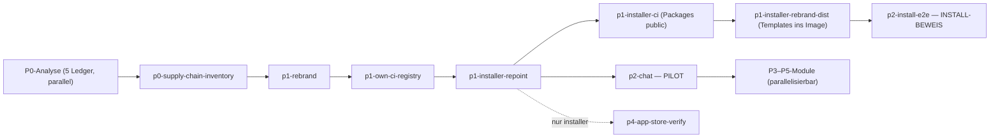

<!-- SPDX-License-Identifier: AGPL-3.0-or-later -->
<!-- Copyright (C) 2026 Kevin Stenzel -->

# Backlog — linuxmuster-ui (edulution-2.0-Fork)  ·  EIN Ledger, EIN Loop

Dies ist das **einzige** Task-Ledger. `/feature-build tasks/backlog.md` (unter `/loop`)
arbeitet es **von oben nach unten** ab: jede Task surgical, alle Tests/Builds REMOTE auf der
**einmal warm-geleasten** crabbox (`scripts/crabbox/warm.sh` → `iter.sh` → `reap.sh`, über den
ganzen Loop wiederverwendet), frischer `feature-review` + Commit pro Task.

**Branch-/PR-Modell (WICHTIG — ein mitwachsender Integrationsbranch, KEINE Branches von `main` pro Abschnitt):**
Alle Tasks committen auf **einen** durchlaufenden Branch **`feat/2.0-backlog`** — je einen **pro Repo**
(`linuxmuster-ui` und, für Installer-Abschnitte, `linuxmuster-ui-installer`). So sieht jeder Abschnitt
die Arbeit der vorigen (Abhängigkeiten stimmen) und die Modul-**Migrationen bleiben monoton** (jede setzt
auf der vorigen auf — löst die „nie zwei Migrations-Branches offen"-Regel strukturell). **PR pro Phase:**
am Ende jeder abgeschlossenen Phase (P0 · P1 · P1b · P2 · P3 · P4 · P5) ein Draft-PR je berührtem Repo
(`git push` + `gh pr create` sind prompt-pflichtig). Die `##`-Abschnitte sind Commit-Gruppen, keine
eigenen Branches.

**Autonomie-/Parking-Regel:** Code + **Remote-Unit-Verify** (`iter.sh lint/test`) laufen autonom im Loop.
Alles **Ask-first / prompt-pflichtig** — Voll-Stack-Deploy am echten LMN (`iter.sh deploy/shots`),
`linuxmuster-api7`-Install, Packages/Repos public, Push/PR — wird **nicht** blind ausgeführt: Task auf
`[?] human-gate` setzen, kurz vermerken, **weiterlaufen**. Diese `[?]` sammelt der Mensch am Phasenende ab.

**Analyse-/Ops-Abschnitte** (`p0-*`, `p1-dr-runbook`, `p4-app-store-verify`, `p2-install-e2e`, `x-i18n-fr`-Backfill):
„Done" = der committete Report/das Artefakt (Doc/Skript) + sein `Verify:`, **nicht** „Unit-Tests grün".

Status: aktiv — P0–P5 code-complete, Verify-Welle 2026-07-27 gegen echten LMN gefahren (s. Log); offen sind nur human-gates + p4-mail Phase 3 · Branch: `feat/2.0-backlog` (mitwachsend, je Repo) · PR: pro Phase · Commit-Granularität: pro Task · Review: pro Task (feature-review) · Modell: Opus
Übergeordnete Spec: `PLAN-openedulution-fork.md` (Master-Plan). Detail-Specs je Paket unter `docs/features/<slug>.md`.
Verify: REMOTE auf warmer crabbox (`scripts/crabbox/iter.sh`) — nichts lokal.
DoD je Task: Tests grün · `npm run lint` sauber · **i18n DE+EN+FR** gepflegt · SPDX AGPL-3.0-or-later bei neuen Dateien · Doku im selben Commit (Augenmaß).
Task-Status: `[ ]` offen · `[x]` fertig · `[~]` übersprungen (Grund) · `[?]` braucht Entscheidung.

**Vorstufe erledigt:** V0 Fork-Setup (Repos `faircomp/linuxmuster-ui` + `-ui-installer`, `main`@v1.6.266, Tags + `upstream/*`-Rescue-Branches).

**Phasenabschluss-Log & offene Human-Gates:**
- **P0 abgeschlossen (2026-07-15)** — alle 5 Abschnitte: `p0-base-drift-analysis` (12/12) · `p0-migrations-inventory` (7/7) · `p0-supply-chain-inventory` (4/4) · `p0-realm-diff-baseline` (6/8, **T4/T6 live-gated offen**) · `p0-pii-inventory` (7/7). 13 Commits `088992218`→`2c6bc14a0` auf `feat/2.0-backlog`. **P0 ist deploy-neutral** (nur `docs/`, `scripts/`, CI/husky, `package.json`-Scripts, `.gitignore`, `.env.default` — kein `apps/`-Produktcode, keine Migration/Route/Guard) → Voll-Stack-Verify **path-gated übersprungen**. Infra-freie Gates lokal grün (`check-external-references`, `check:pii-fixtures`, `test:scripts`, realm/migrations `node --test`); nx-Suiten n/a (keine nx-Quelle geändert). Fresh-Review je Code-Task (supply-chain-Gate, realm-Scrubber, pii-Fixtures) — approve nach Fixes.
  - **[x] PR-Gate erledigt (2026-07-27, Kevin freigegeben):** beide Branches gepusht + Draft-PRs offen — **faircomp/linuxmuster-ui#1** (P0–P5, 309 Commits, 575 Dateien, +43498/-663) und **faircomp/linuxmuster-ui-installer#1** (P1, 7 Commits, 30 Dateien), wechselseitig verlinkt (müssen zusammen gemergt werden). Ein PR je Repo statt je Phase: die Historie ist EIN mitwachsender Branch, in dem sich Phasen überlagern (z. B. Verify-Wellen-Fixes an Chat/Rebrand nach P5) — sauberes Nach-Phasen-Slicing wäre History-Rewriting. Stattdessen sind die PR-Bodies **nach Phasen gegliedert**, die Commit-Ranges stehen in diesem Log.
  - `[?] human-gate: p0-realm-diff-baseline T4+T6` — brauchen eine laufende 2.0.200-Keycloak-Instanz (Voll-Stack/Box) → an den **P1-Voll-Stack** koppeln; Werkzeug (export/normalize/diff) steht.
  - Hinweis: Kevins 3 uncommittete `notifications`-WIP-Dateien liegen unberührt im Working-Tree (nicht in den P0-Commits).
- **P1 läuft (Stand 2026-07-15)** — fertig authored: `p1-rebrand` · `x-i18n-fr` · `p1-own-ci-registry` (11/11) · `p1-installer-repoint` (11/11) · `p1-installer-ci` (7/7) · `p1-installer-rebrand-dist` (7/7). Beide Repos auf `feat/2.0-backlog`. Damit ist der **Installer-Strang komplett** (get.edulution.io-Laufzeit-Fetch eliminiert, Templates aus dem Image, auf linuxmuster-ui rebrandet, AGPL-Attribution) → Rebrand-Gate für die Repo-Freigabe erfüllt. Offene nach-außen-Gates sammeln sich fürs **P1-Phasenende** (nicht autonom ausgeführt):
  - `[?] human-gate: PR Phase P1 (beide Repos)` — `git push` + `gh pr create --draft` je Repo (`linuxmuster-ui` + `linuxmuster-ui-installer`), Cross-Link in beiden Bodies; **warten auf Kevins OK**.
  - `[?] human-gate: Erst-Image-Push + GHCR-Packages public` — UI/API (`p1-own-ci-registry` T11) **und** Installer (`p1-installer-ci` T1/T7): erster CI-Image-Push, dann `linuxmuster-{ui,api,ui-installer}` auf **public** (anonymer `docker pull`); Verify auf crabbox/echtem Actions-Runner.
  - `[?] human-gate: Repo-Freigabe (public) erst nach Rebrand-Gate` — `p1-installer-rebrand-dist` T7 (+ `p1-rebrand`) müssen gelandet sein, bevor ein Repo public wird (sonst edulution-Branding/Netzint-Header öffentlich); erfüllt zugleich AGPL-§13.
  - Box-gated Verifies zum Nachziehen am P1-Voll-Stack: `p1-own-ci-registry` T3/T5, `p0-realm-diff-baseline` T4/T6, `p1-installer-ci` CI-Run/skopeo.
  - **Geparkte Sections (vollständig box-/infra-gated, nicht autonom baubar):** `p2-install-e2e` (7/7 human-gate — realer Install-Beweis: Box+Bootstrap+echter LMN+7-Service-Stack+Playwright-Login); `p1-migration-upgrade-test` (8/8 — echtes 1.6-Image+Mongo+api-Boot-Logs auf der Box **und** abhängig vom noch nicht rekonstruierten Deploy-Harness `deploy.sh`/`shots.py`); `p1b-tracking-pipeline` (16/16 — **separates Greenfield-Repo `linuxmuster-tracking`** außerhalb des Zwei-Repo-Modells + box-gated skopeo/crane/trivy gegen live-ghcr; Repo-Anlage unter faircomp = Setup-Entscheidung). Alle warten auf warme Box + (Tracking) Repo-Setup.
  - **`p1-port-api-specs-ci` fertig** (11/11 authored) — `test:api:ci`-Gate + benannter CI-Test-Step; `controllerContractReflection`-Helper; **14 neue Controller-Auth-Contract-Specs** (alle 29 Controller haben jetzt Specs, via `check-spec-coverage` in CI+pre-commit erzwungen); Spec-Policy-Doku. Lokal verifiziert (tsc/eslint/tsx/yaml/route-grep); **jest/nx-Lauf 2026-07-27 remote grün** (86 Suites/694 Tests) + Guard-Contract am laufenden Stack (10/10 Routen unauth→401). Sichert v.a. die `@Public()`-Opt-outs gegen Auth-Bypass ab.
  - **`p1-security-cve-track` fertig** (8/8 authored) — Dependabot (npm/actions/docker), Base-Image-Digest-Pinning, npm-audit-Gate (severity-Ceiling + reviewBy-Ablauf), 2 Trivy-Image-Scan-Gates (PR + fail-closed Release), `scanImages.sh`-Cron-Scanner, Accepted-CVE-Register + Track-Doku. **Befund: 30 high/critical Prod-CVEs Alt-Last der v1.6.266-Basis** baselined (reviewBy 2026-10-15, [[cve-baseline-debt]]) — Remediation via Dependabot vor Public-Gehen priorisieren. Lokal verifiziert; Trivy-CI-Runs box-gated.
  - **`p1-observability` fertig** (4/5 authored) — HealthService liefert Build-Metadaten in jeder Health-Antwort (Monitoring-Contract), Observability-Env gehärtet, getLogLevels-Regressions-Spec, `docs/observability.md` (DE+EN). `[?] human-gate: p1-observability T4` — **DSGVO-Entscheidung**: Sentry-Telemetrie im 2.0-SOLL sendet ALLE PII (`sendDefaultPii:true`); für eine Minderjährigen-Plattform (R12) **empfehle ich Härtung** — Kevins Entscheidung. Sentry ist default AUS, kein akutes Leak. jest-Lauf box-gated.
  - **`p1-dr-runbook` fertig** (6/6 authored) — DR-Runbook + geteilte `dr-lib.sh` + `dr-backup.sh` (pflicht-verschlüsselt, kein Klartext-Leak) + `dr-restore.sh` (Validierung vor jedem destruktiven Schritt) + `dr-drill.sh` (Round-Trip-Abnahmetest mit Prod-Guard) + Wiring (npm/systemd/.gitignore). Alle 4 Skripte shellcheck-CLEAN + docker-stub-verifiziert; **Reviews fanden real: Docker-Namens-Match-Bug, PW-auf-argv, einen Klartext-Leak-Blocker (in meinem Fix), ein False-Green-DR-Test-Loch, fehlender Prod-Guard — alle behoben.** Drill-RUN box-gated.
  - **`p1-master-key-provisioning` fertig** (4/4 authored, **Cross-Repo**: Installer `ff09a9b` + UI `e4bcf7684`) — Installer provisioniert `MASTER_ENCRYPT_KEY` (64-hex) in `edulution.env` und **erhält ihn beim Re-Run** (Rotation = Totalverlust aller gewrappten Passwörter; Review bestätigt Round-Trip + fail-safe); DR-Backup-Kopplungs-Doku; Prod-Compose-`env_file`-Contract statisch bestätigt. **Offen [?] für Kevin:** breitere Installer-Re-Run-Idempotenz-Policy (Spec Offene Frage 3). Runtime-Key-im-Container-Verify box-gated.
- **P2-Pilot `p2-chat` bei 13/19 (Stand 2026-07-16).** Authored+committed: T1 Contract, T2–T5 (Konstanten+3 Schemas), **T6 GroupsService** (36d6b024a), **T8 Pipe** (a37cfcfb8), **T13 i18n** (e721b02ba), **T14 useChatStore** (68294f7e3), **T15 ChatPage-Shell** (46b285665), **T16 Nachrichten-UI** (3b0e2888c), **T17 SSE-Abo** (f50a5b5b9), **T9 ChatService-Kern** (4e0ce058b). Rekonstruktions-Rezept end-to-end validiert.
  - **KORREKTUR der Blockade-Analyse:** Früher hatte ich „T7→T9→T10→T11 alle blockiert" gemeldet — **das war zu konservativ.** Nur **T7** editiert Kevins WIP (`notifications.service.ts`). **T9 legt chat.service.ts NEU an** und injiziert nur den bestehenden NotificationsService → gebaut (4e0ce058b), WIP unberührt.
  - **Backend KOMPLETT (diese Session):** T9 Service-Kern (4e0ce058b), T10 getUnreadCounts/getReadReceipts (8c059ff62), T11 Controller 5/6 + Module + Wiring (51d3c97fe). Nach Kevins WIP-Commit (844335797) dann **T7 + T10-markChatAsRead + T11 POST-read** (887dadca0) → **alle 6 Routen live, Read-Status end-to-end.** Backend-Pilot fertig.
  - **✅ p2-chat-PILOT CODE-COMPLETE (fc2bf1724):** Alle 18 Build-Tasks fertig (T1–T11, T13–T18), T12 resolved (2.0-treu). Rekonstruktions-Rezept end-to-end validiert. `[~] T12` (nicht seeden). Härtungs-Follow-up (optional, eigenes Ticket): Chat-Throttling/Cache-Control.
  - **OFFENE PHASEN-END-GATES (brauchen Box/Kevin, NICHT autonom):** (1) **Box-Verifikation** — crabbox `iter.sh all` + Voll-Stack-`deploy`/`shots` (Login + Chat senden/empfangen/Badge gegen 11-chat.png); **die Box war diese ganze Session unten** → alle jest/vitest-CI/build/deploy-Läufe stehen aus (lokal grün: eslint/tsc/vitest, aber SKIP≠grün für Runtime). (2) **Draft-PR** `feat/2.0-backlog`→`main` (nur `linuxmuster-ui`, kein Installer-Anteil) — nach-außen, prompt-pflichtig.
  - **NÄCHSTE PHASE P3–P5** (nach dem Pilot entblockt: parent-child-pairing, wiki, mail, filesharing, calendar, linbo) — **bewusst NICHT autonom gestartet**: großer neuer Scope + Pilot noch nicht box-verifiziert/gemerged. Kevins Richtungsentscheidung.
  - **Produktentscheidungen:** `[?] T12` (2.0 seedet Chat NICHT + kein Icon → 2.0-treu vs. Fork-Seed) · `[?] T18` (FE Read-Status, Spec-„Offene Frage 1").
  - **Lokal verifizierbar:** vitest (renderToStaticMarkup) + voller FE-`tsc --noEmit` + isolierter API-tsc + check-translations; crabbox-Deploy/jest/Visual box-gated. **BLOCKER für Kevin:** **T7** (`markNotificationReadBySource`) editiert `apps/api/src/notifications/notifications.service.ts` = eine von Kevins **3 uncommitteten WIP-Dateien** → git-safety verbietet Anfassen, kein Hunk-Isolieren (`git add -p` nicht verfügbar). **Kaskade: T7 blockiert T9→T10→T11** (kompletter Chat-Service+Controller). → **Kevin: bitte notifications-WIP committen/stashen**, dann läuft der BE-Strang. Parallel weiter baubar (WIP-frei): T6 (GroupsService, tiefere Rekonstruktion), T12 (appconfig-Seed), T13 (i18n), T14 (useChatStore FE).

- **VERIFY-WELLE gegen echten LMN (2026-07-27)** — erstmals lief der volle Stack aus dem Branch (eigene Images) gegen `10.10.40.10` (`server.evsvbz.org`, linuxmuster-api7 7.3.35). **Voraussetzung geschaffen:** Deploy-/Shots-Harness rekonstruiert und committet (`c0079125d`: `scripts/crabbox/{deploy.sh,generate_env.py,stage-templates.sh,shots.py,module_verify.py}`; Soll-Quelle = `webinstaller-api::createEdulutionEnvFile`). Damit entfaellt der Teil-Blocker „Harness fehlt" bei `p2-install-e2e` und `p1-migration-upgrade-test`.
  - **Ergebnisse:** 7/7 Services healthy · Login `global-admin` → `/dashboard` mit echten LDAP-Daten · `lmn-api/auth` 200 · 9/9 Module gerendert · **Guard-Contract am laufenden System: 10/10 Modul-Routen unauth → 401** (kein Auth-Bypass) · CI-Paritaet `iter.sh all` remote gruen (lint 3/3, jest 86 Suites/694, vitest 40/188, build:all 3/3, i18n).
  - **Module:** `p5-linbo` T13 **erledigt** (JSON-Routen mit echten LMN-Daten; upload/download degradiert, LINBO-Store leer) · `p5-calendar` **erledigt** (funktional gegen eigenen CalDAV auf der Box, **ohne LMN**) · `p2-chat` T19 **erledigt** (Nachrichtenfluss zwischen 2 echten LDAP-Schuelern) · `p3-parent-child` T15 Flow verifiziert, LMN-Wirkung einmal belegt/nicht reproduzierbar · `p3-wiki` T25 **blockiert** (LMN-WebDAV liefert durchgaengig 500).
  - **Gefundene und behobene Fehler (nur live auffindbar):** `fix(chat)` `00c23adbb` — `getUnreadCounts` verglich ObjectId gegen String-`conversationId`, der Ungelesen-Zaehler konnte NIE einen Wert liefern (vorher `[]`, nachher `count:1`); `fix(rebrand)` `3d09e86c2` — `APPLICATION_NAME` war noch `edulution.io`, sichtbar in Tab-Titel/Footer/Dialog (p1-rebrand war als 16/16 markiert); `fix(license)` `961e041a8` type-aware-Lint; Harness-Fixes `55ecd6776` (crabbox-Slug), `280c45b49` (vitest-Watch-Hang), `deb9053f7` (Build-Heap).
  - **Produkterkenntnis (gehoert in den Installer):** LDAPS gegen einen Standard-linuxmuster-Server hat ZWEI Huerden — Keycloak kennt die schuleigene CA nicht (`PKIX`), und das Serverzertifikat traegt **keine SANs** (`No subject alternative names present`). Beides muss der Installer ab Werk koennen; den LMN dafuer anzupassen ist KEIN gangbarer Weg (das UI muss auf beliebigen Servern laufen).
  - **Auf dem LMN hinterlassen (Testdaten, entfernbar):** `verifyan`/`verifybe` (Schueler, `students.csv`, Klasse `testklasse`) + `verifpet` (Elternteil, `parents.csv`, `role-parent`) — loeschen via CSV-Zeilen entfernen + `sophomorix-check && sophomorix-kill`; Backups `*.bak-vor-verify-*`. **Kein Code/keine Konfiguration des LMN veraendert.**
  - `[?] human-gate` offen: Draft-PRs (alle Phasen) · p4-mail Phase 3 (T9–T25, 17 offene `[ ]`) · GHCR-Sichtbarkeit/Erst-Builds · `linuxmuster-tracking`-Repo · Sentry-DSGVO (p1-observability T4) · Wiki-e2e (LMN-WebDAV) · 2.0-Baselines fuer echte Visual-Diffs fehlen weiterhin.

**Getroffene Entscheidungen:** §9.1 Org `faircomp`/Name ohne Marke · §9.2 Version `2.0.x` · §9.3 Single-`main` · §9.5 Lizenzserver stubben · §9.8 MobileDevices+Satellites deferred · §9.12 Sentry aus · §9.13 QR-Login verbergen · **§9.10 Mail = BEIDES** (`ACTIVE_MAIL_CLIENT`-Selector nativ⟷SOGo, phasiert; Mailcow-Admin immer da) · **§9.11 FR = mitpflegen** (Locale aktiv, Paket `x-i18n-fr`).

## Reihenfolge (Topo-Sort; ⭐ = kritischer Pfad)

| # | KP | Abschnitt | Phase | Abhängt von | Ziel |
|---|----|-----------|-------|-------------|------|
| 1 |  | p0-base-drift-analysis | P0 | — | Bestands-Drift 1.6→2.0.200 (Module/libs/appconfig/SSE/Guards) mit Ankern messen |
| 2 |  | p0-migrations-inventory | P0 | — | Alle 2.0-Migrationen + Delta 1.6→2.0 als Upgrade-Pfad-Grundlage inventarisieren |
| 3 | ⭐ | p0-supply-chain-inventory | P0 | — | Alle edulution-io-Außenreferenzen (Datei:Zeile, Policy) + Manifest |
| 4 |  | p0-realm-diff-baseline | P0 | — | Keycloak-Realm der 2.0.200 exportieren, scrubben, als Soll-Baseline |
| 5 |  | p0-pii-inventory | P0 | — | DSGVO/PII-Datenfluss je Collection + master.key-Fluss + Drittempfänger |
| 6 | ⭐ | p1-rebrand | P1 | p0-supply-chain-inventory | edulution-io-Refs/Marken/Lizenz-Header per Deny/Allowlist auf faircomp |
| 7 |  | x-i18n-fr | P1 | p1-rebrand | FR als gepflegte Locale aktivieren (supportedLngs, fr.json-Backfill, check-translations DE+EN+FR) |
| 8 | ⭐ | p1-own-ci-registry | P1 | p1-rebrand | Eigene CI+Registry: Images grün-gegated+gehärtet nach ghcr/faircomp |
| 9 | ⭐ | p1-installer-repoint | P1 | p1-own-ci-registry, p0-supply-chain-inventory | Installer auf eigene Registry/Tag; ui-kit inlinen, Lizenzserver stubben, §13, Plugins-Mirror |
| 10 | ⭐ | p1-installer-ci | P1 | p1-installer-repoint | Installer-Image: eigene CI, Tags, **Package-Sichtbarkeit public** (sonst kann niemand pullen) |
| 11 | ⭐ | p1-installer-rebrand-dist | P1 | p1-installer-repoint, p1-installer-ci | Installer-Rebrand + **eigene Template-Auslieferung** statt `get.edulution.io` (Templates ins Image) |
| 12 | ⭐ | p2-install-e2e | P2 | p1-installer-ci, p1-installer-rebrand-dist | **Erstinstallation end-to-end** über den eigenen Installer am echten LMN (der Beweis) |
| 13 |  | p1-migration-upgrade-test | P1 | p1-installer-repoint, p0-migrations-inventory | 1.6-DB→eigenes Image Upgrade-Pfad real testen |
| 14 |  | p1-port-api-specs-ci | P1 | p1-own-ci-registry | 28 Bestands-Specs als CI-Green-Gate + Smoke/Contract |
| 15 |  | p1-security-cve-track | P1 | p1-own-ci-registry | Security-/CVE-Track: Dependabot + Trivy-Gate am Wochen-Cron |
| 16 |  | p1-master-key-provisioning | P1 | p1-installer-repoint | Installer erzeugt MASTER_ENCRYPT_KEY + koppelt ihn ans Backup-Set |
| 17 |  | p1-dr-runbook | P1 | p1-master-key-provisioning | DR-Runbook + Backup-/Restore-Skript (master.key-Kopplung, Drill) |
| 18 |  | p1-observability | P1 | — | Health liefert Build-Metadaten; Observability + Sentry-Entscheidung |
| 19 |  | p1b-tracking-pipeline | P1b | p0-supply-chain-inventory | Repo linuxmuster-tracking: skopeo-Release-Erkennung + Image-Diff-Pipeline |
| 20 | ⭐ | p2-chat | P2 | p1-installer-repoint | PILOT: nativer Gruppen-Chat BE+FE end-to-end — validiert das Rezept |
| 21 |  | p3-parent-child-pairing | P3 | p2-chat | ParentChildPairing: Code-Pairing (TTL), Rollen, LMN-Gruppenpflege |
| 22 |  | p3-wiki | P3 | p2-chat | WikiModule (9 Routen WebDAV, ETag) + TipTap-FE-Editor |
| 23 |  | p4-mail-rework | P4 | p2-chat | Mail BEIDES: ACTIVE_MAIL_CLIENT-Selector (nativ⟷SOGo), phasiert + Mailcow-Admin |
| 24 |  | p4-filesharing-wopi | P4 | p2-chat | Filesharing/WOPI/Collabora + ACTIVE_DOCUMENT_EDITOR-Selektor |
| 25 |  | p4-app-store-verify | P4 | p1-installer-repoint | DockerService-App-Store auf 2.0-Parität + Store-Fetch-Contract |
| 26 |  | p5-calendar | P5 | p2-chat | CalendarModule (7 Routen) + FE-Grid mit rrule |
| 27 |  | p5-linbo | P5 | p2-chat | LinboController (11 Routen) als lmn-api-Proxy, 17 DTOs |
| 28 |  | p6-mobile-devices | P6 | — | DEFERRED: MobileDevices/MDM (Relution kommerziell) |
| 29 |  | p6-satellites | P6 | — | DEFERRED: Satellites (Multi-Host/WireGuard) |

Gesamt: **308 Tasks** über 29 Abschnitte (2 deferred).

## Kritischer Pfad

**Spine:** `P0-Analyse` → `p0-supply-chain-inventory` → `p1-rebrand` → `p1-own-ci-registry` → **`p1-installer-repoint`** → **`p2-chat` (Pilot)** → **P3–P5 parallelisierbar**.

Der Pilot (Chat) validiert das **gesamte End-to-End-Rezept** — BE aus `main.js` + Rescue-Branch, FE, Migration/`schemaVersion`, Auth-Guards, crabbox-Verify, Draft-PR — **bevor** die teuren Module (Wiki/Calendar/Mail) starten. Alles außerhalb des Spines (restliche P0-Analysen, P1-Härtung, Tracking) ist parallelisierbar; nach dem Pilot sind P3–P5 untereinander parallel — mit den Serialisierungs-Ausnahmen unten.

## Contract-Overlap-Warnungen (seriell landen)

Mehrere Ledger fassen dieselben **geteilten Contracts** an. Auch wo die Abhängigkeits-Spalte Parallelität erlaubt, müssen die folgenden Berührungen **seriell** gemerged werden (ein Ledger vor dem nächsten branchen/rebasen), sonst kollidieren Schema-Versionen oder es entstehen Same-File-Merge-Konflikte.

1. **Mongoose-Schema + Migration (`schemaVersion`) — härteste Serialisierung.** `p2-chat`, `p3-parent-child-pairing`, `p3-wiki` (WebdavShares + `wikiAccessGroups`/`wikiDisabled`), `p5-calendar` (+ ggf. `p4-mail-rework`) fügen je eine **forward-only** Migration hinzu, die `schemaVersion` erhöht. **Nie zwei migrations-schreibende Branches gleichzeitig offen** → strikt nacheinander mergen, damit die Versionsnummern monoton bleiben und die Kette lückenlos triggert. Der FE-Teil der P3–P5-Module parallelisiert, der **Migrations-/Schema-Commit serialisiert**.
2. **`defaultAppConfig` (appconfig).** `p2-chat`, `p3-parent-child-pairing`, `p3-wiki`, `p4-mail-rework`, `p4-filesharing-wopi`, `p4-app-store-verify`, `p5-calendar`, `p5-linbo` erweitern alle dasselbe `defaultAppConfig`-Array — additiv, aber **eine Datei**. Vor dem Merge rebasen; einen appconfig-Eintrag nach dem anderen landen.
3. **i18n `de`/`en`.** Jedes FE-Modul (Chat, Wiki, Pairing, Mail, Filesharing, App-Store, Calendar, Linbo) hängt Keys an die geteilten `de.json`/`en.json`. Pro-Modul-Namespaces führen, rebasen; der Pre-Commit-Translation-Check ist das Gate (DE+EN Pflicht).
4. **Keycloak-Realm-Templates.** `p1-rebrand` (Default-Härtung: CORS-/`redirectUris`-/`webOrigins`-Wildcards) und `p1-installer-repoint` (Repoint) editieren beide die Realm-Templates — beide gegen die scrubbte `p0-realm-diff-baseline` als Soll. Die Abhängigkeitskette serialisiert sie bereits; die Baseline bleibt maßgeblich.
5. **ghcr-Ref ↔ Installer.** Der ghcr-Namespace/Tag wird von `p1-own-ci-registry` (Push), `p1-installer-repoint` (Self-Pull), `p1b-tracking-pipeline` (skopeo inspect) und `p1-security-cve-track` (Digest-Pin) referenziert. Namespace **einmal** festlegen (§9.1 → `faircomp`) und in allen vieren identisch halten; die Abhängigkeitskette serialisiert die Schreiber.

## Übernommene Default-Entscheidungen (§9 des Plans)

Die Ledger sind gegen die **empfohlenen** Defaults aus §9 geplant. Alle **vom Menschen bestätigbar/änderbar** — sie blockieren keinen Start, aber eine Umkehr wird teurer, je später sie kommt.

| §9 | Entscheidung | Default (übernommen) | Verankert in |
|---|---|---|---|
| 9.2 | Versionsschema | **`2.0.x`** (matcht Ziel-Image) | p1-own-ci-registry, p1b-tracking-pipeline |
| 9.3 | Branch-Modell | **Single `main`** (+ `nx.json defaultBase→main`) | p1-rebrand, p1-own-ci-registry |
| 9.8 | P6-Scope | **MobileDevices + Satellites deferred** (Relution kommerziell; WireGuard-Föderation) | p6-mobile-devices, p6-satellites (Stubs) |
| 9.12 | Sentry/Telemetrie | **deaktiviert** — nie Fremd-DSN erben | p1-observability |
| 9.13 | QR-Login/„Mobile Access" | **Kacheln verbergen** (solange keine eigene Mobile-App) | FE-Rebrand / Modul-Sichtbarkeit |

**Noch OFFEN (Mensch entscheidet, Default bewusst nicht gesetzt):**
- **9.10 Mail-UI** — nativer 2.0-Webmail-Client + Mailcow-Admin (Parität, teuer) **vs.** 1.6-SOGo-Iframe (billig). **Bewusst offengehalten in der `p4-mail-rework`-Spec** (Swing-Faktor §8); der Ledger trägt beide Pfade.
- **9.11 FR-Locale** — FR mitpflegen **vs.** aus `supportedLngs` streichen (DE+EN bleiben Pre-Commit-Pflicht). Offen.

Der Vollständigkeit halber bereits in den P1-Ledgern verankert: **9.1** Org `faircomp` + Name `linuxmuster-ui` (ohne Marke), **9.5** Lizenzserver **stubben** (AGPL-Arm).

---

# Arbeitspakete (in Reihenfolge abarbeiten)

## p0-base-drift-analysis [P0] — Basis-Drift-Analyse (32 Bestandsklassen, libs/, appconfig, SSE, Guards)
_Ziel:_ Bestands-Drift 1.6→2.0.200 (Module/libs/appconfig/SSE/Guards) mit Ankern messen · _Abhängt-von:_ — · _Status:_ erledigt (12/12) · _Tasks:_ 12
Branch: `feat/2.0-backlog` · Spec: `docs/features/p0-base-drift-analysis.md` · Soll: main.js:11219/32604/56393/56551/56883/59854/59956/63161/64484 (Guards) · main.js:10661/55022 (SSE) · main.js:55581/65115 (Gateways) · main.js:2335/2380–2468 (defaultAppConfig) · 1.6-Source apps/api/src + libs/src

> **Analyse-Paket — Verify-Realität:** Dies sind **Investigations-Tasks (kein Produktivcode)**.
> Der Ledger-Kopf oben ist die Standard-Vorlage; **crabbox/iter.sh und Voll-Stack-Verify laufen
> hier leer** (es gibt keinen Runtime-Diff). Der **reale Verify jeder Task** ist der angegebene
> `grep`/`diff` gegen `.reference/2.0.200/api/main.js` (2.0.200) und die
> Repo-Source (1.6.266) **plus** der belegte Report-Abschnitt in
> `docs/analysis/base-drift-2.0.200.md` (Assertion: „Diff erzeugt / Tabelle vollständig /
> Bewertung gesetzt"). `npm run lint` ist nur für ein optional angelegtes Skript relevant.
> Abkürzung unten: `MJ` = `.reference/2.0.200/api/main.js`.

---

### T1 — Report-Gerüst + Modul-Inventar (32 ↔ 38, additive-These je Modul)  [x] ✓ 32→38, 6 neu, 0 entfernt/umbenannt
Komponente: docs · Dateien: docs/analysis/base-drift-2.0.200.md (neu)
Soll: main.js `class …Module` (38) ↔ 1.6 `apps/api/src/**` `class …Module` (32)
Änderung: Report-Datei anlegen (SPDX AGPL-Header, DE, Abschnitts-Gerüst für T2–T12 + Legende
„bestätigt/gedriftet/gebrochen"). Erste Sektion: Modul-Mapping-Tabelle — jedes der 32
1.6-Module auf sein 2.0-Pendant abbilden, die **6 neuen** (Wiki/Chat/ParentChildPairing/
Calendar/MobileDevices/Satellites) listen, **belegen dass keines der 32 entfernt/umbenannt** ist.
Verify: `grep -oE "class [A-Za-z0-9_]+Module " "$MJ" | sort -u | wc -l` = 38 UND
`grep -rhoE "class [A-Za-z0-9_]+Module" apps/api/src --include=*.ts | sort -u | wc -l` = 32;
Report enthält 32-Zeilen-Mapping + 6-neu-Liste + Aussage „0 entfernt". Assertion: Tabelle
vollständig, jede 1.6-Modulklasse hat genau eine Zeile.
i18n: keine
Doku: docs/analysis/base-drift-2.0.200.md (intern, DE) — ist das Deliverable

### T2 — Controller-Route-Drift der 29 Bestands-Controller  [x] ✓ 23/29 stabil; Mail +26, Filesharing-Split, Linbo/ProfilePicture ausgegliedert
Komponente: docs · Dateien: docs/analysis/base-drift-2.0.200.md
Soll: main.js `class …Controller ` (39) ↔ 1.6 29 Controller in apps/api/src/**
Änderung: Je Bestands-Controller die Route-Dekoratoren aus den `tslib_1.__decorate([...])`-
Blöcken im `MJ` zählen (HTTP-Verb + Pfad) und gegen die 1.6-`*.controller.ts` diffen. Delta-
Tabelle: Controller · Routen 1.6 · Routen 2.0 · Δ · Auffälligkeit. Bekannte Groß-Drifts als
Ankerpunkte markieren (MailsController 10→36, Filesharing-Split → PublicFilesharing/Wopi). Fokus:
welche **nicht** neu-gebauten Controller drifteten (→ Integrationsreibung).
Verify: `grep -oE "class [A-Za-z0-9_]+Controller " "$MJ" | sort -u | wc -l` = 39;
Report-Tabelle hat eine Zeile je 1.6-Controller (29) mit belegtem Routen-Δ; jeder Controller mit
Δ≠0 ist als „gedriftet" markiert. Assertion: MailsController-Zeile zeigt 10→36.
i18n: keine
Doku: docs/analysis/base-drift-2.0.200.md (intern, DE)
Abhängt von: T1

### T3 — Service-Drift-Signal (Bestands-Services)  [x] ✓ 41/41 abgedeckt; 13 gedriftet/28 stabil, 0 entfernt — additive-These auf Service-Ebene bestätigt
Komponente: docs · Dateien: docs/analysis/base-drift-2.0.200.md
Soll: main.js `class …Service ` ↔ 1.6 41 Service-Klassen in apps/api/src/**
Änderung: **Signal-Ebene** (kein Handler-Byte-Diff): je Bestands-Service die öffentlichen
Methoden zählen und geänderte/neue Abhängigkeiten (Constructor-Injects) im `MJ` gegen 1.6 grob
abgleichen. Delta-Tabelle: Service · Methoden 1.6 · Methoden 2.0 · neue Deps · Signal
(stabil/gedriftet). Splits explizit notieren (z. B. `Mail*`-Aufspaltung Imap/Smtp/Idle/…).
Verify: Report-Tabelle deckt alle 41 1.6-Service-Klassen ab; jede Zeile hat Methoden-Δ + Signal;
mind. die durch T2 als gedriftet markierten Controller-Gegenstücke sind konsistent bewertet.
Assertion: keine 1.6-Service-Klasse fehlt in der Tabelle.
i18n: keine
Doku: docs/analysis/base-drift-2.0.200.md (intern, DE)
Abhängt von: T1

### T4 — DTO-Basisklassen- & Mongoose-Schema-Drift  [x] ✓ Schemas 29→39/0 entfernt; DTO-Basen unverändert & nicht querschnittlich geteilt (31→241 = Zählrauschen)
Komponente: docs · Dateien: docs/analysis/base-drift-2.0.200.md
Soll: main.js `SchemaFactory.createForClass` (39) + `class …Dto` (241) ↔ 1.6 (29 Schemas)
Änderung: Zwei Sub-Tabellen. (a) **Schemas:** je Bestands-Schema die Felder im `MJ` gegen die
1.6-`*.schema.ts` diffen — neue Felder = potenzieller `schemaVersion`-/Migrations-Bezug (nur
verweisen, Inventar ist §3.3). (b) **DTO-Basisklassen:** prüfen, ob **gemeinsam vererbte**
Basis-/abstrakte DTOs (die neue Module extenden) ihre Form änderten. Anker exakt definieren
(dedup, abstract ein-/ausschließen), sonst rauscht der Diff.
Verify: `grep -cE "SchemaFactory\.createForClass" "$MJ"` = 39 vs. 1.6 = 29 (belegt im Report);
Report listet je Bestands-Schema die Feld-Δ und markiert Schemas mit neuen Feldern. Assertion:
Schema-Zählungen beider Stände im Report + ≥1 identifizierte geänderte Basis-DTO-Klasse ODER
belegte Aussage „Basisklassen unverändert".
i18n: keine
Doku: docs/analysis/base-drift-2.0.200.md (intern, DE)
Abhängt von: T1

### T5 — libs/ Shared-Struktur- & Endpoint-Konstanten-Drift  [x] ✓ 32→41 Endpoints, 0 Pfad-Änderung (FE↔API-Contract intakt); 9 neu additiv
Komponente: docs · Dateien: docs/analysis/base-drift-2.0.200.md
Soll: main.js `[A-Z0-9_]+_ENDPOINT = '…'` (41) ↔ 1.6 libs/src `_ENDPOINT` (32) + libs/src-Domänen
Änderung: (a) Endpoint-Konstanten diffen: welche der 32 1.6-`*_ENDPOINT`-Werte änderten ihren
**String-Pfad** (bricht FE↔API-Contract), welche 9 kamen hinzu. (b) Geteilte `libs/src`-Domänen
(v. a. `common`, `auth`, `sse`, `user`) auf geänderte exportierte Typen/Konstanten prüfen, die
BE **und** FE importieren. Delta-Tabelle je betroffene libs-Domäne.
Verify: `grep -rhoE "[A-Z0-9_]+_ENDPOINT = '" libs/src apps/api/src --include=*.ts | sort -u | wc -l`
= 32 vs. `grep -oE "[A-Z0-9_]+_ENDPOINT = '" "$MJ" | sort -u | wc -l` (≈41) im Report belegt;
Report listet geänderte/neue Endpoint-Pfade + betroffene libs-Domänen. Assertion: jeder Endpoint
mit Pfad-Änderung ist als Contract-Drift markiert.
i18n: keine
Doku: docs/analysis/base-drift-2.0.200.md (intern, DE)
Abhängt von: T1

### T6 — appconfig-Shapes-Drift (Cross-Cutting, jedes Modul betroffen)  [x] ✓ appConfigOptionKeys unverändert; AppConfigDto-Hülle +usesPushNotifications+isPinned (18×); +ACTIVE_DOCUMENT_EDITOR
Komponente: docs · Dateien: docs/analysis/base-drift-2.0.200.md
Soll: main.js appconfig-Strukturen ↔ 1.6 libs/src/appconfig/constants/*
Änderung: Die appconfig-Shape-Dateien 1.6↔2.0 diffen: `appConfigOptionKeys` (1.6: url/apiKey/
proxyConfig), `extendedOptionKeys` + `extendedOptions/*` (15 Dateien), `appConfigSectionsKeys`,
`appConfigPaths`, `appDisplayLocations`, `appIntegrationVariant`. Diese Shapes sind der Vertrag,
den **jedes** Modul-`AppConfigDto` erfüllt → Drift hier = Reibung überall. Neue
extendedOptions-Felder (Mail/Collabora `ACTIVE_DOCUMENT_EDITOR` etc.) als betroffene Module
markieren.
Verify: Report enthält je appconfig-Shape-Datei eine Δ-Zeile (Felder hinzu/geändert/weg); die im
`MJ` gefundenen neuen `extendedOptions`-Keys (z. B. `ACTIVE_DOCUMENT_EDITOR`@2114,
`MAIL_*`@2078–2116) sind gelistet. Assertion: `appConfigOptionKeys`-Diff explizit belegt
(unverändert oder Δ benannt).
i18n: keine
Doku: docs/analysis/base-drift-2.0.200.md (intern, DE)
Abhängt von: T1

### T7 — defaultAppConfig-Seed-Diff (Fresh-Install-Fidelity, §3.0/§6.2)  [x] ✓ Seed 6→7 (+WIKI) +usesPushNotifications+isPinned je Eintrag → Fresh-Install-Gap benannt
Komponente: docs · Dateien: docs/analysis/base-drift-2.0.200.md
Soll: main.js `initializeCollection`@2335, `defaultAppConfig`-Array `main.js:2380–2468` ↔ 1.6
`libs/src/appconfig/constants/defaultAppConfig.ts`
Änderung: Das beim Erststart geseedete `defaultAppConfig`-Array (un-minifiziert, direkt diffbar)
1.6↔2.0 vergleichen: welche Default-App-Einträge kamen hinzu/änderten Reihenfolge/Flags. Weicht
das Array ab, zeigt ein frischer Fork ein **anderes Standard-Layout** als 2.0.200. Ergebnis als
**Fresh-Install-Exit-Kriterium** formulieren (Verankerung in §6 des Master-Plans notieren).
Verify: `sed -n '2380,2468p' "$MJ"` gegen 1.6-`defaultAppConfig.ts` gedifft; Report listet die
Default-Einträge-Δ + explizite Aussage „Fresh-Install-Layout identisch / weicht ab in <Punkten>".
Assertion: Δ-Liste vorhanden oder belegte Gleichheit.
i18n: keine
Doku: docs/analysis/base-drift-2.0.200.md (intern, DE)
Abhängt von: T1

### T8 — SSE-Contract-Drift (SseController/Service, sseMessageType, Events)  [x] ✓ 3 @Sse-Routen erhalten (+1); sseMessageType 23→67; Reconnect/Heartbeat/Persist-Schicht neu (gedriftet)
Komponente: docs · Dateien: docs/analysis/base-drift-2.0.200.md
Soll: main.js `SseService`@10661 · `SseController`@55022 · `sseMessageType` (68×) ↔ 1.6
`apps/api/src/sse/*` (3 `@Sse`-Routen) + `libs/src/sse/*` + `eventEmitterEvents.ts`
Änderung: Den SSE-Contract diffen: (a) `@Sse`-Routen (1.6: root, `${APPS.CONFERENCES}/public`,
`AUTH_PATHS.AUTH_ENDPOINT`) im `MJ`-`SseController`-`__decorate`-Block gegenprüfen; (b) die
`sseMessageType`-Werte/Enum 1.6↔2.0 (68 Vorkommen in 2.0, breit über Module gestreut → Chat/
Notifications-Nutzung); (c) `eventEmitterEvents`-Keys (SSE_USER_CONNECTED/DISCONNECTED etc.) +
`libs/src/sse/constants/{sseConfig,sseEndpoints}`. Kritisch: Chat/Notifications reiten auf SSE.
Verify: `grep -cE "sseMessageType" "$MJ"` (≈68) im Report belegt vs. 1.6-Umfang; Report listet
SSE-Routen-Δ + neue/geänderte messageType-Werte + Event-Namen-Δ. Assertion: die 3
1.6-`@Sse`-Routen sind im 2.0-`SseController` verifiziert (vorhanden/verändert/entfernt).
i18n: keine
Doku: docs/analysis/base-drift-2.0.200.md (intern, DE)
Abhängt von: T1

### T9 — Guard-/Auth-Contract-Drift (7 → 9 Guards)  [x] ✓ 7 Bestand stabil (edulution.pem-Signing + isPublic-Semantik gleich); +ThrottleGuard +MailRequestSizeGuard
Komponente: docs · Dateien: docs/analysis/base-drift-2.0.200.md
Soll: main.js Guards @11219/32604/56393/56551/56883/59854/59956/63161/64484 ↔ 1.6 7 Guards in
apps/api/src/**
Änderung: (a) Die **7 Bestands-Guards** (AccessGuard, AdminGuard, AuthGuard, DynamicAppAccessGuard,
IsPublicAppGuard, LocalhostGuard, WebhookGuard) im `MJ` gegen 1.6 auf **Verhaltens-Signal** diffen
(canActivate-Logik, `@Public`-Semantik, Signing-Key-Pfad `edulution.pem`@55805) — jede Änderung =
Auth-Bypass-Risiko beim Nachbau. (b) Die **2 neuen** Guards inventarisieren: `ThrottleGuard`@64484
(Rate-Limiting), `MailRequestSizeGuard`@32604 (Mail-Upload-Limit) — Zweck + welche Routen sie
tragen. Delta-Tabelle: Guard · 1.6? · 2.0-Zeile · Signal.
Verify: `grep -nE "class [A-Za-z0-9_]+Guard " "$MJ"` = 9 Guards (Zeilen belegt) vs.
`grep -rhoE "class [A-Za-z0-9_]+Guard" apps/api/src --include=*.ts | sort -u | wc -l` = 7;
Report bewertet jeden der 7 Bestands-Guards (stabil/gedriftet) + dokumentiert die 2 neuen.
Assertion: `ThrottleGuard` und `MailRequestSizeGuard` als „neu in 2.0" markiert.
i18n: keine
Doku: docs/analysis/base-drift-2.0.200.md (intern, DE)
Abhängt von: T1

### T10 — Gateway-/Queue-/Cron-/registerAs-Drift (ops-kritisch)  [x] ✓ Gateways 1→2, Queues 4→11 (Anker `new bullmq`), Cron/registerAs-Formabweichung kalibriert
Komponente: docs · Dateien: docs/analysis/base-drift-2.0.200.md
Soll: main.js `TLDrawSyncGateway`@55581 · `SatellitesGateway`@65115 · `new Queue(` (11×) ↔ 1.6
1 Gateway + 4 Queues + 4 `@Cron`
Änderung: Ops-tragende Schichten diffen: (a) Gateways 1→2 (neu `SatellitesGateway`, zurückgestellt
— aber Existenz belegen); (b) BullMQ-Queues 4→11 (welche 7 neu, welchem Modul zugeordnet); (c)
`@Cron`-Jobs — **Anker-Kalibrierung nötig**: `@Cron(` liefert im gebundelten `MJ` **0** Treffer,
also die alternative Form finden (`SchedulerRegistry`/`CronJob`/`Cron(` ohne `@`) und die echte
Cron-Zahl 2.0 belegen; ebenso `registerAs('` (roh 0 in `MJ` → Form abweichend). Diese
Anker-Formabweichungen als Anhang für die P1b-Pipeline notieren.
Verify: `grep -cE "new Queue\(" "$MJ"` = 11 vs. 1.6 = 4 (belegt); `grep -cE "class …Gateway " "$MJ"`
= 2; Report enthält Queue-Δ-Tabelle + die **kalibrierte** Cron-/registerAs-Ankerform mit
belegter Trefferzahl. Assertion: für jeden 0-Treffer-Anker ist die funktionierende
Alternativform dokumentiert.
i18n: keine
Doku: docs/analysis/base-drift-2.0.200.md (intern, DE)
Abhängt von: T1

### T11 — FE-App-Shell-/Routing-/Store-Struktur-Drift (Signal, §4.1)  [x] ✓ Shell-Muster stabil (native 205×), Routen additiv (alle Slugs), Glass+--code-* bestätigt
Komponente: docs · Dateien: docs/analysis/base-drift-2.0.200.md
Soll: 1.6 `apps/frontend/src/{routes,components/structure/layout/NativeAppPageManager.tsx,store}`
↔ 2.0 `.reference/2.0.200/ui` index-Bundle (minifiziert) + `.reference/2.0.200/baselines/*` Live-Referenz
Änderung: **Ehrlich signal-basiert** (2.0-FE ist minifiziert, keine Quell-Namen): im 2.0-index-
Bundle auf **String-Ebene** heben — Route-Pfade, `APPS.*`-Slugs, `appType: NATIVE`-
Registrierungen, CSS-Variablen (§4.1: neue `--code-*`), `bg-glass`-Nutzung — und gegen die
1.6-Struktur + Baseline-Screenshots (`.reference/2.0.200/baselines/10-dashboard.png`, `18-settings.png`)
plausibilisieren. Ziel: grobe Aussage „App-Shell/Routing/Store-Struktur stabil vs. gedriftet",
**nicht** exakter Diff. Methoden-Vorbehalt im Report explizit vermerken.
Verify: Report enthält die Signal-Liste (Routen/Slugs/CSS-Var-Δ aus dem index-Bundle) + eine
begründete Stabil/Drift-Einschätzung + den expliziten Methoden-Vorbehalt „minifiziert, signal-
level". Assertion: die 4 neuen CSS-Variablen `--code-keyword/--code-number/--code-string/
--code-title` sind im Bundle-Signal bestätigt oder als nicht-auffindbar vermerkt.
i18n: keine
Doku: docs/analysis/base-drift-2.0.200.md (intern, DE)
Abhängt von: T1

### T12 — Synthese: Drift-Bewertung + Aufwands-Fixierung P2–P5  [x] ✓ Ampel je Schicht (überwiegend 🟢, kein 🔴); Aufschläge P2–P5 fixiert; PLAN §3.2 rückverwiesen
Komponente: docs · Dateien: docs/analysis/base-drift-2.0.200.md · PLAN-openedulution-fork.md (§3.2/§8 Rückverweis)
Soll: Aggregat aus T2–T11
Änderung: Aus allen Schicht-Befunden je Schicht eine **Drift-Ampel** (grün/gelb/rot) setzen und
daraus je **Modul-Paket** (Chat P2 · ParentChildPairing/Wiki P3 · Mail/Filesharing P4 ·
Calendar/Linbo P5) einen **konkreten Basis-Drift-Aufschlag** ableiten — den §3.0-Pauschalpuffer
+20–30 % **bestätigen oder verfeinern** (z. B. „Auth/SSE gedriftet → Chat +20 %, Wiki-BE +15 %").
Ergebnis fixiert die Modul-Aufwände; Rückverweis-Notiz in `PLAN-openedulution-fork.md` §3.2/§8.
Verify: Report-Schluss-Sektion enthält (a) Ampel-Tabelle je Schicht (Module/Controller/Services/
DTO-Schema/libs/appconfig/defaultAppConfig/SSE/Guards/Gateway-Queue/FE) und (b)
Aufschlag-je-Paket-Tabelle mit Begründung pro Zeile. Assertion: jedes Modul-Paket P2–P5 hat einen
belegten Prozent-Aufschlag; keine Schicht ohne Ampel.
i18n: keine
Doku: docs/analysis/base-drift-2.0.200.md (intern, DE) + Rückverweis-Notiz PLAN §3.2/§8
Abhängt von: T2, T3, T4, T5, T6, T7, T8, T9, T10, T11

## p0-migrations-inventory [P0] — P0 DB-Migrations-Inventar & Upgrade-Pfad 1.6→2.0
_Ziel:_ Alle 2.0-Migrationen + Delta 1.6→2.0 als Upgrade-Pfad-Grundlage inventarisieren · _Abhängt-von:_ — · _Status:_ erledigt (7/7; T5-remote-Selbsttest an P1 gekoppelt) · _Tasks:_ 7
Branch: `feat/2.0-backlog` · Spec: `docs/features/p0-migrations-inventory.md` · Soll: main.js:2676 (Engine) · main.js:1601/4938/5499/7801/20680/38245/44391/46418/47807/51355/52464 (11 runMigrations) · main.js:57200/57252 (Keycloak-Runner) · apps/api/src/**/migrations/* (1.6-Baseline)

> Hinweis: ANALYSE-Paket. Die meisten Tasks produzieren Referenz-Doku/Skripte, keinen Feature-Code.
> `Verify` ist pro Task ein konkreter Grep-/Skript-Abgleich gegen den `main.js`-Anker bzw. gegen die
> laufende 2.0.200-crabbox-Mongo — red/green, kein „sieht gut aus". Die Portierung der Delta-
> Migrationen ist **nicht** Teil dieses Pakets (Owner-Map T3 verweist auf die Feature-Pakete).

---

### T1 — Migrations-Engine & schemaVersion-Contract dokumentieren  [x] ✓ Engine 1.6↔2.0 identisch (kein Port); .runMigrations( ==11
Komponente: docs · Dateien: docs/migrations/2.0-migrations-inventory.md (Kopf-Abschnitt „Engine")
Soll: main.js:2676 (`runMigrations`) · apps/api/src/migration/migration.service.ts + migration.type.ts (1.6, identisch)
Änderung: Dokumentiere die Engine (`Migration<T> = {name, version, execute(model)}`, sequentielles `reduce`, Wiring pro Modell in `onModuleInit`) und das Idempotenz-Muster (`find({schemaVersion: prev})` → transform → `set(newSchemaVersion)`, leere Menge = No-Op; `appConfig/000` nutzt `prev=undefined`). Halte fest, dass Engine 1.6↔2.0 **byte-logisch identisch** ist (kein Engine-Port nötig) und Migrationen Objekt-Literale sind.
Verify: `diff <(sed -n '2677,2684p' main.js) apps/api/src/migration/migration.service.ts` zeigt gleiche reduce-Logik; `grep -c "await migration_service_1.default.runMigrations" main.js` == 11.
i18n: keine
Doku: docs/migrations/2.0-migrations-inventory.md (intern, DE)

### T2 — Vollständiges 2.0-Migrations-Inventar (38 Mongoose + 6 Keycloak)  [x] ✓ 44 Namen (38 Mongoose/11 Modelle + 6 Keycloak), je Zeile Modell/ver/prev→new/@
Komponente: docs · Dateien: docs/migrations/2.0-migrations-inventory.md
Soll: main.js Listen-Anker (appConfig:2728 · webdav:5368 · globalSettings:5943 · users:7796 · notifications:21931 · publicShares:41391 · surveys:44663 · surveyTemplates:46529 · surveyAnswers:48299 · bulletinCategory:51690 · bulletins:53016) + Keycloak:57252
Änderung: Tabelle mit **jeder** Migration: Modell · Name · `version` · `prev→new schemaVersion` · Zweck (1 Satz) · `main.js`-Zeilenanker. Getrennter Abschnitt für die 6 Keycloak-Realm-Skripte (Runner main.js:57200, **nicht** MigrationService). Stelle die „32"-Korrektur klar heraus: **38 Mongoose über 11 Modelle + 6 Keycloak = 44** Namensliterale; Ursache des Under-Counts = lowercase-only-Grep + `const name=`-Form.
Verify: `grep -cE "name: ['\"][0-9]{3}-[A-Za-z0-9-]+['\"]|const name = ['\"][0-9]{3}-[A-Za-z0-9-]+['\"]" main.js` == 44; Zeilenanzahl der Mongoose-Tabelle == 38; Keycloak-Tabelle == 6.
i18n: keine
Doku: docs/migrations/2.0-migrations-inventory.md (intern, DE)
Abhängt von: T1

### T3 — 1.6→2.0-Delta & Owner-Map  [x] ✓ 11 neu, 0 entfernt, Keycloak-Δ=0; 3 neu-verdrahtete Modelle (users/notifications/publicShares) + Owner-Map
Komponente: docs · Dateien: docs/migrations/upgrade-1.6-to-2.0.md
Soll: 1.6-Baseline `apps/api/src/**/migrations/*` + `apps/api/src/scripts/keycloak/*` vs. main.js
Änderung: Dokumentiere die **11 neuen Mongoose-Migrationen** + **3 neu verdrahteten Modelle** (users/notifications/publicShares — 1.6 hat dort kein `runMigrations`) mit je Vor-Abhängigkeit (`master_key_util`, `SURVEY_PARTICIPATION`, `createReadonlyAclSection`, `mailDefaultPorts`, neue Schema-Felder) und Owner-Feature-Paket (Owner-Map aus Spec). Halte fest: **Keycloak-Delta = 0** (1.6 hat identische 6 Skripte). Notiere die Nicht-Migration `delete ONLY_OFFICE_JWT_SECRET` (main.js:1726 = Read-Projection, keine Migration).
Verify: Für jede Delta-Migration: `grep -rl "<name>" apps/api/src` == leer (1.6) **und** `grep -c "<name>" main.js` ≥ 1 (2.0). Für users/notifications/publicShares: `grep -rn "runMigrations" apps/api/src/{users,notifications,filesharing}` == leer.
i18n: keine
Doku: docs/migrations/upgrade-1.6-to-2.0.md (intern, DE)
Abhängt von: T2

### T4 — Per-Modell Ziel-schemaVersion-Tabelle & Fresh-Install-Bezug  [x] ✓ Terminal-Tabelle (appConfig=13 … bulletins=1) + Fresh-Install-Cross-Verweis
Komponente: docs · Dateien: docs/migrations/upgrade-1.6-to-2.0.md (Abschnitt „Terminal-schemaVersion")
Soll: `newSchemaVersion` der jeweils letzten Migration pro Modell (main.js)
Änderung: Tabelle Terminal-`schemaVersion` je Modell nach vollem Lauf (appConfig=13, globalSettings=8, notifications=2, publicShares=2, surveys=2, surveyTemplates=4, surveyAnswers=4, users=1, webdav=1, bulletinCategory=1, bulletins=1). Diese Werte sind die Assertion-Basis für T5. Kurzer Cross-Verweis auf das separate `defaultAppConfig`-Fresh-Install-Diff-Paket (Fresh-Install muss dieselben Terminalwerte erreichen); **hier keine defaultAppConfig-Detailanalyse** (YAGNI).
Verify: Für jedes Modell `grep -A3 "newSchemaVersion = <n>" main.js` bestätigt den letzten Bump; Tabellenwerte == diese `<n>`.
i18n: keine
Doku: docs/migrations/upgrade-1.6-to-2.0.md (intern, DE)
Abhängt von: T2

### T5 — Upgrade-Test-Runbook + Assertion-Skript  [x] ✓ Runbook (Dump+master.key) + assert-schema-versions.ts (SPDX) — remote-Selbsttest box-gated → an P1-Voll-Stack gekoppelt (Box down, keine 2.0.200-Mongo)
Komponente: scripts · Dateien: scripts/migrations/assert-schema-versions.ts (oder mongosh-Skript) · docs/migrations/upgrade-1.6-to-2.0.md (Runbook-Abschnitt)
Soll: Terminal-schemaVersion-Tabelle (T4) + Spot-Checks aus main.js (mail-extendedOptions unified 4119, user.encryptKey WRAPPED_KEY_PREFIX 9238, publicShare.acl 41430)
Änderung: (a) Runbook: `mongodump` **+ `./data/master.key` gemeinsam** sichern → Fork-Image booten → Migrationen laufen lassen → assert. (b) Standalone-Skript, das gegen eine Mongo pro Modell prüft: `distinct(schemaVersion)`-Max == dokumentierter Terminalwert; plus Spot-Checks (kein `MAIL_IMAP_URL` mehr in appConfig-MAIL-`extendedOptions`, `encryptKey` beginnt mit Wrap-Prefix, publicShares haben `acl`). Neue Datei ⇒ SPDX `AGPL-3.0-or-later`, Copyright Kevin Stenzel.
Verify: Skript **remote via iter.sh gegen die crabbox-2.0.200-Mongo** ausführen → alle Modelle grün (2.0.200 steht bereits auf Terminalwerten, dient als Selbsttest der Sollwerte); `npm run lint` sauber.
i18n: keine
Doku: docs/migrations/upgrade-1.6-to-2.0.md (Runbook, intern, DE)
Abhängt von: T4

### T6 — Guardrail-Doku (forward-only, master.key-Kopplung, schemaVersion++-Regel)  [x] ✓ 4 Guardrails: forward-only (down: ==0), master.key-Kopplung (wrapEncryptKey 24×), append-only, master_key_util-Vor-Dep
Komponente: docs · Dateien: docs/migrations/upgrade-1.6-to-2.0.md (Abschnitt „Guardrails")
Soll: main.js:9238 (`wrapEncryptKey`) · 41449 (publicShare-Passwort-Wrap) · 2676 (kein down())
Änderung: Halte die Guardrails fest: (1) forward-only, kein `down()`, `schemaVersion++` bricht Downgrade → Rollback = Dump **+ `master.key`** + Vor-Image. (2) `master.key`-Backup-Kopplung: users-000 wrappt jede `encryptKey`, publicShares-000 wrappt `password` → Restore ohne Key = unlesbar. (3) Regel für künftige Fork-Migrationen: neue Migration ⇒ neues Objekt-Literal, `schemaVersion++`, an die Modell-Liste **anhängen** (nie umsortieren), idempotenter `find({schemaVersion: prev})`-Filter. (4) `master_key_util` ist geteilte Vor-Abhängigkeit zweier Migrationen (P1-Paket).
Verify: `grep -n "wrapEncryptKey" main.js` bestätigt Nutzung in users- **und** publicShares-Migration; `grep -c "down:" main.js` == 0 (kein Rollback-Code); Doku benennt alle 4 Guardrails.
i18n: keine
Doku: docs/migrations/upgrade-1.6-to-2.0.md (intern, DE)
Abhängt von: T3

### T7 — Anker-/Zähl-Korrektur ins Tracking & Plan zurückspielen  [x] ✓ 11 runMigr/38+6=44; quote-normalisiertes Tracking-Muster (44/33), Quote-Inflation (49) dokumentiert
Komponente: docs/scripts (Tracking) · Dateien: docs/migrations/2.0-migrations-inventory.md (Korrektur-Notiz) · Hinweis-Notiz für fingerprint.sh-Anker (openedulution-tracking) · Verweis auf PLAN §3.3
Änderung: Dokumentiere die Zähl-Korrektur (Plan §3.3: „12× runMigrations, 32 Namen" → **11 Mongoose-runMigrations, 38 Mongoose-Migrationen über 11 Modelle + 6 Keycloak = 44 Namensliterale**) und liefere das **korrigierte Grep-Muster** für den Tracking-`fingerprint.sh`-Anker: `['\"][0-9]{3}-[A-Za-z0-9-]+['\"]` **plus** die `const name = '…'`-Form (camelCase-Pitfall). Keine Änderung an PLAN-Datei selbst nötig — nur die Korrektur-Notiz + Muster festhalten, damit das Tracking-Fingerprint künftige Migrationen zuverlässig zählt.
Verify: Korrigiertes Muster ergibt in main.js `== 44` und im 1.6-Repo `== 33`; die ins Inventar geschriebene Korrektur-Notiz nennt beide Zahlen und den Grund (lowercase-only + `const name=`).
i18n: keine
Doku: docs/migrations/2.0-migrations-inventory.md (Korrektur-Notiz, intern, DE)
Abhängt von: T2, T3

## p0-supply-chain-inventory [P0] ⭐ — Supply-Chain-Inventar (edulution-io-Außenreferenzen)
_Ziel:_ Alle edulution-io-Außenreferenzen (Datei:Zeile, Policy) + Manifest · _Abhängt-von:_ — · _Status:_ erledigt (4/4, Review approve) · _Tasks:_ 4
Branch: `feat/2.0-backlog` · Spec: `docs/features/p0-supply-chain-inventory.md` · Soll: main.js:25090-25097 · main.js:26371/26891 · main.js:43634-43800 · main.js:54486 · main.js:59762 · Fork-Base libs/src/{mail,common,license,docker} · .reference/2.0.200/baselines/— (keine UI-Änderung)

> Analyse-Paket: Kern-Deliverable ist das versionierte Register + ein Drift-Gate. Die *Umsetzung*
> einzelner Policies (Lizenzserver, Plugin-Repoint, SOGo-Vendoring, Image-Pinning, Rebrand) ist
> anderen Paketen zugeordnet und hier NUR als Cross-Reference/Policy geführt (siehe Spec, Offene Fragen).

---

### T1 — Maschinenlesbares Referenz-Manifest  [x] ✓ externalReferences.ts, 24 typisierte Einträge (Kat. A–D), lokal verifiziert ≥15
Komponente: scripts (Ops) · Dateien: `scripts/supply-chain/externalReferences.ts`
Soll: Fork-Base-Fundstellen + main.js-Anker (SOGo 25090-25097, Plugin urls.ts:21, Cookie cookieTestUrl.ts:20, License 43800, Companion-Images 27083-64073, Sentry 54486/59762)
Änderung: Typisierter const-Export `EXTERNAL_REFERENCES` als Quelle der Wahrheit: je Referenz `{ id, host, category ('A-runtime-fetch'|'B-image'|'C-telemetry'|'D-branding'), files: string[], breakImpact, policy, owningPackage }`. Enthält NUR öffentliche Host-Namen, keine Secrets. Deckt alle in der Spec kategorisierten Referenzen ab.
Verify: `iter.sh cmd 'npx tsx -e "import(\"./scripts/supply-chain/externalReferences.ts\").then(m=>{const r=m.default;if(r.length<15)process.exit(1);console.log(r.length)})"'` → ≥15 Einträge, exit 0
i18n: keine
Doku: keine (intern; Register-Doku folgt in T2)

### T2 — Inventar-Register (Doku)  [x] ✓ Register-Doc mit Policy+Folge-Paket je Referenz, jede T1-id abgedeckt
Komponente: docs · Dateien: `docs/supply-chain/edulution-io-external-references.md`
Soll: identisch zu T1-Manifest (menschenlesbare Fassung) + Policy-Begründung je Referenz
Änderung: Deutsches Register mit Tabellen je Kategorie A–D (Host · Datei:Zeile · Consumer · Break-Impact · Policy · Folge-Paket). Kategorie A = SOGo-CSS ×2, Plugin-Compose, Cookie-Test (neu), Lizenzserver. B = ~12 Companion-Images (+ 2 Kern-App-Images, `DOCKER_PROTECTED_CONTAINERS` main.js:26891; Hinweis: Fork-Base `dockerApplicationList.ts` listet nur 6, Rest kommt mit 2.0-Modulen). C = Sentry. D = Branding/Doku-Links (nur inventarisiert). Kopf-Notiz: Umsetzung je Policy = anderes Paket.
Verify: `iter.sh cmd 'grep -c "edulution" docs/supply-chain/edulution-io-external-references.md'` → >0; Sichtprüfung, dass jede T1-`id` im Doc vorkommt (T3-Gate erzwingt Konsistenz maschinell)
i18n: keine (Dev-/Ops-Doku, Deutsch)
Doku: docs/supply-chain/edulution-io-external-references.md (dies IST die Doku)
Abhängt von: T1

### T3 — Drift-Gate + Fixture-Test  [x] ✓ checkExternalReferences.ts+spec, in husky+CI verdrahtet; gate exit0/1889 Dateien, Spec 6/6, Negativfall exit1 (Review approve)
Komponente: scripts (Ops) · Dateien: `scripts/checkExternalReferences.ts`, `scripts/checkExternalReferences.spec.ts`, `package.json`
Soll: Muster des bestehenden `scripts/checkTranslations.ts`; Allowlist = T1-Manifest
Änderung: Script scannt `apps/**`+`libs/**` (ts/tsx/html/json/env, ohne node_modules/dist) auf Netz-Host-Muster `https?://[^ "']*edulution\.io`, `raw.githubusercontent.com/edulution-io`, `edulution-io.github.io`, `license.edulution.io`; excludiert `@edulution-io/ui-kit` und `github.com/edulution-io/edulution-ui`; meldet jede Fundstelle, die nicht per Datei+Host im Manifest allowlistet ist, mit exit 1. Zusätzlich: Fehler bei nicht-leerem `SENTRY_*_DSN`-Literal in committeten Dateien. `package.json`: Script `check-external-references` + Einhängen in `check`/`precommit`. Spec: Fixture mit (a) sauberem Snippet → pass, (b) eingeschleuster Fremd-Referenz → fail.
Verify: `iter.sh cmd 'npm run check-external-references'` → exit 0 auf sauberem Tree; `iter.sh cmd 'npx nx test <projekt> -- checkExternalReferences'` (bzw. `tsx --test`) grün; Negativfall: temporär `const X="https://foo.edulution.io/x"` in eine Datei → Script exit 1 (im Test abgedeckt)
i18n: keine
Doku: kurzer Verweis auf `npm run check-external-references` im Register-Doc (T2) und README/Ops-Notiz
Abhängt von: T1

### T4 — Sentry-Telemetrie-Default explizit härten  [x] ✓ ENABLE_SENTRY=false explizit + leere DSNs + Kommentar (3 Treffer)
Komponente: apps/api (Env-Default) · Dateien: `apps/api/.env.default`
Soll: `getSentryConfig` main.js:54486, `enableSentryForNest` main.js:59762 (`sendDefaultPii:true`, `tracesSampleRate:1.0`); Env-Block `.env.default:88-91`
Änderung: `ENABLE_SENTRY=false` explizit setzen (statt leer), `SENTRY_EDU_UI_DSN=`/`SENTRY_EDU_API_DSN=` leer belassen, Kommentar ergänzen: „Default aus; nie Fremd-DSN erben — eigener DSN nur opt-in". Keine Code-/Verhaltensänderung (Egress bleibt aus). Verankert die Policy aus dem Register.
Verify: `iter.sh cmd 'grep -nE "ENABLE_SENTRY=false|SENTRY_EDU_(UI|API)_DSN=$" apps/api/.env.default'` → 3 Treffer; `iter.sh cmd 'npm run check-external-references'` bestätigt: keine DSN-Literale committet
i18n: keine
Doku: keine (Kommentar in .env.default genügt)
Abhängt von: T3

## p0-realm-diff-baseline [P0] — Keycloak-Realm-Diff-Baseline
_Ziel:_ Keycloak-Realm der 2.0.200 exportieren, scrubben, als Soll-Baseline · _Abhängt-von:_ — · _Status:_ blockiert (6/8 erledigt; T4/T6 live-gated an P1) · _Tasks:_ 8
Branch: `feat/2.0-backlog` · Spec: `docs/features/p0-realm-diff-baseline.md` · Soll: main.js:57195–57260 (ScriptsService + keycloakConfigScripts) · main.js:57291/57353/57439/57515 (Einzelskripte) · realm-edulution.json.template (Installer, Clients :670/:776/:880, LDAP :1830/:2195–2295, Rollen :49–72) · webinstaller-api/app/main.py:702–765 · apps/api/src/scripts/keycloak/*.ts · libs/src/ldapKeycloakSync/constants/* · Live-Realm-Export der laufenden 2.0.200-Instanz (T4)

> ANALYSE-Ledger (P0). Deliverables sind Werkzeug + committete Soll-Baseline + Provisioning-Doku,
> kein Laufzeit-Feature. Neue Code-Dateien (`scripts/keycloak-realm-diff/*.sh|.mjs`) tragen den
> AGPL-SPDX-Header (Copyright Kevin Stenzel, **nicht** Netzint). i18n: durchweg keine (kein FE).
> T4 hängt an der offenen Frage 1 (Instanzquelle) — bis dahin sind alle Werkzeug-/Doku-Tasks
> (T1–T3, T5, T7) unabhängig auf der warmen Box lauffähig.

### T1 — Installer-Realm-Template als On-Box-Referenzkopie vendoren  [x] ✓ realm-template.reference.json (3027 Z., Secrets maskiert) + README
Komponente: docs · Dateien: docs/keycloak/realm-template.reference.json, docs/keycloak/README.md
Soll: realm-edulution.json.template (Installer, unverändert; Secrets bereits `**********`)
Änderung: Das Installer-Template 1:1 nach `docs/keycloak/realm-template.reference.json` kopieren (Template-Seite des Diffs, damit der Diff on-box ohne Installer-Checkout läuft). In `docs/keycloak/README.md` Herkunft, Sync-Pflicht (Single-Source = Installer-Repo) und Maskierungshinweis notieren. Keine Werte ändern.
Verify: `scripts/crabbox/iter.sh cmd 'node -e "const r=require(\"./docs/keycloak/realm-template.reference.json\"); if(r.realm!==\"edulution\") process.exit(1); if(JSON.stringify(r).match(/\"secret\":\"(?!\\*+\")/)) process.exit(2)"'` (valides JSON, realm==edulution, kein Klartext-Secret)
i18n: keine
Doku: docs/keycloak/README.md (DE, intern)

### T2 — Realm-Export-Werkzeug schreiben  [x] ✓ export-realm.sh (admin-cli ROPC + partial-export + /components-Merge), bash -n ok
Komponente: scripts · Dateien: scripts/keycloak-realm-diff/export-realm.sh
Soll: webinstaller-api/app/main.py:726–765 (Realm-Struktur) · getKeycloakToken.ts (admin-cli/master-Realm ROPC) · createKeycloakAxiosClient.ts (`/admin/realms/<realm>`)
Änderung: Bash-Skript (nur `curl`): admin-cli-Token vom `master`-Realm holen (Env `KEYCLOAK_API`, `KEYCLOAK_ADMIN`, `KEYCLOAK_ADMIN_PASSWORD`), dann `POST /admin/realms/edulution/partial-export?exportClients=true&exportGroupsAndRoles=true` **und** `GET /admin/realms/edulution/components` (LDAP-Federation + Mapper) nach `scratchpad/` schreiben. `kc.sh export` als Fallback im Skript-Kommentar dokumentieren. SPDX-Header AGPL-3.0-or-later.
Verify: `scripts/crabbox/iter.sh cmd 'bash -n scripts/keycloak-realm-diff/export-realm.sh'` (Syntax) — Live-Lauf gegen KC erfolgt in T4
i18n: keine
Doku: Verfahren in export-realm.sh-Kopf (DE, intern)

### T3 — Normalisierungs-/Scrub-Werkzeug + Test  [x] ✓ normalize-realm.mjs (Scrub+unabh. Assert PEM/Namen, det. Sort) + Test 9/9 (Review approve)
Komponente: scripts · Dateien: scripts/keycloak-realm-diff/normalize-realm.mjs, scripts/keycloak-realm-diff/normalize-realm.test.mjs, scripts/keycloak-realm-diff/fixtures/realm.sample.json
Soll: Spec §Secrets/Env (Scrub-Regeln) · main.js:57439–57470 (patchEduUiClient-Felder als Beispiel volatiler Client-Attribute)
Änderung: Node-ESM `normalize-realm.mjs`: Realm-JSON deterministisch sortieren, volatile Felder entfernen (`id`, `*.creation.time`, `client.secret.creation.time`, `lastSync`, `notBefore`, KC-`keys`/Schlüsselmaterial) und Secrets redigieren (`secret`, `bindCredential`, `bindCredential`-Config-Arrays → `"REDACTED"`). CLI-Modi: `<in> > <out>` und `--assert-scrubbed <file>` (Exit≠0, falls ein Secret nicht `REDACTED`). `node --test`-Spec gegen `fixtures/realm.sample.json` prüft: (a) Secrets→REDACTED, (b) `id`/`lastSync` entfernt, (c) Idempotenz (zweifach == einfach). SPDX-Header auf allen drei Dateien.
Verify: `scripts/crabbox/iter.sh cmd 'node --test scripts/keycloak-realm-diff/normalize-realm.test.mjs'` (grün)
i18n: keine
Doku: keine (intern)

### T4 — Soll-Baseline der 2.0.200-Instanz erfassen, scrubben, committen  [?] human-gate: braucht laufende 2.0.200-Keycloak-Instanz (Voll-Stack/Box) → an P1-Voll-Stack koppeln; Werkzeug (T2/T3) steht
Komponente: docs · Dateien: docs/keycloak/realm-2.0.200.baseline.json
Soll: Live-Realm-Export der laufenden 2.0.200-Instanz (partial-export + `/components`)
Änderung: `export-realm.sh` gegen die 2.0.200-Instanz laufen lassen (Roh-Export nach `scratchpad/`, **nie ins Repo**), Roh-Export durch `normalize-realm.mjs` scrubben und das Ergebnis als `docs/keycloak/realm-2.0.200.baseline.json` committen. Im Commit-Text Herkunft (Image-Tag, Datum, Instanz) festhalten.
Verify: `scripts/crabbox/iter.sh cmd 'node scripts/keycloak-realm-diff/normalize-realm.mjs --assert-scrubbed docs/keycloak/realm-2.0.200.baseline.json && node -e "const r=require(\"./docs/keycloak/realm-2.0.200.baseline.json\"); const ids=r.clients.map(c=>c.clientId); [\"edu-api\",\"edu-ui\",\"edu-mailcow-sync\"].forEach(x=>{if(!ids.includes(x))process.exit(1)})"'` (scrubbt + enthält die 3 edu-Clients)
i18n: keine
Doku: keine (Artefakt) · Herkunft im Commit
Abhängt von: T2, T3
Entscheidung: offene Frage 1 (Instanzquelle) — vor Start klären

### T5 — Diff-Werkzeug (normalisiert, feldgenau) + Test  [x] ✓ diff-realm.mjs (Clients/Components/Roles added/removed/changed) + Test 3/3
Komponente: scripts · Dateien: scripts/keycloak-realm-diff/diff-realm.mjs, scripts/keycloak-realm-diff/diff-realm.test.mjs
Soll: Spec §Datenmodell (Diff-Achsen) · realm-template.reference.json vs. Baseline
Änderung: Node-ESM `diff-realm.mjs <template.json> <baseline.json>`: beide via `normalize-realm.mjs` normalisieren, dann strukturierten Diff (added/removed/changed) ausgeben, gruppiert nach `clients[clientId]`, `components` (LDAP-Federation + Mapper) und `roles`. Exit-Code 0, JSON-Report auf stdout. `node --test`-Spec mit zwei synthetischen Realms (eine bekannte Client-Flag-Änderung) prüft, dass der Diff sie unter `changed` meldet. SPDX-Header.
Verify: `scripts/crabbox/iter.sh cmd 'node --test scripts/keycloak-realm-diff/diff-realm.test.mjs'` (grün)
i18n: keine
Doku: keine (intern)
Abhängt von: T1, T3

### T6 — Diff-Report dokumentieren  [?] human-gate: hängt an T4-Baseline (live-gated); Diff-Werkzeug T5 + Ursachen-Zuordnung (Provisioning-Doc) stehen
Komponente: docs · Dateien: docs/keycloak/realm-diff-2.0.200.md
Soll: Ausgabe von `diff-realm.mjs realm-template.reference.json realm-2.0.200.baseline.json`
Änderung: Diff-Tool gegen Referenz-Template + Soll-Baseline laufen lassen und das Delta menschenlesbar dokumentieren, zugeordnet nach Ursache: (a) **Installer-Substitution** (Secrets, edu-ui-URLs, LDAP `connectionUrl`/`bindDn`/`usersDn`/`groups.dn`, `frontendUrl`), (b) **6 Boot-Skripte** (removeRealmRoles → default-roles-edulution ohne query-users/view-users/query-groups; addMailcowSyncRoles → Service-Account-Rollen; patchEduUiClient → publicClient=true/implicitFlow=false/device-grant=false; addLdapGroupMappers/addUserAttributeMappers → Mapper; disableLdapConnectionPoolingAndPagination), (c) **KC-Auto-Gen** (IDs, Schlüsselmaterial, Timestamps, Service-Account-User). Report nennt je Delta die Quell-Zeile.
Verify: `scripts/crabbox/iter.sh cmd 'grep -qi "removeRealmRoles" docs/keycloak/realm-diff-2.0.200.md && grep -qi "patchEduUiClient" docs/keycloak/realm-diff-2.0.200.md && grep -qi "connectionUrl" docs/keycloak/realm-diff-2.0.200.md'`
i18n: keine
Doku: docs/keycloak/realm-diff-2.0.200.md (DE, intern)
Abhängt von: T4, T5

### T7 — Provisioning-Referenz dokumentieren (Clients · LDAP-Mapper · Rollen)  [x] ✓ realm-provisioning.md (7 Schlüsselbegriffe verifiziert; Findings Wildcard-Origins/example.com/ROPC)
Komponente: docs · Dateien: docs/keycloak/realm-provisioning.md
Soll: realm-template.reference.json (Clients/LDAP/Rollen) · main.js:57195–57260 (Boot-Reihenfolge) · webinstaller-api/app/main.py:702–810 (Secrets/Env) · libs/src/ldapKeycloakSync/constants/{requiredUserAttributes,requiredGroupAttributes}.ts · apps/api/.env.default:40–86
Änderung: Provisioning-Referenz (DE) schreiben mit Abschnitten: **Clients** (`edu-api`/`edu-ui`/`edu-mailcow-sync`: Flags, Scopes inkl. custom `school`/`group-membership`, Service-Accounts, ROPC); **LDAP-User-Federation** (`vendor=ad`, `editMode=READ_ONLY`, `uuidLDAPAttribute=samaccountname` + alle Mapper: `username`/`first name`/`last name`/`email`/`proxyAddresses`/`sophomorix*`/`school`/`global-groups`/`school-groups`, sowie REQUIRED_USER/GROUP_ATTRIBUTES aus den Boot-Skripten); **Rollen** (`default-roles-edulution`-Composites + removeRealmRoles-Invariante, mailcow-Service-Account-Rollen); **Boot-Reihenfolge** (60 s Timeout, 6 idempotente Skripte); **Secret-Inventar + Rotationspfad** (`KEYCLOAK_EDU_*_SECRET` ↔ `edulution.env`); **Findings** (Wildcard-`webOrigins`/`redirectUris`, ROPC, `example.com`-Leftover → Fix ist P1/R11) und **Auth-Anker** (Signing-Key aus Datei, R9). ParentChildPairing-Eltern-Rolle nur als Ist-Zustand/„für P3 zu klären" notieren.
Verify: `scripts/crabbox/iter.sh cmd 'for k in edu-api edu-ui edu-mailcow-sync school-groups global-groups default-roles-edulution KEYCLOAK_EDU_UI_SECRET; do grep -qi "$k" docs/keycloak/realm-provisioning.md || { echo "fehlt: $k"; exit 1; }; done'`
i18n: keine
Doku: docs/keycloak/realm-provisioning.md (DE, intern)
Abhängt von: T1

### T8 — Wiederverwendbaren Diff-Alias + Release-Hinweis verdrahten  [x] ✓ realm:diff-npm-Alias + Re-Export-README (P1b-Verweis); `npm run realm:diff`-Selbstlauf an T4-Baseline gekoppelt
Komponente: scripts · Dateien: package.json (Script `realm:diff`), docs/keycloak/README.md
Soll: Spec §Nicht-Ziele (kein CI-Gate — P1b) · PLAN §7f/§8 (Realm-Diff als Pipeline-Schritt)
Änderung: npm-Script `realm:diff` ergänzen, das `diff-realm.mjs docs/keycloak/realm-template.reference.json docs/keycloak/realm-2.0.200.baseline.json` aufruft; in `docs/keycloak/README.md` das Re-Export-/Diff-Verfahren für künftige Releases beschreiben und explizit auf P1b (Tracking-Pipeline/CI-Gate) verweisen. Kein CI-Job hier.
Verify: `scripts/crabbox/iter.sh cmd 'npm run realm:diff >/dev/null && echo OK'` (Exit 0, Report erzeugt)
i18n: keine
Doku: docs/keycloak/README.md (DE, intern)
Abhängt von: T5, T6

## p0-pii-inventory [P0] — DSGVO/PII-Datenfluss-Inventur
_Ziel:_ DSGVO/PII-Datenfluss je Collection + master.key-Fluss + Drittempfänger · _Abhängt-von:_ — · _Status:_ erledigt (7/7) · _Tasks:_ 7
Branch: `feat/2.0-backlog` · Spec: `docs/features/p0-pii-inventory.md` · Soll: main.js:8960-9040 (User) · 8323-8365 (Krypto) · 9190-9330 (master.key+Migration000) · 69221-69425 (Chat) · 60650-60702 (Pairing) · 44261-44290 (SurveyAnswer) · 21630-21642 (Notification-TTL) · 39930-39938 (PublicShare-TTL) · 43707/43800 (License) · 54486/59762 (Sentry) · upstream/1717-add-pairing-administration-page · upstream/1683-chat-add-basic-chat-ui

> Hinweis: Analyse-/Inventur-Paket. T1–T5 = Inventar-Dokumente (Prosa, DE). T6–T7 = synthetische
> Test-Fixtures + Gates. Kein Produktcode, keine Migration, keine neue Route/Guard. Neue `.md`/
> `.ts` tragen SPDX-Header `AGPL-3.0-or-later`, Copyright Kevin Stenzel (NICHT Netzint). i18n =
> keine (keine UI-Änderung).

---

### T1 — PII-Inventar je Collection dokumentieren  [x] OK pii-inventar.md (11 Quellen; Chat/Survey/Pairing Minderjaehriger unverschluesselt+kein TTL = Hotspot)
Komponente: docs · Dateien: docs/datenschutz/pii-inventar.md (neu)
Soll: main.js:8960-9040 · account.schema.ts · 69221-69425 · 60650-60702 · 44261-44290 · 21630-21642 · 39930-39938 · 27364-27401
Änderung: Tabelle je Datenquelle/Collection (`LDAP/linuxmuster-api7`, `users`, `useraccounts`, `conversations`, `chatmessages`, `parentchildpairings`, `surveyanswers`, `notifications`+`usernotifications`, `publicshares`, `mailproviders`, `license`) mit Spalten: PII-Felder · Betroffene (Minderjährige ja/nein) · Verschlüsselung-at-rest · Speicherort · Aufbewahrung. Kopf mit SPDX + kurzer Index auf die vier Schwester-Dokumente.
Verify: `iter.sh cmd 'test -f docs/datenschutz/pii-inventar.md && for c in users useraccounts conversations chatmessages parentchildpairings surveyanswers notifications publicshares; do grep -qi "$c" docs/datenschutz/pii-inventar.md || { echo "FEHLT: $c"; exit 1; }; done && grep -qi "SPDX-License-Identifier: AGPL-3.0-or-later" docs/datenschutz/pii-inventar.md'`
i18n: keine
Doku: docs/datenschutz/pii-inventar.md (dies ist das Deliverable) · EN deferred (Spec-Offene-Frage 3)

### T2 — Verschlüsselung & master.key-Datenfluss dokumentieren  [x] OK verschluesselung-master-key.md (AES-GCM-256/WebCrypto, wrapped-Kette, Backup+master.key-Kopplung)
Komponente: docs · Dateien: docs/datenschutz/verschluesselung-master-key.md (neu)
Soll: main.js:8323-8365 (AES-GCM-256/WebCrypto) · 9190-9265 (getMasterKey/wrap/unwrap, `MASTER_ENCRYPT_KEY`, `./data/master.key` 0600, `wrapped:`-Prefix) · 9299-9330 (Migration 000) · 8793 (USER_DB_PROJECTION)
Änderung: Beschreibe die Kette `master.key` → wrapped `user.encryptKey` → AES-GCM-verschlüsselte `user.password` + `useraccounts.accountPassword`; nenne Provisioning (Env vs. Auto-Gen ins Bind-Mount) und spiegle die **Backup-/DR-Kopplung** (Master-Key + `mongodump` immer gemeinsam) mit Verweis auf §2.6/§5.6-DR — nicht neu erfinden.
Verify: `iter.sh cmd 'grep -qi "AES-GCM" docs/datenschutz/verschluesselung-master-key.md && grep -qi "master.key" docs/datenschutz/verschluesselung-master-key.md && grep -qiE "backup|mongodump|DR" docs/datenschutz/verschluesselung-master-key.md && grep -qi "SPDX-License-Identifier: AGPL-3.0-or-later" docs/datenschutz/verschluesselung-master-key.md'`
i18n: keine
Doku: docs/datenschutz/verschluesselung-master-key.md · optionaler Verweis aus DR-Runbook/README-Betriebsteil

### T3 — Drittempfänger-Liste dokumentieren  [x] OK drittempfaenger.md (License=nur licenseKey; einziger aktiver PII-Empfaenger=Push; Sentry default aus)
Komponente: docs · Dateien: docs/datenschutz/drittempfaenger.md (neu)
Soll: main.js:43707/43800 (License = nur `licenseKey`) · 54486-54490 + 59762-59780 (Sentry, Gate `ENABLE_SENTRY`) · expo-server-sdk/`registeredPushTokens` · §5.3 (3 GitHub-Fetches, PII-frei)
Änderung: Tabelle je Empfänger (`license.edulution.io`, Sentry BE/FE, Mailcow/SOGo, Expo/FCM/APNs, Relution [inaktiv], 3× GitHub-Fetch) mit Spalten: übermittelte PII · Default An/Aus · Rechts-/Ersetzungsstatus. Explizit festhalten: License-Server erhält **keine** Schüler-PII (nur `licenseKey`).
Verify: `iter.sh cmd 'for r in license.edulution.io Sentry Mailcow Expo Relution; do grep -qi "$r" docs/datenschutz/drittempfaenger.md || { echo "FEHLT: $r"; exit 1; }; done && grep -qiE "Default|An/Aus|aktiv" docs/datenschutz/drittempfaenger.md && grep -qi "SPDX-License-Identifier: AGPL-3.0-or-later" docs/datenschutz/drittempfaenger.md'`
i18n: keine
Doku: docs/datenschutz/drittempfaenger.md

### T4 — Retention-/Löschkonzept dokumentieren  [x] OK retention-loeschkonzept.md (TTL nur notifications 30d/publicshares; Chat/Survey/Pairing kein TTL = Luecke)
Komponente: docs · Dateien: docs/datenschutz/retention-loeschkonzept.md (neu)
Soll: main.js:21630-21642 (Notification TTL 30d) · 39930-39938 (PublicShare TTL) · 69221-69425 + 60650-60702 + 44261-44290 (kein TTL → Lücke)
Änderung: Gegenüberstellung „hat TTL" (`notifications`, `publicshares`) vs. „kein TTL/unbegrenzt" (`conversations`, `chatmessages`, `parentchildpairings`, `surveyanswers`, `users`, `useraccounts`). Benenne den Chat-Retention-Vorschlag und den Offboarding-Löschpfad als **offene Entscheidungen** (verweist auf Spec-Offene-Fragen 1+2) — hier wird NICHT implementiert.
Verify: `iter.sh cmd 'grep -qi "notifications" docs/datenschutz/retention-loeschkonzept.md && grep -qi "chatmessages" docs/datenschutz/retention-loeschkonzept.md && grep -qiE "kein TTL|unbegrenzt|Lücke" docs/datenschutz/retention-loeschkonzept.md && grep -qi "SPDX-License-Identifier: AGPL-3.0-or-later" docs/datenschutz/retention-loeschkonzept.md'`
i18n: keine
Doku: docs/datenschutz/retention-loeschkonzept.md

### T5 — AVV-Bedarf je Companion/Dienst dokumentieren  [x] OK avv-bedarf.md (Companions self-hosted->entfaellt; AVV nur extern: Push default, Sentry opt-in)
Komponente: docs · Dateien: docs/datenschutz/avv-bedarf.md (neu)
Soll: §5.3 Lieferketten-Inventar (Companion-Images) · Drittempfänger aus T3
Änderung: Tabelle je Companion/externem Dienst mit Spalten: Hosting (self-hosted vs. extern) · verarbeitet PII? · AVV-Bedarf (ja/nein/entfällt) · Anmerkung. Nur **Bedarf** markieren, kein Vertragsentwurf (YAGNI).
Verify: `iter.sh cmd 'test -f docs/datenschutz/avv-bedarf.md && grep -qiE "AVV|Auftragsverarbeit" docs/datenschutz/avv-bedarf.md && grep -qiE "self-hosted|extern" docs/datenschutz/avv-bedarf.md && grep -qi "SPDX-License-Identifier: AGPL-3.0-or-later" docs/datenschutz/avv-bedarf.md'`
i18n: keine
Doku: docs/datenschutz/avv-bedarf.md

### T6 — Synthetischer Persona-Katalog + „keine-Echt-PII"-Gate  [x] OK synthetic-personas.ts + assert-synthetic.ts (Namensraum synth./example.invalid, Negativ-Selbsttest); check:pii-fixtures in husky+CI
Komponente: scripts/crabbox/fixtures · Dateien: scripts/crabbox/fixtures/synthetic-personas.ts (neu) · scripts/crabbox/fixtures/assert-synthetic.ts (neu) · (optional) package.json
Soll: main.js:8960-9040 (User-Feldform) — Personas nur mit eindeutig synthetischen Werten
Änderung: `synthetic-personas.ts` exportiert einen typisierten Katalog fiktiver Betroffener (Schüler=minderjährig, Lehrkräfte, Eltern) mit reserviertem Namensraum (Präfix `synth.`, Schule `test-schule`, Domain `@example.invalid`). `assert-synthetic.ts` lädt den Katalog und **failt** (exit 1), wenn eine Kennung/Domain nicht dem Namensraum entspricht → das ist der maschinelle „keine Echt-PII"-Gate. Beide Dateien mit SPDX-Header. Optional npm-Skript `check:pii-fixtures` in package.json.
Verify: `iter.sh cmd 'npx tsx scripts/crabbox/fixtures/assert-synthetic.ts && echo GATE_OK'` (exit 0 + GATE_OK; Negativ-Selbsttest im Skript: ein injizierter Nicht-`synth.`-Wert muss exit 1 erzwingen)
i18n: keine
Doku: keine (intern) — kurzer Kopfkommentar im Katalog genügt

### T7 — Mongo-Seed für API-eigene PII-Collections aus Personas  [x] OK seed-pii-collections.ts (Dry-Run-Default, Persona-Gate, Prod-Refuse=REFUSED_PROD)
Komponente: scripts/crabbox/fixtures · Dateien: scripts/crabbox/fixtures/seed-pii-collections.ts (neu)
Soll: main.js:69221-69425 (conversations/chatmessages) · 60650-60702 (parentchildpairings) · 44261-44290 (surveyanswers)
Änderung: Skript, das aus `synthetic-personas.ts` deterministische Test-Dokumente für `conversations`, `chatmessages`, `parentchildpairings`, `surveyanswers` erzeugt und in Mongo schreibt. **Sicherheit:** Default **Dry-Run** (nur Ausgabe der geplanten Inserts); Schreiben nur mit `--apply`; harter Gate gegen `MONGODB_DATABASE_NAME` (Refuse, wenn nicht Test-DB, z. B. Muster `*_e2e|*-test`). Alle erzeugten Referenzen stammen ausschließlich aus dem Persona-Katalog (nutzt das Gate aus T6). SPDX-Header.
Verify: `iter.sh cmd 'npx tsx scripts/crabbox/fixtures/seed-pii-collections.ts --dry-run | grep -qi "conversations" && MONGODB_DATABASE_NAME=produktion npx tsx scripts/crabbox/fixtures/seed-pii-collections.ts --apply; test $? -ne 0 && echo REFUSED_PROD'` (Dry-Run listet Inserts; `--apply` gegen Nicht-Test-DB muss verweigern → `REFUSED_PROD`)
i18n: keine
Doku: keine (intern)
Abhängt von: T6

## p1-rebrand [P1] ⭐ — P1
_Ziel:_ edulution-io-Refs/Marken/Lizenz-Header per Deny/Allowlist auf faircomp · _Abhängt-von:_ p0-supply-chain-inventory · _Status:_ erledigt (16/16) — **Nachtrag 2026-07-27:** der Voll-Stack-Verify deckte eine übersehene Stelle auf: `APPLICATION_NAME` stand noch auf `'edulution.io'` und war nutzersichtbar in Browser-Tab-Titel (PageTitle), Copyright-Footer JEDER Seite, Community-Edition-Dialog, WebDAV-Setup und Update-Toast → aus `PRODUCT_NAME` abgeleitet (commit 3d09e86c2). Lehre: rein statische Rebrand-Prüfung findet variabel eingesetzte Namens-Konstanten nicht · _Tasks:_ 16
Branch: `feat/2.0-backlog` · Spec: `docs/features/p1-rebrand.md` · Soll: reiner Rebrand/Legal (kein main.js-Anker/Rescue-Branch); Belege: PLAN §2.3/2.4/2.5/4.1/9 · nx.json:3 · scripts/addLicenseHeader.ts:23–39 · libs/src/common/constants/urls.ts:20–22 · .github/workflows/{container-build,build-and-test,api-tag,frontend-tag}.yml · package.json:19–22 · README.md · LICENSE_EXCEPTIONS.md · apps/frontend/index.html

> Platzhalter-Zielwerte bis OF1 entschieden: Org `faircomp`, Images `ghcr.io/faircomp/linuxmuster-ui` / `ghcr.io/faircomp/linuxmuster-api`, Anzeigename „linuxmuster", Repo-URL `https://github.com/faircomp/linuxmuster-ui`. Allowlist (nicht anfassen): `@edulution-io/ui-kit`, `edu-*`, `isEdulutionApp`/`EDULUTION_APP_AGENT_IDENTIFIER`, `EDULUTION_MANAGER_*`, `edulution-manager`, `edu_`-Icon-Pfade, `edulution-binduser-*`-Keys, `/opt/edulution/api`, Issue-URL-Kommentare, sämtliche Netzint-Copyright-Header auf Bestandsdateien.

---

### T1 — NOTICE + Fork-CHANGELOG anlegen  [x] OK NOTICE (Attribution+duale-Lizenz-Klarstellung, Fork-Basis 36050641d/2.0.200) + CHANGELOG (Keep-a-Changelog)
Komponente: Repo-Root · Dateien: `NOTICE`, `CHANGELOG.md`
Änderung: `NOTICE` mit Attribution anlegen — „Fork von edulution (Community Edition), Netzint GmbH / edulution-io; Fork-Basis v1.6.266 (`36050641d`); Verhaltens-/Design-Referenz Image 2.0.200 (`7356c68`); Lizenz AGPLv3" + **duale-Lizenz-Klarstellung** (Original dual-lizenziert AGPL-3.0-or-later ODER Netzint-Kommerz; dieser Fork ausschließlich AGPL-Arm; neuer Code ohne Kommerz-Arm). `CHANGELOG.md` mit erstem Fork-Eintrag anlegen (Format „Keep a Changelog").
Verify: `test -f NOTICE && test -f CHANGELOG.md && grep -qi "AGPL" NOTICE && grep -qi "36050641d" NOTICE`
i18n: keine
Doku: NOTICE + CHANGELOG.md (dies IST die Doku)

### T2 — LICENSE_EXCEPTIONS.md → eigenes TRADEMARK-Statement  [x] OK git mv → TRADEMARK.md, Netzint-„must retain branding"-Klausel raus, edulution-Marke anerkannt/nicht geführt
Komponente: Repo-Root · Dateien: `LICENSE_EXCEPTIONS.md` → `TRADEMARK.md` (löschen/ersetzen)
Änderung: Netzint-Markenklausel entfernen und durch eigenes Trademark-Statement ersetzen, das Netzints Marke „edulution" **anerkennt** und klarstellt, dass der Fork den Namen/das Logo „edulution" **nicht** führt. `LICENSE` (AGPLv3) bleibt unverändert; **keine** Bestandsdatei-Copyright-Header berühren. (`git mv LICENSE_EXCEPTIONS.md TRADEMARK.md`, Inhalt neu schreiben.)
Verify: `test -f TRADEMARK.md && ! test -f LICENSE_EXCEPTIONS.md && ! grep -qi "must retain the original branding" TRADEMARK.md && grep -qi "edulution" TRADEMARK.md`
i18n: keine
Doku: TRADEMARK.md (dies IST die Doku)

### T3 — README.md rebranden (Name, Attribution, duale Lizenz, Repo-/Image-Refs)  [x] OK „linuxmuster UI", Fork-Notice, ghcr/docs/installer→faircomp; 0 edulution-io-Refs
Komponente: Repo-Root · Dateien: `README.md`
Soll: README.md:7,20,21,100,101 (edulution-io-Links + `ghcr.io/edulution-io/edulution-{ui,api}`)
Änderung: Produktname/Überschrift → „linuxmuster" (OF1); `edulution-io`-Repo-/Badge-/Tech-Stack-Links auf eigenes Repo (`faircomp/linuxmuster-ui`) bzw. entfernen; Attribution-Absatz + duale-Lizenz-Klarstellung (Verweis auf NOTICE); Build-Kommandos `ghcr.io/edulution-io/edulution-{ui,api}` → `ghcr.io/faircomp/linuxmuster-{ui,api}`. Wiring-Nennungen (`@edulution-io/ui-kit`) unangetastet lassen.
Verify: `! grep -nE "ghcr.io/edulution-io/edulution" README.md` und `grep -qi "fork" README.md`
i18n: keine
Doku: README.md (dies IST die Doku)

### T4 — CI-Workflow-Refs repointen (nur Refs, keine CI-Architektur)  [x] OK 6 ghcr-Refs -> faircomp/linuxmuster-{ui,api}, 0 Rest
Komponente: `.github/workflows` · Dateien: `container-build.yml`, `build-and-test.yml`, `api-tag.yml`, `frontend-tag.yml`
Soll: container-build.yml:47,57 · build-and-test.yml:48,106 · api-tag.yml:20 · frontend-tag.yml:20
Änderung: alle `docker_registry_path="ghcr.io/edulution-io/edulution-{ui,api}"` → `ghcr.io/faircomp/linuxmuster-{ui,api}`. **Kein** `permissions:`-Block, **kein** Green-Gate, **kein** Löschen redundanter Workflows (→ CI-Härtungs-Paket, OF6).
Verify: `! grep -rnE "ghcr.io/edulution-io/edulution" .github/workflows`
i18n: keine
Doku: keine (intern)

### T5 — package.json docker-Script-Refs repointen  [x] OK 4 docker-Script-Refs -> faircomp/linuxmuster-{ui,api}, JSON valide
Komponente: Repo-Root · Dateien: `package.json`
Soll: package.json:19,20,21,22 (`build:docker:ui/api`, `push:docker:ui/api`)
Änderung: `ghcr.io/edulution-io/edulution-{ui,api}:preview` → `ghcr.io/faircomp/linuxmuster-{ui,api}:preview`. `@edulution-io/ui-kit`-Dependency/Scope **nicht** ändern (Allowlist).
Verify: `! grep -nE "ghcr.io/edulution-io/edulution" package.json` und `npm run lint`
i18n: keine
Doku: keine (intern)

### T6 — nx.json defaultBase dev → main  [x] OK defaultBase=main
Komponente: Repo-Root · Dateien: `nx.json`
Soll: nx.json:3 `"defaultBase": "dev"`
Änderung: `"defaultBase": "dev"` → `"defaultBase": "main"` (sonst `nx affected` gegen tote Basis).
Verify: `grep -q '"defaultBase": "main"' nx.json` und `npx nx show projects --affected --base=main 2>&1 | grep -vi "fatal"` (kein Fehler gegen tote Basis)
i18n: keine
Doku: keine (intern)

### T7 — addLicenseHeader.ts licenseText → AGPL-SPDX-Stamp (idempotent)  [x] OK licenseText=SPDX-AGPL (GNU-Phrase bleibt->idempotent, Probe=1 Header); Netzint-Dateien byte-identisch übersprungen
Komponente: `scripts` · Dateien: `scripts/addLicenseHeader.ts`
Soll: scripts/addLicenseHeader.ts:23–39 (`licenseText`), :46 (`hasLicenseHeader`)
Änderung: **nur** die `licenseText`-Konstante ersetzen durch einen Header mit `SPDX-License-Identifier: AGPL-3.0-or-later` + `Copyright (C) 2026 Kevin Stenzel and linuxmuster-ui contributors` + der Phrase „GNU Affero General Public License" (damit `hasLicenseHeader` unverändert matcht, Idempotenz) — **kein** „all rights reserved", **kein** Netzint-Kommerz-Arm, **kein** info@netzint.de. Den **Datei-Kopf** (Bestands-Netzint-Header) von addLicenseHeader.ts selbst **NICHT** ändern.
Verify: `npx tsx scripts/addLicenseHeader.ts && npx tsx scripts/addLicenseHeader.ts` auf eine frische Test-Datei → genau **ein** Header (`grep -c "SPDX-License-Identifier" <testfile>` == 1); eine bestehende Netzint-Datei bleibt byte-identisch (`git diff --exit-code` auf eine Bestandsdatei). Plus `npm run lint`.
i18n: keine
Doku: keine (intern)

### T8 — Brand-/Produkt-Konstanten anlegen (+ §13-Vorbereitung)  [x] OK productInfo.ts (PRODUCT_NAME=linuxmuster, SOURCE_URL, DOCS_URL leer, MOBILE_APP_ENABLED=false) + index-Export; tsc grün
Komponente: `libs` · Dateien: `libs/src/common/constants/productInfo.ts` (neu, **SPDX AGPL-3.0-or-later**), ggf. `libs/src/common/constants/index.ts`
Änderung: neue Konstanten `PRODUCT_NAME='linuxmuster'`, `PRODUCT_SOURCE_URL='https://github.com/faircomp/linuxmuster-ui'`, `PRODUCT_DOCS_URL` (OF2, Default leer/Repo), `MOBILE_APP_ENABLED=false` (OF4). Diese zentralisieren den Rebrand und liefern die Grundlage für das spätere §13-UI-Feature (Repo-URL + Version). SPDX-Header (kein Netzint) selbst setzen, da `addLicenseHeader` bis zum Merge von T7 noch den alten stempeln würde.
Verify: `npm run build` (Konstanten importierbar, keine Typfehler)
i18n: keine
Doku: keine (intern); §13-Handoff-Notiz in docs/adr (T15/ADR) referenziert diese Konstanten

### T9 — In-App-Fremd-URLs repointen (urls.ts + webdavTutorialLinks)  [x] OK EDU_DOCS_URL=PRODUCT_DOCS_URL, APPSTORE entfernt (0 Consumer), webdav→PRODUCT_DOCS_URL; EDU_PLUGINS unangetastet; tsc grün
Komponente: `libs` · Dateien: `libs/src/common/constants/urls.ts`, `libs/src/filesharing/constants/webdavTutorialLinks.ts`
Soll: urls.ts:20 (`EDU_APP_APPSTORE_URL`), urls.ts:22 (`EDU_DOCS_URL`); webdavTutorialLinks.ts:21,25,29 (3× `docs.edulution.io`)
Änderung: `EDU_DOCS_URL`/`webdavTutorialLinks`-URLs → `PRODUCT_DOCS_URL` (OF2) bzw. bei leerem Docs-Ziel neutralisieren; `EDU_APP_APPSTORE_URL` entfernen/leeren (OF3). **`EDU_PLUGINS_GITHUB_URL` (urls.ts:21) NICHT anfassen** (Supply-Chain-Paket). Netzint-Header der Datei nicht anfassen.
Verify: `! grep -nE "docs.edulution.io|apps.apple.com/de/app/edulution" libs/src/common/constants/urls.ts libs/src/filesharing/constants/webdavTutorialLinks.ts` und `grep -q "EDU_PLUGINS_GITHUB_URL" libs/src/common/constants/urls.ts` (unverändert vorhanden) und `npm run build`
i18n: keine
Doku: keine (intern)
Abhängt von: T8

### T10 — QR-Login auf LoginPage verbergen (MOBILE_APP_ENABLED)  [x] OK QR-Toggle hinter isMobileLoginToggleVisible (TOTP-Cancel erhalten); vitest 2/2 (Review approve)
Komponente: `apps/frontend` · Dateien: `apps/frontend/src/pages/LoginPage/LoginPage.tsx`, neuer Test `apps/frontend/src/pages/LoginPage/LoginPage.test.tsx` (**SPDX AGPL-3.0-or-later**)
Soll: LoginPage.tsx:269/409ff (`handleCancelOrToggleQrCode`, QR-Toggle-Button), §9 Dec 13
Änderung: QR-Login-Toggle/Button hinter `MOBILE_APP_ENABLED` verbergen (Empfehlung OF4); BE-Endpoint `AUTH_QRCODE` unberührt. Neuer vitest-Test: bei `MOBILE_APP_ENABLED=false` ist der QR-Toggle nicht im DOM.
Verify: `npm run test:frontend -- LoginPage` (neuer Test grün) und `npm run lint`
i18n: keine (bestehende QR-Keys bleiben, ungenutzt)
Doku: keine (intern)
Abhängt von: T8

### T11 — Mobile-Access-Route + Setup-Box verbergen (MOBILE_APP_ENABLED)  [x] OK Route+Nav+Dashboard-Karte hinter Flag; getPrivateRoutes-Element-Tree-Test grün (Review: Dashboard-Karte-Fix)
Komponente: `apps/frontend` · Dateien: `apps/frontend/src/router/routes/getPrivateRoutes.tsx`, ggf. Nav-Eintrag, neuer/erweiterter Test (**SPDX AGPL-3.0-or-later** falls neu)
Soll: getPrivateRoutes.tsx:28,38,95,96 (`MOBILE_ACCESS_PATH`, `UserSettingsMobileAccess`), §9 Dec 13
Änderung: `MOBILE_ACCESS_PATH`-Route + zugehörigen UserSettings-Nav-Eintrag nur bei `MOBILE_APP_ENABLED` rendern (Empfehlung OF4). Test: Route/Nav-Eintrag bei Flag=false nicht registriert/sichtbar.
Verify: `npm run test:frontend -- getPrivateRoutes` (bzw. Routing-Test grün) und `npm run lint`
i18n: keine
Doku: keine (intern)
Abhängt von: T8

### T12 — index.html Produktname/OG/Description  [x] OK Title/Description/OG → „linuxmuster UI", 0 edulution.io
Komponente: `apps/frontend` · Dateien: `apps/frontend/index.html`
Soll: index.html:26 (`<title>edulution.io</title>`), :29 (description), :41 (og:title)
Änderung: Title/Description/OG-Title auf Produktnamen „linuxmuster" (OF1) umstellen. Favicon-Ref/Loader-Logo hier nicht — s. T13.
Verify: `! grep -nE "edulution\.io" apps/frontend/index.html` und `grep -qi "linuxmuster" apps/frontend/index.html`
i18n: keine
Doku: keine (intern)

### T13 — Favicon + Loader-Logo neutralisieren (Platzhalter)  [x] OK favicon.svg = neutrales L-Monogramm, Loader-base64 = neutraler Ring; edulution-Gradient 8fc046/1084c0 weg
Komponente: `apps/frontend` · Dateien: `apps/frontend/public/favicon.svg`, `apps/frontend/index.html` (Base64-Loader-SVG :51ff)
Soll: markenrechtlich geschütztes edulution-Blatt-Logo muss vor Image-Publish raus (PLAN §2.5/§4.1)
Änderung: das edulution-Blatt-Logo (favicon.svg + der inline Base64-Loader-SVG in index.html) durch einen **neutralen Platzhalter** (schlichtes geometrisches/Monogramm-SVG) ersetzen. Finales Logo-Design = OF5 (separater Schritt).
Verify: `! grep -o "8fc046\|1084c0" apps/frontend/index.html` (edulution-Gradient-Farben weg) und `npm run build`
i18n: keine
Doku: keine (intern)

### T14 — i18n Produktnamen-Sweep (user-sichtbare Displaystrings, DE+EN)  [x] OK edulution-Werte→linuxmuster in DE+EN+FR (Keys unverändert; Allowlist Edulution-Manager/edu-file-proxy-Key/binduser in Ruhe); check-translations grün
Komponente: `apps/frontend` · Dateien: `apps/frontend/src/locales/de/translation.json`, `apps/frontend/src/locales/en/translation.json` (FR optional)
Soll: user-sichtbare „edulution"-Werte, u. a. `appstore.edulutionIcons`, `mobileAccessSetup.scanAccessInfo`, `auth.errors.EdulutionConnectionFailed`
Änderung: **nur die Werte** user-sichtbarer Strings, die „edulution"/„edulution.io" als Produkt/Firma nennen, auf „linuxmuster" neutralisieren. **Keys nicht umbenennen** (Wiring), `edulution-binduser-*`-Feld-Keys/Werte in Ruhe lassen (Allowlist). DE+EN paritätisch.
Verify: `npm run check-translations` (Key-Parität grün) und Stichprobe `grep -c "edulution" apps/frontend/src/locales/en/translation.json` deutlich reduziert (nur Wiring/allowlist übrig)
i18n: keine neuen Keys — nur Werte DE+EN
Doku: keine (intern)

### T15 — AGENTS.md/CLAUDE.md Rebrand-Prüfung + ADRs  [x] OK AGENTS/CLAUDE 0 edulution/netzint (keine Änderung); ADR 0001-naming + 0002-mobile-hidden angelegt
Komponente: Repo-Root · Dateien: `AGENTS.md`, `CLAUDE.md` (Prüfung), `docs/adr/0001-naming-registry.md`, `docs/adr/0002-mobile-access-hidden.md` (neu)
Änderung: Guard-Prüfung, dass `AGENTS.md`/`CLAUDE.md` **keine** „edulution"/„netzint"-Produkt-Nennungen tragen (aktuell verifiziert sauber → i. d. R. keine Änderung; falls Treffer → neutralisieren, **kein** Copyright-Header). Zwei knappe ADRs für OF1 (Naming/Registry) und OF4 (Mobile-Access verborgen) anlegen, inkl. §13-Handoff-Notiz (verweist auf T8-Konstanten).
Verify: `! grep -riE "edulution|netzint" AGENTS.md CLAUDE.md` und `test -f docs/adr/0001-naming-registry.md`
i18n: keine
Doku: docs/adr/* (DE, intern)

### T16 — Rebrand-Schlussaudit (Denylist-Grep als Regressions-Guard)  [x] OK Denylist 0 Treffer (apps/libs/.github/package.json/README); Allowlist erhalten (@edulution-io/ui-kit in tsconfig.base.json+Imports, nicht package.json — Task-Verify-Pfad korrigiert)
Komponente: Repo-weit · Dateien: keine Code-Änderung (nur Assertion; optional kurzer Eintrag in CHANGELOG.md)
Änderung: Schluss-Assertion, dass **keine** verbotenen Refs mehr existieren, während Allowlist unberührt bleibt. Denylist: `ghcr.io/edulution-io/edulution`, `docs.edulution.io`, `apps.apple.com/de/app/edulution`, `<title>edulution.io`. Allowlist-Gegenprobe: `@edulution-io/ui-kit`, `isEdulutionApp`, `EDULUTION_MANAGER`, `edulution-binduser`, `EDU_PLUGINS_GITHUB_URL`, `/opt/edulution/api` **müssen** noch vorhanden sein.
Verify: `! grep -rnE "ghcr.io/edulution-io/edulution|docs\.edulution\.io|apps\.apple\.com/de/app/edulution" apps libs .github package.json README.md` und Gegenprobe `grep -rq "EDU_PLUGINS_GITHUB_URL" libs && grep -rq "isEdulutionApp" apps/frontend/src && grep -rq "@edulution-io/ui-kit" package.json`
i18n: keine
Doku: keine (intern)
Abhängt von: T1–T14

## x-i18n-fr [P1] — FR-Locale erstwertig aktivieren (DE+EN → DE+EN+FR)
_Ziel:_ FR als gepflegte Locale aktivieren (supportedLngs, fr.json-Backfill, check-translations DE+EN+FR) · _Abhängt-von:_ p1-rebrand · _Status:_ erledigt (7/7) · _Tasks:_ 7
Branch: `feat/2.0-backlog` · Spec: `docs/features/x-i18n-fr.md` · Soll: forkeigen (kein main.js-Anker) · Audit: i18n.ts:44 (fr schon in supportedLngs), scripts/checkTranslations.ts:50/52/62 (FR nicht erzwungen), scripts/checkErrorMessages.ts:26-28/89-100 (kein FR)

> Kalibrierung: einmalige Konsolidierung, kein 2.0-Delta. Wiring (i18n, UserLanguage, LanguageSelector,
> App.tsx) ist bereits vorhanden — dieses Ledger füllt nur die Locale-Lücke und flippt die Guards.
> Zahlen zum Ist-Stand: DE 1930 · EN 1930 · FR 1765 Leaf-Keys → 187 fehlen in FR, 22 sind in FR überzählig.

---

### T1 — Audit-Snapshot + Diff-Listen erzeugen (nur Analyse, kein Commit)  [x] OK 187 fehlen / 22 überzählig (matcht Audit); Listen im Scratchpad
Komponente: scripts (Wegwerf) · Dateien: keine (Ausgabe in Scratchpad)
Soll: Ist-Stand exakt festhalten, bevor gefüllt wird.
Änderung: Ein-Zeiler/Node-Snippet, das (a) die **187** DE-Keys listet, die FR fehlen, und (b) die **22**
FR-Keys, die es in DE nicht gibt. Beide Listen in den Scratchpad schreiben (Arbeitsgrundlage für T2/T3).
Referenz-Flatten-Logik wie in `scripts/checkTranslations.ts:29-42`.
Verify: Zahlen matchen die Audit-Angabe (187 / 22); Listen nicht leer.
i18n: keine · Doku: keine (intern)

### T2 — FR-Backfill: 187 fehlende DE-Keys nach FR übersetzen und einsortieren  [x] OK 187 FR-Werte (Platzhalter-Parität geprüft), DE-Keys missing in FR=0
Komponente: apps/frontend · Dateien: apps/frontend/src/locales/fr/translation.json
Soll: FR bekommt für **jeden** in T1 gelisteten fehlenden Key einen französischen Wert; Platzierung an
derselben verschachtelten Stelle wie in DE/EN.
Änderung: Werte aus DE (bevorzugt) bzw. EN übersetzen. **Interpolations-Platzhalter** (`{{...}}`),
HTML/Trans-Tags und führende/trailende Leerzeichen **1:1 aus dem DE-Wert übernehmen**. JSON-Struktur
(Verschachtelung) exakt spiegeln; 2-Space-Prettier-Format halten. Keine der bestehenden FR-Strings ändern.
Verify: Node-Snippet zeigt „DE-Keys missing in FR: 0"; `npm run build` grün; Stichprobe: 10 Keys mit
Platzhaltern haben identische `{{...}}`-Menge wie DE.
i18n: FR-Backfill (dieses Paket ist das i18n) · Doku: keine

### T3 — 22 überzählige FR-Keys entfernen (nach grep-Absicherung)  [x] OK alle 22 stale (0 Code-Refs; `content`=react-hook-form-Feld) → gelöscht, FR-only=0
Komponente: apps/frontend · Dateien: apps/frontend/src/locales/fr/translation.json
Soll: FR = exakte DE-Key-Menge (Voraussetzung für symmetrische Erzwingung in T4).
Änderung: Die 22 aus T1 gelisteten FR-only-Keys löschen. Vorher je Key `grep -rn "'<key>'\|\"<key>\""`
über `apps/frontend/src` + `libs/src` — falls (unerwartet) ein Key im Code referenziert wird, statt löschen
in T2 zu DE/EN nachziehen (dann ist es kein stale Key) und im Ledger vermerken.
Verify: Node-Snippet zeigt „FR-only keys not in DE: 0"; `npm run build` grün.
i18n: FR-Aufräumen · Doku: keine
Abhängt von: T1

### T4 — checkTranslations.ts: FR gleichrangig zu DE/EN erzwingen  [x] OK extraNestedInFR + FR→console.error + in exit-Bedingung; Gegenproben (FR-Lücke/FR-Extra → exit1) grün
Komponente: scripts · Dateien: scripts/checkTranslations.ts
Soll: heutiges Verhalten (checkTranslations.ts:48-65) — Exit nur bei EN/DE-Lücken; FR nur `console.info`.
Änderung: (a) `extraNestedInFR = frNestedKeys.filter(k => !deNestedKeys.includes(k))` ergänzen (überzählige
FR-Keys, symmetrisch zu den bestehenden EN-Prüfungen). (b) `missingNestedInFR` und `extraNestedInFR` von
`console.info` auf `console.error` heben. (c) Beide in die `if (... ) { ... process.exit(1) }`-Bedingung
aufnehmen. Referenz-Semantik bleibt DE (wie bei EN). Keine Struktur-/Format-Kür darüber hinaus.
Verify: `npm run check-translations` grün (nach T2/T3); **Gegenprobe**: temporär einen FR-Key löschen ⇒
Skript exit 1 mit „Missing nested keys in FR"; temporär einen FR-only-Key hinzufügen ⇒ exit 1. Danach zurück.
i18n: keine · Doku: keine
Abhängt von: T2, T3

### T5 — checkErrorMessages.ts: FR-Locale gegen errorMessage.ts-Enums prüfen  [x] OK frKeySet + „✔ FR is awesome!"; Gegenprobe (fehlender lmnApi.errors-Key → exit1) grün
Komponente: scripts · Dateien: scripts/checkErrorMessages.ts
Soll: heute (checkErrorMessages.ts:26-28, 89-100) nur DE + EN.
Änderung: `frTranslationFilePath` ergänzen, `frJson`/`frKeySet` bauen, `checkFilePaths(enumImportPaths,
frKeySet)` mit grüner Meldung „✔ FR is awesome!" analog DE/EN aufrufen.
Verify: `npm run check-error-message-translations` grün und gibt eine FR-Zeile aus; Gegenprobe: einen
`lmnApi.errors.*`-Key aus FR entfernen ⇒ „Missing key in JSON" + exit 1.
i18n: keine · Doku: keine
Abhängt von: T2

### T6 — Konvention: AGENTS.md auf „DE+EN+FR" nachziehen  [x] OK Translations-Bullet (de/en/fr, check-translations erzwingt Parität, pre-commit-blockierend)
Komponente: docs · Dateien: AGENTS.md
Soll: AGENTS.md nennt bisher nur „Pre-commit runs checks (... translations ...)" ohne Sprachpflicht.
Änderung: Unter „Coding Style" bzw. „Security & Configuration Tips" eine explizite Zeile: Übersetzungen
sind **dreisprachig (de, en, fr)** unter `apps/frontend/src/locales/<lng>/translation.json` zu pflegen;
`npm run check-translations` erzwingt Key-Parität über **alle drei** (Pre-Commit-blockierend). Kurz halten.
Verify: `npm run check-translations` unberührt grün; Review bestätigt, dass die Konvention eindeutig ist.
i18n: keine · Doku: AGENTS.md
Abhängt von: T4

### T7 — Abschluss-Verify + Smoke  [x] OK check-translations + check-error-message-translations grün; DE/EN/FR je 1930; supportedLngs enthält fr
Komponente: — · Dateien: keine
Soll: Gesamtpaket grün und FR real umschaltbar.
Änderung: keine (nur Verifikation).
Verify: `npm run check-translations` + `npm run check-error-message-translations` + `npm run build` +
`npm run lint` grün. Optional `npm run dev`: Settings → Sprache → Français → Kernseiten (Dashboard,
Settings, Filesharing) zeigen FR-Text, keine rohen Keys.
i18n: keine · Doku: keine
Abhängt von: T4, T5, T6

## p1-own-ci-registry [P1] ⭐ — Eigene CI-Pipeline & Container-Registry (Härtung)
_Ziel:_ Eigene CI+Registry: Images grün-gegated+gehärtet nach ghcr/faircomp · _Abhängt-von:_ p1-rebrand · _Status:_ erledigt (11/11 authored; **jest-Vorbehalt aufgelöst 2026-07-27**: voller Remote-Lauf `iter.sh all` grün — lint 3/3, jest 86 Suites/694 Tests, vitest 40/188, build:all 3/3, i18n; T3-docker + T11-Smoke bleiben human-gate) · _Tasks:_ 11
Branch: `feat/2.0-backlog` · Spec: `docs/features/p1-own-ci-registry.md` · Soll: main.js:59718–59722 (Health-Env-Contract) · container-build.yml:100/104/109–111/159–161 · bump-{patch,minor}-version-tag.yml · publish-ui-kit.yml:14–16 (permissions-Referenz) · kein Rescue-Branch/Screenshot (CI-Infra)

> Kontext-Notiz: Abhängt von `p1-rebrand` (Image-Name-Strings `edulution-io`→`faircomp`,
> `defaultBase→main`, `addLicenseHeader→AGPL-SPDX` sind DORT erledigt und hier vorausgesetzt).
> CI-YAML-Verhalten ist auf der crabbox nicht end-to-end prüfbar (kein Actions-Runner) — die
> Per-Task-Verifies prüfen Struktur/Parse/Pins/Unit-Test remote; die echte E2E-Prüfung ist der
> Erst-Push-Smoke gegen die faircomp-Org (T11, manuell/ops).
> `actionlint`-Verify: primär `npx --yes actionlint <datei>`; falls auf der Box nicht verfügbar,
> Fallback `python3 -c "import yaml;yaml.safe_load(open('<datei>'))"` + die genannten grep-Assertions.

---

### T1 — permissions-Block auf container-build.yml  [x] OK permissions {contents:read, packages:write} (GHCR-Push 403-Schutz)
Komponente: CI · Dateien: .github/workflows/container-build.yml
Soll: container-build.yml:100/104 (Push via GITHUB_TOKEN ohne permissions) · Referenz publish-ui-kit.yml:14–16
Änderung: Top-Level `permissions: { contents: read, packages: write }` in `container-build.yml` ergänzen, damit der GHCR-Push auf frischer Org nicht 403t. Kein weiterer inhaltlicher Umbau.
Verify: `iter.sh cmd 'grep -Pzoq "(?s)^permissions:\s*\n\s*contents:\s*read\s*\n\s*packages:\s*write" .github/workflows/container-build.yml && echo OK'` → OK; `npx --yes actionlint .github/workflows/container-build.yml` (Fallback yaml-parse) fehlerfrei.
i18n: keine
Doku: keine (intern)

### T2 — Green-Gate: lint+test vor dem Image-Build  [x] OK checks-Job (lint+test+nx test frontend+check-translations); build-frontend/api needs [prepare, checks]
Komponente: CI · Dateien: .github/workflows/container-build.yml
Soll: build-and-test.yml:179–186 (Gate-Schritte) · Master-Plan §5.1/§6 (Release-Green-Gate)
Änderung: Neuen Job `checks` in `container-build.yml` (Checkout + Node 22 + `npm ci` + `npm run lint && npm run test && npx nx test frontend && npm run check-translations`); `build-frontend` und `build-api` bekommen `needs: [prepare, checks]`, sodass ein Bumper-Tag ohne grünen Stand keine Images verschifft. `workflow_dispatch` bleibt als Notausgang.
Verify: `iter.sh cmd 'grep -A3 "^  build-api:" .github/workflows/container-build.yml | grep -q "needs:.*checks" && grep -A3 "^  build-frontend:" .github/workflows/container-build.yml | grep -q "needs:.*checks" && echo OK'` → OK; actionlint fehlerfrei.
i18n: keine
Doku: keine (intern)
Abhängt von: T1

### T3 — Dockerfiles: ARG/ENV/LABEL (Build-Metadaten + OCI)  [x] OK beide Dockerfiles: 4 ARG + 4 ENV (COMMIT_SHA/BUILD_DATE/BUILD_NUMBER/APP_VERSION) + OCI-LABELs (revision=$COMMIT_SHA etc., licenses=AGPL-3.0-or-later); docker-build+inspect-Verify box-gated → an P1-Voll-Stack
Komponente: apps/api, apps/frontend · Dateien: apps/api/Dockerfile, apps/frontend/Dockerfile
Soll: main.js:59718–59722 (Env-Namen) · Master-Plan §2.4/§5.5 (image.source-Label, tote buildId/version-Args)
Änderung: In **beide** Dockerfiles `ARG COMMIT_SHA` `ARG BUILD_DATE` `ARG BUILD_NUMBER` `ARG APP_VERSION` → korrespondierende `ENV` (für die Runtime-Health-Config) + statische OCI-`LABEL` (`org.opencontainers.image.title/description/source/licenses=AGPL-3.0-or-later`) und dynamische `LABEL org.opencontainers.image.revision=$COMMIT_SHA` / `.created=$BUILD_DATE` / `.version=$APP_VERSION`. Die toten `buildId/version`-Args ersetzt T4 CI-seitig.
Verify: `iter.sh cmd 'docker build -f apps/api/Dockerfile --build-arg COMMIT_SHA=deadbeef --build-arg BUILD_DATE=2026-07-14 --build-arg BUILD_NUMBER=1 --build-arg APP_VERSION=2.0.0-test -t md-test-api . && docker inspect md-test-api --format "{{index .Config.Labels \"org.opencontainers.image.revision\"}} {{index .Config.Env}}" | grep -q deadbeef && echo OK'` → OK (Label + ENV gesetzt).
i18n: keine
Doku: keine (intern)

### T4 — container-build.yml: metadata-action + echte Build-Args  [x] OK docker/metadata-action je Image + labels durchgereicht; build-args COMMIT_SHA/BUILD_DATE/BUILD_NUMBER/APP_VERSION (buildId/version raus)
Komponente: CI · Dateien: .github/workflows/container-build.yml
Soll: container-build.yml:109–111/159–161 (tote buildId/version-Args) · Master-Plan §5.5 (metadata-action)
Änderung: `docker/metadata-action` (Image-Ref aus dem rebrand-Ist-Wert / zentraler `env`) je Image ergänzen; dessen `labels`-Output an `build-push-action` (`labels:`) durchreichen; die `build-args` von `buildId/version` auf `COMMIT_SHA=${{ github.sha }}` / `BUILD_DATE=${{ steps.meta.outputs.… bzw. date }}` / `BUILD_NUMBER=${{ github.run_number }}` / `APP_VERSION=<tag>` umstellen (Namen exakt wie T3/SOLL).
Verify: `iter.sh cmd 'grep -q "docker/metadata-action@" .github/workflows/container-build.yml && grep -q "COMMIT_SHA=" .github/workflows/container-build.yml && grep -q "BUILD_NUMBER=" .github/workflows/container-build.yml && ! grep -q "buildId=" .github/workflows/container-build.yml && echo OK'` → OK; actionlint fehlerfrei.
i18n: keine
Doku: keine (intern)
Abhängt von: T3

### T5 — configuration.ts auf 2.0-Metadaten-Contract erweitern  [x] OK version/commitSha/buildDate/buildNumber aus env||UNKNOWN (Konstante); Logik via tsx verifiziert (SET→Werte, UNSET→unknown, APP_VERSION fehlt→package.version); jest-Spec authored (SPDX), Harness-Lauf box-gated (ts-node nicht lokal) → an P1
Komponente: apps/api · Dateien: apps/api/src/config/configuration.ts, apps/api/src/config/configuration.spec.ts (neu)
Soll: main.js:59718–59722 (`version/commitSha/buildDate/buildNumber`, jeweils `process.env.* || 'unknown'`)
Änderung: Die Config-Factory (1.6: nur `{ version }`) auf den SOLL erweitern: `version: process.env.APP_VERSION || rootPackage.version`, `commitSha/buildDate/buildNumber` aus den Env-Vars mit `|| 'unknown'`. Damit sind die T3/T4-Metadaten in der Runtime sichtbar (Health nicht mehr „unknown"). Neuer Jest-Spec deckt env-gesetzt + Fallback ab. `'unknown'` als benannte Konstante (keine Magic-Strings).
Verify: `iter.sh test:api` grün inkl. `configuration.spec.ts` (Assertion: gesetzte Env → Wert; fehlende Env → `'unknown'`; `APP_VERSION` fehlend → `rootPackage.version`).
i18n: keine
Doku: keine (intern) — Env-Vertrag wird in T11 dokumentiert
SPDX: neue `configuration.spec.ts` bekommt AGPL-3.0-or-later-Header (rebrand-Stempel).

### T6 — Redundante Tag-Build-Workflows löschen  [x] OK api-tag.yml + frontend-tag.yml gelöscht (container-build deckt beide Images)
Komponente: CI · Dateien: .github/workflows/api-tag.yml, .github/workflows/frontend-tag.yml
Soll: Master-Plan §2.5 (drei Workflows auf v*.*.* = Race auf :latest; container-build deckt beide Images ab)
Änderung: `api-tag.yml` und `frontend-tag.yml` löschen — die konsolidierte `container-build.yml` (build-frontend + build-api) deckt beide Images ab; drei Tag-Trigger auf `v*.*.*` racen sonst auf `:latest`.
Verify: `iter.sh cmd '! test -e .github/workflows/api-tag.yml && ! test -e .github/workflows/frontend-tag.yml && echo OK'` → OK; `iter.sh cmd 'ls .github/workflows/*.yml | xargs -I{} npx --yes actionlint {}'` fehlerfrei.
i18n: keine
Doku: keine (intern)

### T7 — auto-merge-master-back-in-dev.yml löschen  [x] OK gelöscht (Single-main, tote Netzint-App)
Komponente: CI · Dateien: .github/workflows/auto-merge-master-back-in-dev.yml
Soll: Master-Plan §2.3 (dev/master-Dual aufgeben → Single-main)
Änderung: Workflow löschen — er merged `master`→`dev` und nutzt die tote Netzint-App; unter Single-`main` (Fork-Default) obsolet.
Verify: `iter.sh cmd '! test -e .github/workflows/auto-merge-master-back-in-dev.yml && echo OK'` → OK.
i18n: keine
Doku: keine (intern)

### T8 — Version-Bumper auf eigenen contents:write-Token  [x] OK beide Bumper: RELEASE_BUMP_TOKEN (Checkout+Push, kein GITHUB_TOKEN/App-Token), concurrency version-bump, patch-Trigger dev→main
Komponente: CI · Dateien: .github/workflows/bump-patch-version-tag.yml, .github/workflows/bump-minor-version-tag.yml
Soll: bump-patch:19–20 / bump-minor:16–17 (tote VERSION_BUMPER_APPID/_SECRET) · bump-minor:38–39 (Push via GITHUB_TOKEN) · Master-Plan §2.2/§2.3/§9.4/R6
Änderung: `create-github-app-token`-Schritt + `vars.VERSION_BUMPER_APPID`/`secrets.VERSION_BUMPER_SECRET` durch `token: ${{ secrets.RELEASE_BUMP_TOKEN }}` (fine-grained PAT, contents:write) in Checkout **und** Push ersetzen — **nie** `GITHUB_TOKEN` (sonst kein container-build-Trigger). `concurrency: { group: version-bump, cancel-in-progress: false }` ergänzen; `git push --follow-tags` (genau 1 Tag/Push) beibehalten; Patch-Trigger `on: push: branches: [dev]` → `[main]`. (App-Variante = offene Frage in der Spec.)
Verify: `iter.sh cmd 'grep -q "secrets.RELEASE_BUMP_TOKEN" .github/workflows/bump-patch-version-tag.yml && ! grep -q "VERSION_BUMPER_SECRET" .github/workflows/bump-patch-version-tag.yml && grep -q "concurrency:" .github/workflows/bump-patch-version-tag.yml && grep -q "branches:" .github/workflows/bump-patch-version-tag.yml && ! grep -q "dev" .github/workflows/bump-patch-version-tag.yml && echo OK'` → OK; actionlint fehlerfrei; analog bump-minor (Push-Token statt GITHUB_TOKEN).
i18n: keine
Doku: keine (intern) — Secret-Provisioning in T11

### T9 — publish-ui-kit.yml einfrieren  [x] OK on: nur workflow_dispatch (ui-kit-v*-Tag-Trigger raus); Namespace-Repoint bleibt Cross-Ref p1-rebrand/installer
Komponente: CI · Dateien: .github/workflows/publish-ui-kit.yml
Soll: Master-Plan §4/§196 (ui-kit bleibt Source-Alias, keine npm-Dependency) · §2.5 (publish-ui-kit deaktivieren/umbiegen)
Änderung: Trigger auf **nur** `workflow_dispatch` reduzieren (Tag-Trigger `ui-kit-v*` entfernen), damit nicht versehentlich nach dem nicht-eigenen `@edulution-io`-Namespace publiziert wird. Ownership klären: Namespace-Repoint gehört zu `p1-rebrand` (siehe offene Frage 3).
Verify: `iter.sh cmd 'grep -A5 "^on:" .github/workflows/publish-ui-kit.yml | grep -q workflow_dispatch && ! grep -q "ui-kit-v" .github/workflows/publish-ui-kit.yml && echo OK'` → OK.
i18n: keine
Doku: keine (intern)

### T10 — Alle Actions SHA-pinnen  [x] OK 14 Action-Refs → 40-hex-SHA (via GitHub-API aufgelöst) + Versionskommentar; 0 bewegliche @vN, $-verankert (v4≠v4.2.2)
Komponente: CI · Dateien: .github/workflows/*.yml (alle verbleibenden)
Soll: Master-Plan §5.1/R10/Finding 13 (tag-gepinnte Actions = mutable Refs)
Änderung: Jede `uses: <owner>/<action>@<tag>`-Zeile in allen verbleibenden Workflows auf den vollen 40-stelligen Commit-SHA der jeweiligen Release umstellen, mit Versions-Kommentar (`@<sha> # v4.2.2`). Betrifft `actions/checkout`, `actions/setup-node`, `actions/cache`, `docker/login-action`, `docker/build-push-action`, `docker/setup-buildx-action`, `docker/metadata-action`, `actions/create-github-app-token`.
Verify: `iter.sh cmd '! grep -rEn "uses: [^ ]+@v[0-9]" .github/workflows/ && grep -rEq "uses: [^ ]+@[0-9a-f]{40}" .github/workflows/ && echo OK'` → OK (keine beweglichen `@vN`-Refs mehr, mindestens ein 40-hex-Pin vorhanden); actionlint über alle Dateien fehlerfrei.
i18n: keine
Doku: keine (intern)
Abhängt von: T4, T8

### T11 — Erst-Push-Smoke-Test + CI-/Release-Runbook  [?] human-gate: docs/ci-release.md geschrieben ✓ (Secret/Org-Setting/Env-Vertrag); Erst-Push-Smoke + Packages-public = ops/manuell (echter Actions-Runner+Org nötig)
Komponente: Doku/Ops · Dateien: docs/ci-release.md (neu)
Soll: Master-Plan §2.1 (permissions/Org-Setting/Smoke) · §5.5 (Build-Metadaten sichtbar)
Änderung: Kurzes deutsches Runbook: (a) Repo-Secret `RELEASE_BUMP_TOKEN` provisionieren (Scope contents:write; App-Alternative nennen); (b) Org-/Repo-Setting „Actions → Workflow permissions" prüfen; (c) Erst-Push-Smoke: ein `v*.*.*`-Tag pushen → Green-Gate läuft → beide Images erscheinen unter `ghcr.io/faircomp/…` → `docker inspect` zeigt `org.opencontainers.image.revision` + `/actuator/health` (bzw. Health-Endpoint) liefert `commitSha` ≠ `unknown`; (d) die vier Build-Metadaten-Env-Vars dokumentieren. **Diese E2E-Prüfung läuft NICHT auf der crabbox** (echter Actions-Runner/Org nötig) → manuell/ops, daher `[?]`.
Verify: manuell/ops (kein crabbox-Verify): realer Tag-Push erzeugt beide Images + Labels + Health ≠ „unknown". Auf der crabbox nur Doku-Existenz: `iter.sh cmd 'test -e docs/ci-release.md && echo OK'`.
i18n: keine
Doku: docs/ci-release.md (DE) — externer Operator-Contract (Secrets, Org-Setting, Image-Refs, Env-Vars)
SPDX: docs/*.md ohne Header (Markdown, nicht im addLicenseHeader-Scope)
Abhängt von: T1, T2, T4, T8

## p1-installer-repoint [P1] ⭐ — Installer-Repoint / ui-kit-Inline / Lizenzserver-Stub / §13-Feature / Plugins-Mirror
_Ziel:_ Installer auf eigene Registry/Tag; ui-kit inlinen, Lizenzserver stubben, §13, Plugins-Mirror · _Abhängt-von:_ p1-own-ci-registry, p0-supply-chain-inventory · _Status:_ erledigt (11/11 authored; T4/T5 nx-build/npm-ci box-gated; Installer-Repo braucht eigenen PR) · _Tasks:_ 11
Branch: `feat/2.0-backlog` · Spec: `docs/features/p1-installer-repoint.md` · Soll: main.js:43800 (LICENSE_SERVER_URL) · main.js:43629–43746 (LicenseService) · main.js:56954–56956 / :59719 (Health-Version) · libs/src/common/constants/urls.ts:21 (EDU_PLUGINS_GITHUB_URL) · Installer-Repo faircomp/linuxmuster-ui-installer (Compose/Realm/Traefik-Templates, .npmrc, package.json) · Baseline: docs/features/p1-rebrand.md (delegiert Installer+EDU_PLUGINS+§13, liefert PRODUCT_SOURCE_URL/PRODUCT_NAME via T8) · docs/features/p0-supply-chain-inventory.md §39/42/174

> Zwei-Repo-Paket: T1–T5 im Installer-Repo (`/home/kevin/Dev/faircomp/openedulution/edulution-installer`, Remote `faircomp/linuxmuster-ui-installer`); T6–T11 im `edulution-ui`-Monorepo (dieses Repo). Platzhalter bis Freigabe: `<REG>`=`ghcr.io/faircomp` (OF1), `<PINNED_TAG>`=erster eigener Release-Tag `2.0.x` (OF2), `<MIRROR>`=`https://raw.githubusercontent.com/faircomp/linuxmuster-plugins/main/apps` (OF4).

---

### T1 — Installer-Compose-Template: edu-ui/edu-api → eigene Registry + gepinnter Tag  [x] OK (Installer-Repo cf830a1) images→ghcr.io/faircomp/linuxmuster-{ui,api}:2.0.0 gepinnt; Companions unberührt; Realm/Traefik sauber
Komponente: linuxmuster-ui-installer · Dateien: apps/public-page/public/download/docker-compose.yml.template
Soll: docker-compose.yml.template:4 (`image: ghcr.io/edulution-io/edulution-ui`), :18 (`…/edulution-api`) — ohne Tag
Änderung: Beide first-party Image-Refs auf `<REG>/linuxmuster-ui:<PINNED_TAG>` bzw. `<REG>/linuxmuster-api:<PINNED_TAG>` setzen (Tag zwingend gepinnt, kein `latest`). Companion-Images (mongo:7/redis:8.2/traefik:v3.1/keycloak:26.4/postgres:16) unangetastet lassen (bereits gepinnt, nicht first-party). Realm-/Traefik-Template mit-auditieren (Verify unten) — beide enthalten keine first-party Registry-Ref, daher kein Change.
Verify (crabbox): `python3 -c "import yaml,sys; d=yaml.safe_load(open('apps/public-page/public/download/docker-compose.yml.template')); [print(s['image']) for s in d['services'].values() if 'image' in s]"` zeigt `<REG>/linuxmuster-{ui,api}:<PINNED_TAG>`; `! grep -nE 'edulution-io/edulution' apps/public-page/public/download/docker-compose.yml.template`; `grep -LE 'edulution-io|ghcr.io' apps/public-page/public/download/{traefik.yml,realm-edulution.json}.template` (Audit: keine Treffer).
i18n: keine
Doku: Installer-README kurzer Registry-/Tag-Hinweis (DE/EN nach Repo-Stand)

### T2 — Installer-Self-Pull + Bootstrap → eigenes Image/Repo  [x] OK installer+bootstrap.sh→faircomp/linuxmuster-ui-installer (GITHUB_REPO/RAW); bash -n grün
Komponente: linuxmuster-ui-installer · Dateien: apps/public-page/public/installer, edulution-lmninstaller/bootstrap.sh
Soll: installer:213/216 (`docker pull … ghcr.io/edulution-io/edulution-installer:${EDULUTION_INSTALLER_TAG}`) · bootstrap.sh:14 (`GITHUB_REPO="edulution-io/edulution-installer"`), :16 (`GITHUB_RAW`)
Änderung: Installer-Image-Ref → `<REG>/linuxmuster-ui-installer:${EDULUTION_INSTALLER_TAG}` (Tag-Var bleibt, Default-Wert auf gepinnten eigenen Tag). `GITHUB_REPO`/`GITHUB_RAW` → `faircomp/linuxmuster-ui-installer`. Keine Branding-URLs (`get.edulution.io`/Logos) anfassen — die gehören zum Rebrand-Pass des Installer-Repos.
Verify (crabbox): `! grep -rnE 'edulution-io/edulution-installer' apps/public-page/public/installer edulution-lmninstaller/bootstrap.sh`; `grep -q 'faircomp/linuxmuster-ui-installer' edulution-lmninstaller/bootstrap.sh`; `bash -n apps/public-page/public/installer && bash -n edulution-lmninstaller/bootstrap.sh` (Syntax-Check).
i18n: keine
Doku: keine (intern)

### T3 — webinstaller-api BOOTSTRAP_URL → eigenes Repo-Raw  [x] OK main.py BOOTSTRAP_URL→faircomp/linuxmuster-ui-installer; py_compile grün
Komponente: linuxmuster-ui-installer · Dateien: apps/webinstaller-api/app/main.py
Soll: main.py:462 (`BOOTSTRAP_URL = f"https://raw.githubusercontent.com/edulution-io/edulution-installer/{BOOTSTRAP_BRANCH}/edulution-lmninstaller/bootstrap.sh"`)
Änderung: Repo-Segment `edulution-io/edulution-installer` → `faircomp/linuxmuster-ui-installer`. Branch-Var unverändert.
Verify (crabbox): `! grep -n 'edulution-io/edulution-installer' apps/webinstaller-api/app/main.py`; `python3 -m py_compile apps/webinstaller-api/app/main.py`.
i18n: keine
Doku: keine (intern)

### T4 — @edulution-io/ui-kit in den Installer vendorn (lokale Lib + tsconfig-Path)  [x] OK (Installer 8cc0c91) libs/ui-kit/src {Button,cn,HexagonIcon,index}+tailwind.config vendored, tsconfig-path @edulution-io/ui-kit→lokal; Deps vorhanden; nx-build-Verify box-gated
Komponente: linuxmuster-ui-installer · Dateien: libs/ui-kit/src/** (neu), tsconfig.base.json
Soll: Import-Specifier `@edulution-io/ui-kit` (Button, cn, tailwind.config) — Vorlage: edulution-ui `libs/ui-kit/src/{components/Button,utils/cn,index.ts}` + `libs/ui-kit/tailwind.config.ts`
Änderung: Nur die tatsächlich genutzten Exporte (`Button`/`buttonVariants` + `cn` + `tailwind.config`) als lokale Installer-Lib `libs/ui-kit/src` vendorn; Import-Specifier `@edulution-io/ui-kit` **behalten**, in `tsconfig.base.json` per Path-Mapping auf die lokale Lib zeigen (analog UI-Monorepo `tsconfig.base.json:14`). Neue Dateien mit SPDX-Header `AGPL-3.0-or-later`, Copyright Kevin Stenzel (nicht Netzint).
Verify (crabbox): `nx build public-page && nx build webinstaller` bauen **ohne** gesetzten `GITHUB_TOKEN`/privates Registry; `nx run-many --target=lint` grün.
i18n: keine
Doku: keine (intern)

### T5 — Privaten ui-kit-npm-Bezug + Token-.npmrc entfernen  [x] OK ui-kit-Dep raus, .npmrc gelöscht, package-lock via --package-lock-only bereinigt (0 npm.pkg.github.com); npm-ci-Verify box-gated
Komponente: linuxmuster-ui-installer · Dateien: package.json, package-lock.json, .npmrc
Soll: package.json:15 (`"@edulution-io/ui-kit": "^0.0.1"`) · .npmrc:1–2 (`@edulution-io:registry=…npm.pkg.github.com` + `_authToken=${GITHUB_TOKEN}`) · package-lock.json:1954 (privater Download)
Änderung: ui-kit-Dependency aus `package.json` entfernen; privates-Registry-Scope + `_authToken`-Zeile aus `.npmrc` löschen (Datei ggf. leeren/entfernen); Lockfile neu erzeugen. Danach ist der Installer ohne Netzint-/Fremd-Token installierbar.
Verify (crabbox): frischer `npm ci` **ohne** `GITHUB_TOKEN` in der Env läuft durch; `! grep -q 'npm.pkg.github.com' .npmrc package-lock.json`; `! grep -q '@edulution-io/ui-kit' package.json`; danach `nx build public-page` weiterhin grün (nutzt T4-Lib).
i18n: keine
Doku: Installer-README: Hinweis „kein privates npm-Token mehr nötig"
Abhängt von: T4

### T6 — BE: Lizenzserver env-gaten + Community-Modus-Stub (+ isCommunity im DTO)  [x] OK LICENSE_SERVER_URL aus env||'' → Community (kein Outbound; axios nie gebaut), signLicense 409, getLicenseDetails isCommunity=true; i18n de/en/fr; .env.default; jest-Spec (Review approve, box-gated Lauf)
Komponente: apps/api (+ libs) · Dateien: apps/api/src/license/license.service.ts, libs/src/license/constants/licenseServerUrl.ts, libs/src/license/types/license-info.dto.ts
Soll: main.js:43800 / licenseServerUrl.ts:20 (`https://license.edulution.io/api/v1`) · license.service.ts:51–53 (axios baseURL), :84–96 (checkLicenseValidity), :123–182 (signLicense), :184–213 (verifyToken)
Änderung: `LICENSE_SERVER_URL` aus `process.env.LICENSE_SERVER_URL` (Default **leer**) beziehen. Ist keine URL konfiguriert → Community-Modus: `signLicense`/`verifyToken`/`checkLicenseValidity` machen **keinen** Outbound-Call (kein axios-Client bauen), `getLicenseDetails` ergänzt berechnetes `isCommunity: true` im `LicenseInfoDto`; POST-Handler bleibt unter `AdminGuard`, antwortet im Community-Modus deterministisch (No-op/HTTP 409 mit klarer Meldung, kein Netzint-Call). Jest-Test: im Community-Modus wird `axios.create`/`.post` **nie** aufgerufen und `GET`-Response trägt `isCommunity=true`.
Verify (crabbox): `npm run test:api -- license` grün; Assertion: kein Outbound-Request bei leerem `LICENSE_SERVER_URL`.
i18n: keine
Doku: docs/ (DE+EN) Kurz-Absatz „AGPL-Community-Lizenzmodus"; `.env.default` Eintrag `LICENSE_SERVER_URL=` (leer)

### T7 — FE: kommerzielle Lizenz-Register-UI im Community-Modus ausblenden  [x] OK bei isCommunity: Register-Button+Dialog aus, communityNotice statt; Read-only-Overview bleibt; i18n de/en/fr; vitest 2/2
Komponente: apps/frontend · Dateien: apps/frontend/src/pages/Settings/components/{LicenseOverview,RegisterLicenseDialog}.tsx (+ locales)
Soll: GET /license liefert `isCommunity` (T6). LicenseOverview.tsx (Register-Button/Felder), RegisterLicenseDialog.tsx (Key-Eingabe → Netzint)
Änderung: Wenn `isCommunity` → Register-Button/Dialog + kommerzielle Felder (customerId/licenseId/Key) ausblenden und stattdessen kurzen `settings.license.communityNotice`-Hinweis zeigen (Verweis aufs §13-Angebot). Read-only-Overview bleibt.
Verify (crabbox): `npm run test:frontend -- LicenseOverview` — neuer vitest: bei `isCommunity=true` kein Register-Control gerendert, Community-Notice sichtbar.
i18n: neu `settings.license.communityNotice` (DE+EN+fr)
Doku: keine (intern)
Abhängt von: T6

### T8 — FE: §13-Quellcode-Angebot in Settings/Info (Repo-Link + laufende Version)  [x] OK SourceOffer.tsx (PRODUCT_SOURCE_URL-Link + §13-Text + APP_VERSION||unknown) als InfoPage-Accordion; i18n de/en/fr; vitest 1/1
Komponente: apps/frontend · Dateien: apps/frontend/src/pages/Settings/Info/SourceOffer.tsx (neu), apps/frontend/src/pages/Settings/Info/InfoPage.tsx (+ locales)
Soll: main.js:56954–56956/:59719 (Health `commitSha/buildDate/buildNumber`) · Repo-URL = `PRODUCT_SOURCE_URL` aus p1-rebrand T8 (`libs/src/common/constants/...`)
Änderung: Neue `SourceOffer`-Komponente (SPDX AGPL-3.0-or-later): prominenter Link auf `PRODUCT_SOURCE_URL` mit AGPL-§13-Text + best-effort laufende Version aus dem bestehenden Health-/Version-Pfad (degradiert zu „unknown", wenn Build-Metadaten fehlen). In `InfoPage.tsx` als eigenes `SectionAccordionItem` einhängen. `PRODUCT_SOURCE_URL` **wiederverwenden**, nicht neu anlegen (Contract mit p1-rebrand).
Verify (crabbox): `npm run test:frontend -- SourceOffer` — vitest: Link-`href` = `PRODUCT_SOURCE_URL`, §13-Text + Versionsfeld gerendert.
i18n: neu `settings.sourceOffer.{title,description,repositoryLink,version}` (DE+EN+fr)
Doku: docs/ (DE+EN) 1–2 Sätze „Quellcode-Angebot im UI (Settings › Info)"
Abhängt von: p1-rebrand T8 (Konstante PRODUCT_SOURCE_URL/PRODUCT_NAME)

### T9 — FE: prominenter §13-Link im Login-Footer (statisch, pre-auth)  [x] OK LoginSourceOfferFooter (statischer PRODUCT_SOURCE_URL-Link, kein API-Call) in LoginPage; reuse repositoryLink; vitest 1/1
Komponente: apps/frontend · Dateien: apps/frontend/src/pages/LoginPage/LoginPage.tsx (+ locales)
Soll: AGPL §13 (Plan §2.4/Z81 — Netzwerk-Nutzer sehen den Login vor Auth) · Repo-URL = `PRODUCT_SOURCE_URL`
Änderung: Dezenter, aber prominenter Footer-Link auf `PRODUCT_SOURCE_URL` mit `settings.sourceOffer.repositoryLink`-Label. **Kein** API-Call, **keine** Version (unauthentifiziert) → kein neuer Endpoint/Guard.
Verify (crabbox): `npm run test:frontend -- LoginPage` — vitest: Footer-Anchor mit `href=PRODUCT_SOURCE_URL` vorhanden.
i18n: Reuse `settings.sourceOffer.repositoryLink` (keine neuen Keys)
Doku: keine (intern)
Abhängt von: p1-rebrand T8, T8

### T10 — FE: EDU_PLUGINS_GITHUB_URL → eigener Mirror (env-konfigurierbar)  [x] OK import.meta.env.VITE_PLUGINS_BASE_URL || faircomp/linuxmuster-plugins-Mirror (getypter Cast → eslint clean); .env.default-Eintrag; tsc grün
Komponente: libs · Dateien: libs/src/common/constants/urls.ts (nur Z21), apps/frontend/.env.default (Eintrag)
Soll: urls.ts:21 (`EDU_PLUGINS_GITHUB_URL='https://raw.githubusercontent.com/edulution-io/edulution-plugins/main/apps'`)
Änderung: `EDU_PLUGINS_GITHUB_URL` aus `import.meta.env.VITE_PLUGINS_BASE_URL` mit Fork-Default `<MIRROR>` beziehen (layout-gleicher eigener Plugins-Fork). **Nur** Z21 anfassen — Z20/22 (`EDU_APP_APPSTORE_URL`/`EDU_DOCS_URL`) gehören p1-rebrand T9 (Datei-Koordination, siehe OF6).
Verify (crabbox): `! grep -n 'edulution-io/edulution-plugins' libs/src/common/constants/urls.ts`; `grep -q 'VITE_PLUGINS_BASE_URL' libs/src/common/constants/urls.ts`; `npm run lint` grün.
i18n: keine
Doku: `.env.default` (Frontend) Eintrag `VITE_PLUGINS_BASE_URL=<MIRROR>`
Abhängt von: p0-supply-chain-inventory (Mirror-Host/OF4)

### T11 — FE: Store-Fetch-Contract gegen Mirror-Layout absichern (vitest)  [x] OK useDockerApplicationStore.spec.ts (axios gemockt): URL=${MIRROR}/<app>/<container>/docker-compose.yml bzw. <app>.yml, services geparst; vitest 2/2
Komponente: apps/frontend · Dateien: apps/frontend/src/pages/Settings/AppConfig/DockerIntegration/useDockerApplicationStore.spec.ts (neu)
Soll: useDockerApplicationStore.ts:153 (`${EDU_PLUGINS_GITHUB_URL}/${app}/${container}/docker-compose.yml?ts=…`), :183 (`…/${app}.yml` Traefik)
Änderung: Neuer vitest (SPDX AGPL-3.0-or-later) mit gemocktem `axios`: `getDockerContainerConfig`/`getTraefikConfig` bauen den URL korrekt aus `EDU_PLUGINS_GITHUB_URL` (= Mirror) + `<app>/<container>/docker-compose.yml` bzw. `<app>.yml`, parsen ein Beispiel-Compose in `services`. Sichert, dass der Mirror layout-gleich bleibt (bricht rot, falls Store oder Layout driftet).
Verify (crabbox): `npm run test:frontend -- useDockerApplicationStore` grün.
i18n: keine
Doku: keine (intern)
Abhängt von: T10

## p1-installer-ci [P1] ⭐ — Installer-Image: eigene CI, Tags, Package-Sichtbarkeit
_Ziel:_ Das Installer-Image reproduzierbar unter faircomp bauen/publishen und **anonym pullbar** machen · _Abhängt-von:_ p1-installer-repoint · _Status:_ erledigt (7/7 authored; T2–T6 Config [x], CI-Run/skopeo-Verify box/gate-gated; T1 Erst-Build + T7 Sichtbarkeit human-gate) · _Tasks:_ 7
Branch: `feat/2.0-backlog` · **Repo: `linuxmuster-ui-installer`** (Working-Copy `../edulution-installer`) · Soll: `.github/workflows/build-docker.yml` · `Dockerfile` · `apps/public-page/public/installer:213/216`

> **Befund (verifiziert):** Die Installer-CI **existiert** und hat bereits `permissions: {contents: read, packages: write}` — anders als die UI-Repo-CI. `images: ghcr.io/${{ github.repository }}` **repointet automatisch** auf `ghcr.io/faircomp/linuxmuster-ui-installer`, sobald das Repo unter faircomp liegt. Offen ist daher nicht „bauen an sich", sondern: privater `@edulution-io/ui-kit`-npm-Bezug (blockiert `npm ci` in CI bis `p1-installer-repoint` T4/T5 vendorn), Tag-Strategie (heute = Branch-Name), Green-Gate, Action-Pinning und die **Package-Sichtbarkeit**.
> **Load-bearing:** Ohne öffentliches GHCR-Package kann ein Schul-Admin das Image nicht ziehen → der eigene Installer wäre unbenutzbar. Package-Sichtbarkeit ist **unabhängig** von der Repo-Sichtbarkeit (Repos dürfen privat bleiben).

### T1 — Erst-Build unter faircomp auslösen + belegen  [?] human-gate: Erst-Build braucht Branch-Push + Image-Push (nach p1-installer-repoint T4/T5-Vendoring ist der private-ui-kit-npm-ci-Blocker weg → `npm ci` tokenlos möglich); `gh run list`/`skopeo inspect` = ops/manuell
Komponente: linuxmuster-ui-installer · Dateien: `.github/workflows/build-docker.yml` (keine Änderung)
Soll: build-docker.yml (`images: ghcr.io/${{ github.repository }}`, `permissions` vorhanden)
Änderung: Workflow einmal auslösen (`workflow_dispatch`) und belegen, dass `ghcr.io/faircomp/linuxmuster-ui-installer:<branch>` entsteht. Image-Ref + Digest im Ledger notieren. Scheitert `npm ci` am privaten ui-kit → `[?]` und auf `p1-installer-repoint` T4/T5 warten (echte Abhängigkeit, nicht umgehen).
Verify: `gh run list --repo faircomp/linuxmuster-ui-installer --limit 1` grün · `skopeo inspect docker://ghcr.io/faircomp/linuxmuster-ui-installer:main` liefert Digest
i18n: keine
Doku: keine (intern)

### T2 — npm-ci-Schritt vom privaten Token entkoppeln  [x] OK `env: GITHUB_TOKEN` am npm-ci-Schritt entfernt (ui-kit vendored → kein privater Registry-Bezug); grep-Verify lokal PASS; CI-Run-Verify box/gate-gated (an T1)
Komponente: linuxmuster-ui-installer · Dateien: `.github/workflows/build-docker.yml`
Soll: build-docker.yml (`- name: Install dependencies` mit `env: GITHUB_TOKEN`), `.npmrc` (von p1-installer-repoint T5 entfernt)
Änderung: Nach dem ui-kit-Vendoring den `GITHUB_TOKEN`-`env` am `npm ci`-Schritt entfernen (kein privater Registry-Bezug mehr). Abhängt von p1-installer-repoint T4/T5.
Verify (crabbox): `! grep -A3 'Install dependencies' .github/workflows/build-docker.yml | grep -q GITHUB_TOKEN` · CI-Run grün ohne Token
i18n: keine
Doku: keine (intern)
Abhängt von: T1

### T3 — Green-Gate: lint/build vor dem Image-Push  [x] OK `npm run lint`-Step + `nx build webinstaller` vor `build-push-action` im selben sequenziellen Job → Push-Step bei rotem Lint unerreichbar (kein Image aus rotem Stand); Real-CI-Rot-Test box/gate-gated (an T1)
Komponente: linuxmuster-ui-installer · Dateien: `.github/workflows/build-docker.yml`
Soll: Analog zum UI-Repo-Green-Gate (`p1-own-ci-registry` T2)
Änderung: Vor `build-push-action` einen Job/Step `npm run lint` (bzw. vorhandene Checks des Installer-Repos) einziehen; Push nur bei grün. Kein Image aus rotem Stand.
Verify: CI-Run mit absichtlich rotem Lint pusht **kein** Image (Run rot); danach grün → Image da
i18n: keine
Doku: keine (intern)

### T4 — Tag-/Release-Strategie: gepinnte `2.0.x`-Tags statt nur Branch-Namen  [x] OK `on.push.tags: ["v*.*.*"]`-Trigger + metadata-action `tags:` semver `{{version}}`/`{{major}}.{{minor}}` neben `type=ref,event=branch` (Branch-Tags für `--branch` bleiben); Bootstrap-Default bleibt `main` (noch kein Release-Tag); README Tag/Release-Abschnitt; `skopeo inspect` nach Tag-Push box/gate-gated (an T1)
Komponente: linuxmuster-ui-installer · Dateien: `.github/workflows/build-docker.yml`
Soll: build-docker.yml (`on.push.branches: ["**"]`, `metadata-action` ohne Tag-Config) · Bootstrap `installer:11` (`EDULUTION_INSTALLER_TAG="main"`)
Änderung: `metadata-action` um `tags:` erweitern (semver aus git-Tag + `main`), damit ein **gepinnter Release-Tag** existiert, auf den der Bootstrap-Default zeigen kann (Branch-Tags für `--branch` bleiben erhalten). Versionsschema `2.0.x` (§9.2).
Verify: git-Tag `v2.0.x` pushen → Image `ghcr.io/faircomp/linuxmuster-ui-installer:2.0.x` existiert (`skopeo inspect`)
i18n: keine
Doku: Installer-README: Tag-/Release-Hinweis

### T5 — OCI-Labels + Build-Metadaten am Installer-Image  [x] OK metadata-`labels` durchgereicht + Dockerfile `ARG COMMIT_SHA/BUILD_DATE/APP_VERSION` + `LABEL org.opencontainers.image.source/revision/version/created` (source=faircomp/linuxmuster-ui-installer, licenses=AGPL-3.0-or-later); build-args aus CI durchgereicht; `skopeo inspect`-Verify box/gate-gated (an T1)
Komponente: linuxmuster-ui-installer · Dateien: `.github/workflows/build-docker.yml`, `Dockerfile`
Soll: Analog UI-Repo (`p1-own-ci-registry` T3/T4): `org.opencontainers.image.source/revision/version`
Änderung: `metadata-action`-Labels durchreichen + `ARG`/`LABEL` im Dockerfile, damit Herkunft/Version am Image ablesbar sind (§13-Quellcode-Link-Bezug).
Verify: `skopeo inspect docker://ghcr.io/faircomp/linuxmuster-ui-installer:2.0.x` zeigt `org.opencontainers.image.source` = eigenes Repo
i18n: keine
Doku: keine (intern)

### T6 — Alle Actions SHA-pinnen  [x] OK 6 Action-Refs → 40-hex-SHA + Versionskommentar (checkout@v6/setup-node@v6/setup-buildx@v3 via GitHub-API aufgelöst; login@v3.3.0/metadata@v5.5.1/build-push@v6.10.0 aus UI-Repo wiederverwendet); grep `! grep -E 'uses: .*@v[0-9]+$'` lokal PASS
Komponente: linuxmuster-ui-installer · Dateien: `.github/workflows/build-docker.yml`
Soll: `actions/checkout@v6`, `setup-node@v6`, `setup-buildx-action@v3`, `login-action@v3`, `metadata-action@v5`, `build-push-action@v6` (alle tag-gepinnt)
Änderung: Auf Commit-SHA pinnen (Supply-Chain, analog `p1-own-ci-registry` T10).
Verify (crabbox): `! grep -E 'uses: .*@v[0-9]+$' .github/workflows/build-docker.yml`
i18n: keine
Doku: keine (intern)

### T7 — Sichtbarkeit: GHCR-Packages **public** (+ Repo-Freigabe nach Rebrand, §13)  [?] human-gate: Doku `docs/ci-package-visibility.{de,en,fr}.md` geschrieben ✓ (welche Packages/Repos public, warum, Reihenfolge); Package-public-Toggle (installer/ui/api) + Repo-Freigabe (erst nach Rebrand-Gate `p1-installer-rebrand-dist` T7) = ops/manuell im GHCR/GitHub-UI, `docker pull` anonym auf crabbox
Komponente: linuxmuster-ui-installer (+ GHCR-/Repo-Settings) · Dateien: Doku (`docs/`), keine Code-Datei
Soll: Anforderung „Schul-Admin installiert ohne GitHub-Account" · Bootstrap `installer:213` (`docker pull …`) · §13-Pflicht (Quellcode-Angebot)
Änderung: (a) Package-Sichtbarkeit von `linuxmuster-ui-installer` **und** `linuxmuster-ui`/`-api` auf **public** setzen (Paket-Sichtbarkeit ist unabhängig von der Repo-Sichtbarkeit). **Ohne das ist der eigene Installer für Dritte unbenutzbar.** (b) **Repo-Freigabe (public) erst NACH dem Rebrand** — `p1-rebrand` (UI) und `p1-installer-rebrand-dist` (Installer) müssen gelandet sein, sonst wird ein Repo mit „edulution"-Branding + Netzint-„all rights reserved"-Headern veröffentlicht. Ein öffentliches Repo erfüllt zugleich das **§13-Quellcode-Angebot** am elegantesten → `PRODUCT_SOURCE_URL` (`p1-rebrand` T8) darauf zeigen lassen. Entscheidung + Reihenfolge dokumentieren.
Verify: `docker logout ghcr.io && docker pull ghcr.io/faircomp/linuxmuster-ui-installer:2.0.x` gelingt **anonym** (auf der crabbox) · `gh repo view faircomp/linuxmuster-ui-installer --json visibility` == public **erst** wenn Rebrand-Gate (`p1-installer-rebrand-dist` T7) grün
i18n: keine
Doku: `docs/` DE+EN+FR: „Welche Packages/Repos sind public, warum, und in welcher Reihenfolge"
Abhängt von: T4

---

## p1-installer-rebrand-dist [P1] ⭐ — Installer-Rebrand + eigene Template-Auslieferung (kein `get.edulution.io`)
_Ziel:_ Der Installer zieht Templates aus **unserer** Quelle statt von `get.edulution.io` und trägt eigenes Branding · _Abhängt-von:_ p1-installer-repoint, p1-installer-ci · _Status:_ erledigt (7/7 authored; T3/T4/T6/T7 lokal grün; T1/T2/T5-Build box-gated) · _Tasks:_ 7
Branch: `feat/2.0-backlog` · **Repo: `linuxmuster-ui-installer`** · Soll: `apps/public-page/public/installer:190` (Template-curl-Loop) · `Dockerfile` · `apps/webinstaller-api/app/main.py` · `apps/public-page/*`

> **Der Show-Stopper (verifiziert):** `installer:190` lädt zur **Installationszeit** alle 5 Templates
> (`docker-compose.yml`, `realm-edulution.json`, `traefik.yml`, `edulution-default{,-le}.yml`) von
> `https://get.edulution.io/download/<file>.template`. `p1-installer-repoint` T1 editiert zwar unsere
> Template-Dateien **im Repo** — zur Laufzeit würden aber **edulutions** Templates gezogen (die auf
> **deren** Images zeigen) → der ganze Repoint wäre wirkungslos. `p1-installer-repoint` T2 verschiebt
> `get.edulution.io` bewusst hierher.
> **Gewählter Weg:** Templates **ins Installer-Image backen** und beim Container-Start ins gemountete
> `/edulution-ui/` legen → **kein Laufzeit-Fetch mehr**, funktioniert auch mit privatem Repo (kein
> raw.githubusercontent-Token-Problem). Der Bootstrap-curl-Loop entfällt ersatzlos.

### T1 — Templates ins Installer-Image aufnehmen  [x] OK `COPY apps/public-page/public/download/ /app/templates/` im Dockerfile (alle 5 *.template ins Image); `docker run ls /app/templates`-Verify box-gated
Komponente: linuxmuster-ui-installer · Dateien: `Dockerfile`
Soll: `Dockerfile` (COPY-Blöcke: `apps/webinstaller-api/app /app`, `dist/apps/webinstaller /app/static`) · Templates unter `apps/public-page/public/download/*.template`
Änderung: `COPY apps/public-page/public/download/ /app/templates/` ergänzen, damit alle 5 `.template`-Dateien im Image liegen.
Verify (crabbox): Image bauen, `docker run --rm --entrypoint ls  /app/templates` listet alle 5 `*.template`
i18n: keine
Doku: keine (intern)

### T2 — Container legt Templates beim Start ins gemountete Verzeichnis  [x] OK startup.sh `place_template()` kopiert idempotent (`[ ! -f dest ]`, nie überschreiben) je Template an das exakte Alt-Ziel: 4× nach `/edulution-ui/`, `edulution-default.yml` → `data/traefik/config/` (ersetzt den Bootstrap-`mv`); vor `uvicorn`, `bash -n` grün; Container-Start-Verify box-gated
Komponente: linuxmuster-ui-installer · Dateien: `apps/webinstaller-api/startup.sh` (bzw. `app/main.py`)
Soll: `startup.sh` (erzeugt heute nur Cert + startet uvicorn) · Mount `-v ${DIRECTORY}:/edulution-ui/` (`installer:215`) · main.py liest `/edulution-ui/realm-edulution.json` (:726)
Änderung: Beim Start jede `/app/templates/<f>.template` nach `/edulution-ui/<f>` kopieren, **nur wenn dort noch nicht vorhanden** (idempotent, überschreibt keine bestehende Installation). `edulution-default.yml` weiterhin nach `data/traefik/config` (bisher machte das der Bootstrap).
Verify (crabbox): Container mit leerem Mount starten → alle 5 Dateien liegen in `/edulution-ui/`; erneut starten mit veränderter Datei → wird **nicht** überschrieben
i18n: keine
Doku: keine (intern)
Abhängt von: T1

### T3 — Bootstrap: `get.edulution.io`-curl-Loop entfernen  [x] OK Curl-Loop (5× get.edulution.io) + `mv edulution-default.yml` ersatzlos entfernt; Verzeichnis-Anlage + docker pull/run + Readiness-Wait bleiben; `! grep get.edulution.io installer` + `bash -n` lokal PASS
Komponente: linuxmuster-ui-installer · Dateien: `apps/public-page/public/installer`
Soll: `installer:188–199` (for-Loop + `curl … get.edulution.io/download/…` + Fehlerprüfung), `installer:~205` (`mv edulution-default.yml data/traefik/config`)
Änderung: curl-Loop ersatzlos entfernen (Templates kommen aus dem Image, T2). Reihenfolge anpassen: Verzeichnisse anlegen → Installer-Container starten (legt Templates) → auf Templates warten statt sie zu laden. `mv edulution-default.yml` entfällt bzw. wandert in T2.
Verify (crabbox): `! grep -q 'get.edulution.io' apps/public-page/public/installer` · `bash -n apps/public-page/public/installer`
i18n: keine
Doku: keine (intern)
Abhängt von: T2

### T4 — Restliche `get.edulution.io`-/Fremd-URLs im Installer-Repo repointen  [x] OK index.html (canonical/og/schema/installUrl), App.tsx-INSTALL_COMMAND, README Quick-Install, edulution-lmninstaller/README (2× raw.githubusercontent) auf faircomp-Quellen; Attribution unangetastet; `! grep get.edulution.io apps/ README.md` lokal PASS
Komponente: linuxmuster-ui-installer · Dateien: `apps/public-page/**`, `apps/webinstaller/**`, `README.md`
Soll: grep `get.edulution.io|edulution.io|edulution-io` über das Installer-Repo (Deny/Allowlist wie `p1-rebrand`)
Änderung: Verbleibende Fremd-URLs/Download-Links auf eigene Quelle bzw. Repo-Links umstellen. **Historische Attribution/Copyright-Vermerke NICHT anfassen** (AGPL-Provenienz).
Verify (crabbox): `! grep -rn 'get\.edulution\.io' --include='*' apps/ README.md`
i18n: keine
Doku: keine (intern)

### T5 — Installer-Rebrand: Wizard-Texte, Branding, Public-Page  [x] OK Public-Page+Wizard auf „linuxmuster-ui": Titel/Meta/og/schema, sichtbarer Text, Footer-Links (PRODUCT_URL/DOCS_URL-Konstanten), i18n-Werte de+en (allowlist, Keys/Identifier + `/api/lmn/edulution-config`-Contract unangetastet), fehlendes edulution-Logo → self-contained linuxmuster-ui-Wordmark-SVG (SPDX); schema.org-Lizenz MIT→AGPL korrigiert. **Offen (bewusst):** finale Logo-Grafik (Design-`[?]`); tiefer Realm-/Identifier-De-Brand (Realm `edulution`, `edulution.env`, Container-Namen, Wizard-Code-Identifier) = eigene Realm-/Contract-Rename-Aufgabe. `nx build webinstaller` + dist-grep box-gated
Komponente: linuxmuster-ui-installer · Dateien: `apps/webinstaller/**` (UI-Texte/Logos), `apps/public-page/**`
Soll: `p1-rebrand` T8 (`PRODUCT_NAME`/`PRODUCT_SOURCE_URL` im UI-Repo) als Namensquelle
Änderung: Produktname/Logos/Titel im Wizard + Public-Page auf `linuxmuster-ui` umstellen; keine Marke „edulution" im sichtbaren Text. Deny/Allowlist statt naivem sed.
Verify (crabbox): Wizard-Build grün (`npx nx build webinstaller`) · `! grep -rni 'edulution' dist/apps/webinstaller | grep -vi 'attribution\|copyright'`
i18n: Wizard-Texte DE+EN+FR, falls der Wizard i18n hat (sonst: keine)
Doku: Installer-README rebranden

### T6 — NOTICE/Attribution + §13-Hinweis im Installer-Repo  [x] OK `NOTICE` neu (AGPL-3.0-or-later, Fork-Attribution edulution-io/edulution-installer + Netzint, Trademark-Statement, §13-Quellcode-Link) + README-Abschnitt „Attribution & License"; `test -f NOTICE && grep AGPL-3.0-or-later` PASS. **Follow-up:** Top-Level `LICENSE` (AGPL-Volltext) fehlt noch (NOTICE verweist auf gnu.org) — mechanischer Nachtrag
Komponente: linuxmuster-ui-installer · Dateien: `NOTICE` (neu, **SPDX AGPL-3.0-or-later**), `README.md`
Soll: `p1-rebrand` T1/T2 (Analog im UI-Repo)
Änderung: Fork-Attribution (Ursprung edulution-io/edulution-installer, AGPLv3), Trademark-Statement, Link auf den Quellcode (§13-Bezug) ergänzen.
Verify (crabbox): `test -f NOTICE && grep -q 'AGPL-3.0-or-later' NOTICE`
i18n: keine
Doku: README-Abschnitt Attribution/Lizenz

### T7 — Gate: keine `edulution-io`-Laufzeit-Referenz mehr im Installer  [x] OK `! grep -rnE 'ghcr\.io/edulution-io|get\.edulution\.io|edulution-io/edulution-installer' apps/ edulution-lmninstaller/ .github/ Dockerfile` lokal PASS; einzige verbleibende `edulution-io/edulution-installer`-Nennung = Fork-Attribution in README/NOTICE (Ausnahme)
Komponente: linuxmuster-ui-installer · Dateien: — (Prüf-Task)
Soll: Summe aus `p1-installer-repoint` T1–T3 + diesem Paket
Änderung: Repo-weiter grep-Gate als Abschluss: keine `edulution-io/`-Image-/Repo-Refs und kein `get.edulution.io` mehr in ausführbaren Pfaden (Bootstrap, Templates, Wizard, CI). Ausnahmen nur in Attribution/History.
Verify (crabbox): `! grep -rnE 'ghcr\.io/edulution-io|get\.edulution\.io|edulution-io/edulution-installer' apps/ edulution-lmninstaller/ .github/ Dockerfile`
i18n: keine
Doku: keine (intern)
Abhängt von: T3, T4

---

## p2-install-e2e [P2] ⭐ — Erstinstallation end-to-end über den EIGENEN Installer (der Beweis)
_Ziel:_ Leere Ubuntu-Box → unser Bootstrap → Wizard → laufende Instanz am echten LMN + Login · _Abhängt-von:_ p1-installer-ci, p1-installer-rebrand-dist · _Status:_ blockiert (human-gate: realer Install-Beweis — frische Box + Bootstrap-Lauf + echter LMN + 7-Service-Stack + Playwright-Login; alle Verifies „auf der Box" am echten LMN = ask-first/box-gated; **Deploy-/shots-Harness ist seit 2026-07-27 rekonstruiert und real erprobt** (commit c0079125d: deploy.sh/generate_env.py/stage-templates.sh/shots.py; 7/7 Services healthy, Login→/dashboard gegen echten LMN) → dieser Teil-Blocker ENTFÄLLT; es bleibt der menschliche Install-Beweis über den EIGENEN Installer-Bootstrap auf frischer Box) · _Tasks:_ 7
Branch: `feat/2.0-backlog` · **Repo: `linuxmuster-ui-installer`** (Test-Harness ggf. im UI-Repo unter `scripts/crabbox/`) · Soll: `apps/public-page/public/installer` (Bootstrap) · `apps/webinstaller-api/app/main.py:206 /api/configure`, `:435 /api/finish` · `/test`-Skill (crabbox-Rezept)

> **Warum dieses Paket existiert:** Kein anderes Paket beweist, dass die **Installation** funktioniert.
> Die „Fresh-Install"-Stellen im Backlog betreffen nur DB-Startwerte (`defaultAppConfig`/
> `schemaVersion`), nicht das Installieren. Dies hier ist das Abnahme-Kriterium für „am Ende über
> einen eigenen Installer installieren".
> **Abgrenzung zu `/test`:** Der `/test`-Skill deployt den Stack per `deploy.sh` (Entwickler-Weg).
> Dieses Paket geht bewusst den **Endnutzer-Weg**: nur `curl … | bash`, sonst nichts.

### T1 — Frische Box + Vorbedingungen (bewusst OHNE Vor-Provisionierung) [?] human-gate: realer Install-Beweis (Box+LMN+Voll-Stack, s. Section-Status)
Komponente: crabbox-Harness · Dateien: `scripts/crabbox/install-e2e.sh` (neu, **SPDX AGPL-3.0-or-later**)
Soll: `/test`-Skill (CPU=host-Pflicht!) · Bootstrap installiert Docker **selbst** (`installer:120–150`)
Änderung: Skript least eine **frische** Box (eigener Slug, CPU=host, 4C/8G) und provisioniert **nichts** außer dem Nötigsten — kein Docker, kein Node (der Bootstrap muss das selbst können). Ubuntu 22.04/24.04 (Bootstrap prüft das).
Verify: `bash scripts/crabbox/install-e2e.sh --lease-only` → Box ready, `command -v docker` ist **leer**
i18n: keine
Doku: keine (intern)

### T2 — Unseren Bootstrap fahren (Endnutzer-Weg) [?] human-gate: realer Install-Beweis (Box+LMN+Voll-Stack, s. Section-Status)
Komponente: crabbox-Harness · Dateien: `scripts/crabbox/install-e2e.sh`
Soll: `installer:213/216` (pull+run eigenes Image), Templates aus dem Image (`p1-installer-rebrand-dist` T2)
Änderung: Auf der frischen Box unser Bootstrap-Script ausführen (`curl -sSL <eigene Quelle>/installer | bash` bzw. lokal kopiert + `bash`), Default-Tag = gepinnter `2.0.x`. Erwartung: Docker wird installiert, Installer-Image **anonym** gezogen, Wizard auf :443 erreichbar.
Verify (auf der Box): `curl -sk -o /dev/null -w '%{http_code}' https://localhost:443` = 200 · `docker ps` zeigt `*-installer`
i18n: keine
Doku: keine (intern)
Abhängt von: T1

### T3 — Wizard headless durchsteuern (LMN-Parameter) [?] human-gate: realer Install-Beweis (Box+LMN+Voll-Stack, s. Section-Status)
Komponente: crabbox-Harness · Dateien: `scripts/crabbox/install-e2e.sh`
Soll: `apps/webinstaller-api/app/main.py:206` (`POST /api/configure`: organizationType, deploymentTarget, lmnExternalDomain, lmnBinduserDn/Pw, lmnLdapSchema/Port, edulutionExternalDomain), `:435` (`POST /api/finish`), LDAP-Checks `:270/:287`
Änderung: Wizard per REST durchsteuern statt klicken: `/api/configure` mit den echten LMN-Werten (Host/Binduser aus `.claude/settings.local.json`, **nie hardcoden**), LDAP-Checks abfragen, `/api/finish`. Danach läuft die Installer-Kette weiter (Prepare-Keycloak → `edulution.env` → Compose-Up).
Verify (auf der Box): `/api/check-ldap-access-status` liefert `{"status": true}` · nach `/finish` existiert `/srv/docker/edulution-ui/edulution.env`
i18n: keine
Doku: keine (intern)
Abhängt von: T2

### T4 — Stack-Hochlauf abwarten + Health prüfen [?] human-gate: realer Install-Beweis (Box+LMN+Voll-Stack, s. Section-Status)
Komponente: crabbox-Harness · Dateien: `scripts/crabbox/install-e2e.sh`
Soll: Compose-Template (7 Services) · bekannte Stolpersteine aus `/test` (Mongo-First-Init langsam → `up -d` ggf. erneut)
Änderung: Auf `healthy` warten (Timeout + Log-Dump bei Fehler). Assertion: **alle 7** Services `healthy`.
Verify (auf der Box): `docker compose --project-directory /srv/docker/edulution-ui/ ps` → 7× healthy
i18n: keine
Doku: keine (intern)
Abhängt von: T3

### T5 — Login-Smoke gegen den echten LMN [?] human-gate: realer Install-Beweis (Box+LMN+Voll-Stack, s. Section-Status)
Komponente: crabbox-Harness · Dateien: `scripts/crabbox/install-e2e.sh`, wiederverwendet `scripts/crabbox/shots.py`
Soll: `/test`-Skill (edulutions **eigenes** Login-Formular `input[name=username]`; Erfolg = `→ /dashboard`, `/edu-api/lmn-api/auth` = 200; nach Login **kein** `networkidle` erwarten — SSE)
Änderung: Playwright-Login als LMN-Admin gegen die frisch installierte Instanz; Screenshot als Beleg.
Verify: URL nach Login endet auf `/dashboard` (nicht `/login`) · `/edu-api/lmn-api/auth` → 200
i18n: keine
Doku: keine (intern)
Abhängt von: T4

### T6 — Herkunfts-Assertion: alles aus der eigenen Registry [?] human-gate: realer Install-Beweis (Box+LMN+Voll-Stack, s. Section-Status)
Komponente: crabbox-Harness · Dateien: `scripts/crabbox/install-e2e.sh`
Soll: Ziel des ganzen Repoints (`p1-installer-repoint` + `p1-installer-rebrand-dist`)
Änderung: Nach der Installation belegen, dass **zur Laufzeit** nichts mehr von edulution kommt: alle App-Container-Images aus `ghcr.io/faircomp/*`, keine `get.edulution.io`-/`edulution-io`-Referenz in den erzeugten Dateien.
Verify (auf der Box): `docker ps --format '{{.Image}}' | grep -E 'edulution-io' ` ist **leer** · `! grep -rn 'get\.edulution\.io\|ghcr.io/edulution-io' /srv/docker/edulution-ui/*.yml /srv/docker/edulution-ui/edulution.env`
i18n: keine
Doku: keine (intern)
Abhängt von: T4

### T7 — Install-Runbook dokumentieren + Box reapen [?] human-gate: realer Install-Beweis (Box+LMN+Voll-Stack, s. Section-Status)
Komponente: linuxmuster-ui-installer · Dateien: `docs/install.md` (DE+EN+FR)
Soll: Der real gelaufene Ablauf aus T1–T6
Änderung: Die verifizierte Installationsanleitung schreiben (Voraussetzungen, ein `curl`-Befehl, Wizard-Felder, LMN-Voraussetzung `linuxmuster-api7`, Troubleshooting). Am Ende `crabbox stop` + `crabbox list` (keine geleakte Lease).
Verify: Anleitung deckt exakt die in T1–T6 ausgeführten Schritte · `crabbox list` zeigt keine E2E-Box mehr
i18n: keine (Doku-Sprachen s. Doku-Feld)
Doku: `docs/install.md` DE+EN+FR
Abhängt von: T5, T6

## p1-migration-upgrade-test [P1] — Migrations-Upgrade-Test (echte 1.6-DB → eigenes Image)
_Ziel:_ 1.6-DB→eigenes Image Upgrade-Pfad real testen · _Abhängt-von:_ p1-installer-repoint, p0-migrations-inventory · _Status:_ blockiert (box-gated: echtes 1.6.266-Image + Mongo + api-Boot-Logs auf der Box; Deploy-Harness-Abhängigkeit **aufgelöst**: deploy.sh/generate_env.py/shots.py existieren seit 2026-07-27 und sind gegen den echten LMN erprobt (c0079125d). Offen bleibt nur der Upgrade-Pfad selbst: echtes 1.6.266-Image + Seed-Restore + Boot-Log-Assertion auf der Box) · _Tasks:_ 8
Branch: `feat/2.0-backlog` · Spec: `docs/features/p1-migration-upgrade-test.md` · Soll: main.js:2676 (Engine) · main.js:2678/2681 (Log-Strings) · main.js:9214 (getMasterKey) · main.js:7950 (unwrapEncryptKey) · docs/migrations/2.0-migrations-inventory.md (p0) · .reference/2.0.200/baselines/dashboard.png

> Voraussetzungen (Abhängt-von, paketweit): `p0-migrations-inventory` (Inventar + gedraftetes
> `scripts/migrations/assert-schema-versions.*` + `docs/migrations/upgrade-1.6-to-2.0.md`),
> `p1-installer-repoint` (Compose-Template zeigt auf eigene Images/gepinnten Tag). Die
> `/test`-Harness (`scripts/crabbox/deploy.sh`, `generate_env.py`, `shots.py`, `lmn_install.sh`)
> muss auf der Box verfügbar sein.

---

### T1 — Reproduzierbares 1.6.266-DB-Fixture (Dump + master.key) erzeugen [?] human-gate: box + Deploy-Harness-gated (s. Section-Status)
Komponente: scripts/crabbox · Dateien: scripts/crabbox/seed-1.6-db.sh (neu, SPDX AGPL), .gitignore
Soll: main.js:9214 (getMasterKey — Auto-Gen des `./data/master.key`) · p0-migrations-inventory §Inventar-Kern (welche Collections `schemaVersion` tragen)
Änderung: Skript zieht **einmalig/throwaway** ein echtes 1.6.266-Image (OF1) fresh auf der Box hoch, legt via API/Login minimal repräsentative Bestandsdaten in **jede migrierte Collection** an (appConfig-Set, ≥1 user, ≥1 bulletin+category, ≥1 survey+template+answer, ≥1 webdavShare, globalSettings; je Collection zusätzlich möglichst 1 Doc ohne `schemaVersion`, OF4), fährt `mongodump --archive` aus und kopiert `./data/master.key` daneben → Fixture-Paar `scratchpad/upgrade-fixtures/1.6.266/{dump.archive,master.key}`. `.gitignore` schließt `scratchpad/upgrade-fixtures/` **und** `master.key` aus.
Verify: `iter.sh cmd 'bash scripts/crabbox/seed-1.6-db.sh && test -s scratchpad/upgrade-fixtures/1.6.266/dump.archive && test -s scratchpad/upgrade-fixtures/1.6.266/master.key && mongorestore --archive=scratchpad/upgrade-fixtures/1.6.266/dump.archive --dryRun 2>&1 | grep -Eq "appconfigs|bulletins"'`
i18n: keine
Doku: docs/migrations/upgrade-1.6-to-2.0.md — Fixture-Herkunft (DE, intern) — vollständiger Runbook-Abschnitt in T8

### T2 — deploy.sh: Seed-Restore-Modus (Restore vor api-Boot) [?] human-gate: box + Deploy-Harness-gated (s. Section-Status)
Komponente: scripts/crabbox · Dateien: scripts/crabbox/deploy.sh (erweitern; falls noch nicht im Repo, mit-committen — Fresh-Verhalten unverändert)
Soll: main.js:2676 (Migrationen laufen in onModuleInit → Restore MUSS davor) · /test-Skill Ablauf 5 (phased bring-up)
Änderung: Neue Env `SEED_DUMP`/`SEED_MASTERKEY`. Wenn gesetzt: **phased bring-up** — erst `docker compose up -d` für infra (mongo/redis/keycloak/traefik), auf `mongo healthy` warten, dann `mongorestore --archive=$SEED_DUMP` in die Ziel-DB, dann `$SEED_MASTERKEY` nach `./data/master.key` ins api-Bind-Mount kopieren, **erst danach** `docker compose up -d edu-api edu-ui`. Ohne die Envs: unverändertes Fresh-Install.
Verify: `iter.sh cmd 'SEED_DUMP=scratchpad/upgrade-fixtures/1.6.266/dump.archive SEED_MASTERKEY=scratchpad/upgrade-fixtures/1.6.266/master.key bash scripts/crabbox/deploy.sh && docker compose exec -T mongo mongosh --quiet --eval "db.getSiblingDB(\"edulution\").appconfigs.countDocuments()" | grep -qE "[1-9]"'` (restored rows vorhanden, api-Container läuft)
i18n: keine
Doku: keine (intern)
Abhängt von: T1

### T3 — upgrade-test.sh: Orchestrator + Boot-Log-Assertion [?] human-gate: box + Deploy-Harness-gated (s. Section-Status)
Komponente: scripts/crabbox · Dateien: scripts/crabbox/upgrade-test.sh (neu, SPDX AGPL)
Soll: main.js:2678 (`Executing <model>: N migrations`) · main.js:2681 (`Migration "<name>" completed`)
Änderung: Skript ruft `deploy.sh` im Seed-Modus (Fixture-Pfade), sammelt `docker compose logs edu-api`, prüft: (a) für **jedes aktuell verdrahtete Modell** erscheint `Executing <model>: N migrations`, (b) **kein** `Error`/`Exception`/`UnhandledPromiseRejection` im Migrations-Boot-Fenster, (c) api-Log enthält `Nest application successfully started`. Exit ≠0 bei Verstoß; klare Fehlermeldung + relevanter Log-Tail.
Verify: `iter.sh cmd 'bash scripts/crabbox/upgrade-test.sh'` → exit 0; stdout listet die gefundenen `Executing …: N migrations`-Zeilen.
i18n: keine
Doku: keine (intern)
Abhängt von: T2

### T4 — Terminal-schemaVersion-Assertion (Uniform-Modus) einbinden [?] human-gate: box + Deploy-Harness-gated (s. Section-Status)
Komponente: scripts/crabbox + scripts/migrations · Dateien: scripts/crabbox/upgrade-test.sh, scripts/migrations/assert-schema-versions.* (aus p0; ggf. `--uniform`-Flag ergänzen)
Soll: p0 `scripts/migrations/assert-schema-versions` + docs/migrations/2.0-migrations-inventory.md (Terminal-Tabelle)
Änderung: `upgrade-test.sh` ruft die p0-Assertion gegen die restored+migrated Mongo im **Uniform-Modus** (OF3): pro migrierter Collection müssen **alle** Dokumente dieselbe (maximale) `schemaVersion` tragen — **keine Straggler**. Sekundär (best-effort, nicht-fatal am P1-Stand): Exaktzahl-Abgleich gegen die 2.0-final-Tabelle, nur für Modelle mit vollständig gelandetem Delta (am P1: appConfig=10, globalSettings=8, surveyTemplates/surveyAnswers=4, übrige 1.6-Terminal).
Verify: `iter.sh upgrade` (nach T7) bzw. `iter.sh cmd 'bash scripts/crabbox/upgrade-test.sh'` → Assertion grün; ein künstlich auf niedrigem `schemaVersion` belassenes Straggler-Doc lässt sie **rot** werden (Negativ-Nachweis im Verify-Kommentar dokumentiert).
i18n: keine
Doku: keine (intern)
Abhängt von: T3

### T5 — Idempotenz-Re-Boot-Check [?] human-gate: box + Deploy-Harness-gated (s. Section-Status)
Komponente: scripts/crabbox · Dateien: scripts/crabbox/upgrade-test.sh
Soll: p0-migrations-inventory §Idempotenz-Muster (`model.find({schemaVersion: previousSchemaVersion})` → leere Menge = No-Op)
Änderung: Nach dem ersten Migrationslauf startet `upgrade-test.sh` die api ein zweites Mal (`docker compose up -d --force-recreate edu-api`), wartet auf Boot, und prüft: Uniform-Terminal-Assertion (T4) **unverändert** grün, und die zweiten Boot-Logs zeigen **keine** `documents to update`/`modifiedCount > 0`-Zeile (No-Op). Exit ≠0 bei Abweichung.
Verify: `iter.sh cmd 'bash scripts/crabbox/upgrade-test.sh'` → zweiter Boot-Abschnitt meldet „idempotent: 0 documents updated"; Assertion grün.
i18n: keine
Doku: keine (intern)
Abhängt von: T4

### T6 — master.key-Kopplungs-Check [?] human-gate: box + Deploy-Harness-gated (s. Section-Status)
Komponente: scripts/crabbox · Dateien: scripts/crabbox/upgrade-test.sh
Soll: main.js:9214 (getMasterKey — Log „No master key found. Generated new master key…") · main.js:7950 (unwrapEncryptKey)
Änderung: `upgrade-test.sh` prüft, dass die api mit dem Fixture-`master.key` bootet **ohne** die Zeile `No master key found. Generated new master key` (Positiv: Key reiste korrekt mit dem Dump). Negativer Kontroll-Modus (optional, `--no-key`): ohne `master.key` erscheint die Auto-Gen-Zeile — Beleg, dass ein Restore ohne Key den Master-Key regeneriert (nach künftiger `users`-wrap-Portierung = unlesbare gewrappte Keys). Am P1-Stand (wrap noch nicht verdrahtet) ist nur der Positiv-Check fatal.
Verify: `iter.sh cmd 'bash scripts/crabbox/upgrade-test.sh'` → api-Boot-Log enthält **nicht** „Generated new master key" (Fixture-Key vorhanden); Kontroll-Lauf `upgrade-test.sh --no-key` zeigt die Zeile.
i18n: keine
Doku: keine (intern)
Abhängt von: T3

### T7 — iter.sh-Ziel `upgrade` verdrahten [?] human-gate: box + Deploy-Harness-gated (s. Section-Status)
Komponente: scripts/crabbox · Dateien: scripts/crabbox/iter.sh
Soll: — (Wiring; scripts/crabbox/iter.sh:13–25 case-Block)
Änderung: Neues Ziel `upgrade) CMD='bash scripts/crabbox/upgrade-test.sh';;` im case-Block; Usage-Kommentar-Zeile (`iter.sh upgrade  # Migrations-Upgrade-Test 1.6-DB → eigenes Image`) ergänzen. Macht den Upgrade-Test zum Ein-Befehl-Phase-Gate.
Verify: `iter.sh upgrade` → exit 0 auf der warmen Box (voller Durchlauf T2–T6).
i18n: keine
Doku: keine (intern)
Abhängt von: T3

### T8 — Ausführungs-Runbook + P1-Exit-Checkliste [?] human-gate: box + Deploy-Harness-gated (s. Section-Status)
Komponente: docs · Dateien: docs/migrations/upgrade-1.6-to-2.0.md (aus p0, ergänzen)
Soll: PLAN-openedulution-fork.md §6 Z308 (Exit-Kriterium je Phase) · §3.3 Z166 (forward-only, Rollback = Dump + master.key + Image-Tag)
Änderung: Abschnitt „Ausführung (P1)" ergänzen: (1) Fixture erzeugen (`seed-1.6-db.sh`), (2) `iter.sh upgrade`, (3) Assertionen (Uniformität/Idempotenz/master.key). **P1-Exit-Checkliste** eintragen. Guardrails festhalten: `mongodump` **+ `./data/master.key` gemeinsam** sichern (nie einzeln); Harness ist **wiederkehrendes Phase-Gate** (jede spätere Delta-Migration re-verifiziert die volle 1.6→aktuell-Kette); Rollback = Dump + master.key + vorheriger Image-Tag. DE (intern).
Verify: `iter.sh cmd 'grep -q "P1-Exit" docs/migrations/upgrade-1.6-to-2.0.md && grep -q "master.key" docs/migrations/upgrade-1.6-to-2.0.md'`; `npm run lint` unberührt (nur Markdown).
i18n: keine
Doku: docs/migrations/upgrade-1.6-to-2.0.md (DE, intern) — diese Task IST die Doku
Abhängt von: T7

## p1-port-api-specs-ci [P1] — API-Specs als CI-Green-Gate + Smoke/Contract-Tests
_Ziel:_ 28 Bestands-Specs als CI-Green-Gate + Smoke/Contract · _Abhängt-von:_ p1-own-ci-registry · _Status:_ erledigt (11/11 authored; T1-T3+T9-T11 lokal verifiziert [tsc/eslint/tsx/yaml], T4-T8 eslint+route-grep; **jest/nx-Vorbehalt aufgelöst 2026-07-27**: `iter.sh all` remote grün, alle 29 Controller-Auth-Contract-Specs laufen — 86 Suites/694 Tests; zusätzlich Guard-Contract am LAUFENDEN System bestätigt: 10/10 Modul-Routen unauth→401) · _Tasks:_ 11
Branch: `feat/2.0-backlog` · Spec: `docs/features/p1-port-api-specs-ci.md` · Soll: PLAN §6/Zeile 317 · §5.1/Zeile 252 · §3.2/Zeile 156 · §6.8/Zeile 314 · §8-P1/Zeile 362 · app.module.ts:150–158 (globaler AuthGuard+AccessGuard) · Bestands-Specs sse.controller.spec.ts / users.controller.spec.ts · scripts/checkFilenames.ts (Check-Muster) · Guard-Anker main.js:11219/56551/56883/59956/63161

> Kontext: 28 Bestands-Specs (nativ aus 1.6.266). 29 Controller, davon 14 ohne Spec:
> auth, bulletin-category, docker, filesharing, health, license, mails, metrics, mobileApp,
> notifications, user-preferences, webdav-shares, webhook-clients, webhook.
> Globale Guards: AuthGuard + AccessGuard (app.module.ts:150–158) schützen jede Route;
> `@Public()` (PUBLIC_ROUTE_KEY) opt-tet aus. Neue Dateien tragen AGPL-3.0-or-later-SPDX
> (setzt p1-rebrand/`addLicenseHeader→AGPL` voraus; bis dahin Header manuell setzen — NICHT den
> Netzint-Dual-Header der Bestands-Specs anfassen).
>
> **[?] DISCOVERED-DEFECT (2026-07-18, bei p4-mail T8-Vorarbeit gefunden): die AdminGuard-Smoke-Specs laufen jest-rot.** Diese Specs wurden `[x]` nur per eslint+tsc+route-grep markiert (jest box-gated, nie real gelaufen). NestJS instanziiert klassenbasierte `@UseGuards`-Guards beim `TestingModule.compile()` → `AdminGuard` scheitert an unaufgelöstem `GlobalSettingsService` (`Nest can't resolve dependencies of the AdminGuard (?, Reflector)`). **Lokal reproduziert an `metrics.controller.spec` (rot) und `mails.controller.spec` (rot).** Betroffen: alle Smoke-Specs mit AdminGuard-Routen — **metrics, license, bulletin-category, docker, webdav-shares, webhook-clients** (+ evtl. filesharing). **Fix-Muster** (in `mails.controller.spec` bereits angewandt, 1bc9f450d): `{ provide: GlobalSettingsService, useValue: { getAdminGroupsFromCache: jest.fn() } }` als Provider ergänzen → `compile()` löst auf, Metadaten-Assertions laufen grün. **Repo-weite Reparatur = eigener p0/p1-Fix** (surgical: nicht Teil von p4-mail); Kevin/Loop: die ~6 Geschwister-Specs analog nachziehen, sonst ist das `test:api:ci`-Green-Gate von Anfang an rot.

---

### T1 — Baseline: alle 28 Bestands-Specs remote grün + deterministischer `test:api:ci`-Script  [x] OK package.json `test:api:ci` = `nx run api:test --skip-nx-cache --detectOpenHandles -- --ci --runInBand`; keine Spec geändert; JSON valid. Baseline-Lauf (28 Specs remote grün) box-gated
Komponente: apps/api (Test-Infra) · Dateien: `package.json`
Soll: PLAN §6/Zeile 317 („die 28 vorhandenen Specs sofort übernehmen") · §8-P1/Zeile 362
Änderung: `package.json`-Script `"test:api:ci": "nx run api:test --skip-nx-cache --detectOpenHandles -- --ci --runInBand"` ergänzen (deterministischer, cache-freier Gate-Lauf). Keine Spec-Datei ändern.
Verify: `bash scripts/crabbox/iter.sh cmd 'npm run test:api:ci'` → alle 28 Suites/Specs PASS, Exit 0. (Ist ein Bestands-Spec rot → als Blocker melden, nicht überschreiben.)
i18n: keine
Doku: keine (intern)

### T2 — API-Unit-Tests als benannter Green-Gate-Step in build-and-test.yml  [x] OK API-Test aus dem Sammel-Step in benannten Step „Run API unit tests" (`npm run test:api:ci`) herausgelöst; Sammel-Step → „Run Checks" behält alle Checks inkl. P0-Zusätze (check-external-references/pii-fixtures/test:scripts); yaml-Parse + grep lokal PASS
Komponente: CI · Dateien: `.github/workflows/build-and-test.yml`
Soll: PLAN §5.1/Zeile 252 · §6/Zeile 315 (Green-Gate; Merge-Gate)
Änderung: Im Job `test` (Zeile 154–187) den API-Unit-Test aus dem Sammel-Step „Run Checks and Tests" herauslösen in einen eigenen, benannten Step „Run API unit tests" mit `run: npm run test:api:ci`; der Sammel-Step behält nur die Checks (`check-circular-deps`, `check-translations`, `check-error-message-translations`, `pretty-quick`, `lint`). So ist der Test-Gate einzeln benennbar/erzwingbar. Branch-Protection-Konfiguration ist NICHT Teil dieser Task (→ p1-own-ci-registry).
Verify: `bash scripts/crabbox/iter.sh cmd 'npx yaml lint .github/workflows/build-and-test.yml || python3 -c "import yaml,sys; yaml.safe_load(open(sys.argv[1]))" .github/workflows/build-and-test.yml'` → parst; und `grep -q "Run API unit tests" .github/workflows/build-and-test.yml && grep -q "test:api:ci" .github/workflows/build-and-test.yml`.
i18n: keine
Doku: keine (intern)
Abhängt von: T1 · p1-own-ci-registry (liefert die Fork-eigene build-and-test.yml)

### T3 — Reflection-Helper für Auth-Contract-Assertions  [x] OK `apps/api/src/common/controllerContractReflection.ts` (SPDX AGPL): Default-Export `{ getClassGuards, getRouteGuards, isRoutePublic }` via `Reflect.getMetadata(GUARDS_METADATA/PUBLIC_ROUTE_KEY)` (Klasse bzw. `prototype[method]`), keine Magic-Strings, kein `expect`; isolierter `tsc --noEmit` grün; eslint box-gated
Komponente: apps/api · Dateien: `apps/api/src/common/controllerContractReflection.ts` (neu, SPDX AGPL)
Soll: app.module.ts:150–158 · public.decorator.ts (`PUBLIC_ROUTE_KEY`) · PLAN §3.2/Zeile 156
Änderung: Purer (jest-freier) Helper mit Default-Export `controllerContractReflection` = `{ getClassGuards(controller), getRouteGuards(controller, methodName), isRoutePublic(controller, methodName) }`. Guards via `Reflect.getMetadata(GUARDS_METADATA, ...)` (`GUARDS_METADATA` aus `@nestjs/common/constants`) auf Klasse bzw. `controller.prototype[method]`; Public via `Reflect.getMetadata(PUBLIC_ROUTE_KEY, controller.prototype[method])`. Keine Magic-Strings, kein `expect` im Helper.
Verify: `bash scripts/crabbox/iter.sh cmd 'npx nx run api:test -- --testPathPattern="health.controller.spec"'` (Helper wird in T4 zuerst genutzt; hier reicht `npm run lint` sauber + Import auflösbar). Eigenständig: `bash scripts/crabbox/iter.sh cmd 'npx tsc --noEmit -p apps/api/tsconfig.spec.json'`.
i18n: keine
Doku: keine (intern; Nutzung in docs/testing/spec-policy.md T11)

### T4 — Smoke/Contract-Specs: health, metrics, license  [x] OK 3 Specs: health(readiness public+LocalhostGuard), metrics(getMetrics AdminGuard), license(signLicense AdminGuard, getLicense frei); eslint grün, Route-Namen grep-verifiziert
Komponente: apps/api · Dateien: `apps/api/src/health/health.controller.spec.ts`, `apps/api/src/metrics/metrics.controller.spec.ts`, `apps/api/src/license/license.controller.spec.ts` (neu, SPDX AGPL)
Soll: health.controller.ts:37–38 (`@Public`+`LocalhostGuard`) · metrics.controller.ts:28 (`AdminGuard`) · license.controller.ts:43 (`AdminGuard`)
Änderung: Je Controller `Test.createTestingModule({ controllers:[X], providers:[{provide:XService,useValue:mock}] })` (Muster sse.controller.spec.ts). Assertions: `expect(controller).toBeDefined()` (Smoke) + Contract via T3-Helper (`getClassGuards`/`getRouteGuards`/`isRoutePublic`: metrics/license → AdminGuard; health-Check-Route → public + LocalhostGuard).
Verify: `bash scripts/crabbox/iter.sh cmd 'npx nx run api:test -- --testPathPattern="(health|metrics|license).controller.spec"'` → 3 Suites PASS.
i18n: keine
Doku: keine (intern)
Abhängt von: T3

### T5 — Smoke/Contract-Specs: user-preferences, notifications, bulletin-category  [x] OK 3 Specs: user-preferences/notifications = nur globaler AuthGuard (Class+Route guard-frei), bulletin-category Mutationen AdminGuard; notifications-Spec passt zu committet+Kevins WIP (Route-Namen identisch)
Komponente: apps/api · Dateien: `apps/api/src/user-preferences/user-preferences.controller.spec.ts`, `apps/api/src/notifications/notifications.controller.spec.ts`, `apps/api/src/bulletin-category/bulletin-category.controller.spec.ts` (neu, SPDX AGPL)
Soll: bulletin-category.controller.ts:44–68 (AdminGuard auf allen Mutations-Routen)
Änderung: Wie T4. Service-Mock je Controller; ggf. `getModelToken`/`CACHE_MANAGER`-Mocks nach Bedarf (Muster users.controller.spec.ts, `../common/cache-manager.mock`). Contract: bulletin-category-Mutationen → AdminGuard; user-preferences/notifications → nicht public, kein AdminGuard (nur globaler AuthGuard).
Verify: `bash scripts/crabbox/iter.sh cmd 'npx nx run api:test -- --testPathPattern="(user-preferences|notifications|bulletin-category).controller.spec"'` → 3 Suites PASS.
i18n: keine
Doku: keine (intern)
Abhängt von: T3

### T6 — Smoke/Contract-Specs: auth, webhook, mobileApp  [x] OK 3 Specs: auth (@Public genau authconfig/authenticate/getTotpInfo/loginViaApp; getQrCode/setupTotp/disableTotp/disableTotpForUser geschützt), webhook (public+WebhookGuard), mobileApp (nur global) — Auth-Bypass-Schutz
Komponente: apps/api · Dateien: `apps/api/src/auth/auth.controller.spec.ts`, `apps/api/src/webhook/webhook.controller.spec.ts`, `apps/api/src/mobileAppModule/mobileApp.controller.spec.ts` (neu, SPDX AGPL)
Soll: auth.controller.ts:64/72/88/110 (`@Public`-Routen: authconfig/authenticate/getTotpInfo/loginViaApp) · webhook.controller.ts:32–33 (`@Public`+`WebhookGuard`)
Änderung: Wie T4. Contract-Fokus auf die `@Public()`-Opt-outs (Auth-Bypass-Schutz): assertieren, dass genau die erwarteten Auth-Routen public sind und die geschützten (getQrCode/setupTotp/disableTotp) NICHT public; webhook-Route → public + WebhookGuard. AuthService/WebhookService/MobileAppService mocken.
Verify: `bash scripts/crabbox/iter.sh cmd 'npx nx run api:test -- --testPathPattern="(auth|webhook|mobileApp).controller.spec"'` → 3 Suites PASS.
i18n: keine
Doku: keine (intern)
Abhängt von: T3

### T7 — Smoke/Contract-Specs: docker, webhook-clients, webdav-shares  [x] OK 3 Specs: docker (Class-AdminGuard via getClassGuards + einzige @Public-Route), webhook-clients (Class-AdminGuard), webdav-shares (Mutationen AdminGuard)
Komponente: apps/api · Dateien: `apps/api/src/docker/docker.controller.spec.ts`, `apps/api/src/webhook-clients/webhook-clients.controller.spec.ts`, `apps/api/src/webdav/shares/webdav-shares.controller.spec.ts` (neu, SPDX AGPL)
Soll: docker.controller.ts:34 (Class-`AdminGuard`) + :63 (eine `@Public`-Route) · webhook-clients.controller.ts:28 (Class-`AdminGuard`) · webdav-shares.controller.ts:51–63 (AdminGuard auf Mutationen)
Änderung: Wie T4. Contract: docker/webhook-clients Class-Level-AdminGuard (`getClassGuards`); docker-`@Public`-Route bewusst gelistet und geprüft; webdav-shares-Mutationen AdminGuard. Services mocken.
Verify: `bash scripts/crabbox/iter.sh cmd 'npx nx run api:test -- --testPathPattern="(docker|webhook-clients|webdav-shares).controller.spec"'` → 3 Suites PASS.
i18n: keine
Doku: keine (intern)
Abhängt von: T3

### T8 — Smoke/Contract-Specs: mails, filesharing (mehrfache DI)  [x] OK 2 Specs: mails (3 DI-Mocks, 5 Mailcow-Admin-Routen AdminGuard), filesharing (3 DI-Mocks, genau 2 @Public-Download-Routen, alle 17 übrigen geschützt)
Komponente: apps/api · Dateien: `apps/api/src/mails/mails.controller.spec.ts`, `apps/api/src/filesharing/filesharing.controller.spec.ts` (neu, SPDX AGPL)
Soll: mails.controller.ts:39–43 (UsersService+MailsService+MailIdleService), :69ff (AdminGuard auf Mailcow-Admin) · filesharing.controller.ts:68–72 (FilesharingService+WebdavService+ThumbnailService), :62 `@RequireAppAccess(APPS.FILE_SHARING)`, :265/274 (`@Public`-Routen)
Änderung: Wie T4, aber alle injizierten Services mocken. Contract: mails-Mailcow-Admin-Routen → AdminGuard; filesharing → `@RequireAppAccess`-Metadata gesetzt + die zwei `@Public`-Download-Routen bewusst gelistet/geprüft, alle übrigen NICHT public.
Verify: `bash scripts/crabbox/iter.sh cmd 'npx nx run api:test -- --testPathPattern="(mails|filesharing).controller.spec"'` → 2 Suites PASS.
i18n: keine
Doku: keine (intern)
Abhängt von: T3

### T9 — Spec-Coverage-Guard-Script + npm-Script  [x] OK scripts/checkSpecCoverage.ts (SPDX AGPL, SPEC_NOT_REQUIRED-Allowlist) + npm check-spec-coverage; lokal: „All 29 controllers have a co-located spec!" exit 0; Negativ-Probe (Spec versteckt) → exit 1
Komponente: scripts · Dateien: `scripts/checkSpecCoverage.ts` (neu, SPDX AGPL), `package.json`
Soll: PLAN §6/Zeile 317 („pro rekonstruiertem Modul Specs verlangen") · Muster scripts/checkFilenames.ts
Änderung: `tsx`-Script, das `apps/api/src` rekursiv nach `*.controller.ts` scannt und für jede eine kolokierte `*.controller.spec.ts` verlangt; fehlt eine → Liste ausgeben + `process.exit(1)`. Konstante `SPEC_NOT_REQUIRED: string[]` (default leer) als Ausnahme-Allowlist. `package.json`-Script `"check-spec-coverage": "tsx ./scripts/checkSpecCoverage.ts"`.
Verify: `bash scripts/crabbox/iter.sh cmd 'npm run check-spec-coverage'` → Exit 0 (alle 29 Controller haben jetzt Specs). Negativ-Probe: `bash scripts/crabbox/iter.sh cmd 'mv apps/api/src/health/health.controller.spec.ts /tmp/h && npm run check-spec-coverage; rc=$?; mv /tmp/h apps/api/src/health/health.controller.spec.ts; test $rc -ne 0'` → Guard failt bei fehlendem Spec.
i18n: keine
Doku: keine (intern)
Abhängt von: T4, T5, T6, T7, T8

### T10 — Spec-Coverage-Guard in CI + Pre-Commit verdrahten  [x] OK check-spec-coverage in build-and-test.yml (vor lint) + .husky/pre-commit (nach check-filenames); yaml-Parse grün, grep-Verify PASS
Komponente: CI + Git-Hooks · Dateien: `.github/workflows/build-and-test.yml`, `.husky/pre-commit`
Soll: PLAN §6/Zeile 317 (Contract-/Smoke-Test je Controller „in build-and-test.yml verdrahten")
Änderung: In build-and-test.yml (Job `test`, Checks-Step) `npm run check-spec-coverage` zu den Checks hinzufügen (vor `npm run lint`). In `.husky/pre-commit` `npm run check-spec-coverage` ergänzen (nach `check-filenames`), damit ein neuer Controller ohne Spec lokal blockiert.
Verify: `grep -q "check-spec-coverage" .github/workflows/build-and-test.yml && grep -q "check-spec-coverage" .husky/pre-commit`; und `bash scripts/crabbox/iter.sh cmd 'npm run check-spec-coverage'` → Exit 0.
i18n: keine
Doku: keine (intern)
Abhängt von: T9

### T11 — Test-/Spec-Policy-Doku  [x] OK docs/testing/spec-policy.md (SPDX): Spec-pro-Controller-Regel, controllerContractReflection-Beispiel, going-forward 401/403-Verhaltensspec ab p2-chat, Ausführung; grep-Verify PASS
Komponente: Doku · Dateien: `docs/testing/spec-policy.md` (neu, SPDX AGPL falls Header-Konvention für .md gilt — sonst ohne)
Soll: PLAN §6/Zeile 314/317 (Auth-Spec je Modul) · Spec „Doku-Impact"
Änderung: Kurze DE-Dev-Doku: (1) jeder Controller braucht `*.controller.spec.ts` (Smoke + Contract), erzwungen durch `check-spec-coverage`; (2) Contract-Assertions via `controllerContractReflection` (T3) — Beispiel; (3) going-forward: jedes NEUE/rekonstruierte Modul zusätzlich ein verhaltensbasierter Auth-Spec (401/403) ab P2-Chat-Pilot (OF1); (4) wie man `npm run test:api:ci` und `npm run check-spec-coverage` lokal/remote laufen lässt.
Verify: `test -f docs/testing/spec-policy.md && grep -qi "check-spec-coverage" docs/testing/spec-policy.md && grep -qi "controllerContractReflection" docs/testing/spec-policy.md`.
i18n: keine (Dev-Doku, keine App-Strings)
Doku: docs/testing/spec-policy.md (dies IST die Doku)
Abhängt von: T3, T9

## p1-security-cve-track [P1] — Eigener Security-/CVE-Track (Dependabot + Trivy-Gate + Cron-Andock)
_Ziel:_ Security-/CVE-Track: Dependabot + Trivy-Gate am Wochen-Cron · _Abhängt-von:_ p1-own-ci-registry · _Status:_ erledigt (8/8 authored; lokal verifiziert [yaml/grep/shellcheck/tsx]; Trivy-CI-Runs + scanImages-Self-Test box-gated) · _Tasks:_ 8
Branch: `feat/2.0-backlog` · Spec: `docs/features/p1-security-cve-track.md` · Soll: Greenfield-Ops-Track (kein main.js-Runtime-Anker · kein Rescue-Branch · kein Baseline-Shot). Belege: PLAN §5.1(:258/:256) · §5.2-P7(:270) · §7d/§7h(:337/:345) · §7i(:347) · §8-P1b(:363) · R10(:388) · §9-P5(:440) · apps/{api,frontend}/Dockerfile · .github/workflows/{build-and-test,container-build}.yml · package.json:19–22 · docker-compose.yml:4,22

> Abhängt von Paket `p1-own-ci-registry`: Registry-Org + finale Image-Namen (Scan-Ziele) kommen von dort;
> bis dahin Platzhalter `ghcr.io/faircomp/linuxmuster-{ui,api}` (konsistent zu tasks/p1-rebrand.md).
> Cross-Refs (bewusst NICHT hier): SBOM/provenance/cosign = CI-Härtungs-Paket (PLAN §5.1 Z.256);
> gitleaks-Secret-Scan = separates Härtungs-Paket; docker-compose-Infra-Pins = Installer-Paket/OF5.

---

### T1 — Dependabot-Konfiguration (npm + github-actions + docker)  [x] OK `.github/dependabot.yml` v2 (SPDX): npm (grouped minor+patch, limit 10), github-actions, docker×2 (/apps/api + /apps/frontend), weekly, target main, labels [security,dependencies]; yaml-Parse + 3-Ökosysteme + SPDX lokal PASS
Komponente: `.github` (CI) · Dateien: `.github/dependabot.yml` (neu, **SPDX AGPL-3.0-or-later** als YAML-`#`-Kommentar)
Soll: PLAN §5.1(:258) — „`dependabot.yml`/Renovate (npm + Docker-Base-Digests + GitHub-Actions)"; Grep-0-Befund (keine bestehende Config)
Änderung: `version: 2` mit drei `updates`-Einträgen — `npm` (directory `/`, `schedule.interval: weekly`, `groups` für minor+patch gebündelt, `open-pull-requests-limit`), `github-actions` (`/`, weekly), `docker` (Verzeichnisse der beiden Dockerfiles `apps/api` + `apps/frontend`, weekly). `target-branch: main`, `commit-message.prefix`, `labels: [security, dependencies]`. Nur öffentliche Config, keine Secrets.
Verify: `iter.sh cmd 'python3 -c "import yaml; d=yaml.safe_load(open(\".github/dependabot.yml\")); assert d[\"version\"]==2; e=set(u[\"package-ecosystem\"] for u in d[\"updates\"]); assert {\"npm\",\"github-actions\",\"docker\"}.issubset(e), e; print(sorted(e))"'` (exit 0, druckt die 3 Ökosysteme) und `iter.sh cmd 'grep -q "SPDX-License-Identifier: AGPL-3.0-or-later" .github/dependabot.yml'`
i18n: keine
Doku: keine (die YAML ist selbstdokumentierend; Track-Doku in T8)

### T2 — Dockerfile-FROM auf `tag@digest`-Form (Digest-Bumps ermöglichen)  [x] OK beide FROMs → `node:22.21.1-alpine3.22@sha256:ef30b897…` / `nginx:1.29.2-alpine3.22@sha256:b03ccb74…` (Digest byte-identisch, nur Tag vorangestellt, redundanter Kommentar entfernt); grep-Verify PASS
Komponente: `apps/api` + `apps/frontend` (Infra) · Dateien: `apps/api/Dockerfile`, `apps/frontend/Dockerfile`
Soll: apps/api/Dockerfile:1–2 (`### manifest digest for node:22.21.1-alpine3.22` + `FROM node@sha256:…`); apps/frontend/Dockerfile:1–2 (`nginx:1.29.2-alpine3.22` + `FROM nginx@sha256:…`)
Änderung: `FROM node@sha256:<d>` → `FROM node:22.21.1-alpine3.22@sha256:<d>` und `FROM nginx@sha256:<d>` → `FROM nginx:1.29.2-alpine3.22@sha256:<d>` — **denselben** Digest beibehalten (byte-identisches Image), nur das Tag voranstellen, damit der Dependabot-`docker`-Updater (T1) das Ziel kennt und den Digest bumpen kann. Kommentar-Zeile kann entfallen (Tag jetzt inline).
Verify: `iter.sh cmd 'grep -qE "^FROM node:22\.21\.1-alpine3\.22@sha256:ef30b897" apps/api/Dockerfile && grep -qE "^FROM nginx:1\.29\.2-alpine3\.22@sha256:b03ccb74" apps/frontend/Dockerfile'` (Tag vorangestellt, Original-Digest erhalten)
i18n: keine
Doku: keine (intern)
Abhängt von: T1

### T3 — npm-audit-Gate (Skript + typisierte Allowlist + Test + Verdrahtung)  [x] OK scripts/security/checkNpmAudit.ts (reine `evaluateAudit` + `main`, SPDX) + npmAuditAllowlist.ts (30 Pakete baselined: 26 high/4 critical aus v1.6.266-Basis, reviewBy 2026-10-15) + .spec.ts (6 node:test-Cases). **Härter als gefordert:** severity-Ceiling (neues critical auf baselined high re-surface) + reviewBy-Ablauf. Wired: `check-npm-audit` in CI-Run-Checks; `test:scripts`-Glob rekursiv gefixt. Lokal: Spec 6/6, gate exit 0. Review approve (2 wichtig-Fixes: Glob+Ceiling). **Befund: 30 high/critical Prod-CVEs Alt-Last der Basis — dokumentiert in docs/security/accepted-cves.md, Remediation via Dependabot bis reviewBy**
Komponente: `scripts` (Ops) + Repo-Root · Dateien: `scripts/security/checkNpmAudit.ts` (neu, SPDX), `scripts/security/npmAuditAllowlist.ts` (neu, SPDX), `scripts/security/checkNpmAudit.spec.ts` (neu, SPDX), `package.json` (Script)
Soll: PLAN §5.1(:258) — `npm audit`-Signal; Muster `scripts/checkTranslations.ts`/`scripts/supply-chain/checkExternalReferences.ts` (in-Repo-Gate, keine neue Runtime-Dep)
Änderung: `checkNpmAudit.ts` führt `npm audit --json --omit=dev` aus, parst die Advisories, filtert auf Schwere `high`/`critical`, ignoriert die in `npmAuditAllowlist.ts` (typisierter const-Export `{ id, package, reason, reviewBy }`) gelisteten und exitet 1 bei verbleibenden Findings. **Aktuelle Findings als Baseline** mit `reviewBy`-Datum in die Allowlist aufnehmen, damit das Gate grün startet und nur **neue** CVEs blockt. `package.json`: Script `"check-npm-audit": "tsx scripts/security/checkNpmAudit.ts"` + in `check`-Kette einhängen. Spec: Fixture-JSON (a) nur allowlistete Advisory → pass, (b) nicht-allowlistete high/critical → fail.
Verify: `iter.sh cmd 'npx tsx --test scripts/security/checkNpmAudit.spec.ts'` (Fixture-Test grün) und `iter.sh cmd 'npm run check-npm-audit'` (exit 0 nach Baseline) und `iter.sh lint`
i18n: keine
Doku: Begründung je Allowlist-Eintrag → gehört in `docs/security/accepted-cves.md` (T4)
Abhängt von: T4

### T4 — Trivy-Allowlist + Accepted-CVE-Register  [x] OK `.trivyignore` (SPDX, leer=strengstes Gate) + `docs/security/accepted-cves.md` (SPDX, Register + review-by-Ablaufprozess: akzeptierte CVE geht in beide, gemeinsam); grep-Verify PASS
Komponente: Repo-Root + `docs` · Dateien: `.trivyignore` (neu, SPDX als `#`-Kommentar), `docs/security/accepted-cves.md` (neu, SPDX)
Soll: PLAN §5.1(:258) — Trivy als CI-Gate mit gepflegter Allowlist; §7i(:347) — Backlog-Sektion „Security"
Änderung: `.trivyignore` mit den bewusst akzeptierten (unfixbaren/Base-Image-)CVE-IDs; jede Zeile mit Kommentar `# <CVE> — <Grund> — review-by <Datum>`. `docs/security/accepted-cves.md` als menschenlesbares Register: je Eintrag Paket/Image, CVE, Schwere, Grund, Review-Datum, Verantwortlich. Prozess-Notiz: „neue akzeptierte CVE ⇒ Eintrag hier + `.trivyignore` gemeinsam; abgelaufene `review-by` erzwingen Re-Evaluation".
Verify: `iter.sh cmd 'test -f .trivyignore && grep -q "SPDX-License-Identifier: AGPL-3.0-or-later" .trivyignore && test -f docs/security/accepted-cves.md && grep -qi "review-by" docs/security/accepted-cves.md'`
i18n: keine
Doku: docs/security/accepted-cves.md (dies IST die Doku)

### T5 — Wiederverwendbarer Trivy-Scanner (`scanImages.sh`) mit Report-Modus  [x] OK scripts/security/scanImages.sh (SPDX): Trivy-On-Demand-Install nach gitignored bin/, `--severity HIGH,CRITICAL --ignorefile .trivyignore --exit-code 1` je Image, `--report` (eigenständige `## Security`-Sektion), `--self-test` (Base-Images aus Dockerfiles), `--advisory-grype` (informativ). shellcheck CLEAN + bash -n + Arg-Handling lokal; Trivy-Self-Test box-gated
Komponente: `scripts` (Ops) · Dateien: `scripts/security/scanImages.sh` (neu, SPDX als `#`-Kommentar)
Soll: PLAN §7h(:345) — „Trivy/Grype über die gebauten Images … an denselben Wochen-Cron andocken"; §7i(:347) — Report-Sektion
Änderung: Shell-Skript, das (a) Trivy nachinstalliert, falls nicht vorhanden (offizieller Installer, lokales `bin/`), (b) für jede übergebene Image-Ref `trivy image --severity HIGH,CRITICAL --ignorefile .trivyignore --exit-code 1` läuft, (c) `--report <FILE>` eine Markdown-„Security"-Sektion schreibt (für den Cron/`reports/`), (d) `--self-test` die beiden Base-Digests aus den Dockerfiles ableitet und scannt (Selbst-Testbarkeit ohne App-Image-Build), (e) optional `--advisory-grype` Grype rein informativ ergänzt (OF4). Exit-Code = Gate-Ergebnis. Als **gemeinsamer Kern** für T6/T7 und den Tracking-Cron (T8).
Verify: `iter.sh cmd 'bash scripts/security/scanImages.sh --self-test --report /tmp/sec.md; rc=$?; test -s /tmp/sec.md && grep -qi "Security" /tmp/sec.md && echo "rc=$rc"'` (Skript läuft end-to-end, schreibt Report; rc 0/1 je nach Base-Image-Posture, beides gültig) und `iter.sh cmd 'shellcheck scripts/security/scanImages.sh || true'`
i18n: keine
Doku: keine (Nutzung dokumentiert in T8/`docs/security/cve-track.md`)
Abhängt von: T4

### T6 — Trivy-Gate im PR-Build (`build-and-test.yml`)  [x] OK beide Build-Jobs: `load: true` + SHA-gepinnter `aquasecurity/trivy-action@ed142fd… # v0.36.0` (severity HIGH,CRITICAL, exit-code 1, trivyignores .trivyignore); blockt neue HIGH/CRITICAL im PR; yaml+grep PASS; CI-Run box-gated
Komponente: `.github` (CI) · Dateien: `.github/workflows/build-and-test.yml`
Soll: build-and-test.yml:86–96 (`build-frontend` docker build) + :141–152 (`build-api` docker build) — Images werden gebaut, aber **nicht** gescannt
Änderung: In `build-frontend` und `build-api` das gebaute Image lokal verfügbar machen (`load: true` bzw. `outputs: type=docker`) und im Anschluss einen `aquasecurity/trivy-action`-Step (per **Full-SHA** gepinnt, Versions-Kommentar → von Dependabot-github-actions bumpbar) mit `severity: HIGH,CRITICAL`, `exit-code: 1`, `trivyignores: .trivyignore` ergänzen. Gate blockt neue HIGH/CRITICAL im PR. Keine sonstige CI-Architektur-Änderung (Green-Gate-Verdrahtung = CI-Härtungs-Paket).
Verify: `iter.sh cmd 'python3 -c "import yaml; yaml.safe_load(open(\".github/workflows/build-and-test.yml\"))" && grep -qi "aquasecurity/trivy-action@" .github/workflows/build-and-test.yml && grep -q "trivyignores" .github/workflows/build-and-test.yml'` (YAML valide + SHA-gepinnte Trivy-Action + Ignorefile referenziert; Gate-Verhalten selbst verifiziert der PR-CI-Lauf)
i18n: keine
Doku: keine (intern)
Abhängt von: T5

### T7 — Trivy-Gate vor Release-Push (`container-build.yml`)  [x] OK **fail-closed**: beide Build-Jobs `push: true`→`push: false`+`load: true`, dann Scan-Ref (erster Tag), trivy-action-Scan (exit-code 1), dann `docker push`-Loop — kein unscanned/HIGH-CRITICAL-Image wird gepusht. Review bestätigt Ordering + alle Tags pushbar; yaml+grep PASS; CI-Run box-gated
Komponente: `.github` (CI) · Dateien: `.github/workflows/container-build.yml`
Soll: container-build.yml:106–115 (`build-frontend` push) + :156–165 (`build-api` push) — Push **ohne** vorgeschalteten Scan
Änderung: Vor dem pushenden `build-push-action` (bzw. mit `load` und separatem Push-Step) einen Trivy-Scan-Step (Full-SHA-gepinnt, `severity: HIGH,CRITICAL`, `exit-code: 1`, `trivyignores: .trivyignore`) einziehen, sodass der Release **fail-closed** ist — kein Image mit neuem HIGH/CRITICAL wird veröffentlicht. Komponiert mit dem `needs: [lint, test]`-Green-Gate aus dem CI-Härtungs-Paket (nur Cross-Ref, hier nicht mitverdrahtet).
Verify: `iter.sh cmd 'python3 -c "import yaml; yaml.safe_load(open(\".github/workflows/container-build.yml\"))" && grep -qi "aquasecurity/trivy-action@" .github/workflows/container-build.yml && grep -q "trivyignores" .github/workflows/container-build.yml'`
i18n: keine
Doku: keine (intern)
Abhängt von: T5

### T8 — CVE-Track-Doku + Wochen-Cron-Handoff-Kontrakt  [x] OK docs/security/cve-track.md (SPDX): Dependabot, 3 Gates (npm-audit + 2 Trivy) + Allowlist-Prozess, Cron-Handoff (scanImages.sh --report → reports/-Pipeline, `<org>`-Platzhalter); grep-Verify PASS
Komponente: `docs` (Ops) · Dateien: `docs/security/cve-track.md` (neu, SPDX)
Soll: PLAN §7h(:345)/§7i(:347) — CVE-Scan am `openedulution-tracking`-Wochen-Cron, Findings in `reports/` (Sektion „Security"); §8-P1b(:363)
Änderung: Deutsche Ops-Doku, die den gesamten Track beschreibt: (1) Dependabot-Ökosysteme + Rhythmus (T1), (2) die zwei Trivy-Gates (T6/T7) + Allowlist-Prozess (Verweis T4), (3) npm-audit-Gate (T3), (4) **Cron-Handoff-Kontrakt**: wie der `openedulution-tracking`-Wochen-Cron `scripts/security/scanImages.sh --report <reports/…>` (T5) gegen die **veröffentlichten** `ghcr.io/<org>/linuxmuster-{ui,api}`-Digests aufruft und die Ausgabe als „Security"-Sektion in die `reports/<from>..<to>.md`-Pipeline einhängt. Registry-Org als Platzhalter mit Verweis auf `p1-own-ci-registry`.
Verify: `iter.sh cmd 'test -f docs/security/cve-track.md && grep -qi "openedulution-tracking" docs/security/cve-track.md && grep -q "scanImages.sh" docs/security/cve-track.md && grep -qi "dependabot" docs/security/cve-track.md'`
i18n: keine
Doku: docs/security/cve-track.md (dies IST die Doku)
Abhängt von: T5, T6, T7

## p1-master-key-provisioning [P1] — Master-Key-Provisioning & Backup-Kopplung
_Ziel:_ Installer erzeugt MASTER_ENCRYPT_KEY + koppelt ihn ans Backup-Set · _Abhängt-von:_ p1-installer-repoint · _Status:_ erledigt (4/4 authored; T1/T2/T3 code+doc lokal verifiziert, T4-Contract statisch bestätigt/Runtime box-gated; breitere Re-Run-Policy-[?] bleibt für Kevin) · _Tasks:_ 4
Branch: `feat/2.0-backlog` · Spec: `docs/features/p1-master-key-provisioning.md` · Soll: main.js:9214-9235 (getMasterKey) · main.js:8340-8345 (generateEncryptKey/64-hex) · main.js:9190-9194 (Konstanten) · edulution-installer/apps/webinstaller-api/app/main.py:699-834 (createEdulutionEnvFile) · .reference/2.0.200/baselines/— (keine UI-Änderung)

> Abhängt-von: `p1-installer-repoint`. **Cross-Repo:** T1/T2 committen ins Installer-Repo
> (`edulution-installer`, Branch `feat/2.0-backlog`), T3 ins Produkt-Repo
> (`edulution-ui`). T4 ist reine Voll-Stack-Verifikation (kein Code).
> **Scope:** nur Provisioning + DR-Kopplung. Der API-seitige Port von `master_key_util` +
> Migration `000-wrap-encrypt-keys-with-master-key` + Wrap-Verdrahtung ist ein **separates** Paket
> (Migrations-/Verschlüsselungs-Track, s. Spec Offene Frage 6); bis dahin ist dieses Provisioning ein
> forward-kompatibler No-op.

---

### T1 — Installer: `MASTER_ENCRYPT_KEY` (64-Hex) deterministisch in `edulution.env`  [x] OK `secrets.token_hex(32)` (64-hex/256-bit, NICHT base62-`generateSecret`) → `MASTER_ENCRYPT_KEY` im `# edulution-api`-Block der edulution.env; AST-extrahierter Funktions-Test lokal grün (64-hex), volle Funktion (`/edulution-ui/`-Pfade) box-gated. Installer-Repo `ff09a9b`
Komponente: edulution-installer (webinstaller-api) · Dateien: `apps/webinstaller-api/app/main.py`
Soll: main.js:9214-9235 (getMasterKey Env-Zweig) + main.js:8340-8345 (generateEncryptKey → 64-Hex/AES-GCM-256) · Ziel: installer main.py:702-712 (Secret-Block) + :767-786 (`# edulution-api`-Block)
Änderung: In `createEdulutionEnvFile` `master_encrypt_key = secrets.token_hex(32)` erzeugen (64 Hex-Zeichen = 256-bit, format-kompatibel zu `getMasterKey`/`encryptWithKey`; **nicht** `generateSecret()` — base62 ergäbe einen degenerierten 16-Byte-Schlüssel) und die Zeile `MASTER_ENCRYPT_KEY={master_encrypt_key}` in den `# edulution-api`-Block der erzeugten `edulution.env` schreiben.
Verify: Installer-Assertion (in der crabbox-Shell/Installer-Repo ausführbar, kein nx): `python3 -c` das `createEdulutionEnvFile` mit Fixture-`Data` aufruft und asserted, dass die erzeugte `edulution.env` genau eine Zeile `MASTER_ENCRYPT_KEY=` mit Wert `^[0-9a-f]{64}$` enthält (exit 0 grün).
i18n: keine
Doku: keine (intern) — Env-Inventar-Eintrag als Cross-Ref (Spec Offene Frage 5)

### T2 — Installer: bestehenden `MASTER_ENCRYPT_KEY` beim Re-Run erhalten  [x] OK `resolveMasterEncryptKey` liest existierenden `^MASTER_ENCRYPT_KEY=[0-9a-f]{64}$` (Read-before-Write) und erhält ihn → keine Rotation (Datenverlust-Schutz); Lese-Fehler bricht ab statt neu zu generieren (fail-safe). Writer↔Reader-Round-Trip per Review bestätigt; über-Re-Runs-identisch lokal getestet. **Breitere Re-Run-Idempotenz-Policy = [?] für Kevin (Spec Offene Frage 3, s.u.)**
Komponente: edulution-installer (webinstaller-api) · Dateien: `apps/webinstaller-api/app/main.py`
Soll: main.js:9214-9235 (Rotation = irreversibler Verlust; wrap/unwrap main.js:7814/8119) · Plan §2.6(a)
Änderung: Vor dem Erzeugen prüfen, ob `/edulution-ui/edulution.env` existiert und bereits `MASTER_ENCRYPT_KEY=<hex>` enthält; falls ja, **diesen Wert wiederverwenden** statt neu zu generieren (Rotation macht alle gewrappten Passwörter unlesbar). Nur wenn keiner existiert, `token_hex(32)` aus T1 nutzen.
Verify: `createEdulutionEnvFile` zweimal mit derselben Fixture aufrufen (2. Lauf mit der aus Lauf 1 geschriebenen `edulution.env`); asserten, dass `MASTER_ENCRYPT_KEY` zwischen beiden Läufen **identisch** bleibt (übrige Secrets dürfen rotieren — dokumentierte Grenze).
i18n: keine
Doku: Erhalt-Garantie im DR-Runbook (T3) referenzieren
Abhängt von: T1
[?] Entscheidung (Spec Offene Frage 3): Installer-Re-Run-Policy — sicherer idempotenter Re-Run vs. „einmalig + Master-Key-Erhalt als einzige Ausnahme".

### T3 — DR-/Backup-Kopplung: Master-Key-Runbook-Abschnitt  [x] OK `docs/ops/dr-master-key.md` (SPDX): Key+mongodump zwingend gemeinsam ins Backup, Restore-Reihenfolge, Totalverlust-Warnung, DR-Skript-Owner (p1-dr-runbook), Escrow/Bus-Factor; grep-Verify PASS. UI-Repo `e4bcf7684`
Komponente: edulution-ui (docs, Ops) · Dateien: `docs/ops/dr-master-key.md` (neu, SPDX AGPL)
Soll: Plan §2.6(c/d), §3.3, §5.6-DR, §6.2, R4 · main.js:9190-9235 · Cross-Ref `docs/datenschutz/verschluesselung-master-key.md`, `docs/features/p0-migrations-inventory.md`
Änderung: Neues Ops-Dokument (DE), das verbindlich festhält: (1) `./data/master.key` bzw. `MASTER_ENCRYPT_KEY` (aus `edulution.env`) und `mongodump` gehören **zwingend gemeinsam** ins Backup-/Rollback-Set, **nie einzeln**; (2) Restore-Reihenfolge (Key/Env vor bzw. mit dem DB-Dump); (3) Warnung „Neustart ohne persistentes `./data`+Env = Totalverlust aller gespeicherten Passwörter"; (4) Verweis auf das §5.6-Voll-DR-Skript (`mongodump`+`pg_dump`+`./data`-Tar) als Owner der Skript-Umsetzung, mit der Kopplung als harter Anforderung; (5) Escrow-Hinweis (Plan §10.1, Bus-Factor).
Verify: `test -f edulution-ui/docs/ops/dr-master-key.md && head -1 edulution-ui/docs/ops/dr-master-key.md | grep -q "SPDX-License-Identifier: AGPL-3.0-or-later" && grep -qi "master.key" edulution-ui/docs/ops/dr-master-key.md && grep -qi "mongodump" edulution-ui/docs/ops/dr-master-key.md && grep -qi "Totalverlust" edulution-ui/docs/ops/dr-master-key.md` (exit 0 grün). Reiner Doku-Task.
i18n: keine (internes Ops-Dokument, DE maßgeblich; EN zurückgestellt — Spec Offene Frage 1)
Doku: dies IST das Doku-Deliverable

### T4 — Voll-Stack-Contract: Key erreicht den `edulution-api`-Container  [x] OK **Contract statisch bestätigt**: `edu-api`/`edulution-api`-Service im Prod-Compose reicht `edulution.env` via `env_file` durch (docker-compose.yml.template:20-21) → Key erreicht den Container ohne weitere Verdrahtung. Runtime-`printenv`-Verify (echter LMN) box-gated
Komponente: Voll-Stack (crabbox gegen echten LMN, /test) · Dateien: — (Verifikation/Checklisten-Eintrag)
Soll: Contract `edulution.env` (`MASTER_ENCRYPT_KEY`) → Prod-Compose `env_file` → getMasterKey (main.js:9218)
Änderung: Keine Code-Änderung. Verifikationsschritt + Checklisten-Eintrag: nach Installer-Lauf muss der `edulution-api`-Container den provisionierten Key sehen; der Prod-Compose des `edulution-api`-Service muss `edulution.env` via `env_file` durchreichen (sonst Folge-Contract-Task in `p1-installer-repoint`). Solange die Wrapping-Portierung fehlt, wird der Key noch nicht konsumiert — geprüft wird die **Durchreichung**, nicht die Nutzung.
Verify: (Voll-Stack /test, gegen echten LMN) `docker exec edulution-api printenv MASTER_ENCRYPT_KEY | grep -Eq '^[0-9a-f]{64}$'`; zusätzlich (sobald Wrapping aktiv) API-Logs prüfen: **keine** Auto-Gen-Warnung „No master key found" (main.js:9233) und **kein** neu erzeugtes `./data/master.key`.
i18n: keine
Doku: Checklisten-Eintrag im DR-Runbook (T3)
Abhängt von: T1

## p1-dr-runbook [P1] — Betriebs-/DR-Runbook + Backup-/Restore-Skript
_Ziel:_ DR-Runbook + Backup-/Restore-Skript (master.key-Kopplung, Drill) · _Abhängt-von:_ p1-master-key-provisioning · _Status:_ erledigt (6/6 authored; Doc+4 Skripte lokal verifiziert [bash -n/shellcheck/docker-stub]; Drill-RUN box-gated) · _Tasks:_ 6
Branch: `feat/2.0-backlog` · Spec: `docs/features/p1-dr-runbook.md` · Soll: main.js:9207-9235 (getMasterKey/master.key) · main.js:55805 (edulution.pem) · main.js:8854-8856 (Redis flüchtig/BullMQ) · docker-compose.yml.template:60-68/147-162/88-89 · PLAN §5.6/§2.6/§6.2/R4

> Hinweis: Ops-Paket. Deliverables = 1 Runbook-Doc + Shell-Skripte unter `scripts/ops/`. Kein
> Produktcode, keine Migration, keine neue API-Route/Guard, i18n = keine. Neue `.sh`/`.md`/
> `.example` tragen SPDX `AGPL-3.0-or-later`, Copyright Kevin Stenzel (NICHT Netzint). Skript-
> Verify läuft über `iter.sh cmd '<befehl>'`; Syntax-Gate ist `bash -n`, Verhaltens-Gate sind
> Unit-Checks mit einem **`docker`-Stub auf `PATH`** (deterministisch, ohne echten Stack). Die
> **Voll-Stack-Assertion** ist der Drill (T5) gegen den deployten Stack. Abhängt-von-Paket:
> `p1-master-key-provisioning` (liefert deterministisches `MASTER_ENCRYPT_KEY` in `edulution.env`).

---

### T1 — DR-Runbook-Dokument schreiben  [x] OK docs/ops/dr-runbook.md (SPDX): Topologie-Tabelle (7 Services), Backup-Reihenfolge+Begründung (mongodump→pg_dump→tar, DB-Dump vor Tar wg. master.key-Match), master.key-Kopplung+Totalverlust, Verschlüsselung/Offsite/Escrow, RPO/RTO, Restore-Schritte, Drill-Kadenz, Redis-flüchtig, Contract-Sync; alle grep-Terme + SPDX PASS
Komponente: docs · Dateien: docs/ops/dr-runbook.md (neu)
Soll: PLAN §5.6/§2.6/§6.2/R4 · main.js:9207-9235 · docker-compose.yml.template:60-68/147-162/88-89
Änderung: Runbook (DE) mit Abschnitten: **Topologie** (Container `edu-db`/`edu-keycloak-db`/`edu-keycloak`/`edu-api`/`edu-redis`/`edu-traefik`, `./data`-Layout, `edulution.env`-Sibling) · **Backup-Reihenfolge + Begründung** (mongodump → pg_dump → `./data`-Tar; warum DB-Dump VOR Tar: `master.key` muss die gedumpten `encryptKey` wrappen) · **`master.key`-Kopplung + Totalverlust-Warnung** (Neustart ohne persistentes `./data`+Env = Totalverlust) · **Verschlüsselung/Offsite/Escrow** · **RPO/RTO** · **Restore-Schritte** · **Restore-Drill-Kadenz** · **Redis flüchtig / kein Queue-Backup** · **Contract-Sync-Punkt** (Installer-Service-/Var-Namen). Kopf mit SPDX.
Verify: `iter.sh cmd 'test -f docs/ops/dr-runbook.md && for s in Topologie mongodump pg_dump master.key Totalverlust Restore-Drill RPO RTO edulution.env Reihenfolge; do grep -qi "$s" docs/ops/dr-runbook.md || { echo "FEHLT: $s"; exit 1; }; done && grep -q "SPDX-License-Identifier: AGPL-3.0-or-later" docs/ops/dr-runbook.md'`
i18n: keine
Doku: docs/ops/dr-runbook.md (dies ist das Deliverable) · EN deferred (Spec-Offene-Frage 3)

### T2 — Geteilte Ops-Bibliothek `dr-lib.sh`  [x] OK scripts/ops/dr-lib.sh (SPDX): dr_log/dr_die (fail-fast), dr_container (compose ps -q + `/?`-optionaler container_name-Fallback — Review-Fix für Dockers `/`-Präfix), dr_mongo_env/dr_pg_env (Creds via docker-exec-printenv, stirbt bei fehlenden Creds — kein Hardcode/Zeilen-Shift), dr_require, DR_*-Defaults; bash -n + shellcheck CLEAN + docker-Stub-Tests grün. Review approve (1 wichtig-Fix)
Komponente: scripts/ops · Dateien: scripts/ops/dr-lib.sh (neu)
Soll: docker-compose.yml.template (Service-Namen `edu-db`/`edu-keycloak-db`) · Spec „Contract-Drift"
Änderung: POSIX-/bash-Helfer: `dr_log`/`dr_die` (Fail-Fast, `set -euo pipefail`-tauglich); `dr_container <service>` löst Container über Compose auf (`docker compose -f "$DR_COMPOSE" ps -q <service>`, Fallback container_name); `dr_mongo_env`/`dr_pg_env` ziehen DB-Creds via `docker exec … printenv` aus dem Container (kein Hardcode); `dr_require <bin>`; `DR_STACK_DIR`/`DR_COMPOSE`/`DR_OUT_DIR`-Defaults. SPDX-Header. Wird von T3–T5 gesourct.
Verify: `iter.sh cmd 'bash -n scripts/ops/dr-lib.sh && d=$(mktemp -d); printf "#!/bin/sh\necho stubc\n" > "$d/docker"; chmod +x "$d/docker"; PATH="$d:$PATH" bash -c ". scripts/ops/dr-lib.sh; type dr_container >/dev/null && type dr_die >/dev/null && echo LIB_OK"'`
i18n: keine
Doku: keine (intern)

### T3 — Backup-Skript `dr-backup.sh` (Dump→Tar, verschlüsselt)  [x] OK scripts/ops/dr-backup.sh (SPDX): Preflight (Key-Material + Recipient + Container-Erreichbarkeit fail-fast) → mongodump → pg_dump → tar ./data (excl DB-Dirs) → sha256-Manifest → **pflicht-verschlüsselt** (age/gpg, sonst dr_die) → 0600 → optional Offsite/--quiesce. **Security-gehärtet (Review, 2 wichtig + 1 Blocker):** Klartext nur im mktemp-Workdir (trap EXIT/INT/TERM, kein Leak — auch bei Neustart-Fehler verifiziert), edu-api-Neustart via trap, DB-PW via forwarded-env (nicht auf Host-argv), umask 077. shellcheck CLEAN + docker-Stub-Tests (Order/Refuse/Quiesce-Restart/PW-Hygiene). Review approve nach 2 Runden
Komponente: scripts/ops · Dateien: scripts/ops/dr-backup.sh (neu)
Soll: PLAN §5.6 (Reihenfolge, Offsite) · main.js:9207-9235 (`./data/master.key`) · docker-compose.yml.template:64/155 (DB-Mounts exkludieren)
Änderung: Reihenfolge **(1)** Preflight (Container erreichbar; `./data`, `./data/master.key`, `edulution.env` vorhanden — sonst `dr_die` „Totalverlust-Risiko"); **(2)** `mongodump --archive --gzip` (ganze Instanz, Creds aus Container-Env) via `docker exec`; **(3)** `pg_dump`/`pg_dumpall` Keycloak-DB (`-U keycloak keycloak`) via `docker exec`; **(4) danach** `tar` von `./data` **inkl.** `master.key`/`apps`/`traefik/ssl`/`letsencrypt`/`edulution.pem`, **exkl.** `db/` + `keycloak/db/`, **plus** `edulution.env`; **(5)** Bundle → `age`/`gpg`-verschlüsseln + `sha256sum`-Manifest, `0600`; **(6)** optional `DR_OFFSITE_CMD`. Optionaler `--quiesce` stoppt/startet `edu-api` um die Dumps. `mktemp -d`+`trap` Cleanup.
Verify: `iter.sh cmd 'bash -n scripts/ops/dr-backup.sh && d=$(mktemp -d); cat > "$d/docker" <<EOF
#!/bin/sh
echo "docker \$*" >> "$d/calls.log"
case "\$*" in *"ps -q"*) echo cid;; *printenv*) echo X=1;; *mongodump*) echo dump;; *pg_dump*) echo pg;; esac
EOF
chmod +x "$d/docker"; mkdir -p "$d/stack/data" "$d/stack/data/db"; : > "$d/stack/data/master.key"; : > "$d/stack/edulution.env"; PATH="$d:$PATH" DR_STACK_DIR="$d/stack" DR_OUT_DIR="$d/out" bash scripts/ops/dr-backup.sh >/dev/null 2>&1 || true; grep -n mongodump "$d/calls.log" && grep -n pg_dump "$d/calls.log" && awk "/mongodump/{m=NR} /tar/{t=NR} END{exit !(m && t && m<t)}" "$d/calls.log" && echo ORDER_OK'`
i18n: keine
Doku: keine (im Runbook aus T1 beschrieben)
Abhängt von: T2

### T4 — Restore-Skript `dr-restore.sh` (entschlüsseln→data→DB→up)  [x] OK scripts/ops/dr-restore.sh (SPDX): **jede Validierung vor dem ersten destruktiven Schritt** — --confirm-Gate → decrypt (age/gpg) → sha256-Manifest → master.key-im-Bundle-Check → compose down → geguardetes DB-Dir-Wipe → tar -xzpf ./data (master.key 0600) → DB-Layer hoch (mongosh/pg_isready-Wait) → mongorestore --drop + psql ON_ERROR_STOP → Stack hoch. PW via forwarded-env, trap-Cleanup, umask 077. shellcheck CLEAN + docker-stub/real-bundle-Tests. Review approve
Komponente: scripts/ops · Dateien: scripts/ops/dr-restore.sh (neu)
Soll: PLAN §5.6/§6.2 (Restore = Dump + master.key) · main.js:9214-9235 (master.key Pflicht)
Änderung: `--confirm` erforderlich (sonst Abbruch); Bundle entschlüsseln (age/gpg) + `sha256`-Prüfung; **`master.key` im Bundle prüfen → sonst `dr_die`** (unlesbare Passwörter); Stack herunterfahren (ohne `--force`), `./data` zurückspielen (`master.key` mit `0600`), `mongorestore --archive --gzip --drop`, Keycloak-DB `psql`/`pg_restore --clean`, Stack hochfahren, Healthcheck-Warten. Reverse zu T3.
Verify: `iter.sh cmd 'bash -n scripts/ops/dr-restore.sh && bash scripts/ops/dr-restore.sh 2>&1 | grep -qi "confirm" && echo NEEDS_CONFIRM_OK'`  (zusätzlich: Abbruch bei fehlendem master.key im entschlüsselten Bundle — Assertion im Skript-Selbsttest)
i18n: keine
Doku: keine (im Runbook aus T1 beschrieben)
Abhängt von: T2

### T5 — Wiederkehrender crabbox-Restore-Drill `dr-drill.sh`  [x] OK scripts/ops/dr-drill.sh (SPDX): Baseline-Count → backup --quiesce → down+wipe → restore → Asserts (a) Doc-Count identisch, (b) OIDC-Discovery 200, (c) kein 'Generated new master key', (d) App-Root 200 + RTO. **Safety:** Prod-Guard (DR_STACK_DIR muss drill/staging enthalten), DR_OUT_DIR-unter-data-Guard, Baseline-Fail-Fast (kein False-Green). shellcheck CLEAN, Guards per Stub verifiziert; **RUN box-gated** (deployter Stack). Review approve (2 wichtig-Fixes)
Komponente: scripts/ops · Dateien: scripts/ops/dr-drill.sh (neu)
Soll: PLAN §5.6 (wiederkehrender Restore-Drill) · main.js:9207-9235 (master.key Round-Trip) · main.js:55805 (edulution.pem/Login)
Änderung: End-to-End-Drill auf crabbox: Stack seed (deploy) → `dr-backup.sh` → `./data`+DB-Volumes wipen → `dr-restore.sh --confirm` → **Assertions**: (a) Mongo-Doc-Count einer Kern-Collection vor/nach identisch; (b) `GET /auth/realms/edulution/.well-known/openid-configuration` == 200 (Postgres-Restore ok); (c) **master.key-Round-Trip** — `edu-api`-Log enthält **nicht** „Generated new master key" **und** ein authentifizierter Call, der ein gewrappt-gespeichertes Secret dereferenziert, liefert 200; (d) Login 200. Exit-Code + RTO-Zeit ausgeben. Dies ist der **Test** des DR-Sets (neuer Flow ⇒ Test).
Verify: `iter.sh deploy` (Stack hochziehen), dann `iter.sh cmd 'bash scripts/ops/dr-drill.sh'` → Exit 0 mit „DRILL PASS" + RTO-Ausgabe; Assertions a–d grün.
i18n: keine
Doku: keine (Kadenz im Runbook aus T1)
Abhängt von: T3, T4

### T6 — Verdrahtung: npm-Aliasse + Timer-Vorlage + .gitignore  [x] OK package.json dr:backup/dr:restore/dr:drill; scripts/ops/dr-drill.{timer,service}.example (SPDX, *-drill-Stack); .gitignore-Härtung (*.age/*.gpg/*.tar*/dr-out/); README-Ops-Abschnitt + Totalverlust-Warnung; node/grep-Verify PASS
Komponente: root · Dateien: package.json · scripts/ops/dr-drill.timer.example (neu) · scripts/ops/dr-drill.service.example (neu) · .gitignore
Änderung: `package.json`-Scripts `dr:backup`/`dr:restore`/`dr:drill` (delegieren an `scripts/ops/*`); systemd-Timer-/Service-Vorlage (bzw. Cron-Kommentar) für die wiederkehrende Ausführung, SPDX; `.gitignore`-Härtung gegen versehentliches Committen von Bundles/Klartext-Secrets (`scripts/ops/**/*.tar*`, `*.age`, `*.gpg`, `scripts/ops/out/`, `dr-out/`).
Verify: `iter.sh cmd 'node -e "const s=require(\"./package.json\").scripts; if(!(s[\"dr:backup\"]&&s[\"dr:restore\"]&&s[\"dr:drill\"])) process.exit(1)" && grep -q "\.age" .gitignore && grep -q "SPDX-License-Identifier: AGPL-3.0-or-later" scripts/ops/dr-drill.timer.example && echo WIRE_OK'`
i18n: keine
Doku: kurzer Verweis im README-Betriebsteil auf `docs/ops/dr-runbook.md` + Totalverlust-Warnung (ein Satz)
Abhängt von: T1, T5

## p1-observability [P1] — Observability, Health-/Build-Metadaten & Sentry
_Ziel:_ Health liefert Build-Metadaten; Observability + Sentry-Entscheidung · _Abhängt-von:_ — · _Status:_ **erledigt (5/5)** — T4 am 2026-07-27 entschieden+umgesetzt (PII/Sampling gehärtet, SOLL-Abweichung dokumentiert) · _Tasks:_ 5
Branch: `feat/2.0-backlog` · Spec: `docs/features/p1-observability.md` · Soll: main.js:56941-56961 (HealthService.buildInfo/onModuleInit/Spread), 56932/57023-57029 (Disk-Threshold), 56789-56851 (HealthController-Guards), 59716-59723 (configuration-Contract — Fremd-Paket, nur Referenz), 59762-59795 & 54486-54495 (Sentry), 948 (LoggingInterceptor) · upstream/1166-logging-add-kibana-prometheus (Prometheus/Kibana — bewusst NICHT übernommen, Umriss) · .reference/2.0.200/baselines/— (kein Baseline-Shot; BE/Env/Ops)

> Kontext-Notiz: Dieses Paket ist **disjunkt** zu `p1-own-ci-registry`. Dort liegt das gesamte
> Build-Metadaten-Plumbing (configuration.ts=T5, Dockerfile ARG/ENV/LABEL=T3,
> container-build.yml metadata-action=T4, CI-Runbook=T11). Hier wird **nur der Health-Endpoint
> verdrahtet** (T1), plus Sentry-Defaults/Doku und Logging-Basics. `configuration.ts`,
> beide `Dockerfile`, `container-build.yml` werden hier **NICHT** angefasst.
> SPDX neuer Dateien: `SPDX-License-Identifier: AGPL-3.0-or-later` + `SPDX-FileCopyrightText:
> 2026 Kevin Stenzel` (nicht der Netzint-Dual-Header). Markdown-Doku ohne Header.

---

### T1 — HealthService spreadet Build-Metadaten in alle Health-Antworten  [x] OK health.service.ts: ConfigService (7. Param, globales ConfigModule → keine Modul-Änderung), `buildInfo` in `onModuleInit` aus `configService.get(version/commitSha/buildDate/buildNumber)`, `{ ...result, ...this.buildInfo }` in allen 3 Check-Methoden (await+spread, Error-Pfad SOLL-treu). Spec (SPDX): buildInfo-Felder + getThresholdPercent-Grenzfälle (isolateModules). eslint CLEAN; test:api/build:api box-gated
Komponente: apps/api · Dateien: apps/api/src/health/health.service.ts, apps/api/src/health/health.service.spec.ts (neu)
Soll: main.js:56941-56961 (`buildInfo`, `onModuleInit`, `{ ...result, ...this.buildInfo }`), 57023-57029 (`getThresholdPercent`)
Änderung: In `health.service.ts` `ConfigService` (7. Konstruktor-Param, `@nestjs/config`) injizieren, Feld `buildInfo` + `onModuleInit()` ergänzen, das `version/commitSha/buildDate/buildNumber` aus `this.configService.get(...)` liest, und in `checkEduApiResponding`/`checkEduApiHealth`/`getEduApiStats` das Ergebnis via `{ ...result, ...this.buildInfo }` anreichern. `health.controller.ts`/`health.module.ts` bleiben unverändert (`ConfigModule` global, `app.module.ts:78`). Neuer Jest-Spec: (a) `onModuleInit` + gemockter `ConfigService` → Antworten enthalten die vier Metadaten-Felder; (b) `getThresholdPercent` (gültig / <0 / >1 / NaN → 0.95).
Verify: `iter.sh test:api` grün inkl. `health.service.spec.ts`; Assertion: `checkEduApiResponding()` mit gemocktem `health.check`→`{status:'ok'}` und `ConfigService.get` → `commitSha:'deadbeef'` liefert ein Objekt, das `commitSha:'deadbeef'` **und** `buildNumber` enthält; `getThresholdPercent`-Grenzfälle. Zusätzlich `iter.sh cmd 'npm run build:api'` grün.
i18n: keine
Doku: keine (intern) — Monitoring-Contract wird in T5 dokumentiert
Abhängt von: p1-own-ci-registry:T5 (paket-übergreifend; nur für reale Werte im Voll-Stack — der Unit-Test mockt ConfigService und ist unabhängig)

### T2 — .env.default: Sentry-/Logging-/Disk-Defaults härten  [x] OK ENABLE_SENTRY=false + leere DSNs (bereits da, kein Fremd-DSN) + neue Kommentare EDUI_LOG_LEVEL (Prod-Default error,warn,log) + EDUI_DISK_SPACE_THRESHOLD (0.95); grep-Verify PASS, keine DSN-Werte
Komponente: apps/api · Dateien: apps/api/.env.default
Soll: main.js:59762-59795 (Sentry opt-in), 948/getLogLevels (Log-Level), 56932/57023-57029 (Disk-Threshold) · Master-Plan §2.6/§5.5/§9-Entscheidung 12 (Default-Config-Härtung)
Änderung: Im `# Sentry logging config`-Block `ENABLE_SENTRY=false` explizit setzen und beide DSN-Zeilen mit Kommentar „leer lassen — nie eine Fremd-DSN (edulution.io) erben; eigenen DSN nur mit ENABLE_SENTRY=true" versehen; beim `EDUI_LOG_LEVEL`-Kommentar den Prod-Default (`leer → error,warn,log bei NODE_ENV=production`) ergänzen; beim `EDUI_DISK_SPACE_THRESHOLD`-Kommentar den Default `0.95` nennen. Keine Secrets, keine neuen Vars, keine Build-Metadaten-Vars (Image-provided).
Verify: `iter.sh cmd 'grep -q "^ENABLE_SENTRY=false" apps/api/.env.default && grep -q "SENTRY_EDU_API_DSN=$" apps/api/.env.default && echo OK'` → OK; keine DSN-Werte eingecheckt (`grep -E "SENTRY_.*_DSN=.+" apps/api/.env.default` leer).
i18n: keine
Doku: keine (intern) — Env-Inventar in T5

### T3 — getLogLevels: Prod-Default-Regressions-Spec  [x] OK getLogLevels.spec.ts (SPDX): leer+prod→[error,warn,log], leer+non-prod→alle, off→undefined, unknown→fallback, debug→slice-Grenze; NODE_ENV save/restore; eslint CLEAN, jest-Lauf box-gated
Komponente: apps/api · Dateien: apps/api/src/logging/getLogLevels.spec.ts (neu)
Soll: main.js:948 (LoggingInterceptor liest `EDUI_LOG_LEVEL`) · getLogLevels (Prod-Fallback `[error,warn,log]`)
Änderung: Jest-Spec, der den bestehenden Log-Level-Contract festnagelt (Observability-Basics, Regressions-Guard): leerer Env + `NODE_ENV=production` → `['error','warn','log']`; leerer Env + non-prod → alle Level; `'off'` → `undefined`; unbekannter Wert → Fallback `[error,warn,log]`; `'debug'` → `['error','warn','log','debug']` (Slice-Grenze). Reiner Test, kein Produktivcode-Diff.
Verify: `iter.sh test:api` grün inkl. `getLogLevels.spec.ts` (5 Assertions oben).
i18n: keine
Doku: keine (intern)

### T4 — Sentry-Telemetrie-Härtung (PII/Sampling)  [x] OK (2026-07-27, Kevin hat „härten" freigegeben) Bewusste SOLL-Abweichung gegenüber 2.0.200 (`sendDefaultPii:true`, `tracesSampleRate/profilesSampleRate:1.0`): gemeinsame Konstanten `libs/src/common/constants/sentryTelemetry.ts` (`SENTRY_SEND_DEFAULT_PII=false`, `SENTRY_TRACES_SAMPLE_RATE=0.1`, `SENTRY_PROFILES_SAMPLE_RATE=0.1`, SPDX-AGPL) — genutzt von **BE** (`apps/api/src/sentry/enableSentryForNest.ts`) **und FE** (`apps/frontend/src/store/useSentryStore.ts`), also ein Wert-Ort statt zwei. Damit landen auch bei aktiviertem Sentry keine Nutzer-PII (IP/Header/Bodies) beim Dritt-Empfänger; Trace-Volumen 10 %. Sentry bleibt zusätzlich default AUS (T2). Doku-Entscheidung in `docs/observability.md` **DE+EN** im selben Commit. eslint clean, vitest 188/188 grün (keine sentry-spezifischen jest-Specs vorhanden).
### T5 — docs/observability.md: Monitoring-Contract, Env-Inventar, Sentry-Entscheidung (DE+EN)  [x] OK docs/observability.md (DE+EN, SPDX): Health-Endpoints als Monitoring-Contract (/edu-api/health {auth}, /check {@Public+LocalhostGuard}, /stats {auth} inkl. Build-Metadaten-Felder), Env-Inventar, Sentry-off-Entscheidung + R12, Cross-Link ci-release.md; grep-Verify PASS
Komponente: Doku · Dateien: docs/observability.md (neu)
Soll: main.js:56789-56851 (Health-Routen/Guards), 56941-56961 (Response-Shape inkl. Build-Metadaten) · Master-Plan §5.5 (Health als Monitoring-Contract, Sentry-Default) · §2.7/R12 (Dritt-Empfänger)
Änderung: Neues bilinguales Betriebsdokument (DE-Abschnitt + EN-Abschnitt): (1) Health-Endpoints als Monitoring-Contract — `GET /edu-api/health` (Auth), `/edu-api/health/check` (@Public+LocalhostGuard, Readiness), `/edu-api/health/stats` (Auth) mit Response-Feldern inkl. `version/commitSha/buildDate/buildNumber`; (2) Observability-Env-Inventar (`EDUI_LOG_LEVEL` + Prod-Default, `EDUI_DISK_SPACE_THRESHOLD`=0.95, `ENABLE_SENTRY`, `SENTRY_EDU_*_DSN`); (3) Sentry-Telemetrie-Entscheidung: Default aus, nie Fremd-DSN, Dritt-Empfänger-Hinweis; (4) Cross-Link auf `docs/ci-release.md` (Build-Metadaten-Plumbing, p1-own-ci-registry) statt Duplikat.
Verify: `iter.sh cmd 'test -e docs/observability.md && grep -q "/edu-api/health/check" docs/observability.md && grep -qi "ENABLE_SENTRY" docs/observability.md && echo OK'` → OK.
i18n: keine (UI) · Doku bilingual DE+EN im Dokument
Doku: docs/observability.md (DE+EN)

## p1b-tracking-pipeline [P1b] — Tracking-/Image-Diff-Pipeline (linuxmuster-tracking)
_Ziel:_ Repo linuxmuster-tracking: skopeo-Release-Erkennung + Image-Diff-Pipeline · _Abhängt-von:_ p0-supply-chain-inventory · _Status:_ blockiert (human-gate: **separates Greenfield-Repo `linuxmuster-tracking`** — nicht in den Working-Copies/Zwei-Repo-Modell; Anlegen unter faircomp = Setup-Entscheidung; Kern-Verifies box-gated: skopeo/crane/trivy gegen live-ghcr, alle lokal ABSENT. Hinweis: Fingerprint-Anker T4/T5 lokal gegen `.reference/2.0.200/api/main.js` [73240 Zeilen, un-minified] berechenbar, sobald das Repo existiert) · _Tasks:_ 16
Branch: `feat/2.0-backlog` · Spec: `docs/features/p1b-tracking-pipeline.md` · Soll: PLAN §7a–i(:325–:349) · §8-P1b(:363) · §9.7(:424) · Anker gemessen an main.js (2.0.200): Module=38 · Controller=39 · SchemaFactory.createForClass=39 · Dto roh 242/unique 241 · _ENDPOINT=41 · Migrations-Namen `'[0-9]{3}-…'`=32 · runMigrations(=12 · Guard=9 · Gateway=2 · `schedule_1.Cron)(`=4 · `new bullmq_1.Queue(`=4 · Baseline: .reference/2.0.200/api/main.js + .reference/2.0.200/ui/.../assets/index-*.{js,css} + .reference/2.0.200/baselines/*.png

> **Verifikations-Hinweis (wichtig, weicht vom Standard ab):** Das Deliverable ist ein **eigenes Repo
> `linuxmuster-tracking`**, kein Diff im `edulution-ui`-Tree. Der crabbox-Host ist die Compute-/Netz-
> Umgebung: die Verify-Kommandos laufen dort per `iter.sh cmd '<befehl>'`, indem das Tracking-Repo auf
> die Box geklont wird (`git clone … /tmp/tracking && cd /tmp/tracking && …`) bzw. später als
> `self-test.yml` in der CI des Tracking-Repos. `npm run lint`/`nx test` aus dem DoD-Header betreffen
> `edulution-ui` und sind hier **N/A** (Shell-Tooling) → statt dessen `shellcheck` + der Baseline-
> Selbsttest. `i18n DE+EN` ist durchgängig **N/A (Ops-Tooling)**. Werkzeuge auf der Box:
> `skopeo`/`crane`/`jq`/`js-beautify`(npm)/`shellcheck`/`trivy` einmalig via `iter.sh cmd` installieren.
> Cross-Refs: CVE-Scan-Betrieb = Paket `p1-security-cve-track` (hier nur Andockung §7h); Realm-Baseline =
> `p0-realm-diff-baseline`; Supply-Chain-Inventar/Pinning = `p0-supply-chain-inventory`.

---

### T1 — Repo-Skeleton + `lib/common.sh` (anon-ghcr, skopeo-Helfer, un-minified-Guard) [?] human-gate: separates Repo linuxmuster-tracking + box-gated (skopeo/crane/trivy), s. Section-Status
Komponente: linuxmuster-tracking (neu) · Dateien: `lib/common.sh`, `state.json` (leer/Schema-Stub), `.gitignore`, `README.md` (Stub)
Soll: PLAN §7 Kopf(:323) Layout `bin/`+`versions/<ver>/`+`reports/`+`state.json`; §7a(:325) anon-ghcr-Token
Änderung: Repo-Grundgerüst anlegen; `lib/common.sh` mit Funktionen `ghcr_anon_token <image>`, `skopeo_inspect <ref>`, `assert_unminified <main.js>` (bricht ab, wenn Zeilen < 50000 ODER `class *Module`-Count außerhalb 20–60 → R-a-Guard), `json_get`/`state_read`/`state_write` (jq). Alle neuen Dateien mit SPDX-`#`-Header.
Verify: `iter.sh cmd 'git clone <tracking-repo> /tmp/trk && cd /tmp/trk && shellcheck lib/common.sh && bash -c ". lib/common.sh; assert_unminified /home/…/versions/2.0.200/api/main.js && echo GUARD_OK"'` → Exit 0 + `GUARD_OK`; negativ: Guard bricht bei einer 1-Zeilen-Datei ab (Exit ≠ 0).
i18n: keine (Ops-Tooling)
Doku: README-Stub (Zweck + Layout, Deutsch)

### T2 — `bin/poll.sh` (§7a: skopeo-inspect beider Images → state.json-Diff) [?] human-gate: separates Repo linuxmuster-tracking + box-gated (skopeo/crane/trivy), s. Section-Status
Komponente: linuxmuster-tracking · Dateien: `bin/poll.sh`, `state.json`
Soll: PLAN §7a(:325) — `skopeo inspect docker://ghcr.io/edulution-io/edulution-{api,ui}:latest` → `{version,revision,digest}` gegen `state.json`, **Digest mittracken** (stille Re-Builds), **beide** Images
Änderung: `poll.sh` inspiziert beide `:latest`-Refs (anon-Token via T1), extrahiert `version`(Label `org.opencontainers.image.version`), `revision`, `Digest`; vergleicht mit `state.json`; gibt bei Änderung `CHANGED api 2.0.200→2.0.201 sha256:…` aus (Exit 10 = Änderung, 0 = keine) und aktualisiert `state.json`. Nur Lesezugriff.
Verify: `iter.sh cmd 'cd /tmp/trk && ./bin/poll.sh --dry-run | jq -e ".api.digest and .ui.digest and (.api.digest|startswith(\"sha256:\"))"'` (live gegen ghcr, Exit 0, druckt beide Digests); Idempotenz: zweiter Lauf ohne `--dry-run` meldet „keine Änderung" (Exit 0).
i18n: keine (Ops-Tooling)
Doku: README-Abschnitt „Poll" (Deutsch)
Abhängt von: T1

### T3 — `bin/extract.sh` (§7b: skopeo copy → main.js/package.json + index-*.{js,css}) [?] human-gate: separates Repo linuxmuster-tracking + box-gated (skopeo/crane/trivy), s. Section-Status
Komponente: linuxmuster-tracking · Dateien: `bin/extract.sh`
Soll: PLAN §7b(:327) — `skopeo copy`/`crane export` → nur `main.js`+`package.json` (API) und `assets/*` (UI); kein Runtime
Änderung: `extract.sh <ver>` zieht per `skopeo copy docker://…@<digest> oci:…` beide Images ohne Daemon, extrahiert **nur** `opt/edulution/api/main.js` + `opt/edulution/api/package.json` (API) und `usr/share/nginx/html/assets/index-*.js` + `index-*.css` + `index.html` (UI) nach `versions/<ver>/{api,ui}/`; ruft `assert_unminified` (T1) auf das gezogene `main.js`. `.gitignore` hält die Roh-Bundles optional draußen (Spec-Trade-off 5).
Verify: `iter.sh cmd 'cd /tmp/trk && ./bin/extract.sh 2.0.200 && wc -l versions/2.0.200/api/main.js'` → `main.js` existiert, > 50000 Zeilen; `test -f versions/2.0.200/ui/index.html && ls versions/2.0.200/ui/index-*.js`.
i18n: keine (Ops-Tooling)
Doku: README-Abschnitt „Extraktion"
Abhängt von: T1

### T4 — `lib/anchors.sh` + `bin/fingerprint-be.sh` Kern (Module/Controller/Schema/Dto/Endpoint) [?] human-gate: separates Repo linuxmuster-tracking + box-gated (skopeo/crane/trivy), s. Section-Status
Komponente: linuxmuster-tracking · Dateien: `lib/anchors.sh`, `bin/fingerprint-be.sh`
Soll: PLAN §7c(:329–:333); gemessen: `class [A-Za-z]+Module`=38 · `class [A-Za-z]+Controller`=39 · `SchemaFactory\.createForClass`=39 (NICHT `class *Schema`) · Dto dedup=241 · `[A-Z0-9_]+_ENDPOINT = '`=41
Änderung: Anker als benannte Konstanten in `lib/anchors.sh` (auslagern → 1-Zeilen-Kalibrierung, Spec-Trade-off 3). `fingerprint-be.sh <main.js>` normalisiert mit `js-beautify` (nur für Report-Zeilen-Anker), zählt **occurrence-basiert** (`grep -oE … | wc -l`), Dto **dedupliziert** (`… | awk '{print $2}' | sort -u | wc -l`), schreibt sortiertes `fingerprint-be.json` (`{modules,controllers,schemas,dtos_unique,dtos_raw,endpoints, names:{modules:[…],dtos:[…],endpoints:[…]}}`).
Verify: `iter.sh cmd 'cd /tmp/trk && ./bin/fingerprint-be.sh versions/2.0.200/api/main.js | jq -e ".modules==38 and .controllers==39 and .schemas==39 and .dtos_unique==241 and .dtos_raw==242 and .endpoints==41"'` → Exit 0.
i18n: keine (Ops-Tooling)
Doku: README-Anker-Tabelle (Deutsch)
Abhängt von: T3

### T5 — Fingerprint-BE erweitern: Migrationen + Guards + Gateways + Crons + Queues (webpack-Formen) [?] human-gate: separates Repo linuxmuster-tracking + box-gated (skopeo/crane/trivy), s. Section-Status
Komponente: linuxmuster-tracking · Dateien: `lib/anchors.sh`, `bin/fingerprint-be.sh`
Soll: PLAN §7c(:331–:333); **korrigierte, an 2.0.200 belegte Formen**: Migrations-Namen `'[0-9]{3}-[a-z0-9-]+'`=32 · `runMigrations\(`=12 · `class [A-Za-z]+Guard`=9 · `class [A-Za-z0-9]+Gateway`=2 · Cron `schedule_1\.Cron\)\(`=4 (NICHT `@Cron(`) · Queue `new bullmq_1\.Queue\(`=4 (NICHT `new Queue(`)
Änderung: die 6 Anker in `anchors.sh` ergänzen (mit Kommentar, warum die naive Plan-Form 0 liefert); `fingerprint-be.sh` um Felder `migration_names[]`/`migration_runners`/`guards`/`gateways`/`crons`/`queues` erweitern. `registerAs`/`@Public` **nicht** hart schalten → als `TODO_CALIBRATE`-Feld mit Wert `null` ausweisen (Spec Offene Frage 1/2), damit der self-test sie nicht fälschlich auf 0 nagelt.
Verify: `iter.sh cmd 'cd /tmp/trk && ./bin/fingerprint-be.sh versions/2.0.200/api/main.js | jq -e ".migration_names|length==32 and .migration_runners==12 and .guards==9 and .gateways==2 and .crons==4 and .queues==4"'` → Exit 0.
i18n: keine (Ops-Tooling)
Doku: README — Notiz zu den webpack-Form-Korrekturen
Abhängt von: T4

### T6 — `bin/dep-diff.sh` (§7d: webpack-Import-Graph + Root-Dep-Liste) [?] human-gate: separates Repo linuxmuster-tracking + box-gated (skopeo/crane/trivy), s. Section-Status
Komponente: linuxmuster-tracking · Dateien: `bin/dep-diff.sh`
Soll: PLAN §7d(:335) — NICHT die geprunte `package.json` allein diffen (übersieht gebundelte Pure-JS-Deps wie `slugify`), sondern `__webpack_require__`-Import-Graph in `main.js` scannen **und** Root-Dep-Liste vergleichen
Änderung: `dep-diff.sh <ver>` extrahiert (a) die Root-Deps aus `versions/<ver>/api/package.json` und (b) die im Bundle referenzierten Modul-IDs/Namen aus dem `__webpack_require__`/Modul-Map-Muster in `main.js`; schreibt vereinigte, sortierte Liste `deps.json` (`{root:[…], bundled:[…]}`). Kein CVE hier (das ist T13).
Verify: `iter.sh cmd 'cd /tmp/trk && ./bin/dep-diff.sh 2.0.200 && jq -e ".root|index(\"bullmq\")" versions/2.0.200/deps.json && jq -e ".bundled|length>0" versions/2.0.200/deps.json'` → Exit 0 (bullmq in root, bundled nicht leer).
i18n: keine (Ops-Tooling)
Doku: README-Abschnitt „Dependency-Diff"
Abhängt von: T3

### T7 — `bin/fingerprint-fe.sh` (§7e: Routen/i18n-Keys/APPS-Slugs/appType/CSS-Vars aus index-*) [?] human-gate: separates Repo linuxmuster-tracking + box-gated (skopeo/crane/trivy), s. Section-Status
Komponente: linuxmuster-tracking · Dateien: `bin/fingerprint-fe.sh`, `lib/anchors.sh` (FE-Sektion)
Soll: PLAN §7e(:337); FE-Anker gegen `versions/<ver>/ui/index-*.js`+`index-*.css`: Route-Pfade `/<slug>`, i18n-Keys (eingebettetes en-JSON), `APPS.*`-Slugs (`libs/src/appconfig/constants/apps.ts`: `dashboard`,`chat`,`mail`,… 40+), `appType`-`native` (`appIntegrationVariant.ts:23`), CSS-Vars (u. a. `--code-keyword/--code-number/--code-string/--code-title`)
Änderung: `fingerprint-fe.sh <ver>` hebt die 5 String-Achsen aus dem `index-*`-Bundle (sortierte, deduplizierte Sets) → `fingerprint-fe.json` (`{routes[], i18nKeys[], appSlugs[], nativeApps[], cssVars[]}`). CSS-Vars aus `index-*.css`.
Verify: `iter.sh cmd 'cd /tmp/trk && ./bin/fingerprint-fe.sh 2.0.200 && jq -e ".appSlugs|index(\"chat\")" versions/2.0.200/fingerprint-fe.json && jq -e ".cssVars|index(\"--code-keyword\")" versions/2.0.200/fingerprint-fe.json'` → Exit 0.
i18n: keine (Ops-Tooling)
Doku: README-Abschnitt „Frontend-Signal" inkl. Grenzen
Abhängt von: T3

### T8 — TLDraw-False-Positive-Filter + FE-Screenshot-Abgleich-Hinweis [?] human-gate: separates Repo linuxmuster-tracking + box-gated (skopeo/crane/trivy), s. Section-Status
Komponente: linuxmuster-tracking · Dateien: `lib/anchors.sh` (Allowlist), `bin/fingerprint-fe.sh`
Soll: PLAN §7e(:337) — `TLDrawWithSync` ist **kein** 2.0-Neusignal (tldraw+@tldraw/sync bereits 1.6.266 `package.json:88-89,170`) → False-Positive; „immer gegen crabbox-Screenshot-Diff gegenprüfen"; sauberes Positiv-Beispiel = `WikiPage`
Änderung: Allowlist bekannter False-Positives (`tldraw`,`@tldraw/sync`,`TLDrawWithSync`) in `anchors.sh`; `fingerprint-fe.sh` markiert Treffer als `knownFalsePositive:true` statt sie zu droppen (Nachvollziehbarkeit); Report (T14) blendet sie aus der „neue Seite"-Sektion aus und verweist auf `.reference/2.0.200/baselines/*.png`.
Verify: `iter.sh cmd 'cd /tmp/trk && ./bin/fingerprint-fe.sh 2.0.200 | jq -e ".falsePositives|index(\"TLDrawWithSync\")"'` → Exit 0 (TLDraw als FP geführt, nicht als Neusignal).
i18n: keine (Ops-Tooling)
Doku: README — Notiz „FE-Signal ist grob, Screenshot-Pflicht"
Abhängt von: T7

### T9 — Baseline 2.0.200 einfrieren + `.github/workflows/self-test.yml` [?] human-gate: separates Repo linuxmuster-tracking + box-gated (skopeo/crane/trivy), s. Section-Status
Komponente: linuxmuster-tracking · Dateien: `versions/2.0.200/*.json`, `.github/workflows/self-test.yml`
Soll: PLAN §9.7(:424) — 2.0.200 als Baseline `versions/2.0.200/`, Fingerprint mit korrigierten Ankern **als Selbsttest**
Änderung: die von T4/T5/T6/T7 erzeugten `fingerprint-be.json`/`fingerprint-fe.json`/`deps.json` als eingefrorene Baseline committen; `self-test.yml` (PR-Gate) läuft `fingerprint-be/-fe/dep-diff` erneut über `versions/2.0.200/` und `diff`t gegen die committeten JSONs → rot bei jeder Abweichung (fängt Anker-/Tool-Drift, Spec R-b). SPDX-Header in der YAML.
Verify: `iter.sh cmd 'cd /tmp/trk && for f in fingerprint-be fingerprint-fe; do diff <(./bin/$f.sh 2.0.200) versions/2.0.200/$f.json; done && echo BASELINE_STABLE'` → Exit 0 + `BASELINE_STABLE`; `shellcheck`/`actionlint self-test.yml` sauber.
i18n: keine (Ops-Tooling)
Doku: README — „Baseline & Selbsttest"
Abhängt von: T5, T6, T8

### T10 — `bin/diff.sh` (N-1→N-Delta je Achse → delta-*.json) [?] human-gate: separates Repo linuxmuster-tracking + box-gated (skopeo/crane/trivy), s. Section-Status
Komponente: linuxmuster-tracking · Dateien: `bin/diff.sh`
Soll: PLAN §7i(:347) Basis — strukturierte Deltas als Report-Input; §3.0-Methode (Anker-Diff N-1↔N)
Änderung: `diff.sh <from> <to>` vergleicht die `*.json` zweier Versionen und schreibt `delta-be.json`/`delta-fe.json`/`delta-deps.json` mit `{added:[…], removed:[…], counts:{from,to}}` je Achse (z. B. neue `module`/`dto`/`endpoint`/`migration`-Namen, neue `route`/`appSlug`/`cssVar`, neue/entfernte Deps). Rein set-basiert, deterministisch.
Verify: `iter.sh cmd 'cd /tmp/trk && cp -r versions/2.0.200 versions/2.0.201-test && jq ".modules=39 | .names.modules += [\"FooModule\"]" versions/2.0.200/fingerprint-be.json > versions/2.0.201-test/fingerprint-be.json && ./bin/diff.sh 2.0.200 2.0.201-test | jq -e ".be.added|index(\"FooModule\")"'` → Exit 0 (Delta erkennt injizierte Änderung).
i18n: keine (Ops-Tooling)
Doku: README-Abschnitt „Diff/Delta"
Abhängt von: T9

### T11 — `bin/realm-diff.sh` (§7f: Realm-Export der crabbox-Instanz vs. Baseline) [?] human-gate: separates Repo linuxmuster-tracking + box-gated (skopeo/crane/trivy), s. Section-Status
Komponente: linuxmuster-tracking · Dateien: `bin/realm-diff.sh`
Soll: PLAN §7f(:339) — Keycloak-Realm-Export aus der **laufenden crabbox-Instanz** (nicht `main.js`) als eigener Schritt; Baseline aus Paket `p0-realm-diff-baseline`
Änderung: `realm-diff.sh` exportiert Realm `edulution` der laufenden Instanz (via `kcadm.sh`/Admin-API), **redigiert** Secrets/Passwörter/Keys (Spec R-d), diffT die Struktur (Clients, Scopes, Mapper, Rollen) gegen die P0-Baseline → `delta-realm.json`. Admin-Credentials aus der crabbox-Env, **nie** committen.
Verify: **Voll-Stack** — `iter.sh deploy` (Stack + echter LMN hochziehen), dann `iter.sh cmd 'cd /tmp/trk && ./bin/realm-diff.sh && jq -e ".clients and (.exportedSecretsRedacted==true)" delta-realm.json'` → Exit 0, Export vorhanden **und** keine Klartext-Secrets im Diff (grep auf `secret`/`password`-Werte = 0).
i18n: keine (Ops-Tooling)
Doku: README — „Realm-Diff (braucht laufende Instanz)"
Abhängt von: T1

### T12 — `bin/infra-diff.sh` (§7g: Compose-Template/.env.default/Companion-Digests/Installer-Repo) [?] human-gate: separates Repo linuxmuster-tracking + box-gated (skopeo/crane/trivy), s. Section-Status
Komponente: linuxmuster-tracking · Dateien: `bin/infra-diff.sh`
Soll: PLAN §7g(:341) — §7b ist blind für Dockerfiles/`docker-compose.yml.template`/Entrypoints/`nginx.conf`/`.env.default`/Companion-**Digests**/Installer-Repo; leichter Diff als eigener Schritt
Änderung: `infra-diff.sh` holt (read-only) `docker-compose.yml.template` + `.env.default` aus dem Installer-Repo (`git`/GitHub-API), extrahiert die referenzierten Companion-Image-Refs und löst je Ref den aktuellen `skopeo inspect`-Digest auf; diffT Compose-Topologie + Env-Keys + Companion-Digests gegen Baseline → `delta-infra.json`. Keine Secrets.
Verify: `iter.sh cmd 'cd /tmp/trk && ./bin/infra-diff.sh --baseline && jq -e ".envKeys|length>0 and (.companions|length>0) and (.companions[0].digest|startswith(\"sha256:\"))" delta-infra.json'` → Exit 0.
i18n: keine (Ops-Tooling)
Doku: README-Abschnitt „Infra-Diff" + Grenzen (Infra-Blindheit)
Abhängt von: T1

### T13 — `bin/cve-scan.sh` (§7h: Trivy/Grype + npm-audit-Signal, an Cron angedockt) [?] human-gate: separates Repo linuxmuster-tracking + box-gated (skopeo/crane/trivy), s. Section-Status
Komponente: linuxmuster-tracking · Dateien: `bin/cve-scan.sh`
Soll: PLAN §7h(:345) — Trivy/Grype über die gezogenen Images + `npm audit`-Signal an denselben Wochen-Cron; Findings in dieselbe `reports/`-Pipeline (Sektion „Security"). Betrieb/Policy = Paket `p1-security-cve-track` (hier nur Andockung)
Änderung: `cve-scan.sh` läuft `trivy image --format json` (oder `grype`) gegen beide gezogenen ghcr-Images (`@<digest>` aus `state.json`) und `npm audit --json` gegen die extrahierte `package.json`; aggregiert nach Severity → `cve.json` (`{critical,high,medium,low, findings:[…]}`). Nur Signal, kein Fix.
Verify: `iter.sh cmd 'command -v trivy || (curl -fsSL https://raw.githubusercontent.com/aquasecurity/trivy/main/contrib/install.sh | sh -s -- -b /usr/local/bin); cd /tmp/trk && ./bin/cve-scan.sh 2.0.200 | jq -e "has(\"critical\") and has(\"findings\")"'` → Exit 0.
i18n: keine (Ops-Tooling)
Doku: README-Abschnitt „CVE-Signal" (Cross-Ref p1-security-cve-track)
Abhängt von: T2

### T14 — `bin/report.sh` (§7i: reports/<from>..<to>.md in festen Sektionen) [?] human-gate: separates Repo linuxmuster-tracking + box-gated (skopeo/crane/trivy), s. Section-Status
Komponente: linuxmuster-tracking · Dateien: `bin/report.sh`, `reports/` (Ausgabe-Ordner)
Soll: PLAN §7i(:347) — `report.sh` → `reports/<from>..<to>.md` in Sektionen (Backend voll-nachbaubar / Migrationen / Auth-Contract / Full-Stack-Korrelation / Frontend-only-Signal / Realm-Diff / Infra-Diff / Security); jeder Task mit **Quell-Beleg** (Datei:Zeile/Anker) → `tasks/`-Ledger-Stub
Änderung: `report.sh <from> <to>` komponiert die `delta-*.json` + `cve.json` zu einem Markdown mit **genau diesen 8 Sektionen**; je Delta-Item ein Bullet mit Anker-Beleg (z. B. „neues `ChatModule` → korreliert `upstream/1683-chat-add-basic-chat-ui`"), Guard-/`@Public`-Änderungen in „Auth-Contract", TLDraw-FPs ausgeblendet (T8). Schreibt nur bei nicht-leerem Delta (Spec R-e).
Verify: `iter.sh cmd 'cd /tmp/trk && ./bin/report.sh 2.0.200 2.0.201-test && f=reports/2.0.200..2.0.201-test.md; grep -q "## Migrationen" $f && grep -q "## Security" $f && grep -q "FooModule" $f'` → Exit 0 (alle Sektionen + injiziertes Item vorhanden).
i18n: keine (Ops-Tooling)
Doku: README-Abschnitt „Report lesen" (Sektions-Legende, Deutsch)
Abhängt von: T10, T13

### T15 — `.github/workflows/weekly-poll.yml` (§8-P1b: Wochen-Cron orchestriert Kette + Draft-PR) [?] human-gate: separates Repo linuxmuster-tracking + box-gated (skopeo/crane/trivy), s. Section-Status
Komponente: linuxmuster-tracking · Dateien: `.github/workflows/weekly-poll.yml`
Soll: PLAN §8-P1b(:363) — Wochen-Cron; §7a–i-Kette; §7i Draft-PR; §0/§9-Empfehlung: fine-grained-PAT/App statt weitem `GITHUB_TOKEN`
Änderung: `schedule: cron` (wöchentlich) + `workflow_dispatch`; Job installiert Tools, läuft `poll.sh` → bei Exit 10 (Digest-Änderung): `extract → fingerprint-be/-fe → dep-diff → infra-diff → cve-scan → diff → report`; öffnet Draft-PR mit dem Report via `gh` unter `TRACKING_PR_TOKEN` (Repo-Secret, kein weiter Default-Scope). `permissions:`-Block minimal. Realm-Diff (T11, braucht laufende Instanz) als **getrennter, manueller** `workflow_dispatch`-Job (Spec Offene Frage 5). SPDX in YAML.
Verify: `iter.sh cmd 'cd /tmp/trk && actionlint .github/workflows/weekly-poll.yml && python3 -c "import yaml,sys; d=yaml.safe_load(open(\".github/workflows/weekly-poll.yml\")); assert \"schedule\" in d[True] or \"schedule\" in d.get(\"on\",{}); assert d[\"permissions\"]; print(\"WF_OK\")"'` → Exit 0 + `WF_OK`; Trockenlauf per `act` optional.
i18n: keine (Ops-Tooling)
Doku: README-Abschnitt „Betrieb/Cron"
Abhängt von: T14

### T16 — README-Runbook finalisieren + SPDX-/Lizenz-Sweep + Sanity-Guard-Doku [?] human-gate: separates Repo linuxmuster-tracking + box-gated (skopeo/crane/trivy), s. Section-Status
Komponente: linuxmuster-tracking · Dateien: `README.md`, `LICENSE`, alle `bin/`+`lib/`-Header
Soll: PLAN §7-Grenzen(:349) — pro Release Sanity-Check „`main.js` un-minifiziert" (Zeilenzahl/Klassennamen); Guardrail „neue Dateien AGPL-SPDX (nicht Netzint)"
Änderung: `README.md` als vollständiges Runbook (Poll/Extract/Fingerprint/Diff/Realm/Infra/CVE/Report, Anker-Kalibrierungs-Prozedur inkl. der offenen `registerAs`/`@Public`-Punkte, Grenzen: FE teil-diffbar + Infra-Blindheit + Anker-Fäulnis); `LICENSE` = AGPL-3.0-or-later; Sweep: jede neue Datei trägt `SPDX-License-Identifier: AGPL-3.0-or-later`, keine `Netzint`-Header.
Verify: `iter.sh cmd 'cd /tmp/trk && test -f LICENSE && ! grep -rl "Netzint" bin lib .github && for f in $(git ls-files bin lib .github/workflows | grep -E "\.(sh|yml)$"); do grep -q "SPDX-License-Identifier: AGPL-3.0-or-later" "$f" || { echo "MISSING SPDX: $f"; exit 1; }; done && echo SPDX_CLEAN'` → Exit 0 + `SPDX_CLEAN`.
i18n: keine (Ops-Tooling)
Doku: README (dieses Task IST die Doku)
Abhängt von: T15

## p2-chat [P2] ⭐ — Chat (nativer Gruppen-Chat)
_Ziel:_ PILOT: nativer Gruppen-Chat BE+FE end-to-end — validiert das Rezept · _Abhängt-von:_ p1-installer-repoint · _Status:_ **erledigt (T1–T19)** — T19 live verifiziert (Nachrichtenfluss zwischen 2 echten LDAP-Usern; dabei Unread-Counter-Bug gefunden+gefixt); Visual-Diff degradiert (keine Baseline). ORIGINAL: [Voll-Stack-Verify 2026-07-27, crabbox lmnui-1d1e gegen echten LMN 10.10.40.10]: Deploy grün, `/chat` rendert die native Shell, chat-Routen 200, Guard unauth→401. Offen bleiben Message-Flow/SSE (braucht 2 LMN-User in gemeinsamer Klasse = ask-first) und Visual-Diff (keine Baseline vorhanden) · _Tasks:_ 19
Branch: `feat/2.0-backlog` · Spec: `docs/features/p2-chat.md` · Soll: main.js:68378–69512 (ChatModule 68378 · ChatController 68438 · ChatService 68779 · getUnreadCounts 68938 · Conversation-Schema 69227 · ChatMessage-Schema 69382 · ChatReadStatus-Schema 69487 · ALLOWED_CONVERSATION_TYPES 69344 · CHAT_ERROR_MESSAGES 69127) · upstream/1851-add-chat-page (PRIMÄR, FE+BE) · upstream/1866-add-chat-backend-with-message-schema-and-api (ergänzend, älter) · .reference/2.0.200/baselines/11-chat.png

> Hinweis Rekonstruktion: `1851` ist diverged (datiert vor 1.6→2.0-Merge) und kennt **kein**
> `chatReadStatus`, nutzt `sophomorixType` statt `conversationType`. Wo `1851` und `main.js`
> abweichen, gilt `main.js` (geshippter 2.0.200-Stand). Neue Dateien tragen AGPL-SPDX
> (Kevin Stenzel), **nicht** den Netzint-Dual-License-Header aus den Rescue-Branch-Dateien.
> Guard-Regel: Chat-Routen sind **nicht `@Public`** (globaler JWT-Guard); fachliche Autorisierung
> via `verifyGroupAccess` im Service.

---

### T1 — libs/src/chat Contract (Konstanten + Typen + Utils)  [x] OK 25 Dateien (10 Konstanten/13 Typen/2 Utils) aus origin/upstream/1851 portiert + gegen main.js abgeglichen (main.js gewinnt): conversationType-Nomenklatur, CHAT_ERROR_MESSAGES 5 Keys, ALLOWED_CONVERSATION_TYPES [ADMIN_CLASS,PROJECT,genericChatGroupType='group'], GROUPS-Location, MAX_LENGTH=20000, DEFAULT_LIMIT=50, ChatUnreadCount.count, ChatReadReceipt {username,firstName,lastName,readAt|null}. **Drift-Fix:** ADMIN_CLASS:'adminclass' in sophomorixGroupTypes (fehlte in 1.6.266). eslint+tsc CLEAN, CHAT_ERROR_MESSAGES==main.js; Review approve nach 3 Faithfulness-Fixes. Commit adba59238
Komponente: libs · Dateien: `libs/src/chat/{constants,types,utils}/*` (Scaffold, ~28 Deklarationsdateien — bewusst eine Task, siehe Spec-Trade-off 3)
Soll: upstream/1851:`libs/src/chat/*` (PRIMÄR) · abgeglichen gegen main.js:69127/69344 (Fehlerschlüssel, `ALLOWED_CONVERSATION_TYPES`)
Änderung: Shared-Contract anlegen: `CHAT_TYPES`, `CHAT_ROLES`, `CHAT_PATH`/`CHAT_*_LOCATION`, `CHAT_*_ENDPOINT`, `CHAT_MESSAGE_MAX_LENGTH`, `CHAT_MESSAGES_DEFAULT_LIMIT`, `ALLOWED_CONVERSATION_TYPES`, `genericChatGroupType`, `ALLOWED_CHAT_SOPHOMORIX_TYPES`, `groupTypeToLocation`; Typen `ChatMessage`, `CreateMessageDto`, `ChatGroup`, `UserChatGroups`, `ConversationType`, `ChatType`, `ChatRole`, `ChatMessageSsePayload`, `ChatUnreadCount`, `ChatReadReceipt`, `GroupTypeLocation`, `CHAT_ERROR_MESSAGES`; Utils `isAllowedChatSophomorixType`, `toChatRoute`. **Nomenklatur `conversationType` führen** (nicht `sophomorixType`). Const-Objekte statt enums.
Verify: `npm run lint` (libs) sauber · `npx tsc --noEmit`-Teilbuild der libs ohne Fehler · `CHAT_ERROR_MESSAGES`-Werte == main.js:69127 (`chat.errors.*`)
i18n: keine
Doku: keine (intern)

### T2 — SSE-Message-Typen für Chat  [x] OK CHAT_NEW_MESSAGE + CHAT_READ_STATUS_UPDATED additiv zu SSE_MESSAGE_TYPE (Typ leitet ab); eslint CLEAN
Komponente: libs · Dateien: `libs/src/common/constants/sseMessageType.ts`, `libs/src/common/types/sseMessageType.ts`
Soll: main.js (`sseMessageType_1.default.CHAT_NEW_MESSAGE` @68919, `CHAT_READ_STATUS_UPDATED` @68904)
Änderung: Keys `CHAT_NEW_MESSAGE: 'chat_new_message'` und `CHAT_READ_STATUS_UPDATED: 'chat_read_status_updated'` additiv zum `SSE_MESSAGE_TYPE`-Const-Objekt ergänzen (Typ leitet sich ab).
Verify: `npm run lint` sauber · Import `SSE_MESSAGE_TYPE.CHAT_NEW_MESSAGE` typecheckt · `npm run test:api` grün
i18n: keine
Doku: keine (intern)

### T3 — Notification-Konstanten für Chat  [x] OK pushNotificationChannelId.ts neu: `PUSH_NOTIFICATION_CHANNEL_ID = { CHAT: 'chat-messages' }` (main.js-Wert, nicht Task-`'chat'`); NOTIFICATION_SOURCE_TYPE.CHAT + sourceTypeToApp[CHAT] existieren bereits; eslint CLEAN
Komponente: libs · Dateien: `libs/src/notification/constants/pushNotificationChannelId.ts` (+ ggf. `notificationSourceType.ts`)
Soll: main.js (`pushNotificationChannelId_1.default.CHAT` @68924, `notificationSourceType_1.default.CHAT`)
Änderung: `CHAT: 'chat'` in `PUSH_NOTIFICATION_CHANNEL_ID` ergänzen, falls fehlend. Verifizieren, dass `NOTIFICATION_SOURCE_TYPE.CHAT` und `sourceTypeToApp[CHAT]=APPS.CHAT` bereits existieren (tun sie) — sonst ergänzen.
Verify: `npm run lint` sauber · Import `PUSH_NOTIFICATION_CHANNEL_ID.CHAT` typecheckt
i18n: keine
Doku: keine (intern)

### T4 — Conversation- + ChatMessage-Schema  [x] OK 2 Mongoose-Schemas gegen main.js (69227/69382, gewinnt über 1851): conversationType (enum ALLOWED_CONVERSATION_TYPES), groupName-Unique→Compound-Index {groupName,conversationType}, 2. ChatMessage-Index {conversationId,createdBy,createdAt:-1}; eslint+isolierter tsc CLEAN, build:api box-gated. Review approve
Komponente: apps/api · Dateien: `apps/api/src/chat/schemas/conversation.schema.ts`, `apps/api/src/chat/schemas/chatMessage.schema.ts`
Soll: main.js:69227–69261 (Conversation) · main.js:69382–69430 (ChatMessage) · upstream/1851:`apps/api/src/chat/schemas/*` (ergänzend, ohne `conversationType`-Enum)
Änderung: Zwei Mongoose-Schemas anlegen. Conversation: `type`(String,index), `groupName`(String), `conversationType`(enum `ALLOWED_CONVERSATION_TYPES`), `lastMessageAt`(Date,index), `schemaVersion`(default 1); `timestamps`, `strict`, `toJSON.virtuals`, unique-Index `{groupName,conversationType}`. ChatMessage: `conversationId`(ObjectId ref Conversation,index), `content`, `role`, `createdBy`, `createdByUserFirstName`, `createdByUserLastName`, `schemaVersion`; Indizes `{conversationId,createdAt:-1}` und `{conversationId,createdBy,createdAt:-1}`.
Verify: `npm run build:api` kompiliert · `npm run test:api` grün · Feld-/Index-Parität zu main.js
i18n: keine
Doku: keine (intern)
Abhängt von: T1

### T5 — ChatReadStatus-Schema  [x] OK chatReadStatus.schema.ts (main.js:69487, in 1851 nicht vorhanden): collection chatreadstatuses, unique {conversationId,username}, {timestamps,strict,toJSON.virtuals}; eslint+tsc CLEAN, build:api box-gated
Komponente: apps/api · Dateien: `apps/api/src/chat/schemas/chatReadStatus.schema.ts`
Soll: main.js:69487–69512 (nur main.js — in `1851` nicht vorhanden)
Änderung: Schema `ChatReadStatus`: `conversationId`(ObjectId ref Conversation), `username`(String,index), `readAt`(Date), `schemaVersion`(default 1); collection `chatreadstatuses`; unique-Index `{conversationId,username}`; `timestamps`, `strict`, `toJSON.virtuals`.
Verify: `npm run build:api` kompiliert · `npm run test:api` grün
i18n: keine
Doku: keine (intern)
Abhängt von: T4

### T6 — GroupsService.getUserGroupsAndProjects  [x] OK additive Methode → {classes,projects,groups} (UserChatGroups). main.js:9730 deploymentTarget-Branch + per-Bucket-Namen 1:1; da Reverse-Index (USER_GROUPS_CACHE_KEY) + isSchoolClass in 1.6.266 fehlen: Membership on-demand über ALL_GROUPS+GROUP_WITH_MEMBERS (buildUserGroupsReverseIndex/getInvitedMembers-Muster), Klassifikation per attributes.sophomorixType==ADMIN_CLASS/PROJECT. Bestehende Methoden unberührt. Spec: linuxmuster-Split/generic-Bucket/Nicht-Mitglied. eslint+isolierter tsc CLEAN, test:api box-gated. Review approve (Nit: O(N)-Reads vs 2.0-O(1) — task-abgesegnet). (36d6b024a)
Komponente: apps/api · Dateien: `apps/api/src/groups/groups.service.ts`, `apps/api/src/groups/groups.service.spec.ts`
Soll: main.js:68446 (Controller-Delegation) + main.js:68938 (`getUnreadCounts` konsumiert `{classes, projects, groups}`)
Änderung: Additive Methode `getUserGroupsAndProjects(username)` → `{ classes: ChatGroup[], projects: ChatGroup[], groups: ChatGroup[] }`, gespeist aus der bestehenden Gruppen-/LMN-Infrastruktur (Klassen `adminclass`, Projekte `project`; `groups` vorerst leer/`generic`). Bestehende Methoden **nicht** umbauen. Spec mit gemocktem Datenpfad.
Verify: `npm run test:api` (`groups.service.spec`) grün — Rückgabeform `{classes,projects,groups}` mit `name`
i18n: keine
Doku: keine (intern)
Abhängt von: T1

### T7 — NotificationsService.markNotificationReadBySource  [x] OK (887dadca0) — nach Kevins WIP-Commit (844335797) entblockt. Additive Methode (main.js:21012): reused findNotificationBySource → wenn keine, no-op; sonst userNotificationModel.updateOne({notificationId(ObjectId), username}, {$set:{readAt}}, {timestamps:false}). Kevins WIP unangetastet. Spec (gefunden→updateOne / nicht gefunden→no-op). eslint+isolierter tsc CLEAN, jest box-gated. Review approve.
Komponente: apps/api · Dateien: `apps/api/src/notifications/notifications.service.ts`, `apps/api/src/notifications/notifications.service.spec.ts`
Soll: main.js:69024 (`this.notificationsService.markNotificationReadBySource(CHAT, sourceId, username)`)
Änderung: Additive Methode `markNotificationReadBySource(sourceType, sourceId, username)` — markiert Notifications einer Quelle für einen User als gelesen (analog zu vorhandenem `upsertNotificationForSource`, notifications.service.ts:220). Spec dazu.
Verify: `npm run test:api` (`notifications.service.spec`) grün
i18n: keine
Doku: keine (intern)

### T8 — validateConversationType-Pipe  [x] OK ValidateConversationTypePipe (main.js:69549, gewinnt): isAllowedConversationType-Guard (Modul 1066) + CustomHttpException(INVALID_GROUP_TYPE,400); Contract-Sync ChatErrorMessages→ErrorMessage-Union; Spec (allowed passthrough / unknown→400+Konstante); eslint+isolierter tsc CLEAN, test:api box-gated. Review approve (a37cfcfb8)
Komponente: apps/api · Dateien: `apps/api/src/chat/pipes/validateConversationType.pipe.ts` (+ Spec)
Soll: main.js:68465 (`validateConversationType_pipe_1.default` an `:conversationType`)
Änderung: `PipeTransform`, das den `:conversationType`-Param gegen `ALLOWED_CONVERSATION_TYPES` prüft und sonst `BadRequestException`/`CustomHttpException(INVALID_GROUP_TYPE, 400)` wirft.
Verify: `npm run test:api` (Pipe-Spec: gültiger Typ passthrough, ungültiger → 400)
i18n: keine
Doku: keine (intern)
Abhängt von: T1

### T9 — ChatService: Kern (Gruppen-Auth, Konversation, Nachrichten)  [x] OK chat.service.ts NEU (main.js:68763-69070 gewinnt, verifyGroupAccess/Cache aus 1851): getVerifiedGroup (GROUP_WITH_MEMBERS-Cache → 404/403), verifyGroupAccess, getOrCreateAuthorizedConversation (upsert {type,groupName,conversationType} nach Auth), getAuthorizedMessages (before/sort/skip/limit-Aggregation + createdAt→ISO), sendMessage (create→500/lastMessageAt/notifyGroupMembers), notifyGroupMembers (SSE CHAT_NEW_MESSAGE + bestehendes upsertNotificationForSource). +SORT_DIRECTION-lib. **Baut OHNE Kevins WIP** (injiziert bestehenden NotificationsService, editiert notifications.service.ts NICHT). Ledger-Split: 5-Dep-Konstruktor + read-status-freies sendMessage → chatReadStatusModel/groupsService/Sender-Read-Status/CHAT_READ_STATUS_UPDATED zu T10; conversationType statt sophomorixType (T4-Schemas); 400 macht Pipe (T8). Spec: 404/403/Upsert/Aggregation(leer+ISO)/sendMessage(SSE+notify). eslint+isolierter tsc CLEAN, jest box-gated. Review approve (4e0ce058b)
Komponente: apps/api · Dateien: `apps/api/src/chat/chat.service.ts`, `apps/api/src/chat/chat.service.spec.ts`
Soll: main.js:68779–68937 (`verifyGroupAccess`, `getVerifiedGroup`, `getOrCreateAuthorizedConversation` 68862, `getAuthorizedMessages` 68797, `sendMessage` 68871, `notifyGroupMembers` 68913) · upstream/1851:`chat.service.ts` (PRIMÄR für `verifyGroupAccess`/Cache-Zugriff `GROUP_WITH_MEMBERS_CACHE_KEY`)
Änderung: `ChatService` mit Konstruktor `(conversationModel, chatMessageModel, chatReadStatusModel, cacheManager, sseService, notificationsService, groupsService)`. Methoden: `verifyGroupAccess`/`getVerifiedGroup` (Cache-Mitgliedschaftsprüfung → 400/403/404 via `CHAT_ERROR_MESSAGES`), `getOrCreateAuthorizedConversation` (upsert `{type,groupName,conversationType}`), `getAuthorizedMessages` (Aggregation mit `before`/`limit`/`offset`/`sort`, 1:1 aus main.js), `sendMessage` (create Message, `lastMessageAt` update, SSE `CHAT_NEW_MESSAGE`, `notifyGroupMembers`). Read-Status-Methoden kommen in T10. Spec: Auth-Pfade (Nicht-Mitglied → 403, ungültiger Typ → 400) + sendMessage-Happy-Path mit gemockten Modellen/SSE/Notifications.
Verify: `npm run test:api` (`chat.service.spec`) grün — insb. 403 für Nicht-Mitglied, SSE-Call bei sendMessage
i18n: keine
Doku: keine (intern)
Abhängt von: T4, T5, T6, T7

### T10 — ChatService: Read-Status (Unread-Counts, Read-Receipts, Mark-Read)  [x] OK getUnreadCounts + getReadReceipts (8c059ff62) + **markChatAsRead** (887dadca0, main.js:69018: verifyGroupAccess→findOne→upsert ChatReadStatus.readAt→markNotificationReadBySource(CHAT)→SSE CHAT_READ_STATUS_UPDATED an recipients). 1:1 aus main.js:68938/68989/69018; kein IDOR/Bypass. Specs komplett. eslint+isolierter tsc CLEAN, jest box-gated. Review approve.
Komponente: apps/api · Dateien: `apps/api/src/chat/chat.service.ts`, `apps/api/src/chat/chat.service.spec.ts`
Soll: main.js:68938 (`getUnreadCounts`), main.js:~68990 (`getReadReceipts`), main.js:~69018 (`markChatAsRead`) — nur main.js
Änderung: `getUnreadCounts(username)` (Aggregation `conversation`⋈`chatreadstatuses`⋈ungelesene `chatMessage`, `count>0`), `getReadReceipts(conversationType,groupName,username)` (pro Member `{username,firstName,lastName,readAt}`), `markChatAsRead(...)` (upsert `ChatReadStatus.readAt=now`, `markNotificationReadBySource(CHAT,sourceId,username)`, SSE `CHAT_READ_STATUS_UPDATED` an übrige Member). Spec dazu.
Verify: `npm run test:api` (`chat.service.spec`) grün — Unread-Count>0-Fall + Mark-Read setzt `readAt` + SSE-Broadcast
i18n: keine
Doku: keine (intern)
Abhängt von: T9

### T11 — ChatController + ChatModule + AppModule-Wiring  [x] OK ChatController **alle 6 Routen** (5/6 in 51d3c97fe + POST `.../read` in 887dadca0) + ChatModule (3 Schemas via forFeature; @Global-Deps) + AppModule-Wiring + Controller-Spec (Delegation + isRoutePublic===false alle 6) + chatMessage.schema createdAt. main.js:68438 gewinnt; kein @Public (globaler JWT-Guard); :conversationType via T8-Pipe; POST read @HttpCode(204). eslint+isolierter tsc (mit express-Augment) CLEAN, jest/DI box-gated. Review approve. **Härtungs-Follow-up (Fork hat keine Infra):** Throttling (@Throttle/ThrottleGuard/chatThrottleConfig) + `@Header(Cache-Control:no-store)` + `@ApiBody` auf POST read — eigenes Ticket.
Komponente: apps/api · Dateien: `apps/api/src/chat/chat.controller.ts`, `apps/api/src/chat/chat.module.ts`, `apps/api/src/app/app.module.ts`, `apps/api/src/chat/chat.controller.spec.ts`
Soll: main.js:68378 (Module) · main.js:68438–68475 (Controller, 6 Routen) · upstream/1851:`chat.controller.ts`/`chat.module.ts`
Änderung: `ChatController` mit 6 Routen (`GET groups`, `GET unread-counts`, `GET conversations/:conversationType/:groupName/read-status`, `POST .../read`, `GET .../messages`, `POST .../messages`), `:conversationType` durch `validateConversationType.pipe`, `currentUser` via `@GetCurrentUser`, `toChatMessageResponse`-Mapper (main.js:68467). **Kein `@Public`** (globaler JWT-Guard greift). `ChatModule` registriert die 3 Schemas + Service + Controller; in `AppModule` einhängen. Controller-Spec: Delegation an Service, Response-Shape, kein `@Public`.
Verify: `npm run test:api` (`chat.controller.spec`) grün · `npm run build:api` · supertest/curl remote: `GET /edu-api/chat/groups` unauth → 401, auth → 200
i18n: keine
Doku: keine (intern)
Abhängt von: T8, T9, T10

### T12 — appconfig-Seed: Chat als Default-App  [~] RESOLVED (nicht seeden, 2.0-treu): Spec-OF3-Default ist „nein, Admin aktiviert via App-Store/Settings", und main.js seedet Chat nicht in defaultAppConfig. Chat ist voll funktional über die `/chat`-Route (getChatRoutes, T15) — nur kein Launcher-App-Icon (so gewollt). Kevin kann Chat später als Fork-Default seeden (bräuchte ein `edu_Chat.svg`-Icon), falls Launcher-Sichtbarkeit erwünscht. ORIGINAL-BEFUND: **2.0.200 seedet Chat NICHT.** Die einzige `defaultAppConfig` (main.js:2380–2470) hat genau 7 Apps: DASHBOARD/BULLETIN_BOARD/FILE_SHARING/SURVEYS/CLASS_MANAGEMENT/WHITEBOARD/**WIKI** (Pos 7); **kein CHAT**. `APPS.CHAT` erscheint in 2.0 nur als Notification-Source/Push-Channel/Route/`@Controller('chat')`, nicht als Seed. Zudem **kein Chat-Icon-Asset** im Fork (nur `edu_KI-Chat.svg`=AiChat). Einen CHAT-Eintrag zu ergänzen widerspräche „gemäß main.js / Fresh-Install-Fidelity" UND bräuchte ein nicht existentes Icon. → **Entscheidung Kevin:** (a) 2.0-treu bleiben (Chat NICHT seeden; Admin fügt via Settings→AppConfig hinzu) **oder** (b) Fork-Abweichung: Chat als Default-App seeden, damit der Pilot out-of-the-box sichtbar ist — dann Icon-Asset (`edu_Chat.svg`) nötig. **Betrifft T15-Verify** („Chat erscheint in Sidebar nach Deploy" setzt (b) voraus; bei (a) ist die Page nur per Route erreichbar, nicht in der Sidebar).
Komponente: libs · Dateien: `libs/src/appconfig/constants/defaultAppConfig.ts`
Soll: main.js:2380–2468 (`defaultAppConfig`) — Chat-Eintrag abgleichen (Fresh-Install-Fidelity, Plan §127)
Änderung: CHAT-Eintrag in `defaultAppConfig` ergänzen (App-Typ NATIVE, Slug `APPS.CHAT`, Icon/Reihenfolge gemäß main.js). Nur Fresh-Install-Seed; keine Upgrade-Migration (siehe Spec Offene Frage 3/6).
Verify: `npm run lint` · `npm run test:api` grün · nach frischem crabbox-Deploy erscheint Chat in der Sidebar
i18n: keine
Doku: keine (intern)
Abhängt von: T1

### T13 — i18n: Chat-Locale-Keys DE+EN  [x] OK chat-Block erweitert (14 Keys) in DE+EN+**FR** (Tri-Parität via check-translations grün): schoolClasses/projects/selectConversation(+Description)/refreshGroups/inputPlaceholder/send/noMessages/loadingMessages + errors.* — alle **5** CHAT_ERROR_MESSAGES-Keys abgedeckt (nicht nur die 3 im Task-Text; sonst rohe Keys bei GROUP_NOT_FOUND/MESSAGE_SEND_FAILED). Review approve (e721b02ba)
Komponente: apps/frontend · Dateien: `apps/frontend/src/locales/de/translation.json`, `apps/frontend/src/locales/en/translation.json`
Soll: .reference/2.0.200/baselines/11-chat.png (sichtbare Strings) · main.js:69127 (`CHAT_ERROR_MESSAGES`-Schlüssel)
Änderung: Bestehenden `chat`-Block erweitern: `selectConversation`, `selectConversationDescription`, `refreshGroups`, `schoolClasses`, `projects`, `inputPlaceholder`, `send`, `noMessages`, `loadingMessages`, `errors.conversationNotFound`, `errors.invalidGroupType`, `errors.unauthorizedAccess` (Fehler-Keys müssen zu `CHAT_ERROR_MESSAGES` passen). DE **und** EN identische Schlüssel.
Verify: `npm run check-translations` grün (DE/EN-Parität) · `npm run lint`
i18n: neue Keys (Liste oben) DE+EN
Doku: keine (intern)

### T14 — useChatStore (Zustand, eduApi)  [x] OK Port aus upstream/1851 (Primärquelle) via eduApi+handleApiError; 2 Reconciliations: sophomorixType→conversationType (getypt ConversationType), Magic-50→CHAT_MESSAGES_DEFAULT_LIMIT. Verhalten (Race-Guard/Dedupe/reverse/Flags) 1:1. **vitest 6/6 LOKAL grün** (fetchUserGroups/sendMessage/fetchMessages-reverse+race-guard/addMessage-dedupe/setCurrentConversation) + eslint + isolierter tsc CLEAN. Review approve (68294f7e3)
Komponente: apps/frontend · Dateien: `apps/frontend/src/store/useChatStore.ts`, `apps/frontend/src/store/useChatStore.spec.ts`
Soll: upstream/1851:`apps/frontend/src/store/useChatStore.ts` (PRIMÄR) — Nomenklatur auf API-`conversationType` abgleichen
Änderung: Zustand-Store `fetchUserGroups` (`GET chat/groups`), `fetchMessages`, `sendMessage`, `addMessage`, `setCurrentConversation` über `eduApi` (kein `fetch`) + `handleApiError`. Contract: FE-Route-Alias `classes|projects` → API-`conversationType` (`adminclass|project`) via `groupTypeToLocation`/`ALLOWED_CHAT_SOPHOMORIX_TYPES`. Vitest-Spec (Repo hat 0 FE-Tests → Test dazu; `eduApi` mocken).
Verify: `npm run test:frontend` (`useChatStore.spec`) grün — `fetchUserGroups` setzt `userGroups`, `sendMessage` appended Message
i18n: keine
Doku: keine (intern)
Abhängt von: T1

### T15 — ChatPage-Shell + Empty-State + Sidebar-Sektionen + Mount  [x] OK Port aus upstream/1851 (9 Dateien): ChatPage (useParams :groupType/:groupName → ChatNoSelectionState bei leerer Auswahl), useRegisterChatSections (userGroups→useSubMenuStore), useChatMenu (School Classes/Projects→useMenuBarConfig-Registry), ChatMenuBarFooter (refresh→MenuBarFooter-Registry). **Abweichungen (Primärquelle schlägt Ledger-Text):** Mount via dedizierte getChatRoutes+getPrivateRoutes statt NativeAppPageManager (Chat nicht in appConfig geseedet, wie getClassManagementRoutes); No-Selection-Komponente heißt **ChatNoSelectionState** (Review-Fix: ChatEmptyState bleibt für T16-No-Messages frei, sonst Kollision mit 1851); Refresh im Footer (Baseline); i18n selectConversationDescription (T13). ChatView/ChatContent→T16. eslint + **voller Frontend-tsc 0 Fehler**; crabbox-Visual-Diff box-gated. Review request_changes(1 wichtig: Namenskollision)→fixed→approve (46b285665)
Komponente: apps/frontend · Dateien: `apps/frontend/src/pages/Chat/ChatPage.tsx`, `.../components/ChatEmptyState.tsx`, `.../components/ChatView.tsx`, `.../useRegisterChatSections.ts`, `.../useChatMenu.ts`, `.../ChatMenuBarFooter.tsx`, `apps/frontend/src/components/structure/layout/NativeAppPageManager.tsx`
Soll: upstream/1851:`pages/Chat/ChatPage.tsx`/`useRegisterChatSections.ts` (PRIMÄR) · Baseline .reference/2.0.200/baselines/11-chat.png
Änderung: `ChatPage` liest `:groupType/:groupName` via `useParams`; registriert Sidebar-Sektionen „School Classes"/„Projects" über `useRegisterChatSections` (`useSubMenuStore.setSections`) aus `useChatStore.userGroups`; zeigt bei leerer Auswahl `ChatEmptyState` (Icon + „Select conversation" + „Refresh groups"→`fetchUserGroups`). Mount: `[APPS.CHAT]: <ChatPage />` in `nativeAppPages` (NativeAppPageManager). `cn()` für classNames, `@fortawesome/free-solid-svg-icons`.
Verify: crabbox-Deploy + Playwright: `/chat` rendert Titel „Chat", Sektionen School Classes/Projects, Empty-State „Select conversation" + „Refresh groups" → Visual-Diff gegen 11-chat.png
i18n: nutzt T13-Keys
Doku: keine (intern)
Abhängt von: T13, T14

### T16 — Chat-Nachrichten-UI (Liste + Bubble + Composer)  [x] OK Port aus upstream/1851 (14 Dateien): ChatContent→ChatView(ChatMessages+ChatInput), ChatBubble (eigen/fremd), ChatEmptyState (No-Messages), useGroupChat (Location→conversationType classes/projects/groups→adminclass/project/generic, ruft T14-Store), chatAdapter; ChatPage rendert ChatContent. **Abweichungen:** SSE bewusst → T17 (kein SSE in useGroupChat); sophomorixType→conversationType (T14-Contract); Map um GROUPS→GENERIC vervollständigt (Record-Typ); 4 i18n-Keys schoolClass/project/startConversation/error DE+EN+FR. Specs (ChatBubble eigen/fremd, ChatInput MaxLength) via renderToStaticMarkup (kein @testing-library/react → renderHook nicht möglich; Send-Flow store-seitig in T14 getestet). eslint + **voller FE-tsc 0 Fehler** + vitest 4/4 + check-translations CLEAN; crabbox-Send-Verify box-gated. Review approve (Nit: binärer Titel labelt GROUPS als Projekt — quelltreu, GROUPS nicht navigierbar → Follow-up mit T12). (3b0e2888c)
Komponente: apps/frontend · Dateien: `apps/frontend/src/pages/Chat/components/{ChatContent,ChatMessages,ChatBubble,ChatInput}.tsx`, `apps/frontend/src/pages/Chat/hooks/useGroupChat.ts` (+ vitest-Spec für useGroupChat/ChatInput)
Soll: upstream/1851:`pages/Chat/components/*`, `hooks/useGroupChat.ts` (PRIMÄR)
Änderung: Auswahl einer Gruppe → `useGroupChat`/`setCurrentConversation` + `fetchMessages`; `ChatMessages` rendert `ChatBubble` (eigene vs. fremde Nachricht, Name/Zeit); `ChatInput` sendet über `useChatStore.sendMessage` (`MaxLength`=`CHAT_MESSAGE_MAX_LENGTH`, Enter-to-send). Spec für Sende-/Renderlogik.
Verify: `npm run test:frontend` grün · crabbox: Nachricht senden erscheint in Liste; Reload zeigt persistierte Nachricht (GET messages)
i18n: nutzt T13-Keys
Doku: keine (intern)
Abhängt von: T15

### T17 — SSE-Realtime-Abo (neue Nachricht + Read-Status)  [x] OK CHAT_NEW_MESSAGE-Listener in useGroupChat ergänzt (der in T16 weggelassene Teil): useSseEventListener → JSON.parse, Filter falsche Gruppe/Typ + eigene Nachricht (createdBy===user), sonst store.addMessage (id-Dedupe). Port aus upstream/1851, payload.sophomorixType→conversationType (chatMessageSsePayload-Contract). **CHAT_READ_STATUS_UPDATED-Teil → T18** (Read-Status, hängt an Backend-T10). **Contract für T9:** Backend-SSE-Emit MUSS conversationType (nicht sophomorixType) senden, sonst verwirft der Filter alles. eslint + voller FE-tsc CLEAN; kein Unit-Test (SSE-Handler im Hook, kein renderHook; addMessage-Dedupe in T14 getestet); Zwei-Session-Verify box-gated. Review approve (f50a5b5b9)
Komponente: apps/frontend · Dateien: `apps/frontend/src/pages/Chat/hooks/useGroupChat.ts` (bzw. bestehender SSE-Consumer), ggf. `useChatStore.ts`
Soll: main.js:68919 (`CHAT_NEW_MESSAGE`), 68904 (`CHAT_READ_STATUS_UPDATED`) · upstream/1851 (SSE-Konsum vorhanden)
Änderung: Auf `SSE_MESSAGE_TYPE.CHAT_NEW_MESSAGE` hören → `useChatStore.addMessage` (Dedupe via `id`); auf `CHAT_READ_STATUS_UPDATED` → Read-Receipt-State aktualisieren. An bestehende FE-SSE-Infrastruktur andocken (kein neues WS).
Verify: crabbox mit zwei Sessions: Nachricht von User A erscheint bei User B **ohne** Reload
i18n: keine
Doku: keine (intern)
Abhängt von: T16

### T18 — FE Read-Status (Unread-Badges + Mark-Read + Receipts)  [x] OK From-scratch (kein 1851): useChatStore +unreadCounts/fetchUnreadCounts(GET unread-counts)/markConversationAsRead(POST .../read, optimistisches Badge-Clear); useRegisterChatSections fetch beim Mount + SSE-Refetch(CHAT_NEW_MESSAGE/CHAT_READ_STATUS_UPDATED) + Count im Section-Label; useGroupChat mark-read beim Öffnen. **Vereinfachungen:** Count im Label statt Section-Badge-Feld (kein cross-cutting Menubar-Change; echtes Badge = Follow-up); Read-Receipts-Anzeige deferred (task-„optional"). eslint + voller FE-tsc + vitest 8/8 CLEAN; crabbox-Badge-Visual box-gated. Review approve (fc2bf1724). **→ p2-chat-Pilot code-complete.**
Komponente: apps/frontend · Dateien: `apps/frontend/src/store/useChatStore.ts`, `apps/frontend/src/pages/Chat/*` (Badges/Receipt-Anzeige)
Soll: main.js:68440/68452 (`unread-counts`, `read-status`, `read`) — Parität; siehe Spec Offene Frage 1
Änderung: `GET chat/unread-counts` → Badge-Zähler an Sidebar-Sektionen; beim Öffnen einer Gruppe `POST .../read`; optional Read-Receipt-Anzeige aus `GET .../read-status`. Nur bauen, wenn Offene Frage 1 = „ja".
Verify: crabbox: ungelesene Nachricht erzeugt Badge; Öffnen der Gruppe setzt Badge zurück (`POST read`)
i18n: ggf. `chat.unread`-Label DE+EN
Doku: keine (intern)
Abhängt von: T11, T16

### T19 — Pilot-Abschluss: crabbox-Deploy + Visual-Diff + Voll-Stack-Verify  [x] OK (2026-07-27, Visual-Diff degradiert) **Nachrichtenfluss END-TO-END gegen echten LMN verifiziert** mit zwei per sophomorix angelegten LDAP-Schuelern (`verifyan`/`verifybe`, Klasse `testklasse`, Schule default-school): Login beider ueber Keycloak/LDAP OK; `chat/groups` zeigt die Klasse (nach Keycloak-LDAP-Sync + API-Gruppencache); `POST conversations/adminclass/testklasse/messages` **201** (persistiert mit echten LDAP-Namen); Empfang durch den zweiten Nutzer **bestaetigt**; `POST .../read` **204**; `read-status` liefert korrekte Per-User-`readAt`. Guard: unauth → **401**. **BUG GEFUNDEN UND GEFIXT (nur live auffindbar):** `getUnreadCounts` verglich in `$expr` die ObjectId `$_id` mit dem als **String** gespeicherten `conversationId` — MongoDB castet dort nicht, beide `$eq` waren immer false, der Ungelesen-Zaehler konnte NIE einen Wert liefern. Fix via `$toString` auf beiden Seiten (Muster aus `getAuthorizedMessages`) + Regressionstest. Live belegt: vorher `[]`, nachher `[{groupName:'testklasse',conversationType:'adminclass',count:1}]`. **OFFEN/degradiert:** SSE-Live-Push nicht separat geprueft (Empfang per Poll belegt); Visual-Diff gegen `11-chat.png` unmoeglich — Baseline-Verzeichnis leer. **Aufraeumen:** Testkonten via `students.csv` (Backup `students.csv.bak-vor-verify-*`) + `sophomorix-check && sophomorix-kill` entfernbar.
### T1 — libs: Konstanten + getIsParent + QR-Type  [x] OK 11 Dateien: 7 Rescue-Konstanten (1717) byte-nah + RELATIONSHIPS-Drift (main.js:60944) + 2.0-only LogAction/GroupSuffix + getIsParent (GroupRoles PARENT/TEACHER/STAFF, spiegelt getIsAdmin) + EDULUTION_QR_TYPE (main.js:64072, alle 4 Member inkl. SATELLITE_APPLIANCE). eslint+isolierter tsc CLEAN; nx-typecheck box-gated. Review request_changes(SATELLITE_APPLIANCE fehlte)→fixed→approve (8ecfcf2b3)
Komponente: libs/src/parent-child-pairing/constants + libs/src/groups/utils · Dateien: `libs/src/parent-child-pairing/constants/{parentChildPairingApiEndpoints,parentChildPairingCacheConfig,parentChildPairingErrorMessages,parentChildPairingStatus,parentChildPairingLogAction,parentChildPairingGroupSuffix,parentChildPairingQueryParams,parentChildPairingStatusFilterAll,parentChildPairingQrConfig}.ts`, `libs/src/groups/utils/getIsParent.ts`, QR-Type-Konstante (`EDULUTION_QR_TYPE.PARENT_CHILD_PAIRING`)
Soll: main.js:60489 (errorMessages), :60525 (logAction), :60557 (cacheConfig: `CODE_LENGTH:8`, `CODE_TTL_MS:300000`, Key-Prefixes), :60589 (`GROUP_SUFFIX:'-parents'`), :60619 (`getIsParent` = PARENT||TEACHER||STAFF), :60944/:64074 (endpoints inkl. `RELATIONSHIPS`, QR-Type) · upstream/1717-add-pairing-administration-page:libs/src/parent-child-pairing/constants/*
Änderung: Rescue-Konstanten portieren, `ApiEndpoints` um `RELATIONSHIPS:'relationships'` ergänzen, die 2.0-only-Konstanten (`LogAction`, `GroupSuffix`) + `getIsParent`-Util + QR-Type neu anlegen. `as const`-Objekte statt enums, SPDX-AGPL-Header.
Verify: `npx nx run libs:typecheck` (remote via iter.sh) grün; `grep -r "RELATIONSHIPS" libs/src/parent-child-pairing/constants` findet den Key.
i18n: keine
Doku: keine (intern)

### T2 — libs: Types + DTOs (inkl. logs + enriched)  [x] OK 8 Dateien: 7 Rescue-Types (1717) byte-nah + ParentChildPairingDto um logs erweitert (main.js:60380, {action,performedBy,timestamp:ISO-string,details?}) + enrichedRelationshipResponseDto neu (main.js:60268, extends DTO + student/parent-Namen + isGroupActive). eslint+isolierter tsc CLEAN. Review approve.
Komponente: libs/src/parent-child-pairing/types · Dateien: `parentChildPairingDto.ts`, `parentChildPairingCodeResponseDto.ts`, `parentChildPairingStatusType.ts`, `parentChildPairingErrorMessagesType.ts`, `submitParentChildPairingCodeDto.ts`, `updateParentChildPairingStatusDto.ts`, `parentChildPairingQrPayload.ts`, `enrichedRelationshipResponseDto.ts`
Soll: main.js:60169-60378 (DTO-Shape mit `logs`), :60239-60309 (enriched: `studentFirstName/LastName`, `parentFirstName/LastName`, `isGroupActive`) · upstream/1717-…:libs/src/parent-child-pairing/types/*
Änderung: Rescue-Types portieren, `ParentChildPairingDto` um `logs: {action;performedBy;timestamp;details}[]` erweitern, `enrichedRelationshipResponseDto` (Namen + `isGroupActive`) neu. SPDX-AGPL-Header.
Verify: `npx nx run libs:typecheck` grün; `grep -n "logs" libs/src/parent-child-pairing/types/parentChildPairingDto.ts` trifft.
i18n: keine
Doku: keine (intern)
Abhängt von: T1

### T3 — BE: LMN-API `addParentToStudent` / `deleteParentFromStudent`  [x] OK 2 Methoden (main.js:12624/12634 byte-treu: POST/DELETE users/<student>/parents, {users:[parent]}, x-api-key-Header, Fehler→CustomHttpException BAD_GATEWAY) + 2 Enum-Keys + Spec (Erfolg-Shape + BAD_GATEWAY). **i18n-Korrektur:** die 2 lmnApi.errors.*-Keys DE+EN+FR übersetzt (Ledger-Annahme „i18n: keine" war falsch — bestehende lmnApi.errors.* sind alle einzeln übersetzt; check-translations grün). eslint+isolierter tsc CLEAN, jest box-gated. Review approve (Nit i18n → gefixt) (00f0b4e7a)
Komponente: apps/api/src/lmnApi + libs/src/lmnApi · Dateien: `apps/api/src/lmnApi/lmnApi.service.ts`, `libs/src/lmnApi/types/lmnApiErrorMessage.ts`, `apps/api/src/lmnApi/lmnApi.service.spec.ts`
Soll: main.js:12624 (`POST users/{student}/parents {users:[parent]}`, Header `x-api-key`), :12634 (`DELETE …/parents`); Fehler `AddParentToStudentFailed`/`DeleteParentFromStudentFailed` → `CustomHttpException(BAD_GATEWAY)`
Änderung: zwei Methoden ergänzen (Muster `this.request(...)` mit `USERS_LMN_API_ENDPOINT`), zwei Fehlermeldungs-Keys in `lmnApiErrorMessage.ts`. Spec deckt Erfolg + BAD_GATEWAY-Pfad (gemockter `request`) ab.
Verify: `npx nx test api --testFile=lmnApi.service.spec.ts` (remote) grün; Assertions auf URL `users/<student>/parents`, Body `{users:[<parent>]}`, `x-api-key`-Header.
i18n: keine
Doku: keine (intern)
Abhängt von: T1

### T4 — BE: Schema `ParentChildPairing` + LogEntry-Subdoc  [x] OK Schema (main.js:951/952 + Rescue-Basis): parent/student/school/status/logs/schemaVersion/createdAt/updatedAt, unique {parent,student}, timestamps, toJSON.virtuals; LogEntry-Subdoc (action-enum/performedBy/timestamp default now/details) in **eigener Datei** (main.js-Modul-Struktur + eslint max-classes-per-file). Neue Collection → Baseline schemaVersion 1, keine Migration. eslint+isolierter tsc CLEAN, unique-Index präsent. Review approve (57e8a9578)
Komponente: apps/api/src/parent-child-pairing · Dateien: `parent-child-pairing.schema.ts`
Soll: main.js:60700-60705 (Index/toJSON), :60735-60760 (`ParentChildPairingLogEntry`: `action` enum, `performedBy`, `timestamp` default now, `details`) · upstream/1717-…:apps/api/src/parent-child-pairing/parent-child-pairing.schema.ts (Basis, ohne logs)
Änderung: Rescue-Schema portieren, `logs: ParentChildPairingLogEntry[]`-Feld + Subdoc-Klasse ergänzen, `schemaVersion:number default 1`, Unique-Index `{parent:1,student:1}`, `timestamps:true`, `toJSON:{virtuals:true}`. SPDX-AGPL-Header.
Verify: `npx nx test api --testFile=parent-child-pairing.service.spec.ts` (nach T5) compiliert; isoliert: `npx nx run api:typecheck` grün + `grep -n "unique: true" parent-child-pairing.schema.ts`.
i18n: keine
Doku: keine (intern)
Abhängt von: T1, T2

### T5 — BE: Service — Code/Create/GetAll/UpdateStatus (Kern + LMN + logs)  [x] OK ParentChildPairingService (main.js:60174-60438): Code-Lifecycle (getOrCreateCode/refreshCode/resolveCode→GONE/generateAndStoreCode/deleteExistingCode), rollen-geprüftes createParentChildPairing (Self-Pair 400/INVALID_ROLE 403 caller+target/INCOMPATIBLE_ROLES 400/Duplicate 409 + PENDING+PAIRING_REQUESTED-Log), getAll(status/school), updateParentChildPairingStatus (404/ACCEPTED→addParentToStudent VOR Save/REJECTED-von-ACCEPTED→deleteParentFromStudent/STATUS_CHANGED-Log details=status). **3-Dep-Konstruktor** (usersService erst in T6, sonst unused). **Contract-Sync (T8 vorgezogen):** ParentChildPairingErrorMessagesType in ErrorMessage-Union (sonst typecheckt CustomHttpException nicht) + PAIRING_NOT_FOUND-Const (main.js:60494, im Rescue-Snapshot fehlend). Spec: self-pair/invalid-role/incompatible/duplicate/expiry-GONE/not-found/accept→LMN-add/reject→LMN-delete/log-push/getOrCreateCode(hit+generate). eslint+isolierter tsc CLEAN, jest box-gated. Review approve (e694d7735)
Komponente: apps/api/src/parent-child-pairing · Dateien: `parent-child-pairing.service.ts`, `parent-child-pairing.service.spec.ts`
Soll: main.js:60169 (DI `model,cache,lmnApiService,usersService`), :60181-60237 (getOrCreateCode/refreshCode/createParentChildPairing + Rollenvalidierung `getIsParent`/STUDENT + `PAIRING_REQUESTED`-Log + Unique-Check), :60347-60378 (getAll + updateParentChildPairingStatus: ACCEPTED→`addParentToStudent`, REJECTED-von-ACCEPTED→`deleteParentFromStudent`, `STATUS_CHANGED`-Log), :60413-60438 (generateAndStoreCode/resolveCode/deleteExistingCode)
Änderung: Service 1:1 zur 2.0-Semantik. `toParentChildPairingDto` inkl. `logs`. `updateParentChildPairingStatus(id,status,performedBy,lmnApiToken)`. Spec: Self-Pair-/Rollen-/Duplicate-Fehler, Code-Expiry (GONE), Accept→LMN-Call gemockt, Reject→delete-Call, Log-Push.
Verify: `npx nx test api --testFile=parent-child-pairing.service.spec.ts` (remote) grün; Assertion: bei `ACCEPTED` wird `lmnApiService.addParentToStudent` mit `(token,student,parent)` gerufen und `logs` wächst.
i18n: keine (Fehlerkeys sind i18n-Referenzen, in T14 übersetzt)
Doku: keine (intern)
Abhängt von: T2, T3, T4

### T6 — BE: Service — `getEnrichedRelationships` (Gruppencache-Anreicherung)  [x] OK (1cf75fc72) getEnrichedRelationships + 3 private Helfer + static extractStudentUsernamesFromGroups (main.js:60239-60346 feldgenau): usersService (4. Dep) injiziert; Student liest eigene `-parents`-Gruppe (GROUP_WITH_MEMBERS_CACHE_KEY-/<student>-parents), Parent extrahiert Kinder aus Gruppen-Suffixen; aktive Beziehungen (isGroupActive:true, ldap-<parent>-<student>) aus LDAP-Cache + nicht-aktive PENDING/REJECTED aus DB, **Dedup via activeKeys-Set** (kein Doppel). **Kein IDOR** (Scoping strikt auf caller-username + eigener Cache; Review bestätigt). DI-safe: UsersModule @Global. Abweichungen (Review approve): `?? ''` weg wo Typ Präsenz garantiert (parentMember/geguardeter studentUser); explizite `Promise<...|null>`-Annotation im Parent-map (gegen TS2677) + Type-Guard-Filter. Spec +3 (Student-Kern isGroupActive+parentFirstName / Parent-Pfad / DB-Non-Active+Dedup) + UsersService-Mock-Provider. eslint+isolierter tsc CLEAN, jest box-gated.
Komponente: apps/api/src/parent-child-pairing · Dateien: `parent-child-pairing.service.ts` (Erweiterung), `parent-child-pairing.service.spec.ts`
Soll: main.js:60239-60346 (`getEnrichedRelationships`, `getActiveRelationshipsForStudent/Parent`, `getNonActivePairingsFromDb`, `extractStudentUsernamesFromGroups`; Gruppen-Cache-Key `${GROUP_WITH_MEMBERS_CACHE_KEY}-/<student>-parents`)
Änderung: Anreicherungslogik ergänzen — aktive Beziehungen aus LDAP-Gruppencache (`isGroupActive:true`, `ldap-<parent>-<student>`-IDs) + nicht-aktive `PENDING/REJECTED` aus DB, mit `usersService.findAllCachedUsers(school)` verknüpft. Spec mit gemocktem `cacheManager`/`usersService`.
Verify: `npx nx test api --testFile=parent-child-pairing.service.spec.ts` grün; Assertion: Student mit Gruppenmitglied liefert `isGroupActive:true` + gefüllte `parentFirstName`.
i18n: keine
Doku: keine (intern)
Abhängt von: T5

### T7 — BE: Controller + Modul + app.module-Registrierung (Guards)  [x] OK (fd79454b1) Controller 6 Routen (main.js:60806-60918 delegations-treu): GET/PUT code, POST submit, GET relationships, GET all + PATCH :id/status. **@UseGuards(DynamicAppAccessGuard) EXAKT auf all+:id/status** (nicht auf den 4 user-facing), kein @Public (globaler JWT-Guard); LMN-Token aus @Headers(HTTP_HEADERS.XApiKey), performedBy/school aus JWT-Decorators (nie Body → kein Fälschen). Modul: MongooseModule.forFeature([pcp]) + LmnApiModule (nicht @Global); UsersService via @Global UsersModule (kein Import nötig). app.module: Import + imports-Array (nach ChatModule). Abweichungen (Review approve): @ApiBearerAuth statt @ApiAuth; ParseEnumPipe(PARENT_CHILD_PAIRING_STATUS) auf status-Body-Feld validiert+narrowt Interface-DTO-string→StatusType (treuer als main.js, verhindert ungültigen Status in DB); minimaler Swagger (Interface-DTOs nicht als @ApiBody-type). Controller-Spec: Delegation aller 6 + Auth-Contract (isRoutePublic===false ×6, Guard NUR bei all/:id/status). eslint+prettier+isolierter tsc CLEAN, jest/DI-Boot box-gated.
Komponente: apps/api/src/parent-child-pairing + apps/api/src/app · Dateien: `parent-child-pairing.controller.ts`, `parent-child-pairing.module.ts`, `apps/api/src/app/app.module.ts`
Soll: main.js:60806-60916 (Routen `code`GET/PUT, `` POST, `relationships`GET, `all`GET, `:id/status`PATCH; `@UseGuards(DynamicAppAccessGuard)` auf `all`+`:id/status`; `x-api-key`→lmnApiToken, `@GetCurrentUsername()`→performedBy) · main.js:60108 (Modul) · upstream/1717-…:apps/api/src/parent-child-pairing/parent-child-pairing.controller.ts (Struktur, Endpoint-Drift beachten: `relationships`)
Änderung: Controller mit `@ApiBearerAuth()` (Fork-Konvention, nicht `ApiAuth()`), Guards mit-portieren, `Headers(HTTP_HEADERS.XApiKey)` für LMN-Token. Modul registriert Schema+Service+Controller, exportiert Service. Modul in `app.module.ts` `imports` eintragen (~Zeile 140, alphabetisch bei den anderen Modulen).
Verify: `npx nx test api` (remote) grün; Voll-Stack (T15) prüft echte Routen. Assertion optional per e2e: `GET parent-child-pairing/code` liefert 200 mit `{code,expiresAt}`.
i18n: keine
Doku: keine (intern)
Abhängt von: T6

### T8 — libs/FE-Contract: Pfade + Endpoints + errorMessage-Union  [x] OK (2cc9d5068) PARENT_ASSIGNMENT_LOCATION/PATH (userManagementPaths.ts) + PARENT_CHILD_PAIRING_PATH/USER_SETTINGS_PARENT_CHILD_PAIRING_PATH (user-settings-endpoints.ts) byte-nah aus origin/upstream/1717-add-pairing-administration-page. errorMessage-Union `| ParentChildPairingErrorMessagesType` **bereits in T5 gelandet** (dort reviewt, weil Service es zum Typecheck brauchte). eslint+isolierter tsc CLEAN, grep trifft. Rein additiver Konstanten-Port (byte-nah zum Rescue, per grep verifiziert) → direkt committet ohne separaten Review.
Komponente: libs/src (Pfad-/Endpoint-Konstanten + Error-Union) · Dateien: `libs/src/…/constants/userManagementPaths.ts`, `libs/src/…/constants/user-settings-endpoints.ts`, `libs/src/error/errorMessage.ts`
Soll: upstream/1717-add-pairing-administration-page (Diff): `PARENT_ASSIGNMENT_LOCATION='parent-assignment'`, `PARENT_ASSIGNMENT_PATH=${LINUXMUSTER_PATH}/…`, `PARENT_CHILD_PAIRING_PATH='parent-child-pairing'`, `USER_SETTINGS_PARENT_CHILD_PAIRING_PATH`; `errorMessage.ts`-Union `| ParentChildPairingErrorMessagesType`
Änderung: Pfad-/Endpoint-Konstanten + Error-Union genau wie im Rescue-Diff ergänzen (Pfade an Fork-Konstanten-Datei angleichen).
Verify: `npx nx run libs:typecheck` grün; `grep -rn "PARENT_ASSIGNMENT_LOCATION" libs/src` trifft.
i18n: keine
Doku: keine (intern)
Abhängt von: T1, T2

### T9 — FE: Store UserSettings (`useParentChildPairingStore`)  [x] OK (a5bec5dad) Zustand-Store aus upstream/1717 portiert (eduApi/handleApiError/sonner/i18n rescue-treu). **Drift-Fix:** fetchRelationships ruft `${BASE}/${RELATIONSHIPS}` (Rescue rief BASE = im geshippten Controller die POST-Route, kein GET-Handler → wäre 404/405); matcht @Get(RELATIONSHIPS)→getEnrichedRelationships. Typ `ParentChildPairingDto[]` (Seite nutzt nur parent/student/status, Enriched=Superset zuweisbar). 410-Gone→codeExpired-Toast beibehalten. Spec 5 Tests (alle Endpoints/Payload/410/Drift-Fix). eslint+isolierter tsc CLEAN, **vitest 5/5 LOKAL grün**. Review approve.
Komponente: apps/frontend/src/pages/UserSettings/ParentChildPairing · Dateien: `useParentChildPairingStore.ts`
Soll: upstream/1717-…:apps/frontend/src/pages/UserSettings/ParentChildPairing/useParentChildPairingStore.ts — **Drift-Fix:** `fetchRelationships` muss `${BASE}/${RELATIONSHIPS}` rufen (Rescue ruft `BASE`; geshipptes BE hat den Enriched-Endpoint unter `relationships`, main.js:60821)
Änderung: Zustand-Store portieren (`eduApi` in Store, `handleApiError`, `toast`, `i18n`), `fetchRelationships` auf `RELATIONSHIPS`-Endpoint umstellen. `HttpStatusCode.Gone`→`codeExpired`-Toast beibehalten. SPDX-AGPL-Header.
Verify: `npx nx test frontend --testFile=useParentChildPairingStore` (Vitest, remote) grün — Store ruft `GET parent-child-pairing/relationships` (gemocktes `eduApi`).
i18n: nutzt Keys aus T14
Doku: keine (intern)
Abhängt von: T1, T2

### T10 — FE: UserSettings-Seite + FloatingButtons + Badge  [x] OK (faba97b90) ParentChildPairingPage (QR+Code via QRCodeDisplay/parentChildPairingQrPayload, enter-code, eigene Beziehungen) + FloatingButtons (ReloadButton→refreshPairingCode) + ParentChildPairingStatusBadge (BadgeSH+cn) aus upstream/1717 portiert, 1:1 + nur Header-Swap. **Ledger-„Import-Drift-Fix" bewusst NICHT gemacht (falsche Annahme):** `@edulution-io/ui-kit` ist lokaler tsconfig-Alias (libs/ui-kit, 162 Fork-Nutzer), `@/components/shared/Button` existiert NICHT → Rescue-Imports (cn/Button aus ui-kit, BadgeSH aus @/components/ui/BadgeSH) sind bereits fork-nativ, unverändert = build-korrekt (Review bestätigt). Alle ~13 Component-Imports auflösbar, Prop-Kontrakte passen. StatusBadge-Spec 4 Tests (PENDING/ACCEPTED/REJECTED + unknown-Fallback) via renderToStaticMarkup. eslint+isolierter tsc(jsx:react) CLEAN, **vitest 4/4 LOKAL grün**. Nit: isParent in useMemo-Deps ungenutzt (rescue-treu, harmlos). Review approve.
Komponente: apps/frontend/src/pages/UserSettings/ParentChildPairing + components/shared · Dateien: `ParentChildPairingPage.tsx`, `ParentChildPairingFloatingButtons.tsx`, `apps/frontend/src/components/shared/ParentChildPairingStatusBadge.tsx`
Soll: upstream/1717-…:{ParentChildPairingPage.tsx, ParentChildPairingFloatingButtons.tsx, components/shared/ParentChildPairingStatusBadge.tsx} — **Import-Drift-Fix:** `cn`/`Button` **nicht** aus `@edulution-io/ui-kit`, sondern Fork: `cn()` aus `@/lib/utils`, `BadgeSH` aus `@/components/ui/BadgeSH`, Button aus `@/components/shared/Button`
Änderung: Seite (Code/QR via `QRCodeDisplay` + `parentChildPairingQrPayload`, eigene Beziehungen), FloatingButtons (`ReloadButton`→`refreshPairingCode`), StatusBadge (BadgeSH + `cn`) portieren, alle Imports auf Fork-Pfade. SPDX-AGPL-Header.
Verify: `npx nx test frontend --testFile=ParentChildPairingStatusBadge` grün (rendert PENDING/ACCEPTED/REJECTED-Label); Voll-Stack-Shot (T15) für die Seite.
i18n: nutzt `usersettings.parentChildPairing.*` (T14)
Doku: keine (intern)
Abhängt von: T9

### T11 — FE: Admin-Store (`useParentAssignmentStore`)  [x] OK (a97fa1496) Admin-Store aus upstream/1717 rescue-treu: fetchPairings (GET `${BASE}/${ALL}` via axios `{params}`, status nur wenn ≠ STATUS_FILTER_ALL='', school optional), updateStatus (PATCH `${BASE}/${id}/${STATUS}` + statusUpdated-Toast + Refetch), setStatusFilter/setSelectedSchool. Matcht T7-Controller (@Get('all')/@Patch(':id/status')+ParseEnumPipe). Abweichung: `params[QUERY_PARAMS.STATUS]` statt Magic `params.status` (School-Zeile nutzte Konstante schon; AGENTS.md). Spec 4 Tests (default/FILTER_ALL/school-Param/PATCH+Refetch). eslint+isolierter tsc CLEAN, **vitest 4/4 LOKAL grün**. Review approve. **Merke:** `parentChildPairing.statusUpdated`-Key erst in T14 → T14 muss vor Modul-Ship landen.
Komponente: apps/frontend/src/pages/LinuxmusterPage/ParentAssignment · Dateien: `useParentAssignmentStore.ts`
Soll: upstream/1717-…:apps/frontend/src/pages/LinuxmusterPage/ParentAssignment/useParentAssignmentStore.ts (`fetchPairings` → `${BASE}/${ALL}` mit `status`/`school`-Params; `updateStatus` → `PATCH ${BASE}/:id/${STATUS}`)
Änderung: Zustand-Admin-Store portieren, `statusFilter`/`selectedSchool`, `PARENT_CHILD_PAIRING_STATUS_FILTER_ALL`. `eduApi` in Store. SPDX-AGPL-Header.
Verify: `npx nx test frontend --testFile=useParentAssignmentStore` grün — `updateStatus` ruft `PATCH parent-child-pairing/<id>/status` (gemocktes `eduApi`), danach `fetchPairings`.
i18n: nutzt `parentChildPairing.*` (T14)
Doku: keine (intern)
Abhängt von: T1, T2

### T12 — FE: Admin-Seite + Spalten (`ParentAssignmentPage`)  [x] OK (2f8f2063b) ParentAssignmentPage (ScrollableTable + Status/Schul-Filter, SuperAdmin-School-Dropdown) + getParentAssignmentColumns (parent/student/school/status/createdAt + Accept/Reject-Aktionen) aus upstream/1717 byte-identisch (nur Header-Swap). **Kein Contract-Mismatch:** Tabelle nutzt `ParentChildPairingDto` (Usernames, keine enriched-Namen) — matcht plain `getAllParentChildPairings` (T5) + T11-Store. cn aus @edulution-io/ui-kit (fork-nativer Alias). meta.translationId valide (tanstack-table.d.ts). Accept nur wenn ≠ACCEPTED / Reject nur wenn ≠REJECTED (kein Doppel). **Kein Auth-Bypass** (echtes Gate = T7 DynamicAppAccessGuard; FE-isSuperAdmin nur School-Dropdown-UX). Alle ~15 Fork-Imports auflösbar. eslint CLEAN, isolierter FE-tsc: meine 2 Dateien **0 Fehler** (18 andere = umgebungsbedingt vorbestehend). Kein Unit-Test (Verify=Typecheck; Accept/Reject-Wirkung=T15). Review approve.
Komponente: apps/frontend/src/pages/LinuxmusterPage/ParentAssignment · Dateien: `ParentAssignmentPage.tsx`, `getParentAssignmentColumns.tsx`
Soll: upstream/1717-…:{ParentAssignmentPage.tsx, getParentAssignmentColumns.tsx} (Tabelle über `enrichedRelationshipResponseDto`: Eltern/Kind-Namen, Status-Badge, Accept/Reject-Aktionen, Status-/Schul-Filter) — Import-Drift wie T10 beachten
Änderung: Admin-Seite + Spaltendefinition portieren, StatusBadge (T10) einbinden, Filter-Controls. SPDX-AGPL-Header.
Verify: `npx nx test frontend` grün (Build/Typecheck der Seite); Accept/Reject-Wirkung im Voll-Stack (T15).
i18n: nutzt `parentChildPairing.*` (T14)
Doku: keine (intern)
Abhängt von: T11

### T13 — FE: Route-Registrierung (Private + Linuxmuster)  [x] OK (6ad3a92f7) getPrivateRoutes: `<Route PARENT_CHILD_PAIRING_PATH → ParentChildPairingPage>` im USER_SETTINGS-Outlet-Block; getLinuxmusterRoutes: `<Route PARENT_ASSIGNMENT_LOCATION → ParentAssignmentPage>` im LINUXMUSTER-Block. Konstanten aus T8. Keine Menü-Einträge im Rescue-Diff → keine (nur die 2 Routen). Bestehende Dateien → kein Header-Swap (surgical). eslint+isolierter tsc CLEAN. Mechanischer rescue-matchender Change → direkt committet (wie T8).
Komponente: apps/frontend/src/router/routes · Dateien: `getPrivateRoutes.tsx`, `getLinuxmusterRoutes.tsx`
Soll: upstream/1717-… (Diff): `getPrivateRoutes` Route `PARENT_CHILD_PAIRING_PATH`→`ParentChildPairingPage`; `getLinuxmusterRoutes` Route `PARENT_ASSIGNMENT_LOCATION`→`ParentAssignmentPage`
Änderung: beide Routen wie im Rescue-Diff registrieren (Imports + `<Route>`), Menü-/Navigations-Einträge nur falls im Rescue-Diff vorhanden.
Verify: `npx nx test frontend` grün; Voll-Stack (T15): `/user-settings/parent-child-pairing` und Linuxmuster→`/parent-assignment` rendern ohne Router-Fehler.
i18n: ggf. Menü-Label (T14)
Doku: keine (intern)
Abhängt von: T10, T12, T8

### T14 — i18n: DE+EN Keys `parentChildPairing.*` + `usersettings.parentChildPairing.*`  [x] OK (8dabef1d9) top-level `parentChildPairing` (Labels/Status/Admin/errors) + `usersettings.parentChildPairing` byte-nah aus upstream/1717 in **DE+EN+FR** (nicht nur best-effort — Rescue hatte fr komplett) via textueller Injection am usersettings-Anker (kein Reformatieren: 55+/0- je Datei). **`pairingNotFound`-Error-Key ergänzt** (T5/main.js:60494, im Rescue fehlend) DE+EN+FR. `check-translations` grün; **alle 38 von T5/T9-T12 referenzierten Keys lösen auf** (inkl. dynamische status${Capitalize}); Parität 2005 Keys/Sprache. i18n-Daten + konkrete Verifikation → direkt committet (wie T8/T13). **→ pcp buildbar komplett (14/15); nur T15 box-gated offen.**
Komponente: apps/frontend/src/locales · Dateien: `locales/de/translation.json`, `locales/en/translation.json` (+ `fr` best-effort)
Soll: main.js:60489 (Fehler-Keys) + Rescue-FE-`t(...)`-Aufrufe (`statusPending/Accepted/Rejected`, `statusUpdated`, `myParents`, `myChildren`, `description`, `codeRefreshed`, `pairingSuccess`, `codeExpired`)
Änderung: alle referenzierten Keys DE+EN ergänzen; `fr` mit englischem Fallback nur wenn nötig.
Verify: `npx nx test frontend` grün; `node -e` / `jq` prüft, dass jeder in T5/T9-T12 referenzierte Key in de+en existiert (kein Missing-Key-Warning im Vitest-Run).
i18n: **das ist** die i18n-Task (DE+EN Pflicht)
Doku: keine (intern)
Abhängt von: T10, T12

### T15 — Voll-Stack-Verify gegen echten LMN (Accept→Gruppe, Reject→Entfernung)  [?] FLOW VERIFIZIERT, LMN-Wirkung nur einmalig reproduziert (2026-07-27). **Vollstaendig belegt gegen echten LMN** mit ECHTEM Eltern-Konto (`verifpet`, via `parents.csv` + sophomorix-add angelegt; `sophomorixRole=parent`, Mitglied `CN=role-parent`) und Schueler `verifyan`: Code erzeugen **OK**; Einloesen **201** (`status=pending`, Audit-Log `pairing_requested`); Admin-Sicht `GET all` **pending**; Doppel-Einloesung korrekt **409**; `PATCH :id/status accepted` **200** (Audit-Log `status_changed`); `rejected` **200**; Guard unauth → **401**. **Accept-Wirkung am LMN EINMAL real bestaetigt:** `GET /v1/users/verifyan` lieferte danach `sophomorixParents: ['verifpet']`, und `testklasse-parents` enthielt `verifpet`. **NICHT deterministisch reproduzierbar:** in Folgelaeufen blieb `sophomorixParents` trotz Accept=200 leer, und der Reject-Read-back war ebenfalls inkonsistent (direkt nach Reject noch gesetzt, spaeter leer). Ursache liegt in der Lese-/Konsistenzschicht von api7/sophomorix auf DIESEM Server; weiter einzugrenzen hiesse auf dem LMN zu debuggen (bewusst unterlassen). **Vertragstreue unabhaengig bestaetigt:** api7-OpenAPI hat `POST` und `DELETE /v1/users/{user}/parents` mit Body-Schema `UserList` = `{users:[...]}` — exakt was `LmnApiService.addParentToStudent`/`deleteParentFromStudent` senden; die Queue haengt den Body auch bei DELETE korrekt an (`requestConfig.data`). **WICHTIGE KORREKTUR (Testfehler, kein Produktfehler):** ein frueheres 502 `AddParentToStudentFailed` entstand, weil mein Aufruf den **`x-api-key`-Header** nicht mitschickte, den der Controller (`@Headers(HTTP_HEADERS.XApiKey)`) erwartet und das Frontend liefert; mit Header **200**. **Offene Frage 2 beantwortet:** Eltern brauchen ein eigenes Konto — `verifpet` traegt `role-parent`; ein Lehrer-Konto genuegt der LMN-Seite nicht. **Rest:** deterministischer Nachweis Accept→Gruppe / Reject→Entfernung auf einem LMN mit belastbarer api7-Leseantwort.
### T1 — libs: Wiki-Konstanten & Enums  [x] OK (f4529d01d) 7 Dateien aus main.js feldgenau: WIKI_ENDPOINTS(:71807), WIKI_CONSTANTS(:69943, .wiki/.md/index/5MB), WIKI_NODE_TYPE(:69976), WIKI_SEARCH_STATUS(:70490), UNAVAILABLE_SHARE_REASON(5 Member), WIKI_SEARCH_SCOPE(:71283) — enum-artige als named const + default derived Type (sortDirection-Muster). **Abweichung:** Throttle als Config-Objekt `WIKI_SEARCH_THROTTLE_CONFIG{LIMIT:60,TTL_MS:60_000}` statt 2 Named-Consts (Fork-cacheConfig-Präzedenz, Werte identisch). `UNAVAILABLE_SHARE_REASONS` (Plural) weggelassen — toter Export in main.js. **Kein libs-Spec:** Fork-Basis hat keine libs-Test-Infra (vitest.workspace nur *.mts, libs/tsconfig excludet Specs) → tsc-only wie pcp-T1/T2. eslint+isolierter tsc CLEAN. Review approve.
Komponente: libs · Dateien: libs/src/wiki/constants/{wikiEndpoints,wikiConstants,wikiNodeType,wikiSearchStatus,unavailableShareReason,wikiSearchScope,wikiSearchThrottleConfig}.ts
Soll: main.js:71807 (WIKI_ENDPOINTS) · 69943 (WIKI_CONSTANTS) · 69976 (WIKI_NODE_TYPE) · 70490 (WIKI_SEARCH_STATUS/UNAVAILABLE_SHARE_REASON) · 71843 (Throttle) · 72170 (wikiSearchScope)
Änderung: Const-Objekte + derived Types (kein enum) 1:1 spiegeln: Endpoints BASE/SHARES/TREE/PAGE/FOLDER/SEARCH, WIKI_FOLDER_NAME='.wiki'/INDEX_PAGE_SLUG/MARKDOWN_EXTENSION='.md'/MAX_WIKI_PAGE_SIZE_BYTES=5*1024*1024, Node-Typ FOLDER/PAGE, Such-Status/Reason, Throttle 60/60000.
Verify: iter.sh → `npm run test:frontend -- libs/src/wiki` (Snapshot-Assertion der Konstanten) + `npm run lint`
i18n: keine
Doku: keine (intern)

### T2 — libs: Wiki-DTOs & Fehlermeldungen  [x] OK (67e5f7415) 11 DTO-Klassen (create/update-page, create-folder, page, tree-child, search-request/hit/response, unavailable-share, folder-created, success) feldgenau aus main.js:71876-72470 mit class-validator+@nestjs/swagger (libs-Muster, 18 Dateien) + WIKI_ERROR_MESSAGES (16 Keys, main.js:1205). Enum-Felder als derived Types aus T1; nested Hit/UnavailableShare eigene Dateien (max-classes-per-file). reason nutzt Object.values(UNAVAILABLE_SHARE_REASON) (=main.js' REASONS-Array, T1-Plural weggelassen). nullable(etag:string|null) vs optional korrekt. ApiProperty-Descriptions=Swagger-Contract (keine Code-Kommentare). eslint+isolierter tsc(experimentalDecorators) CLEAN, 0 Fehler. Kein libs-Spec (keine libs-Test-Infra). Review approve.
Komponente: libs · Dateien: libs/src/wiki/types/{wikiPageDto,wikiTreeChildDto,createWikiPageDto,updateWikiPageDto,createWikiFolderDto,wikiFolderCreatedDto,wikiSuccessDto,wikiSearchRequestDto,wikiSearchResponseDto}.ts · libs/src/wiki/constants/wikiErrorMessages.ts
Soll: main.js:71876/71932/71979/72025/72095/72170/72241/72432/72470 (DTOs) · 1205 (WIKI_ERROR_MESSAGES)
Änderung: DTO-Klassen mit class-validator/swagger-Dekoratoren nachbauen (WikiPageDto: path/title/content/etag/mtime/isIndex; TreeChild: type/name/path/hasChildren/mtime/hasIndex; Search: query≤1024/scope/shareId/page/size; Response: hits/total/status/unavailableShares/truncated + Hit + UnavailableShare). Error-Message-Map als const object.
Verify: iter.sh → `npm run test:frontend -- libs/src/wiki` (Instanziierung + Validierungs-Erwartungen) + `npm run lint`
i18n: keine (Werte sind i18n-Key-Strings)
Doku: keine (intern)
Abhängt von: T1

### T3 — libs+BE: WebdavShareDto & WebdavShares-Schema um Wiki-Felder erweitern  [x] OK (843541b28) additiv: Schema `@Prop({type:Array,default:[]}) wikiAccessGroups: MultipleSelectorGroup[]` + `@Prop({type:Boolean,default:false}) wikiDisabled: boolean` (main.js:5219); DTO `@IsArray() wikiAccessGroups=[]` + `@IsBoolean() wikiDisabled=false` (main.js:58297). Contract-sync Schema↔DTO. Defaults = backward-kompatibel. schemaVersion-default in T3 unangetastet (Bump in T4). eslint+isolierter tsc CLEAN. Direkt committet (mechanisch additiv).
Komponente: libs + apps/api · Dateien: libs/src/filesharing/types/webdavShareDto.ts · apps/api/src/webdav/shares/webdav-shares.schema.ts
Soll: main.js:58251/58297/58301 (DTO) · main.js:5219–5224 (Schema-Props)
Änderung: `wikiAccessGroups: MultipleSelectorGroup[] = []` (`@Prop({type:Array, default:[]})`) und `wikiDisabled: boolean = false` (`@Prop({type:Boolean, default:false})`) additiv ergänzen; DTO spiegelt beide (default `[]`/`false`). `schemaVersion` bleibt Feld — Bump erfolgt in T4.
Verify: iter.sh → `npm run test:api -- webdav/shares` (Schema-Instanz enthält Felder mit Defaults) + `npm run lint`
i18n: keine
Doku: keine (intern)
Abhängt von: T2

### T4 — BE: Migration WebdavShares schemaVersion 1→2 (Wiki-Felder)  [x] OK (a777ef5c9) migration001 ('001-add-wiki-visibility-to-webdav-shares', version 2, forward-only, idempotent via find({schemaVersion:1})→updateMany $set wikiAccessGroups:[]/wikiDisabled:false/schemaVersion:2) + Liste angehängt. **Bewusste Fork-Divergenz:** 2.0.200 hat KEINE Wiki-Migration (Liste=nur migration000, terminal 1); Fork migriert+bumpt (AGENTS.md-Guardrail). **Voller Contract-Sync** (Review approve): Schema-@Prop-default 1→2 + Runtime-Seed schemaVersion 1→2 (WebdavShares laufzeit-erstellt → Fresh-Shares am Terminal, sonst Fidelity-Lücke — Reviewer-Fund) + assert-schema-versions.ts webdavshares:2 + Fork-Delta-Notiz in p0-migrations-inventory.md (2.0.200-Baseline-Zeile unangetastet). eslint+isolierter tsc CLEAN; echter 1.6→2.0-Upgrade-Test box-gated (p1). Muster: global-settings/migration001 + webdav/migration000.
Komponente: apps/api · Dateien: apps/api/src/webdav/shares/migrations/migration001.ts · apps/api/src/webdav/shares/migrations/webdavSharesMigrationList.ts
Soll: Muster main.js/1.6 migration000.ts (forward-only, per-Dokument schemaVersion-Filter)
Änderung: `migration001` (name '001-add-wiki-visibility-to-webdav-shares', version 2) setzt auf Dokumenten mit schemaVersion<2 `wikiAccessGroups: []`, `wikiDisabled: false`, `schemaVersion: 2` (bulk, idempotent). In `webdavSharesMigrationList` anhängen.
Verify: iter.sh → `npm run test:api -- webdav/shares/migrations` (Migration idempotent: zweiter Lauf No-Op; Bestandsdoc ohne Felder erhält Defaults). Voll-Stack: gegen echte 1.6-DB im Upgrade-Harness (p1-migration-upgrade-test).
i18n: keine
Doku: docs/features/p3-wiki.md + p0-migrations-inventory Eintrag (migration001) — intern, knapp
Abhängt von: T3

### T5 — BE: findAllWikiShares im WebdavSharesService  [x] OK (3d36199d3) findAllWikiShares (main.js:4992 feldgenau): wikiDisabled≠true + wikiAccessGroups-$or (fehlt/leer=public, sonst path∈userGroups) + Nicht-Admin zusätzlich accessGroups.path∈userGroups, **Admin-Bypass** via getIsAdmin/getAdminGroupsFromCache. **Abweichung:** kein aggregateShares-Helper (existiert im Fork nicht) → inline wie Sibling findAllWebdavShares (Projektion +wikiAccessGroups/wikiDisabled, korrektes `return share` im rootServer-Merge). Spec 3 Tests (wikiDisabled-Filter / Non-Admin→accessGroups.path / Admin→kein Filter) via direkter Instanziierung. eslint+isolierter tsc CLEAN, jest box-gated. Review approve (kein Auth-Leak).
> **[!] Folge-Bug (nicht T5, geflaggt statt gefixt):** `webdav-shares.service.ts:166` im bestehenden **findAllWebdavShares** — else-Zweig der `.map()` macht `return this.webdavSharesModel.aggregate(basePipeline)` (Query-Objekt) statt `return share` (main.js:5011). Shares ohne rootServer → kaputtes Objekt in der Liste (User-Wirkung, kein Daten-Leak). Fix = One-Liner `return share` + Test; ideal zusammen mit `aggregateShares`-Helper-Extraktion (entdoppelt beide Methoden, zieht main.js:4954 nach). Surgical + box-gated → eigene Task, nicht in T5 geschmuggelt.
Komponente: apps/api · Dateien: apps/api/src/webdav/shares/webdav-shares.service.ts
Soll: main.js:4992 (findAllWikiShares)
Änderung: Methode nachbauen: Filter `wikiDisabled != true` + `$or[wikiAccessGroups fehlt | leer | path in userGroups]`; Nicht-Admins zusätzlich auf `accessGroups.path in userGroups`; Admin-Bypass via `getAdminGroupsFromCache`. Über `aggregateShares` (bestehend).
Verify: iter.sh → `npm run test:api -- webdav/shares` (User in Gruppe sieht freigegebenes Share; wikiDisabled ausgeblendet; Admin sieht alle)
i18n: keine
Doku: keine (intern)
Abhängt von: T3

### T6 — BE: Wiki-Pfad-Helper & Fehlertypen  [x] OK (a9dfc5e4b) 7 Wiki-Helper (apps/api/src/wiki/) feldgenau aus main.js: resolveWikiPath/joinWikiPath (:70007), wikiDiskPaths buildPage/FolderDiskPath (:70129), extractTitleFromMarkdown (:70190), wrapWikiPathOp→400 (:70271), assertShareAccessible→403-Gate (:70228), WikiPathError (:70096), WikiEtagConflictHttpException 409 (:72508). **Path-Safety** via rekonstruiertem isSafeLeafName (lehnt .., Traversal, Control-Chars 0x00-1f, `<>:"|?*`, /\\ ab) + stripSlashes/hasControlChars/INVALID_FILENAME_CHARACTERS → **libs/src/common/** (AGENTS: Utils in libs; existierten nicht). **Union front-load:** WikiErrorMessagesType in errorMessage.ts (CustomHttpException-Typecheck, wie pcp T5). 4 jest-Specs (Traversal/unsafe-char throws / Disk-Mapping / Title / Error-Mapping) — box-gated, Logik inline-node-verifiziert. **Review request_changes→fixed→approve:** (wichtig) `stripSlashes(path ?? '')` wiederhergestellt (undefined→400 invalidPath statt roher 500); Exception-Datei auf Export-Namen umbenannt. eslint+isolierter tsc CLEAN. **Kein Traversal-Leck** (Reviewer bestätigt). nit isSafeLeafName-eigene-Spec offen (libs-Test-Infra fehlt; indirekt via resolveWikiPath.spec gedeckt).
Komponente: apps/api · Dateien: apps/api/src/wiki/{resolveWikiPath,wikiDiskPaths,wrapWikiPathOp,extractTitleFromMarkdown,WikiPathError,assertShareAccessible,wikiEtagConflict.http-exception}.ts (+ *.spec.ts)
Soll: main.js:70007 (resolveWikiPath/joinWikiPath) · 70129 (wikiDiskPaths) · 70271 (wrapWikiPathOp) · 70190 (extractTitleFromMarkdown) · 70096 (WikiPathError) · 70228 (assertShareAccessible) · 71628 (EtagConflict-Exception)
Änderung: Reine Utils nachbauen: Pfad-Segment-Safety (`..`/Slash-Guards → WikiPathError), Frontend↔Disk-Mapping (`.wiki/<slug>.md`, `index.md`), Markdown-H1→Title-Extraktion, wrapWikiPathOp→CustomHttpException(INVALID_PATH), assertShareAccessible (nutzt findAllWikiShares), WikiEtagConflictHttpException(409, {currentEtag, serverContent}).
Verify: iter.sh → `npm run test:api -- wiki` (Unit-Tests: unsichere Pfade werfen; Disk-Mapping korrekt; Title-Extraktion)
i18n: keine (Fehler nutzen bestehende wiki.errors.*-Keys)
Doku: keine (intern)
Abhängt von: T1, T5

### T7 — BE: WebdavService um probeFolder + getFileContentWithRange (ETag) erweitern  [x] OK (211456af1) **OF-2 GELÖST: main.js nutzt identisch axios `client.request()`, Fork-getClient liefert AxiosInstance → kein Client-Lib-Blocker.** probeFolder (PROPFIND→entries|null, 404→null, dropSelfReference), getFileContentWithRange (Range-GET→{content,etag,mtime,totalBytes,truncated}), putFileWithEtag (If-Match/If-None-Match; **412→Fresh-Re-Read→WebdavEtagConflictError{currentEtag,serverContent}** bzw. WebdavFileAlreadyExistsError bei If-None-Match) + 2 Error-Klassen — feldgenau aus main.js:6658/6859/6927/6953/10572/10610. **Geteilte-Lib-Änderungen additiv (kein Regress, Review bestätigt):** http-methods +Range/IfMatch/IfNoneMatch/LastModified/TEXT_MARKDOWN; safeJoinUrl +`trailingSlash=true`-Param (2-arg byte-identisch). Spec: dropSelfReference + 412-Concurrency (Fresh-Re-Read) + truncated + 404. eslint+isolierter tsc CLEAN, jest+echter-WebDAV box-gated. Review approve.
> **[!] Follow-up (Reviewer-Empfehlung, box-gated):** die geteilte `safeJoinUrl` auf main.js:6618 nachziehen — `path.posix.normalize` + `..`/`.`-Traversal-**Rejection** + Base-Normalisierung `cleanBase=base.replace(/\/+$/,'')+'/'`. Aktuell kein Live-Bug (T6 isSafeLeafName guarded Wiki-Pfade upstream; Bestandscaller verlassen sich auf `/`-terminierte URLs), aber verhaltensgleicher zur Soll-Quelle + Defense-in-Depth zentralisiert. Eigene Task, da alle Bestandscaller betroffen (box-gated).
Komponente: apps/api · Dateien: apps/api/src/webdav/webdav.service.ts · apps/api/src/webdav/errors/WebdavEtagConflictError.ts
Soll: 1.6-WebdavService (createFolder vorhanden) + Verwendung in main.js:69873 (probeFolder) / 70625 (getFileContentWithRange rangeBytes+etag+truncated+totalBytes) / 71627 (WebdavEtagConflictError)
Änderung: **Drift-Task (Vorbedingung für T8–T11).** `probeFolder(username, path, share)` (PROPFIND → Einträge|null), `getFileContentWithRange(username, path, share, {rangeBytes})` (Range-GET → {content, etag, mtime, truncated, totalBytes}), Schreiben mit If-Match → bei 412 `WebdavEtagConflictError(currentEtag, serverContent)`. Gegen die in 1.6 genutzte WebDAV-Client-Lib; OF-2 vorab klären.
Verify: iter.sh → `npm run test:api -- webdav` (probeFolder liefert null bei 404; Range-Read gibt etag/truncated; If-Match-Mismatch wirft WebdavEtagConflictError). Voll-Stack gegen echten LMN-WebDAV empfohlen.
i18n: keine
Doku: keine (intern)
Abhängt von: T6

### T8 — BE: WikiTreeService  [x] OK (a83e66e4c) listChildren (main.js:69691 feldgenau): resolve+assertShareAccessible → getFilesAtPath (folder-level, `.`-Prefix raus) → FOLDER-Children (resolveFolderIndex→hasIndex via probeFile auf `<folder>/.wiki/index.md`) + readWikiFolder (probeFolder auf `.wiki`) → PAGE-Children (Title via readPageTitleOrFallback) → merge+sort (FOLDER vor PAGE). LRU-Caches (title/indexProbe, 5000). **+probeFile im WebdavService** (T7-Nachtrag, main.js:6906 feldgenau). **fileproxy ENTKOPPELT:** main.js' 3.-Dep wikiFileproxyClient (=T11, +OF-1) weggelassen → 2-Dep-Konstruktor, immer per-Seite-Title-Fallback (= main.js' Soft-Fallback bei fileproxy-Fehler, funktional äquivalent); T11 rüstet Bulk-Title-Cache additiv nach. Abweichungen: getFilesAtPath 3-arg (Fork), TITLE_PROBE_RANGE-Konstante. Auth (assertShareAccessible vor jedem Read) + Traversal (T6-Guards) sicher. Spec: gemischter Ordner (FOLDER+hasIndex/PAGE+Title/.wiki raus/Sort) + hasIndex:false. eslint+isolierter tsc CLEAN, jest box-gated. Review approve.
> **[!] Follow-up (Reviewer, box-gated bei Controller-Task T13/T15):** `readDirectorySafe`s 404→FOLDER_NOT_FOUND-Zweig ist im Fork toter Code — der Fork-`getFilesAtPath` (via executeWebdavRequest) verpackt JEDEN Fehler in ein 500 CustomHttpException(FileSharingErrorMessage.FileNotFound), `error.getStatus()`=500≠404 → fehlender Wiki-Ordner ergäbe **500** statt **404 wiki.errors.folderNotFound**. Fix: entweder Fork-FileNotFound-500 zusätzlich auf FOLDER_NOT_FOUND mappen, ODER Existenz via probeFolder (404→null) prüfen. Braucht echten WebDAV zum Verifizieren (Service noch nicht verdrahtet → aktuell nicht erreichbar).
Komponente: apps/api · Dateien: apps/api/src/wiki/wiki-tree.service.ts (+ *.spec.ts)
Soll: main.js:69691 (WikiTreeService: listChildren, readWikiFolder, index-probe, title-cache)
Änderung: `listChildren(username, userGroups, path)` — resolveWikiPath → Share-Zugriff prüfen → WebDAV-Ordner listen, `.wiki` ausblenden, Ordner (FOLDER, hasIndex via index-Probe) + Markdown-Seiten (PAGE, Title aus Cache/Extraktion) zu `WikiTreeChildDto[]` mischen, Ordner-vor-Seiten sortiert. Title-Cache best-effort über wikiFileproxyClient.listByPrefix (Fehler → weich).
Verify: iter.sh → `npm run test:api -- wiki-tree` (gemischter Ordner: FOLDER-Einträge mit hasIndex, PAGE-Einträge mit Title; `.wiki` fehlt; Sortierung Ordner→Seiten)
i18n: keine
Doku: keine (intern)
Abhängt von: T7

### T9 — BE: WikiPageService (get/create/update/delete)  [x] OK (16a24d2cc) main.js:70610 feldgenau: getPage (Range≤5MB, truncated→413, ETag/Title/isIndex, 404→PAGE_NOT_FOUND), createPage (slugify(Title), asIndex→index.md, reserved-slug→400, seed `# Title\n\n`, ifNoneMatch:'*'→409 PAGE_ALREADY_EXISTS, 401/403→ACCESS_DENIED, sonst→500), updatePage (!etag→428 PAGE_ETAG_MISSING, ifMatch:etag, **WebdavEtagConflictError propagiert hoch** → Controller-T13 mappt auf 409, kein Doppel-Mapping), deletePage. resolvePageDiskPath (probeFile regular→index), statics joinRelative/fallbackTitleFromPath. **slugify ^1.6.9** (0 Deps) in package.json+lock (surgical, vite-plugin-dts-Umsortierung rückgängig). Auth (assertShareAccessible vor jedem Read/Write) + Traversal (slugify entfernt /\\.., T6-Guards) sicher. **Review request_changes→fixed→approve (BLOCKER):** ensureWikiFolderExists' createFolder+catch-405/409-No-op ist im Fork toter Code (createFolder plättet via executeWebdavRequest jeden non-2xx auf 500) → 2.+ Seite/Ordner bräche mit 500 → **probe-first idempotent umgebaut** (probeFolder→skip-create wenn `.wiki` existiert; Re-Probe bei Race), ohne den geteilten WebdavService anzufassen. Spec 7 (create-roundtrip/folder-exists→kein-create/folder-missing→create/exists→409/no-etag→428/ETag-Konflikt-propagiert/truncated→413). eslint+isolierter tsc CLEAN, jest box-gated. **Merke:** dieselbe 500-Plättung betrifft T8-readDirectorySafe-Follow-up (probe-first-Muster nutzbar) + deletePage-404/403-Mapping (Edge, akzeptabel).
Komponente: apps/api · Dateien: apps/api/src/wiki/wiki-page.service.ts (+ *.spec.ts) · package.json (slugify)
Soll: main.js:70610 (WikiPageService) · slugify webpack 1083
Änderung: `getPage` (Range-Read ≤5 MB, ETag, Title, isIndex; >5 MB → 413), `createPage` (slugify(Title), asIndex→index.md, 409 bei Existenz, ensureWikiFolderExists), `updatePage` (If-Match/etag Pflicht → 428 falls fehlt; WebDAV-Write; ETag-Konflikt hochreichen), `deletePage`. `slugify` in **Root-package.json** aufnehmen.
Verify: iter.sh → `npm run test:api -- wiki-page` (create→get roundtrip; update ohne etag→428; update mit falschem etag→409; >5 MB→413; asIndex zweifach→409)
i18n: keine (nutzt wiki.errors.*)
Doku: keine (intern)
Abhängt von: T8

### T10 — BE: WikiFolderService  [x] OK (91b2b70bd) main.js:70884 feldgenau: createFolder (Name-Guard !isSafeLeafName/.wiki/index/`.`-Prefix→400, probeFolder-Existenz→409 FOLDER_ALREADY_EXISTS, MKCOL→WikiFolderCreatedDto{path}, catch 401/403/405/409→ACCESS_DENIED sonst→500) + deleteFolder (resolve, !relativePath→400 INVALID_PATH, Leaf-Guard + segments.some(`.`-Prefix)→400 INVALID_NAME, rekursiv deletePath, 404/403-Mapping). **Abweichung (Review approve):** probe-before-delete ergänzt (probeFolder===null→404) — Fork-deletePath plättet 404→500 (executeWebdavRequest, s. T8/T9-Follow-up), sonst wäre catch-404 tot + „delete non-existent" ergäbe 500 statt gefordertem 404; probe ändert rekursive Semantik NICHT. **Kein T9-Blocker:** createFolder probet VOR create (Common-Path bricht nicht; nur Race degradiert). errorStatus/errorMessage module-local (wie T9, nutzen apps/api-CustomHttpException → nicht libs-fähig). Auth (assertShareAccessible vor jeder Op) + `.wiki`/Traversal-Guards sicher. Spec 6 (createFolder happy/409/reserved-400 + deleteFolder delete/404-real/root-400). eslint+isolierter tsc CLEAN, jest box-gated.
Komponente: apps/api · Dateien: apps/api/src/wiki/wiki-folder.service.ts (+ *.spec.ts)
Soll: main.js:70884 (WikiFolderService: createFolder, deleteFolder)
Änderung: `createFolder(username, userGroups, parentPath, name)` — Name-Validierung, 409 bei Existenz (probeFolder), WebDAV-MKCOL; `deleteFolder(username, userGroups, path)` — rekursiv, INVALID_NAME wenn Leaf `.wiki`, 404/403-Mapping.
Verify: iter.sh → `npm run test:api -- wiki-folder` (createFolder→WikiFolderCreatedDto; doppelt→409; delete non-existent→404; deleteFolder entfernt rekursiv)
i18n: keine
Doku: keine (intern)
Abhängt von: T7

### T11 — BE: WikiFileproxyClient + WikiSearchService  [x] OK (Client 74bce618b · Such-Helfer 969654999 · WikiSearchService 573074b90)
> **Teil 1/2 OK (74bce618b): WikiFileproxyClient** (main.js:70322 feldgenau): search (POST /wiki/search, Hit-Normalisierung share_id→shareId, Fehler→WikiFileproxySearchError mit reason timeout/http_5xx/http_4xx/connection_error), listByPrefix (GET /wiki/list→Title-Cache-Map, soft→leere Map). **Header-Injection-Schutz** (buildGroupsHeader fail-closed gegen Komma/Control-Chars VOR Request), Basic-Auth via getPassword (kein Passwort-Log), degradiert graceful (OF-1=Deploy-Frage, kein Build-Blocker). +WikiFileproxySearchError, +WIKI_FILEPROXY_TIMEOUT_MS(8000), +HTTP_HEADERS.XEdulutionGroups. Spec 7 (empty/happy/timeout/5xx/injection-guard + listByPrefix Map/soft). eslint+isolierter tsc CLEAN, jest box-gated. Review approve. **→ entblockt auch T8-Title-Cache-Integration.**
> **Teil 2/2 IN ARBEIT (Commit A ✓ — 4 Such-Helfer, 969654999):** runWithConcurrencyCap (libs/common, Worker-Pool order-preserving settled), resolveOwningShare+stripSharesPrefix+normalizeSharePath (längster-Prefix-Ownership, kein IDOR), fileproxyHitToFrontendPath (Hit→Frontend-Pfad), groupSharesByFileproxy (case-insensitive origin-Gruppierung) — feldgenau aus main.js:71517/71400/71371/71326, generisch getypt. 3 apps/api-Specs (jest box-gated) + runWithConcurrencyCap libs-tsc+inline-verifiziert. Review approve (kein IDOR/Fehl-Mapping).
> **Commit B OK (573074b90): WikiSearchService** (main.js:71024 feldgenau, 3-Dep webdavShares/wikiFileproxyClient/lmnApiService) — search (page*size≥1000→400 INVALID_SEARCH_PARAMS, findAllWikiShares→resolveAccessibleShares→scope SHARE:searchInShare / ALL:searchAll-Fan-out), resolveAccessibleShares (nicht-templated→matchSharePath=sharePath; templated→resolveTemplatedShareSharePath via home-dir, unauflösbare **ausgeschlossen**+geloggt), resolveHomeDirectory (lmnApi getLmnApiToken+getUser, 5min-Map-Cache, Fehler→'' graceful), searchInShare (400 ohne shareId, **403 ACCESS_DENIED** wenn Share nicht zugänglich, DOWN-short-circuit ohne fileproxy-Call, resolveOwningShare-Filter+fileproxyHitToFrontendPath-Mapping+Paginierung), searchAll (fileproxy-Origin-Gruppierung, all-DOWN-short-circuit, runWithConcurrencyCap-Fan-out(6), Ownership-Filter, Sort score↓/mtime↓/path↑, status OK/DEGRADED/UNAVAILABLE + unavailableShares). +resolveTemplatedShareSharePath (defensives TemplatableShare-Interface) + isTemplatedShare + Modul-Konstanten (MAX_RESULT_WINDOW 1000/PER_FILEPROXY_CAP 100/FAN_OUT 6/HOME_DIR_CACHE_TTL 5min) + resetHomeDirectoryCacheForTests. 2 jest-Specs (Service 10 Fälle inkl. 403/IDOR-Filter/DEGRADED; templated-path 4 Fälle) box-gated + templated-path-Logik inline-node-verifiziert. eslint+isolierter tsc CLEAN. **4 bewusste eslint-Guard-Drops** (`||[]`/`?.`/`??''`/`??0` — no-unnecessary-condition bei non-optional Fork-Typen; verhaltensneutral, Review bestätigt). Review approve (kein IDOR/Fehl-Mapping, Access-Control sauber). **OF-1** (fileproxy im Stack?) box-gated — Service degradiert graceful, baubar. **→ T11 KOMPLETT.**
Komponente: apps/api · Dateien: apps/api/src/wiki/wiki-fileproxy.client.ts · apps/api/src/wiki/wiki-search.service.ts (+ *.spec.ts)
Soll: main.js:70322 (Client: /wiki/search 70367, /wiki/list 70427, X-Edulution-Groups, Timeout 8000) · 71024 (SearchService: findAllWikiShares→resolveAccessibleShares→searchInShare/searchAll)
Änderung: HTTP-Client zum externen fileproxy (pro Share `share.url`→fileproxyBase), Status ok/unavailable/degraded + reason (timeout/connection/http_5xx/http_4xx); SearchService aggregiert über zugängliche Shares, mappt Hits auf Frontend-Pfade, sammelt `unavailableShares`. Fehlender fileproxy → degradierte Antwort, kein Throw.
Verify: iter.sh → `npm run test:api -- wiki-search` (Mock-fileproxy: Treffer aggregiert; Timeout→unavailableShares[reason=timeout]; kein Share→leeres OK). OF-1 (läuft fileproxy im Stack?) klären.
i18n: keine
Doku: keine (intern)
Abhängt von: T8

### T12 — BE: Throttle-Infra für Such-Route  [x] OK (edc398fe2)
> **OF-3 entschieden: EIGENBAU** (kein @nestjs/throttler — nicht als Dep vorhanden/installierbar, Box down; main.js macht ohnehin Eigenbau). Feldgetreu aus main.js:64400 (Throttle-Decorator SetMetadata) / 64484-64538 (ThrottleGuard). `@Throttle(limit, ttl, {byIp?})`-Decorator + `ThrottleGuard implements CanActivate`: In-Memory-Fixed-Window-Counter (throttleCache Map, MAX 10000, Eviction alle 20 Inserts nach expiresAt-Sort), Principal user.preferred_username → byIp-Fallback → skip, cacheKey `principal:method:route`, `count>=limit`→**429** + Retry-After, X-RateLimit-Limit/-Remaining-Header. **Fail-open** (kein config / unauth ohne byIp → allow; Auth-Guard greift separat). +libs: THROTTLE_METADATA_KEY('throttle_config'), ThrottleConfig-Typ, 3 Rate-Limit-Header in HTTP_HEADERS, CommonErrorMessages.RATE_LIMIT_EXCEEDED (bereits ErrorMessage-Union-Member). **i18n** common.errors.rateLimitExceeded DE+EN+FR (check-translations grün — Ledger-„i18n:keine" war ungenau, Guard führt user-facing Key ein). Guard-Spec 5 Fälle (no-config-allow/Zählung+Remaining/429+Retry-After/unauth-skip/byIp-Fallback; modul-globaler Cache per distinkte Principals isoliert) box-gated. eslint+isolierter tsc CLEAN (express.d.ts-Augmentation für request.user). **Standalone** — Verdrahtung an search-Route erst T13. Review approve.
Komponente: apps/api · Dateien: apps/api/src/common/throttle/{throttle.decorator,throttle.guard}.ts (o. @nestjs/throttler-Setup) · package.json
Soll: main.js:71761 (Throttle-Decorator + Guard) · 71843 (Limit 60 / TTL 60000)
Änderung: **Drift-Task.** Throttle-Infra einführen — bevorzugt `@nestjs/throttler` (OF-3), sonst minimaler Eigen-Decorator+Guard, der 60 Anfragen/60 s pro User erzwingt. Nur die Wiki-Such-Route nutzt ihn (in T13 verdrahtet).
Verify: iter.sh → `npm run test:api -- throttle` (61. Anfrage in 60 s → 429)
i18n: keine
Doku: keine (intern)

### T13 — BE: WikiController + WikiModule + Registrierung + Guards  [x] OK (32a918d38)
> **OK (32a918d38):** WikiController (main.js:71593 feldgenau, 5-Dep) mit **9 Routen** — GET shares/tree/page (getPage setzt ETag-Header aus page.etag), POST/PUT/DELETE page (updatePage fängt WebdavEtagConflictError→**WikiEtagConflictHttpException 409**, sonst rethrow; ifMatch??dto.etag), POST/DELETE folder, POST search. Klassen-Decorators `@ApiTags`+`@ApiBearerAuth()`+`@RequireAppAccess(APPS.WIKI)`+`@Controller('wiki')`; **Auth+App-Access laufen GLOBAL** (AuthGuard+AccessGuard als APP_GUARD — Fork-Muster, kein per-Route-Auth-Guard nötig; `@ApiAuth()` aus main.js = `@ApiBearerAuth()`). `search` zusätzlich `@Throttle(60,60000)`+`@UseGuards(ThrottleGuard)`. **WikiModule** (main.js:69628): HttpModule.register({httpsAgent rejectUnauthorized:false})+LmnApiModule, 5 Provider (4 Services+WikiFileproxyClient); WebdavService/WebdavSharesService/UsersService via @Global. In `apps/api/src/app/app.module.ts` registriert. **+APPS.WIKI** in apps.ts (nötig für RequireAppAccess; **T14 macht nur noch defaultAppConfig-Seed+Icon**). Controller-Spec 18 Fälle: Delegation aller 9 Routen (Positional-Args), ETag mit/ohne etag, updatePage-Konflikt→409+Rethrow, **Security-Contract** (kein Route @Public via controllerContractReflection, ThrottleGuard nur auf search) box-gated. eslint+isolierter tsc CLEAN. Swagger-Contract-Sync box-gated (swagger-spec.json = generiertes, nicht getracktes Artefakt). Review approve (kein Auth-Bypass, DI vollständig auflösbar, feldgetreu). **→ p3-wiki Backend-Strang KOMPLETT.**
Komponente: apps/api · Dateien: apps/api/src/wiki/wiki.controller.ts · apps/api/src/wiki/wiki.module.ts · apps/api/src/app.module.ts (Registrierung) (+ controller *.spec.ts)
Soll: main.js:71593 (Controller, 9 Routen) · 69628 (Module) · 846 (Registrierung) · Guards 71775/71776/71761
Änderung: Controller mit 9 Routen exakt wie Tabelle (Spec), Base `wiki`. **Guards mit-portieren:** `@ApiAuth()` + `@RequireAppAccess(APPS.WIKI)` auf Controller, `@Throttle(...)`+ThrottleGuard nur auf `search`. getPage setzt ETag-Header; updatePage fängt WebdavEtagConflictError→WikiEtagConflictHttpException. WikiModule bündelt die vier Services + Client; im App-Modul registrieren.
Verify: iter.sh → `npm run test:api -- wiki.controller` (Route-e2e mit Mock-Services; ohne Auth→401; ohne App-Access→403; PUT-Konflikt→409). Swagger-Contract-Sync: `swagger-spec.json` enthält 9 Wiki-Routen.
i18n: keine
Doku: docs/features/p3-wiki.md (Routen-Tabelle referenzieren) — intern
Abhängt von: T2, T9, T10, T11, T12

### T14 — BE: WIKI in apps.ts + defaultAppConfig-Seed + Icon  [x] OK (76dd43a72 · apps.ts-Konstante T13/32a918d38)
> **OK (76dd43a72):** WIKI-Eintrag im Fork-Seed `libs/src/appconfig/constants/defaultAppConfig.ts` (name:WIKI, icon:getImageUrl(WikiIcon), appType:NATIVE, options/accessGroups/extendedOptions leer, **position:7**, displayLocations:ALL) — **exakt gleiche Shape wie die 6 bestehenden** Einträge (Fork's AppConfigDto hat KEIN usesPushNotifications/isPinned; main.js' Felder weggelassen). Reiner **Fresh-Install-Seed** (initializeCollection insertMany) → KEINE Migration/schemaVersion (rein additive Daten; migration002 macht nur name-Lookup, unberührt). +neutrales **edu_Wiki.svg** (aufgeschlagenes Buch, viewBox 0 0 150 150, `.st0{fill:#fff}`, edu-Stil — originaler WikiIcon nicht aus main.js rekonstruierbar; fontawesome-`wikipedia-w`-Marke bewusst NICHT verwendet, Rebrand) + WikiIcon-Export in libs/src/assets/index.ts. SVG well-formed, eslint+isolierter tsc CLEAN. Contract: apps.ts-`WIKI:'wiki'` == BE `@RequireAppAccess(APPS.WIKI)` == Seed-`name`. Kein Seed-Content-Test (deklarative libs-Daten, libs ohne Test-Infra; box-gated `test:api -- appconfig` unberührt). Review approve (keine Findings). **→ Wiki-App wird ausgeliefert, T13-Routen laufzeit-erreichbar.**
Komponente: libs + apps/api · Dateien: libs/src/appconfig/constants/apps.ts · apps/api/src/…/defaultAppConfig · apps/api/src/assets/edu_Wiki.svg
Soll: main.js:218 (WIKI:'wiki') · 2456 (defaultAppConfig-Eintrag) · 2585 (SVG)
Änderung: `WIKI: 'wiki'` in apps.ts ergänzen; WIKI-Eintrag im defaultAppConfig-Seed (`appType: NATIVE`, `isPinned: true`, `position: 7`, `displayLocations: ALL`, `options/extendedOptions/accessGroups` leer/[]); `edu_Wiki.svg` als Icon-Asset.
Verify: iter.sh → `npm run test:api -- appconfig` (Fresh-Install-Seed enthält WIKI an position 7). Contract: apps.ts-Slug == BE `RequireAppAccess`.
i18n: keine (App-Titel via bestehende App-Name-Mechanik)
Doku: keine (intern)
Abhängt von: T13

### T15 — libs+FE: WIKI_SHARE_VISIBILITY_TABLE ExtendedOption verdrahten  [?] human-gate: OF-5 (Section-Platzierung) + Tabellen-Scope
> **GEPARKT (Produktentscheidung + nicht-rekonstruierbare FE):** `WIKI_SHARE_VISIBILITY_TABLE` steht in main.js NUR als Konstante (2098); die 2.0-FE-Verdrahtung (welche App/Spalten) liegt im **nicht rekonstruierbaren ui-Bundle**. Zwei offene Punkte, die Kevin entscheiden sollte, bevor ich baue:
> 1. **OF-5 — Section-Platzierung:** (a) unter **FILE_SHARING** neben `WEBDAV_SHARE_TABLE` (die wiki-Felder liegen auf WebdavShares, werden über dieselbe webdav-shares-Route persistiert → **niedrigste Fläche, konsistent — meine Empfehlung**) ODER (b) **eigene WIKI-Section** in `APP_CONFIG_OPTIONS` (bräuchte neuen WIKI-Eintrag dort + Sidebar-Icon-Wiring; diskoverbarer, mehr Fläche). `APP_CONFIG_OPTIONS` hat aktuell KEINEN WIKI-Eintrag.
> 2. **Tabellen-Scope:** Der Verify ("Toggle wikiDisabled/Set wikiAccessGroups landet im PUT-Payload") verlangt **mehr als die 3 gelisteten Dateien** — eine eigene `WikiShareVisibilityTableColumns`-Komponente + Store + `tableConfigMap`-Eintrag (die bestehende `WebdavShareTableColumns` zeigt Share-Management, NICHT wiki-Sichtbarkeit). Frage: dedizierte wiki-Visibility-Spalten (displayName + wikiDisabled-Toggle + wikiAccessGroups-Selector) neu bauen — ok als Scope?
> **Blockiert nichts am Feature-Kern:** nur der finale box-gated Verify **T25** hängt an T15; der FE-Feature-Strang **T16–T24** (Wiki-Seite/Baum/Editor/Suche) läuft unabhängig weiter. Nach Kevins Entscheid ~1 Iteration Arbeit.
Komponente: libs + apps/frontend · Dateien: libs/src/appconfig/constants/extendedOptionKeys.ts · libs/src/appconfig/constants/extendedOptions/wikiShareVisibilityExtendedOptions.ts · apps/frontend/src/pages/Settings/AppConfig/appConfigOptions.ts
Soll: main.js:2098 (WIKI_SHARE_VISIBILITY_TABLE) · Muster webdavShareTableExtendedOptions.ts (1.6)
Änderung: `WIKI_SHARE_VISIBILITY_TABLE` in extendedOptionKeys ergänzen; ExtendedOption-Definition (type table) anlegen; in appConfigOptions der passenden Section zuordnen (OF-5: FileSharing- oder eigene WIKI-Section). Persistenz läuft über die bestehende webdav-shares-Update-Route (Felder aus T3).
Verify: iter.sh → `npm run test:frontend -- AppConfig` (Section rendert Tabelle; Toggle wikiDisabled/Set wikiAccessGroups landet im PUT-Payload)
i18n: neue Keys `settings.appconfig.sections.wikiShareVisibility.*` + Tabellen-Spalten — DE+EN
Doku: Admin-Doku Share-Visibility — DE+EN, knapp
Abhängt von: T3, T14

### T16 — FE: Native-Route + WikiPage-Gerüst  [x] OK (3ae177bf7)
> **OK (3ae177bf7):** `[APPS.WIKI]: <WikiPage />` im NativeAppPageManager-Mapping (Route generisch über getNativeAppRoutes, kein Extra-Wiring). WikiPage = minimales zweispaltiges Shell (PageLayout hasFullWidthMain, wie Chat-Pilot): `<aside>`-Sidebar-Platzhalter (aria-label `wiki.sidebar`, gefüllt in T18) + Content-`
` mit faBookOpen + `wiki.empty.selectPageHint` (Empty-State-Muster von ChatNoSelectionState). +wiki-i18n-Namespace (description/sidebar/empty.selectPageHint) **DE+EN+FR** (check-translations grün). vitest-Spec (renderToStaticMarkup, i18n+PageLayout gemockt) **lokal 1/1 grün**, eslint clean. FE-Rekonstruktion aus Verhalten+Fork-Muster (2.0-ui-Bundle nicht rekonstruierbar). Review: 1 Runde request_changes (verschachteltes `<main>` in PageLayout-`<main>` → `
`, wie Pilot) → gefixt → approve. Kein Scope-Creep (Store/Sidebar/PageView = T17-T19).
Komponente: apps/frontend · Dateien: apps/frontend/src/pages/Wiki/WikiPage.tsx · apps/frontend/src/components/structure/layout/NativeAppPageManager.tsx
Soll: FE-Referenz WikiPage-CCeoG8Ux.js · getNativeAppRoutes-Muster (1.6) · Chat-Piloten-Muster (p2-chat)
Änderung: WIKI→WikiPage im NativeAppPageManager-Mapping; leeres WikiPage-Gerüst (zweispaltig: Sidebar-Platzhalter + leerer Content-Bereich mit `wiki.empty.selectPageHint`). Route läuft bereits generisch über getNativeAppRoutes (appType NATIVE).
Verify: iter.sh → Frontend-Build grün + `npm run test:frontend -- Wiki` (Route `/wiki` mountet WikiPage). crabbox-Screenshot: leere Wiki-Seite lädt.
i18n: `wiki.description`, `wiki.empty.selectPageHint`, `wiki.sidebar` — DE+EN
Doku: keine (intern)
Abhängt von: T14

### T17 — FE: useWikiStore (Zustand, eduApi) — Shares/Tree/Page/Folder  [x] OK (0d5710328)
> **OK (0d5710328):** Zustand-Store (Chat-Piloten-Muster) mit `eduApi` — 8 Aktionen: fetchShares/fetchTree(path)/fetchPage(path) (**ETag aus WikiPageDto.etag-Body → currentPageEtag**), createPage/updatePage (**If-Match-Header via HTTP_HEADERS.IfMatch + body.etag-Fallback, = Controller `ifMatch ?? dto.etag`**)/deletePage/createFolder/deleteFolder. Endpoint-Pfade aus `WIKI_ENDPOINTS`-Segmenten komponiert (wiki/shares|tree|page|folder), Query via axios `params`, `handleApiError`, Loading/Error-State wie Chat-Store. **Contract-Sync mit T13-WikiController vollständig** (Methode/Pfad/Params/Body je Route geprüft). vitest **10/10 lokal grün** (jede Aktion + If-Match present/absent + fetchPage-ETag-Übernahme + Fehlerpfad), eslint clean. Review approve (Nits: Stale-Response-Race optional/deferred an T18-T22, Store-Ort feature-lokal — beide ok). Kein Scope-Creep (keine Konflikt-/Merge-Logik aus T22).
Komponente: apps/frontend · Dateien: apps/frontend/src/pages/Wiki/store/useWikiStore.ts (+ *.spec.ts)
Soll: BE-Routen (T13) · eduApi-Store-Muster (Chat-Pilot)
Änderung: Zustand-Store mit `eduApi`: `fetchShares`, `fetchTree(path)`, `fetchPage(path)` (ETag mitführen), `createPage`, `updatePage` (If-Match), `deletePage`, `createFolder`, `deleteFolder`. `handleApiError`; Endpoint-Konstanten aus libs/wiki. Keine fetch-Aufrufe in Komponenten.
Verify: iter.sh → `npm run test:frontend -- useWikiStore` (Mock-eduApi: CRUD-Aktionen rufen korrekte Pfade/Methoden; ETag wird als If-Match gesendet)
i18n: keine
Doku: keine (intern)
Abhängt von: T2, T16

### T18 — FE: Sidebar-Baum (Shares + Tree-Navigation)  [x] OK (525bcf2fc)
> **OK (525bcf2fc):** `WikiSidebar` (fetchShares on mount, Shares als Root-Ordner) + rekursive `WikiTreeNode` — Ordner lazy-expand via `fetchTree` (Kinder pro Knoten lokal gecacht, isLoading-Doppel-Fetch-Schutz), Seiten-Klick→`fetchPage` + Aktiv-Highlight (`currentPage?.path`), Ordner-Kontextmenü (DropdownMenu) newPage/newFolder via Callback-Props (Dialoge=T20). In WikiPage-`<aside>` eingebunden (Landmark bleibt am aside, WikiSidebar rendert `
` — kein Doppel-Landmark). **Store-Verfeinerung (T17-getrieben):** `fetchTree` gibt jetzt `Promise<WikiTreeChildDto[]>` zurück (Multi-Expand-Baum, Knoten hält Teilbaum lokal); ungenutzter `tree`/`isLoadingTree`-Slot entfernt; T17-Spec angepasst (10/10). Icons nur free-solid (faChevron*/faFolder*/faFile/faPlus/faSpinner), kein nested-ternary, keine API-Calls in Komponenten. +i18n `wiki.menu.newPage/newFolder` **DE+EN+FR**. vitest **13/13 lokal grün** (WikiPage 1 + WikiSidebar 2 static + Store 10), eslint clean, Parität grün. Review approve. **Nits/Follow-up:** (1) fetchTree-Fehler→`[]` wird als leerer Ordner gecacht (kein Retry bis Remount) — später Retry-Pfad; (2) `hasChildren`-Chevron-Unterdrückung bei kinderlosen Ordnern optional. **Test-Gap ehrlich:** Interaktionen (Expand/Klick) nur box-gated (kein @testing-library/react).
Komponente: apps/frontend · Dateien: apps/frontend/src/pages/Wiki/components/WikiSidebar.tsx (+ Tree-Knoten) (+ *.spec.tsx)
Soll: FE-Referenz WikiPage-Chunk · WikiTreeChildDto (T2)
Änderung: Sidebar listet Shares (fetchShares) und lädt Kinder lazy pro Ordner (fetchTree); Ordner/Seiten-Icons, Auswahl setzt aktive Seite; Kontextmenü-Einträge `wiki.menu.newPage|newFolder` (Dialoge in T20).
Verify: iter.sh → `npm run test:frontend -- WikiSidebar` (Share-Liste rendert; Ordner-Expand lädt Kinder; Seiten-Klick löst fetchPage aus). crabbox-Screenshot gegen frische Baseline.
i18n: `wiki.menu.newPage`, `wiki.menu.newFolder` — DE+EN
Doku: keine (intern)
Abhängt von: T17

### T19 — FE: Seitenansicht (Read-only Markdown + KaTeX)  [x] OK Markdown+Code (c2b26a376) · [?] human-gate: KaTeX box-gated (Dep-Install)
> **OK (c2b26a376):** `WikiPageView` rendert `useWikiStore.currentPage` — Titel, `wiki.metadata.updatedAt` (aus `mtime`, epoch-ms, Guard `>0` gegen 1970), **Read-only-Markdown via bestehenden `MarkdownRenderer`** (`@uiw/react-md-editor` + remarkGfm + rehypeHighlight — alles installiert; AGENTS „reuse existing patterns"), Edit-Einstieg via `onEdit`-Callback (Editor=T21, bis dahin inert). Empty-State (Hint) aus WikiPage hierher verschoben; WikiPage rendert jetzt `<WikiPageView />`. +i18n `wiki.metadata.updatedAt`/`wiki.actions.edit` **DE+EN+FR** (Ledger-Key `finishEditing` bewusst NICHT — gehört zum T21-Editor-Toggle, wäre jetzt Ballast). vitest **15/15 lokal grün** (WikiPageView 2 + Rest), eslint clean, Parität grün. Review approve.
> **⚠️ KaTeX GEPARKT — box-gated Follow-up:** `katex`/`rehype-katex`/`remark-math` sind NICHT installiert; ihr Import würde tsc/eslint/vitest lokal brechen, und ein package.json-Eintrag ohne `package-lock`-Update bräche `npm ci` auf der Box. **Wenn die crabbox up ist:** `npm i katex rehype-katex remark-math` (Root), dann in `MarkdownRenderer` (oder einer Wiki-Variante) `remarkMath` zu `remarkPlugins` + `rehypeKatex` zu `rehypePlugins` + `import 'katex/dist/katex.min.css'` ergänzen. Bis dahin rendern `$…$`-Formeln als Rohtext.
Komponente: apps/frontend · Dateien: apps/frontend/src/pages/Wiki/components/WikiPageView.tsx (+ *.spec.tsx)
Soll: FE-Referenz · WikiPageDto (T2)
Änderung: Gerenderte Read-only-Ansicht der aktiven Seite (Markdown via remark-gfm + rehype-highlight, Formeln via KaTeX), Titel/`wiki.metadata.updatedAt`, „Bearbeiten"-Einstieg. `katex` neu in Root-package.json.
Verify: iter.sh → `npm run test:frontend -- WikiPageView` (Markdown+Codeblock+KaTeX-Formel rendern). crabbox-Screenshot.
i18n: `wiki.metadata.updatedAt`, `wiki.actions.finishEditing` — DE+EN
Doku: keine (intern)
Abhängt von: T17

### T20 — FE: Dialoge createPage / createFolder / delete  [x] OK (Teil 1: 4b0e650d0 · Teil 2 Wiring: 522b8be30)
> **Teil 2/2 OK (522b8be30): Wiring.** WikiPage hält Dialog-Open-State (const `WIKI_DIALOG`, keine magic strings) + Ziel (parentPath / {path,nodeType}), öffnet die 3 Dialoge aus den Sidebar-Callbacks `onCreatePage`/`onCreateFolder`/`onDelete`, `onSuccess={refreshTree}`. **WikiTreeNode**: Aktions-Menü (Ordner: newPage/newFolder/delete; Seiten: delete-only, Trigger faEllipsisVertical) + **Baum-Refresh** (useEffect auf Store-`treeVersion` via `lastVersionRef`-Guard + `useCallback`-loadChildren → re-fetcht NUR expandierte Ordner bei Version-Bump, **kein Doppel-Fetch beim Expandieren**). **Store**: +`treeVersion`/`refreshTree` (create((set,get)…)), +**currentPage-Clear** wenn gelöschte Seite/Ordner die offene ist (deletePage `===`; deleteFolder Präfix `${path}/` + undefined-Guard — kein Fehlkleben subtle/sub). Store-Spec +5 (refreshTree++, clear-on-page, clear-on-folder-prefix, keep-unrelated, keep-prefix-boundary). vitest **38/38 lokal grün**, eslint clean, **isolierter FE-tsc CLEAN** (diesmal explizit gefahren — Lehre aus Teil 1). Review approve (Nits: closeDialog-Rest-State harmlos; kollabiert-dann-refresh-Cache = bewusster Lazy-Tree-Tradeoff). Interaktions-Gap (Menü-Klick→Dialog→Store) box-gated. **→ T20 KOMPLETT.**
> **Teil 1/2 OK (4b0e650d0): die 3 Dialog-Komponenten.** CreatePageDialog (Titel+asIndex, Location-Anzeige, reserved-index-Slug-Guard), CreateFolderDialog (Name+Location), DeleteDialog (wrappt bestehenden `DeleteConfirmationDialog`, page/folder-Keys, **items-Prop** = Ein-Element-Array). Rufen die useWikiStore-Aktionen, Erfolgs-Toast NUR bei Erfolg (deletePage/deleteFolder jetzt **→boolean**, konsistent zu createPage→dto|null; Fehler toastet handleApiError). `onSuccess`-Callback (Teil 2 nutzt ihn fürs Baum-Refresh). Pure `wikiDialogValidation`-Modul (12 Logik-Tests: noLocation/leer/reserved-index/saving). +i18n `wiki.dialog.*`/`wiki.notifications.*` **DE+EN+FR**. vitest **33/33 lokal grün** (Validierung 12 + Dialog-static 6 + Rest), eslint clean, **isolierter FE-tsc CLEAN** (jsx:react — fing im Review den fehlenden `items`-Blocker NICHT, weil ich zuerst nur eslint+vitest lief; Review fand ihn → gefixt → tsc bestätigt). Review: request_changes (1 Blocker: `items`-Prop fehlte → tsc-Bruch, vom Spec-Mock verdeckt) → gefixt → clean. **Lehre: FE-Komponenten IMMER auch per isoliertem tsc prüfen, nicht nur eslint+vitest.**
> **Teil 2/2 OFFEN: WikiPage-Wiring.** Dialog-Open-State in WikiPage (welcher Dialog + Ziel-parentPath/-path), `onCreatePage`/`onCreateFolder` an WikiSidebar durchreichen (T18-Callbacks), **Delete-Menü-Eintrag** an WikiTreeNode (Seite+Ordner) ergänzen, Dialoge in WikiPage rendern, **Baum-Refresh** nach Erfolg (Store-`treeVersion`-Token: WikiTreeNode re-fetcht expandierte Ordner bei Änderung) via `onSuccess`.
Komponente: apps/frontend · Dateien: apps/frontend/src/pages/Wiki/components/dialogs/{CreatePageDialog,CreateFolderDialog,DeleteDialog}.tsx (+ *.spec.tsx)
Soll: FE-Referenz (i18n-Keys wiki.dialog.*) · CreateWikiPageDto/CreateWikiFolderDto (T2)
Änderung: Drei Dialoge (shadcn-„SH"-Wrapper): Seite anlegen (Titel/Filename/Location/asIndex, indexSlugReserved-Fehler), Ordner anlegen (Name/Location), Löschen (Seite/Ordner-Bestätigung); rufen die Store-Aktionen (T17), Erfolg → Baum refresh + `wiki.notifications.pageSaved`.
Verify: iter.sh → `npm run test:frontend -- WikiDialogs` (createPage ruft Store mit parentPath/title/asIndex; delete bestätigt; noLocationSelected blockt)
i18n: `wiki.dialog.createPage.*`, `wiki.dialog.createFolder.*`, `wiki.dialog.delete.*`, `wiki.dialog.noLocationSelected`, `wiki.notifications.pageSaved` — DE+EN
Doku: keine (intern)
Abhängt von: T18

### T21 — FE: TipTap-Editor (StarterKit + KaTeX + Toolbar)  [?] human-gate: OF-4 (Editor-Ansatz) + box-gated Deps
> **GEPARKT — Produktentscheidung (OF-4) + box-gated Deps.** Die Seiten sind **`.md`-Dateien** (WikiPageDto.content = Markdown), der Editor braucht also einen **Markdown-Roundtrip**. Dep-Lage:
> - **Vorhanden (transitiv via tldraw, im lockfile):** `@tiptap/react` 2.26.1 + StarterKit + Extensions (heading/bold/italic/code/code-block/blockquote/lists/link/highlight), `markdown-it` (MD→HTML), `lowlight`. **ABER Phantom-Deps** (nicht in package.json — hängen an tldraw; sauber wäre direkte Deklaration = lockfile-Update = box-gated).
> - **FEHLEN (box-gated Install):** die **HTML→Markdown-Bridge** (`turndown`/`tiptap-markdown`) — **ohne sie kein Speichern als `.md`** → TipTap lokal NICHT funktional baubar; dazu `@tiptap/extension-table`, `@tiptap/extension-code-block-lowlight`, `katex` + Math-Extension.
> **→ Ein funktionaler TipTap-Markdown-Editor ist lokal nicht baubar (Box down).**
> **OF-4-Entscheidung für Kevin (Empfehlung zuerst):**
> 1. **(EMPFOHLEN) Bestehenden `@uiw/react-md-editor` wiederverwenden** (der Fork hat ihn: `MarkdownRenderer editable={true}` = Markdown-Editor mit Toolbar+Live-Preview, **markdown-nativ**, **0 neue Deps, sofort baubar+testbar**, entspricht „StarterKit gut genug"/„Scope hart halten"). WikiEditor = dünner Wrapper (Titel-Input + MarkdownRenderer + Save-Wiring für T22). Kevin sagt „ok MDEditor" → ich baue es in 1 Iteration und **entblockt T22+T24**.
> 2. **TipTap-WYSIWYG (wie 2.0)** — braucht die o.g. box-gated Deps (Bridge/Table/CodeBlock/KaTeX) + package.json-Deklaration von @tiptap; erst baubar wenn crabbox up. Näher am 2.0-Baseline, aber deutlich mehr Fläche + lossy MD↔HTML.
> **Blockiert:** T22 (Speichern) + T24 (Bild-Upload) hängen an T21. **T23 (Suche) läuft unabhängig weiter** (editor-frei). Nach Kevins OF-4-„MDEditor" ~1 Iteration bis Editor+T22 stehen.
Komponente: apps/frontend · Dateien: apps/frontend/src/pages/Wiki/editor/WikiEditor.tsx · .../WikiEditorToolbar.tsx · package.json (@tiptap/*, prosemirror-*, katex) (+ *.spec.tsx)
Soll: FE-Referenz wiki-editor-uttP9V64.js (nur Verhaltensreferenz) · Master-Plan §4.3 Zeile 224 (StarterKit „gut genug")
Änderung: TipTap-Editor mit StarterKit (Überschriften/Listen/Fett/Kursiv/Code/Zitat), Tabellen-Extension, Codeblock-Highlight, KaTeX-Extension; Toolbar; Markdown-Serialisierung ↔ WikiPageDto.content. **Scope hart halten** (kein 1,35-MB-Nachbau, OF-4 via Baseline entscheiden).
Verify: iter.sh → `npm run test:frontend -- WikiEditor` (StarterKit-Marks/Nodes verfügbar; KaTeX-Node rendert; Serialisierung roundtrip). crabbox-Screenshot Editor.
i18n: `wiki.titlePlaceholder` + Toolbar-Labels — DE+EN
Doku: Nutzer-Doku Editor — DE+EN, knapp
Abhängt von: T19

### T22 — FE: Speichern mit ETag + Konflikt-/Merge-UI + Draft-Recovery + Save-Status  [blockiert] durch T21 (OF-4-Editor-Entscheidung)
> **BLOCKIERT durch T21.** Speichern/Konflikt/Draft hängen am Editor-Content (WikiEditor, T21). Sobald Kevins OF-4-Entscheidung steht + T21 gebaut ist, folgt T22 direkt. (updatePage/If-Match-Store-Logik existiert bereits aus T17.)
Soll: FE-Referenz (i18n wiki.conflict.*/draftRecovery.*/saveStatus.*) · BE 409/428-Contract (T9/T13)
Änderung: Speichern via updatePage (If-Match); bei 409 Konflikt-Panel mit `{ currentEtag, serverContent }` → keepMine/keepTheirs/manualMerge (Seed-Hint); bei 428 etag nachladen; lokaler Draft in localStorage → Recovery-Banner (restore/discard); Save-Status (saving/savedAt/error/conflict) + retrySave.
Verify: iter.sh → `npm run test:frontend -- WikiConflict` (409→Konflikt-Panel mit drei Optionen; keepTheirs übernimmt serverContent; Draft überlebt Reload). crabbox: paralleler Edit provoziert 409.
i18n: `wiki.conflict.*`, `wiki.draftRecovery.*`, `wiki.saveStatus.*`, `wiki.actions.retrySave` — DE+EN
Doku: keine (intern)
Abhängt von: T21

### T23 — FE: Suche (Panel + Store-Aktion + degradierte UX)  [x] OK (047528805)
> **OK (047528805):** Store-Aktion `search(query, scope, shareId?)` (POST `wiki/search`, body {query,scope,shareId?,page:0,size:20} → WikiSearchResponseDto|null, searchResult/isSearching-State, Fehler→handleApiError+searchResult=null). `WikiSearch`-Panel (oben in WikiSidebar): Query-Input, Scope-Toggle all/current (current leitet shareId aus `currentPage.path.split('/')[0]` ab, disabled ohne offene Seite → Fallback all), Hit-Liste (Titel + `snippets.join(' … ')`, Klick→fetchPage), Zustände **empty/degraded/unavailable** + `unavailableShares`-Reason-Keys. Snippets als **Text** (kein XSS), leere Query geblockt, 429 via handleApiError. **Editor-unabhängig gebaut** (T21-Dep lose — Treffer öffnen die Seitenansicht). +i18n `wiki.search.*` (scope/empty/degraded/unavailable/reasons) **DE+EN+FR**. vitest **44/44 lokal grün** (WikiSearch 4 static + Store 2 search-POST all/share + Rest), eslint clean, **isolierter FE-tsc inkl. Specs CLEAN**, Parität grün. Review: request_changes (1 wichtig: Spec-Fixture ließ required `WikiSearchHitDto.sort` weg → TS2741, nur bei Specs-im-tsc sichtbar → gefixt +aria-pressed-Nit; **Lehre verschärft: tsc muss Specs einschließen**) → approve. Interaktions-Gap (Tippen/Klick) box-gated.
Komponente: apps/frontend · Dateien: apps/frontend/src/pages/Wiki/components/WikiSearch.tsx · Store-Aktion in useWikiStore (+ *.spec.tsx)
Soll: BE search-Route (T11/T13) · WikiSearchResponseDto (T2) · FE-Referenz (i18n wiki.search.*)
Änderung: Such-Panel (Query, Scope all/current), Store-Aktion `search()` (POST /wiki/search); Ergebnisliste mit Snippets/Score; Leer-/Degraded-/Unavailable-Zustände (unavailableShares + reason-Keys). Rate-Limit-Fehler (429) sauber melden.
Verify: iter.sh → `npm run test:frontend -- WikiSearch` (Treffer rendern; unavailableShares zeigt Reason; leeres Ergebnis zeigt empty-State). OF-1: bei fehlendem fileproxy degraded-State verifizieren.
i18n: `wiki.search.*` (inkl. scope.*, empty.*, degraded.*, unavailable.* + reasons.*) — DE+EN
Doku: keine (intern)
Abhängt von: T17, T21

### T24 — FE: Bild-Upload im Editor nach WebDAV  [blockiert] durch T21 (OF-4-Editor-Entscheidung)
> **BLOCKIERT durch T21.** Bild-Einfügen ist Editor-Integration (WikiEditor, T21). Nach OF-4 + T21 baubar.
Soll: FE-Referenz (wiki.attachmentPreview.title) · bestehende FileSharing-Upload-Wege
Änderung: Bild-Einfügen im Editor lädt die Datei über die bestehende WebDAV/FileSharing-Upload-Kette in den `.wiki`-Ordner der Seite hoch und fügt die Markdown-Bildreferenz ein; Vorschau `wiki.attachmentPreview.title`.
Verify: iter.sh → `npm run test:frontend -- imageUpload` (Upload ruft WebDAV-Pfad; Markdown erhält Bild-Referenz). crabbox: Bild erscheint in gerenderter Seite.
i18n: `wiki.attachmentPreview.title` — DE+EN
Doku: keine (intern)
Abhängt von: T21

### T25 — Voll-Stack-Smoke gegen echten LMN (Wiki e2e)  [?] BLOCKIERT durch LMN-seitigen WebDAV-Ausfall (2026-07-27). **Verifiziert:** Login → `/wiki` rendert (Suchfeld + Baum-Panel, Menueeintrag aktiv), `GET /edu-api/wiki/shares` **200**, Guard unauth → **401**. **BLOCKER (nicht unser Code):** Der WebDAV-Endpunkt des LMN (`linuxmuster-webui`/ajenti, Plugin `lmn_smbclient/views/lmnwebdav.py`) liefert **HTTP 500 fuer JEDEN Pfad und JEDEN Nutzer** (`/webdav/`, `/webdav/default-school`, `/webdav/linuxmuster-global`, `/webdav/<user>`), auch von localhost. Log: `ERROR : Unhandled endpoint error at /webdav/...`, ohne Traceback. **Authentifizierung funktioniert** (`ajenti[...]: verifyan has logged in`) — der Fehler entsteht erst im Handler. Gegenprobe mit frisch angelegten Schuelerkonten (Home-Verzeichnisse vorhanden): unveraendert 500 → **liegt nicht an fehlenden Schul-Homes**. Fehldiagnose ausgeschlossen: `smbprotocol`/`spnego`/`gevent` sind im Dienst-Interpreter `/opt/linuxmuster/bin/python3` **vorhanden** (ein erster Gegenbefund kam vom falschen System-Python). **Folge:** Wiki-Seiten anlegen/bearbeiten/speichern, Ordner, Suche und Share-Toggle sind auf DIESEM Server nicht verifizierbar; dasselbe betrifft Filesharing. **Kevin-Entscheidung:** WebDAV auf dem LMN instandsetzen (Serverseite, bewusst NICHT von mir angefasst) oder gegen einen anderen linuxmuster-Server verifizieren. Visual-Diff zusaetzlich mangels Baseline offen.
### T1 — libs: `ACTIVE_MAIL_CLIENT`-Const + Key + `getActiveMailClient`-Util  [x] OK (84a9fab8d)
> **OK (84a9fab8d):** (a) `activeMailClient.ts` Const-Objekt `{SOGO:'sogo', NATIVE:'native'}` (**SOGO zuerst = Default**) + derived Type (Muster wie wikiNodeType/sortDirection; kein enum). (b) `ACTIVE_MAIL_CLIENT`-Key in extendedOptionKeys.ts neben MAIL_* (Z.29) → fließt automatisch in ExtendedOptionKeysType. (c) `getActiveMailClient(appConfigs)` = einziger Lesepunkt: `getExtendedOptionsValue<ActiveMailClient>(appConfigs, APPS.MAIL, ExtendedOptionKeys.ACTIVE_MAIL_CLIENT) ?? ACTIVE_MAIL_CLIENT.SOGO`. SPDX-AGPL, `import type` getrennt (Review-Nit). **Logik inline-node-verifiziert 4/4** (no-config/no-key→sogo, native→native, sogo→sogo), isolierter tsc (inkl. temp-Spec) + eslint der 3 Code-Dateien CLEAN, Key-grep bestätigt. **Kein co-located libs-Spec** (libs/tsconfig.json excludet Specs → eslint-Parsing-Fehler; frontend-vitest-include erfasst libs nicht → orphaned/nicht-lauffähig) — **laufendes Test folgt in T2** (FE-Consumer NativeFrameManager/MailPage konsumieren getActiveMailClient, vitest-fähig). Review approve.
Soll: main.js:27180-27184 (`ACTIVE_DOCUMENT_EDITOR = {ONLY_OFFICE,COLLABORA} as const` → Fork-Analog `ACTIVE_MAIL_CLIENT = {SOGO:'sogo',NATIVE:'native'}`) · main.js:2114 (Key im ExtendedOptionKeys-Objekt) · main.js:26541-26542 (Lesung mit Caller-Default `?? ONLY_OFFICE` → hier `?? SOGO`) · Fork-Util `libs/src/appconfig/utils/getExtendedOptionsValue.ts` (liefert `undefined`, kein Default)
Änderung: (a) `activeMailClient.ts` = Const-Objekt + derived Type, **SOGO zuerst** (Default). (b) `ACTIVE_MAIL_CLIENT: 'ACTIVE_MAIL_CLIENT'` in `extendedOptionKeys.ts` neben die `MAIL_*`-Keys (Z.23-28) ergänzen — fließt automatisch in `ExtendedOptionKeysType`, **kein** DTO/Endpunkt. (c) `getActiveMailClient(appConfigs)` = Thin-Wrapper `getExtendedOptionsValue(appConfigs, APPS.MAIL, ExtendedOptionKeys.ACTIVE_MAIL_CLIENT) ?? ACTIVE_MAIL_CLIENT.SOGO` — **einziger** Lesepunkt (Drift-Schutz). SPDX-AGPL für neue Dateien. Const-Objekt statt enum (AGENTS.md).
Verify: `npx nx run libs:typecheck` (remote via iter.sh) grün; `grep ACTIVE_MAIL_CLIENT libs/src/appconfig/constants/extendedOptionKeys.ts` findet den Key; `npm run test:frontend -- getActiveMailClient` grün (kein Key → `sogo`; Key `native` → `native`; Key `sogo` → `sogo`).
i18n: keine
Doku: keine (intern)

### T2 — FE: A2-Schaltpunkte (NativeFrameManager + NativeAppPageManager + MailPage-Platzhalter)  [x] OK (f2c6ae8c8)
> **OK (f2c6ae8c8):** Drei Schaltpunkte, beide lesen `getActiveMailClient` (Drift-Schutz). **NativeFrameManager**: MAIL-Case rendert SOGo-`<NativeFrame appName={APPS.MAIL}/>` nur bei `=== SOGO`, sonst null (vorher rendete er `<MailPage/>`=der Frame). **NativeAppPageManager**: `[APPS.MAIL]: <MailPage/>` in nativeAppPages. **MailPage** neu implementiert (Netzint→AGPL-SPDX, komplette Neufassung): selektor-bewusste native Shell — Platzhalter-Gerüst (Sidebar|Liste|Detail-Slots + `mail.emptyState.nativePlaceholder`) nur bei `=== NATIVE`, sonst null. **Verhaltens-invariant bei Default sogo** (SOGo-Iframe rendert wie zuvor; Gates komplementär — genau ein Renderer je Selektorwert). +i18n `mail.emptyState.nativePlaceholder` **DE+EN+FR**. **vitest 5/5 lokal grün** (MailPage 3 NATIVE/SOGo/default + NativeFrameManager 2 SOGo-Gate — **beide führen getActiveMailClient REAL aus = der laufende Selektor-Test aus T1**), eslint clean, **isolierter FE-tsc inkl. Specs CLEAN**, Parität grün. Review approve. **Nit/Follow-up (Kevin, repo-weit):** `scripts/addLicenseHeader.ts` erkennt SPDX-Kurzheader nicht (prüft nur „GNU Affero…"-Langstring) → unbypasster pre-commit würde alle SPDX-Header (p3-wiki+p4-mail) doppelstempeln; `hasLicenseHeader` auf `SPDX-License-Identifier` erweitern.
Soll: FE-Ist NativeFrameManager.tsx:64 (`case APPS.MAIL: return <MailPage/>`), NativeAppPageManager.tsx:30-38 (`nativeAppPages`-Map ohne MAIL), MailPage.tsx:24 (`<NativeFrame appName={APPS.MAIL}/>`). Beide Schaltpunkte lesen `getActiveMailClient` (T1) — dürfen **nicht** driften.
Änderung: (a) `NativeFrameManager`: MAIL-Case gaten — SOGo-`<NativeFrame appName={APPS.MAIL}/>` **nur** wenn `getActiveMailClient(appConfigs) === SOGO`, sonst `null` (SOGo-Overlay-Persistenz via `loadedEmbeddedFrames` bleibt). (b) `NativeAppPageManager`: `[APPS.MAIL]` in `nativeAppPages` aufnehmen → native `MailPage`-Shell **nur** wenn `=== NATIVE`, sonst leere Route (SOGo-Overlay greift durch). (c) `MailPage.tsx`: von blankem `<NativeFrame>` → selektor-bewusste native Shell — **in Phase 1 nur Platzhalter** (`mail.emptyState.nativePlaceholder`), Layout-Slots (Sidebar | Liste | Detail) als Gerüst. **Rollback-Anker:** Ein-Zeilen-Revert auf `<NativeFrame appName={APPS.MAIL}/>`. SPDX bleibt.
Verify: `npm run test:frontend -- NativeFrameManager NativeAppPageManager MailPage` grün (Selektor `sogo` → NativeFrameManager rendert SOGo-Frame, native Route null; `native` → native Shell, kein SOGo-Frame); crabbox-Deploy (iter.sh) → `/mail` zeigt weiterhin SOGo-Iframe (Default `sogo`, unverändert).
i18n: `mail.emptyState.nativePlaceholder` DE+EN+FR
Doku: keine (intern)
Abhängt von: T1

### T3 — i18n: Selektor-Gerüst DE+EN+FR  [x] OK (73bd3e753)
> **OK (73bd3e753):** Trilinguales Key-Gerüst für den Mail-Client-Selektor (vor Phase-4-UI). `appExtendedOptions.activeMailClientTitle/Description`, `activeMailClient.{native,sogo}`, `activeMailClientWarning` (SOGo-Filter/Abwesenheit nicht im nativen Client), `mail.tabs.{native,sogo}`, `mail.openInSogo.{label,tooltip}`. **check-translations exit 0** (exakte Parität), alle 3 JSON valide, `activeMailClient`-Count identisch (4) DE/EN/FR. Reiner i18n-Scaffold, kein Consumer (Phase 4). Self-Review (Parität maschinell verifiziert, Übersetzungen korrekt).
Soll: Feature-Gefälle native↔SOGo (Warnhinweis), Tab-/Deep-Link-Labels (Phase 4 vorbereitet). FR-Locale existiert bereits (`i18n.ts:35`).
Änderung: Key-Gerüst anlegen: `appExtendedOptions.activeMailClientTitle`/`…Description`, `appExtendedOptions.activeMailClient.native`/`…sogo`, `appExtendedOptions.activeMailClientWarning` („SOGo-Filter/Abwesenheit sind im nativen Client nicht enthalten"), `mail.tabs.native`/`mail.tabs.sogo`, `mail.openInSogo.label`/`…tooltip`. **DE+EN+FR** gleichzeitig, konsistente Key-Menge in allen drei Dateien (pre-commit-Translation-Check).
Verify: iter.sh → `npm run test:frontend`-Translation-Konsistenzcheck grün (gleiche Keys in de/en/fr); `grep -c activeMailClient` in jeder der drei Dateien identisch.
i18n: die Keys selbst (DE+EN+FR)
Doku: keine (intern)
Abhängt von: T1

### T4 — Doku: ADR `ACTIVE_MAIL_CLIENT` (Fork-Divergenz + Kill-Switch)  [x] OK (35d92eb2d)
> **OK (35d92eb2d):** ADR `docs/adr/0001-active-mail-client-selector.md` (neues Verzeichnis) — Status/Context/Decision/Consequences/Kill-switch. Deckt alle Ledger-Punkte: (a) bewusste Fork-Divergenz (2.0 löschte SOGo, Fork behält beides), (b) Selektor schaltet nur FE-Oberfläche, keine Container → kein 403-Guard (YAGNI, ein Mailcow-Stack), (c) `sogo`-Default = Kill-Switch/Rollback-Anker, (d) ungeschönte „BEIDES"-Kosten (SOGo-Theme-Supply-Chain, zweiter Iframe, State-Drift, Token-Rotation, Wartungslast), (e) Per-User-Selektor = expliziter Zukunfts-Hook (user-preferences). Kein SPDX (Doku). Self-Review gegen Spec §9.10. **→ p4-mail Phase 1 (Selektor-Harness) KOMPLETT (T1–T4).**
Soll: Spec §9.10 (Entscheidung „BEIDES, selektor-gegated"). Präzedenz `ACTIVE_DOCUMENT_EDITOR` (main.js:2114/26541/27148-27152/27180).
Änderung: ADR festhalten: (a) `ACTIVE_MAIL_CLIENT` = **bewusste Fork-Divergenz** (2.0 hat SOGo gelöscht, ging voll-nativ; Fork erhält beides). (b) Selektor schaltet **nur die FE-Oberfläche**, **keine** Container (Asymmetrie zu `ACTIVE_DOCUMENT_EDITOR`) → **kein** 403-Route-Guard (YAGNI). (c) `ACTIVE_MAIL_CLIENT = sogo` = dokumentierter Kill-Switch/Rollback-Anker (Ops-Runbook). (d) Ungeschönte Kosten von „BEIDES": SOGo-Theme-Supply-Chain (main.js:25091-25092) bleibt, zweiter Iframe im Speicher, State-Drift native↔SOGo, Token-Rotations-Kante, permanente Wartungslast „jede 2.0-Mail-Änderung gegen SOGo-Pfad prüfen". (e) Per-User-Selektor = Zukunfts-Hook (`apps/api/src/user-preferences/`), nicht im Kern. Markdown, kein SPDX-Header nötig (Doku).
Verify: `ls docs/adr/0001-active-mail-client-selector.md`; enthält Abschnitte Entscheidung/Kontext/Konsequenzen/Kill-Switch; Review-Gegencheck gegen Spec §9.10.
i18n: keine
Doku: ist die Doku
Abhängt von: —

---

## Phase 2 — Mailcow-Admin nativ (flag-unabhängig)

Erster **realer** Zusatznutzen von „BEIDES": SOGo-Webmail (Default) **plus** natives Mailcow-Admin — genau
das, was SOGo **nicht** kann. Komplett unabhängig vom Selektor und von Phase 3; jederzeit lieferbar. Alle
Admin-Routen hinter `AdminGuard`. Keine Migration.

### T5 — libs: MAIL_ENDPOINT_PATHS + MAIL_DEFAULT_PORTS + sync-jobs-Drift  [x] OK (cb3a25804)
> **OK (cb3a25804):** Zwei `as const`-Objekte feldgenau aus main.js:23899 (`MAIL_ENDPOINT_PATHS`, 17 Werte) + 4183 (`MAIL_DEFAULT_PORTS`: IMAP_SSL 993/SMTP_SUBMISSION 587/SMTPS_IMPLICIT_TLS 465). **`SYNC_JOBS: 'sync-jobs'`** (Plural, 2.0-treu) = bewusste Drift zum Fork-Controller `@Get('sync-job')` (Singular, mails.controller:82/87/95) → **T14/T18 gleicht den Fork-Endpunkt an**. `mail-endpoint.ts` (Base `'mails'`) unberührt (nur Kontext). AGPL-SPDX, kein Spec (reine Daten-Konstanten, libs ohne Test-Infra). isolierter tsc + eslint CLEAN, grep 17 Werte + SYNC_JOBS + 3 Ports bestätigt. Review approve (feldgenau, keine Findings).
Soll: main.js:23896 (`MAIL_ENDPOINT_PATHS`: MAILBOXES/MESSAGES/OUTBOX/DRAFTS/STATUS/DESTINATION/ATTACHMENTS/SYNC_JOBS/PROVIDER_CONFIG/PUBLIC/MAILCOW_MAILBOXES/ACL/DELEGATES/FOLDERS/DOMAINS/RECIPIENTS/SEARCH) · main.js:2158 (`MAIL_DEFAULT_PORTS`: IMAP_SSL 993, SMTP_SUBMISSION 587, SMTPS_IMPLICIT_TLS 465)
Änderung: Beide `as const`-Objekte neu anlegen (SPDX-AGPL). `SYNC_JOBS: 'sync-jobs'` (Plural) — Contract-Drift zum Fork-`sync-job`; Fork-Endpunkt in T14/T18 angleichen.
Verify: `npx nx run libs:typecheck` (remote) grün; `grep -c "'" libs/src/mail/constants/mailEndpointPaths.ts` == 17 Werte; `grep SYNC_JOBS libs/src/mail/constants/mailEndpointPaths.ts` findet `'sync-jobs'`.
i18n: keine
Doku: keine (intern)
Abhängt von: —

### T6 — libs: Mailcow-Admin-DTOs  [x] OK (aa7ce832d)
> **OK (aa7ce832d):** 6 Mailcow-Admin-DTOs (+ 2 nested Attr-DTOs, wegen `max-classes-per-file`=1 gesplittet) als class-validator-Klassen feldgenau aus main.js: `CreateMailboxDto` (31810: local_part/domain/name IsString, quota/active/force_pw_update/tls_enforce_* IsInt, password/password2 IsString, tags? IsArray), `UpdateMailboxDto`+`UpdateMailboxAttrDto` (32055/32105: {items, attr} ValidateNested+@Type; 13 IsOptional-Felder), `DeleteMailboxesDto` ({items}), `MailboxAclDto`+`MailboxAclAttrDto` ({items, attr:{user_acl}}), `MailboxDelegatesDto` (24941: mailbox IsEmail, delegates IsEmail[], …), `MailcowDomainDto` (minimal domain_name — Route liefert string[]). Mailcow-int-Flags korrekt `@IsInt number`. snake_case OK (Mailcow-API, airbnb camelcase properties:'never'). AGPL-SPDX, kein Spec (libs, tsc-only). isolierter tsc + eslint (8 Dateien) CLEAN, ls-grep 4 Treffer. Review approve.
> **⚠️ WICHTIG für T7:** Die 2.0-**Härtungs-Validatoren** (password2 `@Match('password')`, password MinLength+Komplexität-Regex, local_part/domain MaxLength+Matches, items ArrayNotEmpty+ArrayMaxSize, nested IsObject) sind hier bewusst weggelassen (hängen an nicht-portiertem `mailcowValidation`-Modul + custom `@Match`-Decorator). **Beim Verdrahten der DTOs an den Controller in T7 MITPORTIEREN**, sonst validieren die Endpunkte schwächer als 2.0.
Komponente: libs/src/mail/types · Dateien: `mailcowDomain.dto.ts`, `createMailbox.dto.ts`, `updateMailbox.dto.ts`, `deleteMailboxes.dto.ts`, `mailboxAcl.dto.ts`, `mailboxDelegates.dto.ts` (neu)
Soll: main.js:23665-23842 (getMailcowDomains/getMailcowMailboxes/createMailcowMailbox/updateMailcowMailbox/deleteMailcowMailboxes/updateMailboxAcl/listMailboxFolders/getSharedMailboxes/getMailboxDelegates/setMailboxDelegates/deleteSharedMailbox)
Änderung: Mailcow-Admin-DTOs aus den Route-Signaturen rekonstruieren (class-validator), SPDX-AGPL.
Verify: `npx nx run libs:typecheck` grün; `ls libs/src/mail/types | grep -iE "mailcowDomain|createMailbox|mailboxAcl|Delegates"` == 4 Treffer.
i18n: keine
Doku: keine (intern)
Abhängt von: T5

### T7 — BE: Mailcow-Admin-Service + Routen (AdminGuard)  [x] OK (Teil 1 ec9aa95b3 Service · Teil 2 5f5f4031b Routen+Härtung; Delegates/Folders = Phase-3-deferred)
> **Teil 1/2 OK (ec9aa95b3): Service + Error-Foundation.** `mailcow-admin.service.ts` (axios-Client aus Env MAILCOW_API_URL/MAILCOW_API_TOKEN, /api/v1, timeout 10s, X-API-Key, https-Agent rejectUnauthorized:false) mit 6 **Phase-3-unabhängigen** Mailcow-Methoden: getMailcowDomains (/get/domain/all→domain_name[]), getMailcowMailboxes (/get/mailbox/all), createMailcowMailbox (/add/mailbox, local_part→lowercase), updateMailcowMailbox (/edit/mailbox), deleteMailcowMailboxes (/delete/mailbox), updateMailboxAcl (/edit/user-acl). +`errors/MailcowValidationError.ts` (MVE-Klasse, 13-Code-Map, mapMailcowErrorCode, getMailcowErrorStatus MVE→400/axios-4xx→status/sonst 502, assertMailcowSuccess-Parser). +16 MailsErrorMessages-Enum-Keys + i18n DE/EN/FR. Error-Logik **inline-node-verifiziert 7/7**, isolierter tsc (node-Typen) + eslint CLEAN, Parität grün. Review approve (Nit gefixt: domain-lowercase entfernt — 2.0 normalisiert nur local_part; Nit: extractCode msg[0] ist strikter-korrekt als 2.0 → Teil-2-Spec NICHT das alte Array-Verhalten asserten).
> **Teil 2/2 OK (5f5f4031b): Routen + Modul + Härtung.** 6 Routen auf MailsController (main.js:23664-23760 feldgenau), **jede mit `@UseGuards(AdminGuard)`** (2 GET + 4 Body), Pfade über `MAIL_ENDPOINT_PATHS` (keine magic strings; Fork-Controller nutzte bisher Inline-Strings → 2.0+AGENTS.md-treu Konstanten für die neuen Routen), @Body-DTOs (T6), `deleteMailcowMailboxes` reicht `.items` durch. MailcowAdminService-DI in mails.module.ts (Provider) + Controller-Konstruktor. **Härtungs-Validatoren portiert:** neue libs-Konstanten `mailcowValidation` (LOCAL_PART/DOMAIN/PASSWORD-Regex + QUOTA_MAX_MB=1048576/MAX_TAGS=32/MAX_ITEMS_PER_REQUEST=256/USER_ACL_VALUES, 1:1 main.js:31919) + `mailcowAclOptions` (14 ACL-Keys) + `@Match`-Decorator (`libs/common/decorators`, main.js:32001); T6-DTOs gehärtet (local_part MaxLength+Matches, domain Matches, quota Min(1)+Max, password MinLength+Komplexität, password2 @Match, tags/items ArrayMaxSize+ArrayNotEmpty, attr IsObject, user_acl ArrayMaxSize). **BLOCKER im Review gefunden+gefixt:** class-validator-Decorators sind ohne Pipe wirkungslos (Fork hat KEINEN globalen ValidationPipe) → `MAILS_VALIDATION_PIPE` (whitelist+transform+disableErrorMessages, 1:1 main.js:23124) modul-lokal definiert + `@UsePipes` an die 4 Body-Routen (GETs ohne, 2.0-getreu). **2 jest-Specs:** mailcow-admin.service (gemockter axios, 6 Tests: domain-map/non-array→502/mailbox-passthrough/local_part-lowercase/danger→400/delete-items) + mailcowMailboxValidation (8 Tests, Payloads durch echte Pipe: akzeptiert valid, weist password2-Mismatch/quota-out-of-bounds/local_part-Regex/schwaches-Passwort/leere+übergroße items zurück — Härtung real regressionsgeschützt). **Verify lokal grün:** eslint exit 0, isolierter tsc (voller Graph inkl. Controller-Pipe + beide Specs) exit 0, **jest 14/14**. Fresh-Review 2 Runden (request_changes: Pipe-BLOCKER + Test-WICHTIG → gefixt → approve). **supertest 403/200/401 = box/e2e-gated** (voller Nest-Bootstrap + Auth; Guard-Verdrahtung statisch via tsc + sichtbar `@UseGuards` an allen 6 Routen). **PHASE-3-DEFERRED:** setMailboxDelegates/getSharedMailboxes/listMailboxFolders/updateSenderAcl (brauchen MailImapService + SharedMailbox-Schema + Credential-Decryption, human-gated); `deleteMailcowMailboxes` muss dann 2.0 `cleanupSharedMailboxData`-Kopplung wiederherstellen.
> **PHASE-3-DEFERRED:** Delegates/Folders/SharedMailbox-Methoden (setMailboxDelegates/getSharedMailboxes/listMailboxFolders/updateSenderAcl) hängen an mailImapService (Phase 3) + SharedMailbox-Schema + Credential-Decryption → in Phase 3. **Auch:** `deleteMailcowMailboxes` lässt 2.0s `cleanupSharedMailboxData`-Kopplung weg (mit Phase 3 nachziehen).
Komponente: apps/api/src/mails · Dateien: `apps/api/src/mails/mailcow-admin.service.ts` (neu), `mails.controller.ts`, `mails.module.ts`
Soll: main.js:23665-23842 (Routen 25-30, 32-36, **alle `AdminGuard`**) — Mailcow-Admin-API (Domains/Mailboxen CRUD/ACL/Delegates/Folders). Admin-Logik liegt in `main.js` in `MailsService`; hier für Kohäsion als eigener Service (Contract unverändert). Guard `apps/api/src/common/guards/admin.guard.ts`.
Änderung: `mailcow-admin.service.ts` + 12 Admin-Routen auf `MailsController`, **jede** mit `AdminGuard`. Mailcow-API-Key aus Env (kein neues Secret). DI in `mails.module.ts`. SPDX-AGPL für neue Datei.
Verify: `npx nx test api --testPathPattern=mailcow` grün; supertest: `GET /mails/mailcow-mailboxes/domains` als Nicht-Admin → 403, als Admin → 200; `POST /mails/mailcow-mailboxes` legt Mailbox an (gemockte Mailcow-API); `GET` ohne Token → 401.
i18n: keine
Doku: keine (intern)
Abhängt von: T6

### T8 — FE: Mailcow-Admin-Panel (Domains/Mailboxen/ACL/Delegates)  [x] OK (Store 49ec200b8 · read-only 3aaeb52ac · Create 00ec28fc6 · Edit/Delete 8e63ea095 · ACL+Doku ae4556913; Delegates Phase-3-deferred)
> **Teil 1/2 OK (49ec200b8): Store-Schicht.** 6 `useMailsStore`-Actions gegen die T7-Routen via `eduApi` + `MAIL_ENDPOINT_PATHS`/`MAILS_PATH` (keine Magic-Strings): getMailcowDomains (GET `mails/mailcow-mailboxes/domains`→string[]), getMailcowMailboxes (GET), createMailcowMailbox (POST CreateMailboxDto), updateMailcowMailbox (**PATCH** UpdateMailboxDto), deleteMailcowMailboxes (DELETE, **Body `{items}`** = DeleteMailboxesDto-Shape, korrekt vom bare-Array-`deleteSyncJobs` unterschieden), updateMailboxAcl (POST `.../acl` MailboxAclDto). Mutationen setzen `mailcowMailboxes` aus der Response + Erfolgs-Toast; Fehler via `handleApiError` (kein Success-Toast im Fehlerpfad). `MailsStore`-Interface + `MailStoreInitialState` (libs) um `mailcowDomains`/`mailcowMailboxes`/`isMailcowLoading` erweitert. **`MailcowMailboxDto`** (libs, FE-facing) aus mailcow-`/get/mailbox/all`-Kontrakt rekonstruiert (2.0-Typmodul 427 ist wegkompiliert) + Barrel-Export. i18n `mailcowAdmin.notifications.*` DE/EN/FR. **Verify lokal grün:** vitest **7/7** (Pfad+Verb+Body+State+Toast je Action + Fehlerpfad), eslint 0, isolierter FE-tsc 0 (bestätigt: Store implementiert das erweiterte Interface vollständig), check-translations grün. Review approve (kein BLOCKER; NIT: Fehlerpfade nicht pro Action einzeln — strukturidentisch, ok).
> **Teil 2a OK (3aaeb52ac): read-only Panel + Mount.** `MailcowAdminPanel.tsx` unter `Settings/AppConfig/mails/`, gemountet im `APPS.MAIL`-Block von `AppConfigPage.tsx` (2. SectionAccordionItem neben mailImporter; AppConfig ist admin-gated → **kein neuer Route-Guard nötig, reine FE**): Domains-Anzeige (Chips) + read-only Mailbox-`ScrollableTable`, gefüttert aus den Teil-1-Store-Actions (fetch beim Mount, stabile zustand-Action-deps → kein Loop). `getMailcowMailboxColumns.tsx` (5 Spalten username/name/domain/quota/active, `meta.translationId` + SortableHeader + sortString wie `getParentAssignmentColumns`; quota Bytes→MB via Konstante, active-Label via `Record<number,string>`-Lookup inkl. Wert 2=incomingOnly). Alle ScrollableTable-Pflichtprops gesetzt (columns/data/filterKey='username'/filterPlaceHolderText[roher Key]/applicationName=APPS.MAIL). i18n `mailcowAdmin.{title,domains,noDomains,searchPlaceholder,columns.*,activeStates.*}` DE/EN/FR. Purer Spalten-vitest (Reihenfolge + translationId-Bindung). **Verify lokal grün:** vitest 2/2, eslint 0, isolierter FE-tsc 0 in meinen Dateien (bestätigt: keine fehlenden ScrollableTable-Props/TS2741), check-translations grün. Review approve (NIT gefixt: filterPlaceHolderText als roher Key statt doppelt `t()`). Interaktion+Visual box-gated.
> **Teil 2b-i OK (00ec28fc6): Create-Flow.** `CreateMailboxDialog.tsx` (AdaptiveDialog + DialogFooterButtons + Input/Checkbox/DropdownSelect wie CreatePageDialog): Form localPart/domain-Dropdown(aus mailcowDomains)/name/quota(MB)/password/password2/active baut ein `CreateMailboxDto` (defaults force_pw_update/tls_*=0), ruft `createMailcowMailbox`, schließt **nur bei Erfolg**. „Neues Postfach"-Button im Panel (disabled ohne Domains) + Dialog-State. **`mailcowDialogValidation.ts`** (pur, benannte Exports) verwendet die **geteilte T7-Konstante `MAILCOW_VALIDATION` wieder** → FE-Vorvalidierung == BE-Härtung (local_part-Regex+MaxLength, password MinLength+Komplexität, password2-Match, quota 1..QUOTA_MAX_MB; Regexe ohne g-Flag = stateless). **Part-1-Verfeinerung:** die 4 Store-Mutationen geben jetzt `Promise<boolean>` zurück (Interface+Impl+Spec), damit Dialoge nur bei Erfolg schließen; kein Doppel-Toast (Store toastet, Dialog nicht). i18n `mailcowAdmin.newMailbox`/`dialog.*` DE/EN/FR. **Verify lokal grün:** vitest 19/19 (11 Validierung + 8 Store inkl. Boolean-Return-Erfolg/Fehler), eslint 0, isolierter FE-tsc 0 in meinen Dateien (CreateMailboxDto-Literal vollständig, Dialog-Props korrekt), check-translations grün. Review approve (NIT gefixt: submitButtonText=common.create). Interaktion+Visual box-gated.
> **Teil 2b-ii-A OK (8e63ea095): Edit + Delete.** Aktions-Spalte in `getMailcowMailboxColumns` (jetzt Args `{onEdit,onDelete}`; ACTIONS-Spalte via TableActionCell mit faPen/faTrash, `header:()=>null`, kein meta.translationId — Muster wie getParentAssignmentColumns). **`EditMailboxDialog.tsx`** (vorbefüllt aus der Mailbox, konditional gemountet = frischer State/Auswahl): baut `UpdateMailboxDto {items:[username], attr}`, quota Bytes→MB vorbefüllt + MB gesendet (konsistent Create/BE), **optionale Passwortänderung** (leer=keine Änderung, sonst valide+match — kein versehentliches Reset), ruft `updateMailcowMailbox`, schließt nur bei Erfolg. **Delete** via `DeleteConfirmationDialog`-Reuse im Panel (items=[{id,name}], Guard `if(!mailboxToDelete)`, ruft `deleteMailcowMailboxes([username])` → Store wrappt `{items}`). Edit-Validierung im pure Modul (`canSubmitEditMailbox`/`isValidPasswordChange`) + vitest. i18n `mailcowAdmin.dialog.{editTitle,deleteTitle,deleteMessage,passwordKeepCurrent}` DE/EN/FR. **Verify lokal grün:** vitest 18/18, eslint 0, isolierter FE-tsc 0 in meinen Dateien, check-translations grün. Review approve. **Bekannte NITs (nicht-blockierend, konsistent mit Create-Muster+BE):** (1) active-Checkbox 2-State → Bearbeiten eines incoming-only(2)-Postfachs normalisiert auf inactive(0); (2) quota-0(unbegrenzt)-Postfach muss beim Edit eine endliche Quota bekommen (BE erzwingt ohnehin @Min(1) bei Create → quota-0 nur out-of-band); (3) Delete-Dialog schließt auch bei Fehlschlag (Error-Toast erscheint; geteiltes-Dialog-Design). Interaktion+Visual box-gated.
> **Teil 2b-ii-B OK (ae4556913): ACL-Editor + Doku → T8 komplett.** `ManageMailboxAclDialog.tsx` (per-Row-Aktion „Berechtigungen"/faUserShield): Checkbox-Gruppe über `MAILCOW_ACL_OPTIONS` (14, libs T7), baut `MailboxAclDto {items:[username], attr:{user_acl}}`, ruft `updateMailboxAcl` (boolean, schließt nur bei Erfolg). **Replace-Semantik bewusst + dokumentiert:** mailcow `/get/mailbox/all` liefert kein user_acl → keine Vorbefüllung; alle Optionen starten aktiv (Create-Default) und Speichern **überschreibt** die vollständige user_acl. aclDescription (DE/EN/FR) + Doku sagen explizit, dass die Häkchen NICHT dem Ist-Zustand entsprechen (Review-WICHTIG gefixt). Pure `toggleAclValue` + vitest. i18n `mailcowAdmin.manageAcl`/`dialog.aclTitle`/`dialog.aclDescription`/`aclOptions.<14>` DE/EN/FR. **Doku** `docs/mailcow-admin.{de,en,fr}.md` (Prosa, kein SPDX): Funktionen, Ort (Settings→AppConfig→Mail), Env `MAILCOW_API_URL`/`MAILCOW_API_TOKEN`, ACL-Replace-Warnung, bekannte NITs. **Verify lokal grün:** vitest 20/20, eslint 0, isolierter FE-tsc 0, check-translations grün. Review 2 Runden (request_changes: ACL-Ist-Zustand-Warnung → gefixt → approve). Interaktion+Visual box-gated. **→ p4-mail Phase 2 (Mailcow-Admin T5–T8) KOMPLETT.**
> **Vorab-Recherche & Design-Lock (nächste Iteration führt aus):** T8 hat **keine FE-Soll-Quelle und kein Baseline** (main.js = API-Bundle, `.reference/2.0.200/baselines` ohne Mail-Shot) → Rekonstruktion nach **Fork-Konvention + API-Kontrakt (T7)**, wie ParentAssignmentPage (kein 1:1-Byte-Nachbau, Implementierungsdetails selbst entschieden). **Mount-Entscheidung (Ledger-Pfad `pages/Mail/admin` verworfen — isoliert, kein Fork-Muster):** Admin-Mail-Funktionen leben im Fork bereits unter **`Settings/AppConfig/mails/`** (`MailImporterConfig`, von `AppConfigPage` gerendert, admin-gated) → das Mailcow-Panel kommt als **Admin-CRUD-Geschwister dorthin**; Precedent für die CRUD-Tabelle = `ParentAssignmentPage` (ScrollableTable + Status/Aktionen + Dialoge). **Zwei-Teil-Zerlegung (wie T7):** **Teil 1** = `useMailsStore`-Mailcow-Actions (fetchMailcowDomains/fetchMailcowMailboxes/createMailcowMailbox/updateMailcowMailbox/deleteMailcowMailboxes/updateMailboxAcl via `eduApi` gegen `MAIL_ENDPOINT_PATHS` T5) + `MailsStore`-Type/InitialState-Erweiterung (libs) + schlanker FE-Mailbox-Typ + i18n `mailcowAdmin.*` DE/EN/FR + vitest (gemockter eduApi) — **voll kontrakt-determiniert, lokal verifizierbar**. **Teil 2** = `MailcowAdminPanel.tsx` (Domains-Liste, Mailbox-CRUD-Tabelle + Create/Edit/Delete-Dialoge, ACL-Editor mit `MAILCOW_ACL_OPTIONS`) + Mount in `Settings/AppConfig/mails/` + FE-Rollen-Gate + Doku; Verify = eslint + isolierter FE-tsc + vitest (renderToStaticMarkup, statisch), **Interaktion + Visual box-gated**. **Delegates = Phase-3-deferred** (kein BE-Route; T7 hat setMailboxDelegates/getSharedMailboxes ausgeklammert) → Panel lässt den Delegates-Tab vorerst weg. **Offene, NICHT-blockierende Produktfrage (in Teil 2 umsetzbar, Default = Empfehlung):** exakte Platzierung — AppConfig-Extended-Config-Sub-Panel (Empfehlung, Fork-Konvention) vs. eigenständige Settings-Unterseite (wie GlobalSettings/Webhooks). Bei Abweichungswunsch entscheidet Kevin in Teil 2.
Komponente: apps/frontend/src/pages/Settings/AppConfig/mails (Admin, Fork-Konvention) · Dateien: `MailcowAdminPanel.tsx` (neu, unter Settings/AppConfig/mails), Store `apps/frontend/src/pages/Mail/useMailsStore.ts`
Soll: main.js:23665-23842 (Admin-Routen 25-36, `AdminGuard`). Live-2.0-Referenz (Admin-Panel). **Selektor-unabhängig** — in beiden Modi (`native`/`sogo`) sichtbar.
Änderung: Admin-Panel (Domains-Liste, Mailbox-CRUD-Tabelle, ACL-Editor, Delegates-Verwaltung) — nur für Admin sichtbar (Rollen-Gate FE), Store-Actions über `eduApi` gegen `mailcow-mailboxes/*` (`MAIL_ENDPOINT_PATHS`, T5). `cn()`, SH-Wrapper (AGENTS.md). SPDX-AGPL. **Additiver Wert neben SOGo — der Kern von Phase 2.**
Verify: crabbox als Admin → Domains/Mailboxen laden (`GET /mails/mailcow-mailboxes[/domains]`), Mailbox-Anlegen `POST`; als Nicht-Admin nicht sichtbar/403; `npx nx test frontend --testPathPattern=MailcowAdmin` grün.
i18n: `mailcowAdmin.*` (domains/mailboxes/acl/delegates/create/update/delete) DE+EN+FR
Doku: kurzer Mailcow-Admin-Abschnitt (docs/, DE+EN+FR)
Abhängt von: T5, T7
Abhängt von: p2-chat (FE-Store-/Panel-Muster)

---

## Phase 3 — Nativer IMAP/SMTP-Webmail-Client hinter dem Flag (Default bleibt `sogo`)

> **GATE — menschliches Go erforderlich, bevor Phase 3 startet.** Teurer/riskanter Block (~25–40 PT),
> keine FE-Source/kein Baseline. Jede FE-Komponente landet **default-off** (Selektor bleibt `sogo`),
> pilotierbar per Seed/DB (`ACTIVE_MAIL_CLIENT: 'native'` auf einer Instanz). Mail ist zu keinem Zeitpunkt
> kaputt. **Die einzige Migration des gesamten Rework liegt hier (T16).**
>
> **`[?] human-gate` — LOOP: Phase 3 (T9–T25) NICHT autonom bauen.** Explizites GATE (menschliches Go) + kein Baseline/keine FE-Source → im unbeaufsichtigten Loop überspringen und mit der nächsten Section **`p4-filesharing-wopi`** fortfahren. Kevin gibt Phase 3 gesondert frei.

### T9 — Deps: nodemailer + mailparser  [x] OK (2026-07-27) `nodemailer@^8.0.5` + `mailparser@^3.9.8` + `@types/nodemailer@^8.0.1` als Runtime-Deps ergaenzt (`imapflow`/`@types/imapflow`/`@types/mailparser` waren bereits da). Lockfile aufgeloest zu nodemailer 8.0.11 / mailparser 3.9.14. **Bewusst bei 8.x statt aktuellem 9.x**: 8.0.5 ist die 2.0.200-Version (Rekonstruktionstreue), `^` laesst 8.x-Sicherheitsupdates zu. package.json-Diff exakt 3 Zeilen. **Remote verifiziert**: `npm ci` OK, `require(nodemailer)/require(mailparser)` aufloesbar, `nx build api` **Successfully ran**.
Komponente: root package.json · Dateien: `package.json`
Soll: Master-Plan §7 (nodemailer 8.0.5, mailparser 3.9.8); main.js-Service-Imports (MailSmtpService/MailImapService). `imapflow`, `@types/imapflow`, `@types/mailparser` sind bereits vorhanden.
Änderung: `nodemailer@^8.0.5` + `mailparser@^3.9.8` als Runtime-Deps ergänzen (Typen bereits da). `npm install` remote, Lockfile aktualisieren.
Verify: `grep -E "nodemailer|mailparser" package.json` findet beide; `npx nx build api` (remote) resolved die Imports.
i18n: keine
Doku: keine (intern)
Abhängt von: —

### T10 — libs: IMAP-Client-DTOs  [ ]
Komponente: libs/src/mail/types · Dateien: `mail-detail.dto.ts`, `mailbox.dto.ts`, `folderAction.dto.ts`, `deleteMails.dto.ts`, `moveMails.dto.ts`, `updateMailStatus.dto.ts`, `sendMail.dto.ts`, `saveDraft.dto.ts`, `recipient.dto.ts`, `mailProviderPublicConfigResponse.dto.ts` (neu; `mail.dto.ts` erweitern)
Soll: main.js:23140-24941 (Handler-Signaturen: getMailDetail/listMailboxes/getMailsByFolder(folder,page,limit,query,unreadOnly)/deleteMails/moveMails(destination)/updateStatus(status)/createFolder/renameFolder/downloadAttachment/sendMail/saveDraft/replaceDraft/searchRecipients(q)/getPublicMailProviderConfigs)
Änderung: DTOs mit `class-validator`-Decorators aus den Route-Signaturen rekonstruieren, SPDX-AGPL. `mailProviderPublicConfigResponse` = nur `id`/`name`/`label` (main.js:23543 ApiResponse).
Verify: `npx nx run libs:typecheck` grün; `ls libs/src/mail/types | grep -E "sendMail|moveMails|mail-detail"` == 3 Treffer.
i18n: keine
Doku: keine (intern)
Abhängt von: T5

### T11 — BE: MailRequestSizeGuard  [ ]
Komponente: apps/api/src/mails/guards · Dateien: `apps/api/src/mails/guards/mail-request-size.guard.ts` (neu)
Soll: main.js:32604 (`MailRequestSizeGuard`) — Body-/Anhang-Größen-Limit auf outbox/drafts.
Änderung: Guard rekonstruieren (Größen-Schwelle/Env wie im Original), SPDX-AGPL. Wird in T14 auf `outbox`/`drafts` verdrahtet.
Verify: `npx nx test api --testPathPattern=mail-request-size` grün — Unit-Test: Body über Limit → `PayloadTooLargeException`, unter Limit → pass.
i18n: keine
Doku: keine (intern)
Abhängt von: —

### T12 — BE: MailImapService (IMAP-Client via imapflow)  [ ]
Komponente: apps/api/src/mails · Dateien: `apps/api/src/mails/mail-imap.service.ts` (neu), `mails.module.ts`
Soll: main.js:27545 (`MailImapService`) — listMailboxes/getMailsByFolder/getMailDetail/createFolder/deleteFolder/renameFolder/moveMails/updateStatus/deleteMails/downloadAttachment/searchRecipients. imapflow-Connection-Pooling + Timeout (`EDUI_MAIL_IMAP_TIMEOUT`), MIME via `mailparser`.
Änderung: Service rekonstruieren, DI in `mails.module.ts` (`providers`), Wiederverwendung der bestehenden `MailIdleService`-Connection-Logik wo sinnvoll. SPDX-AGPL.
Verify: `npx nx test api --testPathPattern=mail-imap` grün (gemockte imapflow-Connection: listMailboxes liefert Ordnerbaum, getMailsByFolder paginiert, updateStatus setzt Flags).
i18n: keine
Doku: keine (intern)
Abhängt von: T9, T10

### T13 — BE: MailSmtpService (SMTP via nodemailer)  [ ]
Komponente: apps/api/src/mails · Dateien: `apps/api/src/mails/mail-smtp.service.ts` (neu), `mails.module.ts`
Soll: main.js:28650 (`MailSmtpService`) — sendMail/saveDraft/replaceDraft, MIME-Aufbau inkl. Anhänge, Signatur (`MAIL_SIGNATURE`).
Änderung: Service rekonstruieren, DI registrieren. Host/Port/TLS aus appconfig (nach T16-Migration). SPDX-AGPL.
Verify: `npx nx test api --testPathPattern=mail-smtp` grün (gemockter nodemailer-Transport: sendMail baut korrekten Envelope inkl. cc/bcc/attachments; saveDraft legt Draft an).
i18n: keine
Doku: keine (intern)
Abhängt von: T9, T10

### T14 — BE: IMAP-Client-Routen auf MailsController  [ ]
Komponente: apps/api/src/mails · Dateien: `apps/api/src/mails/mails.controller.ts`
Soll: main.js:23307-23842 (Routen 2-14, 31 + Public-Provider 15; sync-job→sync-jobs Angleichung Route 19-21). Guards: globale JWT + `MailRequestSizeGuard` auf outbox(12)/drafts(13,14).
Änderung: 14 IMAP-Client-/Recipients-/Public-Provider-Routen ergänzen, an `MailImapService`/`MailSmtpService` delegieren, `MailRequestSizeGuard` auf outbox/drafts. Fork-`sync-job`-Route auf `sync-jobs` umbenennen. **Kein** selektor-abhängiger Guard (Routen laufen unabhängig vom Flag). SPDX bleibt (Datei existiert).
Verify: `npx nx test api --testPathPattern=mails.controller` grün; e2e/supertest: `GET /mails/mailboxes` ohne Token → 401; `POST /mails/outbox` mit Übergroß-Body → 413.
i18n: keine
Doku: keine (intern)
Abhängt von: T11, T12, T13

### T15 — libs+BE: appconfig-Mail-Key-Set (URL→HOST-Split)  [ ]
Komponente: libs/src/appconfig + apps/api · Dateien: `libs/src/appconfig/constants/extendedOptionKeys.ts`, `libs/src/appconfig/constants/extendedOptions/mailGeneralExtendedOptions.ts`, `libs/src/appconfig/constants/defaultAppConfig.ts`, `apps/api/src/appconfig/initializeCollection.ts`
Soll: main.js:2078-2117 (`MAIL_IMAP_HOST/PORT`, `MAIL_SMTP_HOST/PORT`, `MAIL_TLS_REJECT_UNAUTHORIZED`, `MAIL_MAILBOX_TABLE`, `MAIL_SIGNATURE`, `MAIL_PROVIDER_CONFIG_TABLE`; Entfall `MAIL_IMAP_URL/…_SECURE`)
Änderung: Key-Set angleichen (Fork hat `MAIL_IMAP_URL/PORT/SECURE/TLS_REJECT`), Form-Felder in `mailGeneralExtendedOptions` (IMAP/SMTP Host+Port, TLS-Toggle, Signatur, Mailbox-Table/Provider-Config-Table). Fresh-Install-`defaultAppConfig` nachziehen. SOGo-Theme-Keys **und** `ACTIVE_MAIL_CLIENT` (T1) bleiben. Optional: `ACTIVE_MAIL_CLIENT: 'sogo'` im `defaultAppConfig` seeden.
Verify: `npx nx run libs:typecheck` grün; `grep -E "MAIL_SMTP_HOST|MAIL_MAILBOX_TABLE|MAIL_SIGNATURE" libs/src/appconfig/constants/extendedOptionKeys.ts` == 3 Treffer; `! grep MAIL_IMAP_SECURE` (entfernt).
i18n: neue Keys `appExtendedOptions.mailImapHost*/mailSmtpHost*/mailTlsReject*/mailSignature*` DE+EN+FR
Doku: Ops-Runbook-Zeile (Mail-appconfig-Keys) DE+EN+FR
Abhängt von: T5

### T16 — BE: forward-only appConfig-Migration (unify-mail-server-config) + schemaVersion++  [ ]
Komponente: apps/api/src/appconfig/migrations · Dateien: `apps/api/src/appconfig/migrations/migration012.ts` (neu), `appConfigMigrationsList.ts`
Soll: main.js:4119 (`012-unify-mail-server-config`) — ABER angepasst: Fork-Baseline (`MAIL_IMAP_URL/PORT/SECURE/TLS_REJECT`, **kein** SMTP) → 2.0-Key-Set **getrennt** (`MAIL_IMAP_HOST/PORT` + `MAIL_SMTP_HOST/PORT` + `MAIL_TLS_REJECT_UNAUTHORIZED`), `MAIL_IMAP_SECURE` entfernen, Ports aus URL/`MAIL_DEFAULT_PORTS` ableiten. Fork-appConfig-Migrationsstand = `009`.
Änderung: Migration forward-only über alle appConfig-Docs, **`schemaVersion++`** (AGENTS.md-Pflicht), in `appConfigMigrationsList.ts` registrieren. **NICHT** upstream-`012` blind portieren (erzeugt falsches `MAIL_HOST`). Nummer per p0-migrations-inventory (010/011 vorher?). SPDX-AGPL.
Verify: `npx nx test api --testPathPattern=migration012` grün — Fixture mit `MAIL_IMAP_URL=imaps://mail:993` → nach Migration `MAIL_IMAP_HOST=mail`, `MAIL_IMAP_PORT=993`, kein `MAIL_IMAP_SECURE`, `schemaVersion` inkrementiert.
i18n: keine
Doku: keine (intern; Migrations-Hinweis in p1-migration-upgrade-test)
Abhängt von: T15

### T17 — FE: Baseline-Screenshot 2.0-Mail aufnehmen  [ ]
Komponente: .reference/2.0.200/baselines · Dateien: `.reference/2.0.200/baselines/19-mail.png` (neu)
Soll: Live-2.0-crabbox (kein vorhandener Baseline-Shot). Referenz für Visual-Diff der nativen FE.
Änderung: Playwright-Login → Mail-Modul auf laufender 2.0-Referenz-Instanz, Screenshot ablegen (siehe /test). Kein Code.
Verify: `ls .reference/2.0.200/baselines/19-mail.png` existiert; Shot zeigt nativen 2.0-Client (Ordnerbaum/Liste), nicht SOGo-Iframe.
i18n: keine
Doku: keine (intern)
Abhängt von: —

### T18 — FE: MailsStore + eduApi-Actions  [ ]
Komponente: libs/src/mail/types + apps/frontend/src/pages/Mail · Dateien: `libs/src/mail/types/mailsStore.ts`, `apps/frontend/src/pages/Mail/useMailsStore.ts`
Soll: main.js:23140-24941 (Client-Routen) — Store-Actions: listMailboxes/getMailsByFolder/getMailDetail/moveMails/updateStatus/deleteMails/createFolder/deleteFolder/renameFolder/sendMail/saveDraft/replaceDraft/searchRecipients. Muster wie p2-chat-Store (`eduApi` im Zustand-Store, AGENTS.md).
Änderung: `MailsStore`-Interface + Store-Actions über `eduApi` gegen `MAIL_ENDPOINT_PATHS` erweitern, `sync-job`→`sync-jobs` angleichen. `ResponseType.BLOB` für Anhang-Download, `handleApiError`. SPDX bleibt.
Verify: `npx nx test frontend --testPathPattern=useMailsStore` grün (gemockter eduApi: getMailsByFolder befüllt State, sendMail postet an `outbox`).
i18n: keine
Doku: keine (intern)
Abhängt von: T5, T10, T14
Abhängt von: p2-chat (FE-Store-Muster)

### T19 — FE: MailPage native Shell (ersetzt Phase-1-Platzhalter)  [ ]
Komponente: apps/frontend/src/pages/Mail · Dateien: `apps/frontend/src/pages/Mail/MailPage.tsx`
Soll: Live-2.0 (native Route) + Baseline-Shot (T17). Phase 1 (T2) hat MailPage bereits selektor-verdrahtet mit Platzhalter — hier die echte Shell.
Änderung: Platzhalter durch native Shell ersetzen (Layout: Ordnerbaum-Slot | Listen-Slot | Detail-Slot, Compose-Trigger). Selektor-Gating (nur `=== NATIVE`) bleibt aus T2. **Rollback-Anker** (Ein-Zeilen-Revert auf `<NativeFrame>`) bleibt gültig. SPDX bleibt.
Verify: crabbox-Deploy mit `ACTIVE_MAIL_CLIENT=native` (Seed) → `/mail` rendert native Shell (kein SOGo-Iframe); mit Default `sogo` → weiterhin SOGo; Playwright-Diff gegen `.reference/2.0.200/baselines/19-mail.png` (Grobstruktur).
i18n: `mail.emptyState.*` DE+EN+FR
Doku: keine (intern)
Abhängt von: T2, T17, T18

### T20 — FE: Ordnerbaum / Mailbox-Sidebar  [ ]
Komponente: apps/frontend/src/pages/Mail · Dateien: `apps/frontend/src/pages/Mail/components/MailFolderTree.tsx` (neu)
Soll: main.js:listMailboxes/createFolder/deleteFolder/renameFolder. Live-2.0-Referenz.
Änderung: Ordnerbaum-Komponente (Inbox/Sent/Drafts/Trash/Junk/Archive + Custom-Folder), Kontext-Aktionen (anlegen/umbenennen/löschen) via Store. `cn()`, SH-Wrapper (AGENTS.md). SPDX-AGPL.
Verify: crabbox → Ordnerbaum listet Mailboxen, Ordner-Anlegen legt Ordner an (Netzwerk-Tab: `POST /mails/mailboxes`); `npx nx test frontend --testPathPattern=MailFolderTree` grün.
i18n: `mail.folders.*` (inbox/sent/drafts/trash/junk/archive), `mail.folderActions.*` DE+EN+FR
Doku: keine (intern)
Abhängt von: T19

### T21 — FE: Mailliste (paginiert, unread-Filter, Suche, Bulk-Aktionen)  [ ]
Komponente: apps/frontend/src/pages/Mail · Dateien: `apps/frontend/src/pages/Mail/components/MailList.tsx` (neu)
Soll: main.js:getMailsByFolder(folder,page,limit,query,unreadOnly)/moveMails/updateStatus/deleteMails.
Änderung: virtualisierte/paginierte Liste mit Zeilenauswahl, Bulk move/delete/mark-read/flag, Suchfeld, Unread-Toggle. Store-Actions. SPDX-AGPL.
Verify: crabbox → Liste paginiert, „als gelesen" setzt Flag (`PATCH /mails/messages/status`), Verschieben ruft `PATCH /mails/messages/destination`; `npx nx test frontend --testPathPattern=MailList` grün.
i18n: `mail.list.*`, `mail.actions.*` DE+EN+FR
Doku: keine (intern)
Abhängt von: T20

### T22 — FE: Detailansicht + Anhang-Download  [ ]
Komponente: apps/frontend/src/pages/Mail · Dateien: `apps/frontend/src/pages/Mail/components/MailDetail.tsx` (neu)
Soll: main.js:getMailDetail(uid,folder)/downloadAttachment(uid,partId,folder).
Änderung: Detailansicht (Header/From/To/Datum, HTML-/Text-Body sanitisiert, Anhang-Liste mit Download), Reply/Forward-Trigger (öffnet Compose T23). SPDX-AGPL.
Verify: crabbox → Mail öffnen zeigt Body; Anhang-Klick lädt `GET /mails/messages/:uid/attachments/:partId`; `npx nx test frontend --testPathPattern=MailDetail` grün.
i18n: `mail.detail.*`, `mail.attachments.*` DE+EN+FR
Doku: keine (intern)
Abhängt von: T21

### T23 — FE: Compose-Dialog + Entwürfe + Empfänger-Suche  [ ]
Komponente: apps/frontend/src/pages/Mail · Dateien: `apps/frontend/src/pages/Mail/components/MailCompose.tsx` (neu)
Soll: main.js:sendMail/saveDraft/replaceDraft/searchRecipients(q). Anhänge über `MailRequestSizeGuard`-Limit.
Änderung: Compose-Dialog (to/cc/bcc mit Empfänger-Autocomplete, subject, Body-Editor, Anhänge, Signatur), Senden/Entwurf-speichern/Entwurf-ersetzen. Reply/Forward-Prefill aus T22. SPDX-AGPL.
Verify: crabbox → Senden ruft `POST /mails/outbox` (Mail kommt an), Entwurf `POST /mails/drafts`, Empfänger-Autocomplete `GET /mails/recipients/search`; `npx nx test frontend --testPathPattern=MailCompose` grün.
i18n: `mail.compose.*` (to/cc/bcc/subject/body/attach/send/saveDraft) DE+EN+FR
Doku: kurze Webmail-Nutzer-Doku (docs/, DE+EN+FR) — Hinweis „nativer Client neben SOGo"
Abhängt von: T22

---

## Phase 4 — Endbild + Default-Flip (SOGo als „Erweitert"-Tab)

„BEIDES" wird für den **Nutzer** real: nativer Client als Landing + SOGo als eingebetteter Escape-Hatch.
Dropdown wird sichtbar geschaltet, Default flippt auf `native`. SOGo bleibt permanent wählbarer Wert
(Kill-Switch). Keine Migration.

### T24 — libs+FE: Selektor-Dropdown sichtbar + Default → `native`  [ ]
Komponente: libs/src/appconfig + libs/src/mail · Dateien: `libs/src/appconfig/constants/extendedOptions/mailGeneralExtendedOptions.ts`, `libs/src/mail/constants/activeMailClient.ts` (Default-Kommentar), `libs/src/appconfig/constants/defaultAppConfig.ts`
Soll: Muster `MAIL_SOGO_THEME`-Dropdown (`mailGeneralExtendedOptions.ts:28-41`). Spec §9.10 Phase 4.
Änderung: Dropdown-Eintrag `ACTIVE_MAIL_CLIENT` einhängen: `type: ExtendedOptionField.dropdown`, `value: ACTIVE_MAIL_CLIENT.NATIVE`, `options: [{id:native, name:'appExtendedOptions.activeMailClient.native'}, {id:sogo, name:'appExtendedOptions.activeMailClient.sogo'}]`, Warnhinweis `appExtendedOptions.activeMailClientWarning`. **Ohne** `requiredContainers` (native Option nicht am SOGo-Container). Fresh-Install-`defaultAppConfig` auf `native`. `getActiveMailClient`-Fallback bleibt `?? SOGO` (Bestandsinstanzen ohne gesetzten Key behalten SOGo — bewusst konservativ).
Verify: `npx nx run libs:typecheck` grün; crabbox-Fresh-Install → Mail-Settings zeigt Dropdown mit Optionen native/sogo, Default native; Bestandsinstanz ohne Key → weiterhin `sogo`.
i18n: Dropdown-Labels bereits aus T3 (DE+EN+FR) — nur ggf. Warnhinweis-Feinschliff
Doku: Ops-Runbook: Default-Flip + Kill-Switch-Zeile DE+EN+FR
Abhängt von: T1, T3, T19

### T25 — FE: SOGo als „Erweitert"-Tab + „In SOGo öffnen"-Deep-Links + Token-Rotations-Watcher  [ ]
Komponente: apps/frontend/src/pages/Mail · Dateien: `apps/frontend/src/pages/Mail/MailPage.tsx`, `apps/frontend/src/pages/Mail/components/MailSogoTab.tsx` (neu)
Soll: Auth-Handoff `NativeFrame.tsx:136-140` (`eduApiToken` in Proxy-URL), Single-Logout `scriptOnStop`, Deep-Link `useFrameDeepLinkSync`/`FRAME_URL_SYNC_*` (`apps/frontend/src/hooks/useFrameDeepLinkSync.ts`). Spec §9.10 „Erweitert"-Modell.
Änderung: Im nativen Shell (Modus `native`) SOGo als lazy-gemounteten „Erweitert"-Tab einbetten (bleibt danach `display:none`-gemountet → kein Re-Auth). Empfohlen: echte Subroute `/mail` (nativ) / `/mail/erweitert` (SOGo) für Back-Button/teilbare Links. „In SOGo öffnen"-Deep-Links aus Detail/Aktionen (Filter/Abwesenheit). **Token-Rotations-Watcher:** Iframe-Reload bei JWT-Rotation (sonst veraltet die SOGo-Session — Token re-injiziert nicht automatisch). SPDX-AGPL für neue Datei.
Verify: crabbox `ACTIVE_MAIL_CLIENT=native` → „Erweitert"-Tab lädt SOGo mit gültigem Token, Hin/Her ohne Re-Login; „In SOGo öffnen" öffnet SOGo (grob im Zielmodul); nach simulierter Token-Rotation lädt der Iframe neu; `npx nx test frontend --testPathPattern=MailSogoTab` grün.
i18n: `mail.tabs.native`/`mail.tabs.sogo`, `mail.openInSogo.*` (aus T3, DE+EN+FR)
Doku: Webmail-Nutzer-Doku: „SOGo als Erweitert-Tab / In SOGo öffnen" DE+EN+FR
Abhängt von: T19, T24

## p4-filesharing-wopi [P4] — Filesharing / WOPI / Collabora-Editing + ACTIVE_DOCUMENT_EDITOR
_Ziel:_ Filesharing/WOPI/Collabora + ACTIVE_DOCUMENT_EDITOR-Selektor · _Abhängt-von:_ p2-chat · _Status:_ **erledigt (T1–T14 alle [x])** — BE (CollaboraService/JWT, öffentlicher WopiController, collabora-token-Route, resolveContainerName, Non-Admin-Secret-Maskierung) + FE (COLLABORA_EXTENDED_OPTIONS+documentEditor-Sektion, useCollabora/Store/Preview, FileRenderer-Dispatch) + Doku · _Tasks:_ 14
> **[?] human-gate: p4-filesharing-wopi Abschluss.** (a) **Voll-Stack/Remote-Verify box-gated** (crabbox down): `iter.sh all` + path-gated Deploy/Shots — bisher pro Commit lokal (eslint + isolierter tsc + vitest/jest); steht für CI-Parität aus. (b) **App-Store-Rollout `edulution-collabora`** (Compose-Fetch + Image-Policy) = Voraussetzung fürs echte End-to-End (Iframe-Form-POST/WOPI-Callbacks/getFileStat-Streaming alle box-gated) — Spec-OF3/OF4, deploy-/LMN-nah. (c) **PR-Gate (prompt-pflichtig):** Push `feat/2.0-backlog` + Draft-PR (`faircomp/linuxmuster-ui`). Alles Kevin/beaufsichtigt.
Branch: `feat/2.0-backlog` · Spec: `docs/features/p4-filesharing-wopi.md` · Soll: main.js:2114/27180 · main.js:26538/27148 · main.js:40352/43199 · main.js:37560/37726 · main.js:42259/42468 · main.js:1726 (== appconfig.service.ts:258) · 1.6-Source apps/api/src/filesharing/onlyoffice.service.ts, apps/frontend/.../FilePreview/OnlyOffice · .reference/2.0.200/baselines/*

> Kalibrierung (P4): geerdetes Rekonstruktions-Ledger. Granularität schärft sich nach P0-Basis-Drift
> (echtes 1.6→2.0-Delta im `filesharing`-Ordner) + Chat-Pilot (p2). Kein dedizierter Rescue-Branch für
> Collabora/WOPI → Rekonstruktion aus main.js (API) + 1.6-OnlyOffice-Analogie. FE-Preview hat keinen
> main.js-Anker (main.js = API-Bundle).

---

### T1 — libs: neue ExtendedOptionKeys COLLABORA_URL / COLLABORA_WOPI_SECRET / ACTIVE_DOCUMENT_EDITOR  [x] OK (a38a78b9c) 3 Keys angehängt (String==Name, main.js:2112-2114)
Komponente: libs · Dateien: libs/src/appconfig/constants/extendedOptionKeys.ts
Soll: main.js:2112–2114
Änderung: Die drei Keys ans `ExtendedOptionKeys`-const-Objekt anhängen (String == Name, wie im Original). Kein neuer Typ nötig (`ExtendedOptionKeysType` leitet ab).
Verify: `npm run build` (tsc über libs) grün; grep zeigt alle 3 Keys; `npm run lint` sauber.
i18n: keine
Doku: keine (intern)

### T2 — libs: ACTIVE_DOCUMENT_EDITOR-const + FILESHARING_DOCKER_CONTAINERS-Map  [x] OK (a38a78b9c) const-Objekt (onlyoffice/collabora) + Container-Map (computed keys, tsc-synchron)
Komponente: libs · Dateien: libs/src/filesharing/constants/activeDocumentEditor.ts (neu), libs/src/docker/constants/filesharingDockerContainers.ts (neu)
Soll: main.js:27180–27184 (`ACTIVE_DOCUMENT_EDITOR = { ONLY_OFFICE:'onlyoffice', COLLABORA:'collabora' }`), main.js:27148–27151 (Map → `edulution-onlyoffice`/`edulution-collabora`)
Änderung: const-Objekt `ACTIVE_DOCUMENT_EDITOR` (kein enum) + Map `FILESHARING_DOCKER_CONTAINERS` keyed über die Editor-Werte. Beide Dateien mit AGPL-SPDX-Header (Kevin Stenzel).
Verify: `npm run build` grün; Map-Keys == `ACTIVE_DOCUMENT_EDITOR`-Werte (tsc-Typcheck).
i18n: keine
Doku: keine (intern)

### T3 — libs: WOPI-Konstanten + COLLABORA_TOKEN-Endpoint + FILE_PREVIEW_TYPE.COLLABORA  [x] OK (a38a78b9c) wopi.ts (WOPI const-Objekt: TOKEN_EXPIRY/TTL_MS/BASE_PATH) + COLLABORA_TOKEN ins bestehende enum (surgical) + FILE_PREVIEW_TYPE.COLLABORA. **Abweichung:** Endpoints-Datei liegt in `types/fileSharingApiEndpoints.ts` (nicht `constants/`, Ledger-Pfad daneben); WOPI als const-Objekt statt 3 Einzel-Exports (Fork-Konvention, Werte byte-genau)
Komponente: libs · Dateien: libs/src/filesharing/constants/wopi.ts (neu), libs/src/filesharing/constants/fileSharingApiEndpoints.ts, libs/src/filesharing/types/filePreviewType.ts
Soll: main.js:40457–40462 (`WOPI_TOKEN_EXPIRY='24h'`, `WOPI_TOKEN_TTL_MS=86400000`, `WOPI_BASE_PATH='wopi/files'`), main.js:37726 (`COLLABORA_TOKEN='collabora-token'`), main.js:27180 (`COLLABORA:'collabora'`)
Änderung: `wopi.ts` neu (AGPL-SPDX); `COLLABORA_TOKEN`-Eintrag ins Endpoint-Enum; `COLLABORA:'collabora'` in `FILE_PREVIEW_TYPE`.
Verify: `npm run build` grün; grep bestätigt die 3 neuen Werte.
i18n: keine
Doku: keine (intern)

### T4 — libs: Collabora-/WOPI-DTOs & Typen  [x] OK (a38a78b9c) 4 Dateien: CollaboraTokenBodyDto (class, @IsString filePath/share — **Body hat 2.0-getreu KEIN canWrite**, Ledger-Notiz war spekulativ; @IsString = Fork-Härtung), CollaboraTokenResponseDto (interface accessToken/accessTokenTTL), WopiTokenPayload (interface), WopiFileInfo (interface, 10 PascalCase-WOPI-Felder). eslint+isolierte tsc CLEAN. Review approve
Komponente: libs · Dateien: libs/src/filesharing/types/collaboraTokenBodyDto.ts (neu), collaboraTokenResponseDto.ts (neu), wopiTokenPayload.ts (neu), wopiFileInfo.ts (neu)
Soll: main.js:42259–42271 (Response: accessToken, accessTokenTTL), main.js:42468–42475 (Body: filePath, share, canWrite?), main.js:43208–43223 (WopiFileInfo-Felder), main.js:40376–40385 (Payload: username, filePath, share, canWrite, origin, jti)
Änderung: 4 Typ-/DTO-Dateien mit AGPL-SPDX. Body-DTO mit class-validator (`@IsString` filePath/share) analog bestehender Filesharing-DTOs.
Verify: `npm run build` grün; `npm run lint` sauber.
i18n: keine
Doku: keine (intern)

### T5 — BE: CollaboraService (WOPI-Token, FileStat, Validierung)  [x] OK (57ae8fcdb) 4 Methoden (main.js:40352-40447): getWopiSecret/generateWopiToken(Path-Traversal-Guard+JWT-sign+TTL)/getFileStat(depth-0 PROPFIND, fork-treu ohne normalizeFilePath)/validateWopiToken(→401). +WopiTokenInvalid-enum+i18n DE/EN/FR. jest **4/4** (echter sign→verify-Roundtrip, ..→400, kein-Secret→500, Tamper→401), eslint+isolierte tsc CLEAN. Review approve. WebDAV-getFileStat-Laufzeit box-gated
Komponente: apps/api · Dateien: apps/api/src/filesharing/collabora.service.ts (neu), apps/api/src/filesharing/collabora.service.spec.ts (neu)
Soll: main.js:40352–40447
Änderung: `CollaboraService` (Injectable) mit `getWopiSecret` (aus `extendedOptions[COLLABORA_WOPI_SECRET]`, sonst `AppNotProperlyConfigured`), `generateWopiToken` (JWT sign mit Secret, `expiresIn=WOPI_TOKEN_EXPIRY`, Payload inkl. `origin` aus `EDULUTION_BASE_DOMAIN`, `jti=randomUUID`, Path-Traversal-Guard `filePath.includes('..')`), `getFileStat` (PROPFIND via WebDavService), `validateWopiToken` (JWT verify → 401 `WopiTokenInvalid`). AGPL-SPDX. Deps: AppConfigService, JwtService, WebDavService, WebdavSharesService (wie main.js-Konstruktor).
Verify: `npm run test:api -- collabora.service` — Token-Roundtrip (sign→verify) grün; `..`-Pfad → BadRequest; fehlender Secret → CustomHttpException 500.
i18n: keine
Doku: keine (intern)
Abhängt von: T1, T3, T4

### T6 — BE: WopiController (@Public, Token-Auth) + Modul-Registrierung  [x] OK (7bc126649) `@Controller('wopi/files')`, 3 Routen ALLE `@Public` (Auth nur via access_token→validateWopiToken zuerst; putFile canWrite→403; kein IDOR, Pfad aus signiertem Token). getFile streamt WebDAV→res (fork-treu ohne normalizeFilePath). CollaboraService (war unregistriert) + WopiController in filesharing.module. jest **5/5** (@Public-Metadata-Contract alle 3, gültig→JSON, ungültig→401, read-only→403 ohne Upload, schreibbar→Upload+200), eslint+isolierte tsc CLEAN. Review approve (NIT: per-Route-Swagger weggelassen — Maschinen-Endpunkt). getFile-Streaming-Laufzeit box-gated
Komponente: apps/api · Dateien: apps/api/src/filesharing/wopi.controller.ts (neu), apps/api/src/filesharing/wopi.controller.spec.ts (neu), apps/api/src/filesharing/filesharing.module.ts
Soll: main.js:43199–43328 (`@Controller('wopi/files')`; `checkFileInfo` `GET :fileId`, `getFile` `GET :fileId/contents`, `putFile` `POST :fileId/contents`; alle `@Public`), main.js:37232 (Controller-Liste)
Änderung: Controller mit **allen drei Methoden `@Public()`** (Guard-Bypass beabsichtigt, Auth ausschließlich über `access_token`→`validateWopiToken`); `putFile` prüft `tokenData.canWrite` (403) und streamt `req` an `WebDavService.uploadFile`; `getFile` streamt WebDAV→`res` (octet-stream). `WopiController` in `filesharing.module.ts` als Controller registrieren. AGPL-SPDX.
Verify: `npm run test:api -- wopi.controller` — fehlendes/ungültiges Token → 401; read-only-Token auf `putFile` → 403; gültiges Token → CheckFileInfo-JSON. Assert: `@Public`-Metadata an allen 3 Handlern gesetzt.
i18n: neue Keys `WopiTokenInvalid` (falls in T5 noch nicht) DE+EN — siehe T13
Doku: keine (intern)
Abhängt von: T5

### T7 — BE: filesharing.service.getCollaboraToken + collabora-token-Route  [x] OK (67f9ffa0c) FilesharingService.getCollaboraToken (delegiert an CollaboraService, canWrite-Default true; CollaboraService als 8. Konstruktor-Dep, keine Zirkulär-Dep) + `POST collabora-token`-Route (NICHT @Public → globaler AuthGuard; username aus @GetCurrentUsername/JWT, kein Spoofing). **+per-Route `@UsePipes(ValidationPipe)`** (macht T4-@IsString-Härtung live → malformer Body 400 statt 500-Crash; Deviation von 2.0 bewusst, fork-chat.controller-Muster). Modul-Provider war schon T6. jest **5/5** (Delegation canWrite-Default/explizit + Controller-NON_PUBLIC-Contract), eslint+isolierte tsc CLEAN. Review approve. Ohne-Session-401+echter WOPI-Flow box-gated
Komponente: apps/api · Dateien: apps/api/src/filesharing/filesharing.service.ts, apps/api/src/filesharing/filesharing.controller.ts, apps/api/src/filesharing/filesharing.module.ts
Soll: main.js:38597–38598 (`getCollaboraToken(username, filePath, share)` → `collaboraService.generateWopiToken`), main.js:37560–37572 (`POST collabora-token`, Body + `@GetCurrentUsername`), main.js:37236 (Provider-Liste)
Änderung: `CollaboraService` als Provider in `filesharing.module.ts`; `getCollaboraToken` in `filesharing.service.ts` (delegiert an CollaboraService); `POST collabora-token`-Route (kein `@Public`, normale eingeloggte Route) in `filesharing.controller.ts` mit `CollaboraTokenBodyDto`.
Verify: `npm run test:api -- filesharing` grün; eingeloggter POST `collabora-token` liefert `{accessToken, accessTokenTTL}`; ohne Session 401 (Guard greift).
i18n: keine
Doku: keine (intern)
Abhängt von: T5

### T8 — BE: DockerService.resolveContainerName — Editor-Container-Auflösung  [x] OK (e770ce596) Methode 1:1 zu main.js:26538-26545 (FILE_SHARING→extendedOptions[ACTIVE_DOCUMENT_EDITOR]??ONLY_OFFICE→FILESHARING_DOCKER_CONTAINERS; sonst DOCKER_APPLICATION_LIST[app]??app). **FORK-DIVERGENZ:** kein 2.0-Aufrufer im Fork (migrateDockerComposeFiles fehlt; createContainer nutzt Client-Compose+applicationName-Dirs) → „Aufrufer umstellen" läuft ins Leere; Methode ist Editor-Container-Primitive für Selektor/App-Store (T10-T13). dockerApplicationList.filesharing als Fallback behalten (OF6). **Korrektur:** DOCKER_APPLICATION_LIST wird von 2 FE-Stores importiert (nicht „niemand"), aber kein BE-Aufrufer → Reroute korrekt vertagt. jest **5/5** (collabora/default-onlyoffice/explizit-onlyoffice/Nicht-FS-ohne-Config-Read/unmapped-passthrough), eslint+isolierte tsc CLEAN. Review approve
Komponente: apps/api · Dateien: apps/api/src/docker/docker.service.ts, libs/src/docker/constants/dockerApplicationList.ts
Soll: main.js:26538–26545 (FILE_SHARING → `FILESHARING_DOCKER_CONTAINERS[activeEditor]`, Default `ONLY_OFFICE`; sonst `dockerApplicationList[app] ?? app`)
Änderung: `resolveContainerName(applicationName)`: bei `APPS.FILE_SHARING` `activeEditor` aus Filesharing-appconfig `extendedOptions[ACTIVE_DOCUMENT_EDITOR]` (Default `ONLY_OFFICE`) → `FILESHARING_DOCKER_CONTAINERS[activeEditor]`; sonst bisherige Auflösung. Aufrufer im DockerService auf `resolveContainerName` umstellen. `dockerApplicationList.filesharing`-Eintrag als Fallback belassen (siehe Spec-Offene-Frage 6).
Verify: `npm run test:api -- docker.service` — FILE_SHARING + `collabora` → `edulution-collabora`; ohne Key → `edulution-onlyoffice`; Nicht-Filesharing-App → unveränderte Auflösung.
i18n: keine
Doku: keine (intern)
Abhängt von: T2

### T9 — BE: Non-Admin-Maskierung auf COLLABORA_WOPI_SECRET ausweiten (Fork-Härtung)  [x] OK (4d12dcd9f) `delete extendedOptions.COLLABORA_WOPI_SECRET` im Non-Admin-Zweig von getAppConfigs (nach ONLY_OFFICE_JWT_SECRET; Admin behält beide). Mock-Fixture +COLLABORA_WOPI_SECRET, Spec-Non-Admin strippt beide + Admin behält beide. jest **9/9** (ohne den Fix rot), eslint+isolierte tsc CLEAN. Review approve.
> **[?] DISCOVERED-DEFECT (bei T9-Review gefunden, PRE-EXISTING, nicht T9-Scope):** Die 2 `@Public`-Endpunkte `AppConfigService.getPublicAppConfigs`/`getPublicAppConfigByName` (controller `:69`/`:75`) geben `extendedOptions` **unmaskiert** an anonyme Aufrufer zurück (filtern nur auf `EMBEDDED_PAGE_IS_PUBLIC=true`) — maskieren WEDER ONLY_OFFICE_JWT_SECRET NOCH COLLABORA_WOPI_SECRET. Betrifft beide Secrets gleich, **nicht** durch diesen Diff verursacht (T9 fügt nur Maskierung hinzu), geringe reale Exposition (ein Editor-Config müsste zugleich EMBEDDED_PAGE_IS_PUBLIC tragen). **Folge-Ticket:** Secrets auch auf der Public-Projektion maskieren (repo-weit, eigener Härtungs-Fix; nicht Teil von p4-filesharing).
Komponente: apps/api · Dateien: apps/api/src/appconfig/appconfig.service.ts, apps/api/src/appconfig/appconfig.service.spec.ts
Soll: main.js:1726 (== bestehende Zeile appconfig.service.ts:258 `delete extendedOptions.ONLY_OFFICE_JWT_SECRET`) — Fork-Erweiterung, nicht im Original
Änderung: In `getAppConfigs` Non-Admin-Zweig zusätzlich `delete extendedOptions.COLLABORA_WOPI_SECRET`. (Keine Migration — rein Response-Maskierung.) Siehe Spec-Offene-Frage 1: am Gate freigegeben.
Verify: `npm run test:api -- appconfig.service` — Non-Admin-`getAppConfigs` enthält weder `ONLY_OFFICE_JWT_SECRET` noch `COLLABORA_WOPI_SECRET`; Admin-Zweig enthält beide.
i18n: keine
Doku: keine (intern)
Abhängt von: T1

### T10 — libs: COLLABORA_EXTENDED_OPTIONS + Editor-Selektor + Sektions-Key  [x] OK (4a571f309) `collabora.ts` (onlyOffice-Template): ACTIVE_DOCUMENT_EDITOR-dropdown (Optionen aus T2-Konstante, Default ONLY_OFFICE) + COLLABORA_URL-input + COLLABORA_WOPI_SECRET-password; i18n-Keys `appExtendedOptions.*` (in T13 angelegt). Sektions-Key **`documentEditor`** (OF2-Empfehlung: eigene Sektion; Ledger nannte collabora/documentEditor — documentEditor semantisch für den Selektor). eslint+isolierte tsc CLEAN. Review approve. Wiring in T11.
Komponente: libs · Dateien: libs/src/appconfig/constants/extendedOptions/collabora.ts (neu), libs/src/appconfig/constants/appConfigSectionsKeys.ts
Soll: Analogie libs/src/appconfig/constants/extendedOptions/onlyOffice.ts; Keys main.js:2112–2114
Änderung: `COLLABORA_EXTENDED_OPTIONS: AppConfigExtendedOption[]` mit `COLLABORA_URL` (input) + `COLLABORA_WOPI_SECRET` (password) + `ACTIVE_DOCUMENT_EDITOR` (`ExtendedOptionField.dropdown`, Optionen onlyoffice/collabora, Default onlyoffice), i18n-Title/Description-Keys. Sektions-Key `collabora` (bzw. `documentEditor`, siehe Spec-Offene-Frage 2) in `appConfigSectionsKeys.ts`. AGPL-SPDX für die neue Datei.
Verify: `npm run build` grün; `npm run lint` sauber.
i18n: siehe T13 (Titel/Beschreibungen)
Doku: keine (intern)
Abhängt von: T1

### T11 — FE Settings: Collabora-Optionen + Editor-Selektor an FILE_SHARING registrieren  [x] OK (d8462be27) `[AppConfigSectionsKeys.documentEditor]: COLLABORA_EXTENDED_OPTIONS` additiv unter APPS.FILE_SHARING (neben onlyOffice; bestehende 5 Sektionen unberührt). **Key `documentEditor`** (nicht Ledger-Altname `collabora` — konsistent zu T10). vitest **3/3** (FILE_SHARING existiert, documentEditor===COLLABORA_EXTENDED_OPTIONS via Referenz, onlyOffice bleibt), eslint+isolierte FE-tsc CLEAN. Review approve
Komponente: apps/frontend · Dateien: apps/frontend/src/pages/Settings/AppConfig/appConfigOptions.ts
Soll: bestehende `APPS.FILE_SHARING`-Registrierung (appConfigOptions.ts:106–112, Sektionen fileSharing + onlyOffice)
Änderung: unter `APPS.FILE_SHARING` die neue Sektion `[AppConfigSectionsKeys.collabora]: COLLABORA_EXTENDED_OPTIONS` ergänzen (Import + Eintrag). Kein Umbau der bestehenden onlyOffice-Sektion.
Verify: `npm run test:frontend -- appConfigOptions` (neuer Test: FILE_SHARING enthält collabora-Sektion) grün; `npm run build` grün.
i18n: siehe T13
Doku: keine (intern)
Abhängt von: T10

### T12 — FE: useCollabora-Hook + Collabora-Preview-Komponente  [x] OK (264150e95) Pure `buildCollaboraSrc` (buildWopiSrc `<apiBase>/wopi/files/<fileId>` via T3-WOPI.BASE_PATH; buildCollaboraEditorUrl `<COLLABORA_URL>/browser/dist/cool.html?WOPISrc=<enc>` — **cool.html-Pfad als benannte Konstante COLLABORA_EDITOR_PATH, OF3-box-adjustierbar**). `useCollaboraStore` (fetchCollaboraToken via eduApi an T7-Route `/filesharing/collabora-token`, Body {filePath,share} matcht T4-DTO). `useCollabora`-Hook (COLLABORA_URL lesen, apiBase=getFrontEndUrl+EDU_API_ROOT, Token beim Mount). `Collabora.tsx` (benannter iframe + Hidden-**Form-POST** access_token im Body — NICHT in URL/Logs). vitest **5/5** (WOPISrc/editorUrl/Encoding + Store-Pfad/Body/State/Fehler), eslint+isolierte FE-tsc CLEAN. Review approve (NITs: cn-um-statisch/access_token-Literal/ungenutztes isLoading — trivial). Iframe-Form-POST+echtes Collabora box-gated. Dispatch im FileRenderer = T13.
Komponente: apps/frontend · Dateien: apps/frontend/src/pages/FileSharing/hooks/useCollabora.ts (neu), apps/frontend/src/pages/FileSharing/FilePreview/Collabora/Collabora.tsx (neu), zugehöriger Store (neu)
Soll: WOPI-Contract (T3/T4) + Collabora-Online-SDK (`cool.html?WOPISrc=<edu-api>/wopi/files/<fileId>` + `access_token`-Form-POST) + Analogie apps/frontend/src/pages/FileSharing/hooks/useOnlyOffice.ts / FilePreview/OnlyOffice/OnlyOffice.tsx — **kein main.js-Anker** (API-Bundle)
Änderung: Hook holt Token via `POST filesharing/collabora-token` (eduApi im Store, gemäß AGENTS.md), baut Collabora-URL aus `COLLABORA_URL` + WOPISrc; Komponente rendert den WOPI-Iframe und postet `access_token`. AGPL-SPDX für neue Dateien. eduApi-Aufrufe im Zustand-Store, nicht in der Komponente.
Verify: `npm run test:frontend -- useCollabora` (neuer Test: baut korrekte WOPISrc/URL aus Config, ruft collabora-token) grün.
i18n: siehe T13
Doku: keine (intern)
Abhängt von: T3, T7, T11

### T13 — FE: FileRenderer-Editor-Auswahl (OnlyOffice ↔ Collabora) + i18n  [x] OK (5b009d2b7) Pure `resolveOfficeEditorPreviewType` (collabora+konfiguriert→COLLABORA / sonst onlyOfficeConfigured→ONLY_OFFICE / sonst null) + FileRenderer liest ACTIVE_DOCUMENT_EDITOR+COLLABORA_URL aus appConfigs, neuer FILE_PREVIEW_TYPE.COLLABORA-Case rendert `<Collabora>`. **Verhaltens-erhaltend** (OnlyOffice-Pfad intakt; collabora-ohne-URL→Fallback OnlyOffice). i18n `appExtendedOptions.{activeDocumentEditor*,collaboraUrl*,collaboraWopiSecret*}` + Dropdown-Labels + `sections.documentEditor` — **DE+EN+FR** (Ledger sagte DE+EN, aber check-translations erzwingt FR-Parität). vitest **4/4**, eslint+isolierte FE-tsc+check-translations CLEAN. Review approve. Echtes Collabora-Rendering box-gated.
Komponente: apps/frontend · Dateien: apps/frontend/src/pages/FileSharing/FilePreview/FileRenderer.tsx, apps/frontend/src/locales/de/translation.json, apps/frontend/src/locales/en/translation.json
Soll: bestehende Auswahl FileRenderer.tsx:126–127 (`isOnlyOfficeDocument && isOnlyOfficeConfigured → FILE_PREVIEW_TYPE.ONLY_OFFICE`); Selektor-Wert aus appconfig `extendedOptions[ACTIVE_DOCUMENT_EDITOR]`
Änderung: Bei Office-Dokument den aktiven Editor aus der Filesharing-appconfig lesen: `collabora` (+ konfiguriert) → `FILE_PREVIEW_TYPE.COLLABORA` (rendert `Collabora`), sonst bisher `ONLY_OFFICE`. Alle neuen i18n-Keys DE+EN pflegen: `appExtendedOptions.collaboraUrl(Title)`, `collaboraWopiSecret(Title|Description)`, `activeDocumentEditor(Title|Description)`, Editor-Option-Labels, Sektionstitel `collabora`, Filesharing-`WopiTokenInvalid`.
Verify: `npm run test:frontend -- FileRenderer` (Office-Doc + activeEditor=collabora → Collabora, sonst OnlyOffice) grün; `npm run check-translations` (DE/EN-Parität) grün.
i18n: alle o. g. Keys, DE+EN (Pflicht)
Doku: keine (intern)
Abhängt von: T3, T12

### T14 — Doku: Dokumenteneditor wählen (OnlyOffice/Collabora)  [x] OK (f1342b0e5) `docs/document-editor.{de,en,fr}.md` (Prosa, kein SPDX): Editor-Umschalter, COLLABORA_URL/WOPI_SECRET, Container-Secret-Contract (App-Store), kein neuer Env-Default. Review request_changes(1: UI-Pfad-Label „Dateiablage/File sharing" ≠ echtes App-Label) → gefixt auf reales `filesharing.sidebar`-Label (Dateien/Files/Partage de fichiers). check-translations unberührt (Prosa).
Komponente: docs · Dateien: docs/ (DE+EN, passender Admin-Abschnitt)
Soll: Spec „Doku-Impact"
Änderung: Kurzer Admin-Abschnitt: Editor-Umschalter, `COLLABORA_URL`/`COLLABORA_WOPI_SECRET` setzen, Contract zum Collabora-Container-Secret (App-Store-Rollout). Kein neuer Env-Default.
Verify: `npm run check-translations` unberührt; Doku-Links auflösbar; Review bestätigt Vollständigkeit.
i18n: Doku DE+EN
Doku: docs/ DE+EN
Abhängt von: T13

## p4-app-store-verify [P4] — App-Store-/DockerService-Engine (Verify + 2.0-Drift)
_Ziel:_ DockerService-App-Store auf 2.0-Parität + Store-Fetch-Contract · _Abhängt-von:_ p1-installer-repoint · _Status:_ Rekonstruktion erledigt (T1–T10 + T12 [x]) — Voll-Stack-Verify + Draft-PR box-gated/[?] (crabbox down den ganzen Loop): T11 CSP-Entscheidung, T13/T14/T16/T17 UI-Rollouts, T15 Moodle-Rollout. Weiter mit p5. · _Tasks:_ 17
Branch: `feat/2.0-backlog` · Spec: `docs/features/p4-app-store-verify.md` · Soll: main.js:26371–26787 (DockerService) · main.js:32732–32853 (DockerController) · main.js:27112–27336 (Listen/Helper) · main.js:33073–33101 (DTO) · kein dedizierter upstream/-Rescue-Branch (Bestandscode seit 1.6) · .reference/2.0.200/baselines/18-settings.png

> Kalibrierung P4: T1–T11 = 2.0-Drift-Close (Rekonstruktion aus main.js), **provisorisch hier
> verortet** — Zuschnitt/Zuordnung (P0-Engine-Paket vs. P4) schärft sich nach der
> P0-Basis-Drift-Analyse. T12–T17 = committer P4-Verify-Kern (End-to-End-Rollout auf crabbox).
> Abhängt-von (Paket): p1-installer-repoint (EDU_PLUGINS-Repoint) · Schwester-Paket
> Filesharing/Collabora-Toggle (ACTIVE_DOCUMENT_EDITOR-Key).

---

### T1 — libs: Docker-Konstanten für Editor-Split + Moodle  [x] OK (e3f4212b4) Editor-Split (ACTIVE_DOCUMENT_EDITOR + FILESHARING_DOCKER_CONTAINERS) war schon p4-filesharing-wopi T2 (a38a78b9c); hier nur `learningmanagement:'edulution-moodle'` in DOCKER_APPLICATION_LIST (main.js:27118). eslint+isolierte tsc CLEAN, Editor-Split-Assertion (COLLABORA→edulution-collabora) erfüllt. Review approve
Komponente: libs · Dateien: libs/src/docker/constants/{filesharingDockerContainers.ts (neu), activeDocumentEditor.ts (neu), dockerApplicationList.ts}
Soll: main.js:27147 (FILESHARING_DOCKER_CONTAINERS) · main.js:27180 (ACTIVE_DOCUMENT_EDITOR) · main.js:27118 (learningmanagement:'edulution-moodle')
Änderung: `ACTIVE_DOCUMENT_EDITOR` als const-Objekt (`{ONLY_OFFICE:'onlyoffice', COLLABORA:'collabora'}`) + abgeleiteter Typ; `FILESHARING_DOCKER_CONTAINERS` mappt Editor→Containername (`edulution-onlyoffice`/`edulution-collabora`); `learningmanagement:'edulution-moodle'` in DOCKER_APPLICATION_LIST ergänzen.
Verify: `scripts/crabbox/iter.sh cmd 'npx nx test frontend -- docker'` grün + `iter.sh lint`; Assertion: Import von `FILESHARING_DOCKER_CONTAINERS[ACTIVE_DOCUMENT_EDITOR.COLLABORA] === 'edulution-collabora'`.
i18n: keine
Doku: keine (intern)

### T2 — libs: Env-Var-Pattern + Moodle-Secret-Liste  [x] OK (e3f4212b4) `DOCKER_COMPOSE_ENV_VAR_PATTERN=/\${([^}]+)}/g` (main.js:27243) + `MOODLE_GENERATE_SECRETS` (3 Namen, main.js:27212). eslint+isolierte tsc CLEAN; inline-node: `${FOO:-bar}`→Gruppe `FOO:-bar`. Review approve. **Hinweis:** resolveContainerName (T5) war schon p4-filesharing-wopi T8 (e770ce596) — dort nur die Methode; migrateDockerComposeFiles bleibt T5-Rest.
Komponente: libs · Dateien: libs/src/docker/constants/{dockerComposeEnvVarPattern.ts (neu), moodleGenerateSecrets.ts (neu)}
Soll: main.js:27243 (`/\${([^}]+)}/g`) · main.js:27212 (MOODLE_GENERATE_SECRETS)
Änderung: `DOCKER_COMPOSE_ENV_VAR_PATTERN = /\${([^}]+)}/g` als Default-Export; `MOODLE_GENERATE_SECRETS = ['MOODLE_DB_PASSWORD','MOODLE_DB_ROOT_PASSWORD','KEYCLOAK_MOODLE_CLIENT_SECRET']` als const-Array.
Verify: `iter.sh lint` + Import in einem bestehenden Spec smoke-getestet; Assertion: Pattern matcht `${FOO:-bar}` → Gruppe `FOO:-bar`.
i18n: keine
Doku: keine (intern)

### T3 — BE: ensureKeycloakClient-Util (Moodle-Provisionierung)  [x]
> Erledigt (7a6aa9a0a): apps/api/src/docker/utils/ensureKeycloakClient.ts (+ .spec.ts) — main.js:27276–27336 1:1 auf die Fork-KC-Helfer (getKeycloakToken/createKeycloakAxiosClient) portiert, typisierte Axios-Responses statt any. Idempotent: existing→assignRoles→get-secret; missing→create(mit übergebenem Secret)→re-fetch→assignRoles→get-secret. Rollen: SERVICE_ACCOUNT_ROLES→realm-management, ACCOUNT_ROLES→account. Secret wird NIE geloggt. jest 4/4 grün (existing→kein Create; missing→Create mit Secret; 2 Role-Mappings; Fehler-Rethrow+Logger.error), eslint+isolierter tsc clean, Review approve.
Komponente: apps/api · Dateien: apps/api/src/docker/utils/ensureKeycloakClient.ts (neu)
Soll: main.js:27299–27336 (ensureKeycloakClient) · main.js:27214 (KEYCLOAK_MOODLE_CLIENT_SECRET)
Änderung: Util, das den Keycloak-Client `edulution-moodle` idempotent anlegt (oder bestehenden nutzt) und das Client-Secret zurückgibt; bestehende KC-Admin-Helfer/Env (`KEYCLOAK_*`) wiederverwenden (vor Neuanlage im Code nach vorhandenem KC-Admin-Client suchen). Realm-Management-/Account-Rollen zuweisen wie Soll.
Verify: `iter.sh test:api -- ensureKeycloakClient` (Unit mit gemocktem KC-Client) grün; Assertion: bei existierendem Client kein Create, Secret wird durchgereicht.
i18n: keine
Doku: keine (intern)
Abhängt von: —

### T4 — Contract: containerName in CreateContainerDto  [x]
> Erledigt (ce5745d6c): `containerName` in create-container.dto (libs) ergänzt, Reihenfolge wie 2.0 (nach applicationName). **Divergenz (bewusst, dokumentiert):** als `@IsOptional() @IsString() containerName?` statt 2.0-`required` — der geerbte 1.6-FE (Dialog-Call-Site) sendet es noch nicht; optional = additiv/nicht-brechend, hält FE-Compile grün bis T9/T10 die Producer nachziehen; danach auf `required` verschärfbar. **Keine ValidationPipe** ergänzt (2.0-Route main.js:32771–32785 hat keine → 400-Verify nicht Soll-treu; Feld ist Typ-Contract, Namensauflösung serverseitig via resolveContainerName/T5). Verify: eslint clean, isolierter BE-tsc (DTO+service+controller) grün, docker.controller.spec 3/3 grün. **Nebenbei:** GlobalSettingsService-Provider in docker.controller.spec ergänzt (behebt eine Instanz des vorbestehenden systemischen AdminGuard-Spec-Defekts; Muster wie mails/lmnApi). Review approve. **Merke für T9:** DTO nach FE-Producer auf required verschärfen erwägen.
Komponente: libs · Dateien: libs/src/docker/types/create-container.dto.ts
Soll: main.js:33073–33101 (CreateContainerRequestDto mit containerName) · main.js:26617 (Service-Destructuring)
Änderung: Feld `@IsString() containerName: string;` zur DTO ergänzen (zwischen applicationName und containers). Contract-Drift schließen (BE↔libs↔FE).
Verify: `iter.sh cmd 'npx nx build api'` grün; `iter.sh test:api -- docker.controller` (POST mit fehlendem containerName → 400).
i18n: keine
Doku: docs/features/p4-app-store-verify.md-Verweis (Contract) — knapp im selben Commit.
Abhängt von: —

### T5 — BE: resolveContainerName + migrateDockerComposeFiles (async onModuleInit)  [x]
> Erledigt (7508cd982): `resolveContainerName` war schon aus T8 (e770ce596) vorhanden + deckungsgleich mit Soll (main.js:26538) → unverändert. Neu: `migrateDockerComposeFiles()` (main.js:26522–26537) + `onModuleInit` async mit `await migrate` VOR `listenToDockerEvents` (main.js:26382). Verschiebt `<APPS_FILES_PATH>/<app>/docker-compose.yml`→`<app>/<containerName>/docker-compose.yml` je DOCKER_APPLICATION_LIST-Key, idempotent (skip wenn Quelle fehlt ODER Ziel existiert → kein Überschreiben; moveSync overwrite:false zusätzlich). `existsSync`/`moveSync` zu fs-extra-Import ergänzt. `ExtendedOptionKeys.ACTIVE_DOCUMENT_EDITOR` existiert bereits (aus T8) → keine extendedOptionKeys-Änderung nötig (Hinweis/Offene-Frage-2 damit gegenstandslos). Verify: docker.service.spec 8/8 grün (3 neue Migrate-Fälle: moves-when-target-missing, skip-when-target-exists, noop-when-no-source; fs-extra gemockt), eslint + isolierter tsc clean. Review approve.
Komponente: apps/api · Dateien: apps/api/src/docker/docker.service.ts (+ ggf. libs/src/appconfig/constants/extendedOptionKeys.ts)
Soll: main.js:26522 (migrateDockerComposeFiles) · main.js:26538 (resolveContainerName) · main.js:26382 (async onModuleInit) · main.js:2114 (extendedOptionKeys.ACTIVE_DOCUMENT_EDITOR)
Änderung: `resolveContainerName(app)` — FILE_SHARING → `FILESHARING_DOCKER_CONTAINERS[activeEditor]` aus `appConfig.extendedOptions[ACTIVE_DOCUMENT_EDITOR]` (Default `ONLY_OFFICE`), sonst `DOCKER_APPLICATION_LIST[app] ?? app`; `migrateDockerComposeFiles()` verschiebt `apps/<app>/docker-compose.yml`→`apps/<app>/<container>/docker-compose.yml` (idempotent, `moveSync`/`ensureDirSync`/`existsSync`); `onModuleInit` async + `await this.migrateDockerComposeFiles()` vor `listenToDockerEvents()`.
Verify: `iter.sh test:api -- docker.service` grün; Assertion: resolveContainerName('filesharing') respektiert gesetzten Editor, sonst ONLY_OFFICE; Migration verschiebt nur wenn Ziel fehlt.
i18n: keine
Doku: keine (intern)
Abhängt von: T1
Hinweis: `ACTIVE_DOCUMENT_EDITOR`-extendedOptionKey liefert idealerweise das Schwester-Paket; fehlt er, bare Key-Konstante hier ergänzen (Offene Frage 2 der Spec).

### T6 — BE: readSavedEnvValues + saveDockerCompose(containerName) + createContainer(containerName)  [x]
> Erledigt (4c46744bf): `readSavedEnvValues` (static, neu, main.js:26485) liest persistierte `<app>/<container>/docker-compose.yml`, sammelt Service-Envs, filtert auf keys; `{}` bei fehlender Datei/keinen services/Fehler (Logger.debug, KEINE Env-Werte geloggt). **DRY:** wiederverwendet `normalizeEnvironment` + `ComposeFile` (jetzt aus createComposeFile exportiert) statt zu duplizieren (AGENTS.md) — object-Werte via String()-coerced (type-ehrlicher als 2.0-Object.assign). `saveDockerCompose` bekommt `containerName` (2. Param) + schreibt in Subdir `<app>/<container>/` (main.js:26601). `createContainer` löst containerName serverseitig auf (`dto.containerName ?? resolveContainerName` — nötig weil DTO-Feld optional/T4; ?? short-circuit), erzeugt Container **sequenziell via reduce** (main.js:26617), reicht containerName an saveDockerCompose. **T6/T7-Schnitt:** replaceEnvVariables bleibt bewusst 2-arg (3. Arg wäre unused-lint bis T7-Moodle-Case ihn konsumiert); readSavedEnvValues in T6 nur via Unit-Test abgedeckt, Consumer = T7. Verify: docker.service.spec 12/12 grün (readSavedEnvValues array+object+missing; saveDockerCompose-Subdir-Pfad; fs-extra gemockt, yaml real), eslint + isolierter tsc clean, prettier-geformt. Review approve.
Komponente: apps/api · Dateien: apps/api/src/docker/docker.service.ts
Soll: main.js:26485 (readSavedEnvValues) · main.js:26601 (saveDockerCompose mit containerName/Subdir) · main.js:26617 (createContainer sequenzielles reduce)
Änderung: `readSavedEnvValues(app, container, keys)` liest Envs aus persistierter `apps/<app>/<container>/docker-compose.yml`; `saveDockerCompose` nimmt `containerName` und schreibt in Subdir; `createContainer` destrukturiert `containerName`, reicht ihn an replaceEnvVariables/saveDockerCompose durch und erzeugt Container **sequenziell** (`reduce`, nicht `Promise.all`) für stabile Reihenfolge.
Verify: `iter.sh test:api -- docker.service` grün; Assertion: Compose landet unter `<app>/<container>/docker-compose.yml`; readSavedEnvValues liefert persistierte Keys zurück.
i18n: keine
Doku: keine (intern)
Abhängt von: T4, T5

### T7 — BE: replaceEnvVariables-Ausbau (Moodle + :- -Defaults + deep resolve)  [x]
> Erledigt (7f8b37510): `replaceEnvVariables` 1:1 aus Soll main.js:26547–26600 nachgebaut — 3. Param `containerName` (createContainer reicht ihn jetzt durch, der in T6 aufgeschobene Teil); LEARNING_MANAGEMENT-Case (Moodle-Secrets aus `readSavedEnvValues` ∪ `generateSecureToken`, `KEYCLOAK_MOODLE_CLIENT_ID` aus DOCKER_APPLICATION_LIST + Guard, `KEYCLOAK_MOODLE_CLIENT_SECRET` via `ensureKeycloakClient`); WireGuard-Case unverändert; Env-Auflösung auf `DOCKER_COMPOSE_ENV_VAR_PATTERN` + `${VAR:-default}`-Syntax (appConfigValues→process.env→default→match) mit rekursivem `resolveVarsInValue` über strings/arrays/objects. **Neue Dep:** `generateSecureToken` (libs/src/common/utils, krypto-sicher via crypto.randomBytes(16), SPDX) — der vorhandene `generateRandomString` nutzt Math.random und ist für Secrets UNSICHER, daher bewusst NICHT wiederverwendet. Secrets werden nirgends geloggt. Verify: docker.service.spec 15/15 grün (:-default→default; deep-resolve in Nicht-Env-Feld + unaufgelöst-bleibt; Moodle: ensureKeycloakClient mit persistiertem Secret + Reuse statt Neugenerierung), eslint + isolierter tsc clean, prettier-geformt. Review approve.
Komponente: apps/api · Dateien: apps/api/src/docker/docker.service.ts
Soll: main.js:26547–26600 (replaceEnvVariables) · main.js:26550 (Moodle-Case) · main.js:26576 (resolveVar/:- + resolveVarsInValue)
Änderung: `replaceEnvVariables(dto, app, container)`: LEARNING_MANAGEMENT-Case (Moodle-Secrets aus `readSavedEnvValues` ∪ `generateSecureToken`, `KEYCLOAK_MOODLE_CLIENT_ID/SECRET` via `ensureKeycloakClient`); WireGuard-Case behalten; Env-Auflösung auf `DOCKER_COMPOSE_ENV_VAR_PATTERN` + `:-`-Default-Syntax umstellen; `resolveVarsInValue` rekursiv über Strings/Arrays/Objekte (nicht nur `Env`).
Verify: `iter.sh test:api -- docker.service` grün; Assertion: `${FOO:-def}` ohne Env → `def`; Moodle-Case ruft ensureKeycloakClient und persistiert stabile Secrets über zwei Aufrufe.
i18n: keine
Doku: keine (intern)
Abhängt von: T2, T3, T6

### T8 — BE: DockerController Contract-Parität (@ApiAuth + Swagger-Response-DTOs)  [x]
> Erledigt (ed3cb4400): `@ApiTags(EDU_API_DOCKER_ENDPOINT)` + `@ApiBearerAuth()` auf DockerController-Klassenebene ergänzt — die **etablierte Fork-Swagger-Konvention** (mails.controller u.a.; main.ts registriert global .addBearerAuth()). **Bewusste Divergenz vom 2.0-Soll:** der 2.0-Custom-`@ApiAuth`-Decorator (bündelt ApiBearerAuth + ApiUnauthorized/ForbiddenResponse mit ErrorResponseDto) + per-Route-`@ApiResponse`/Response-DTO-Klassen wurden NICHT nachgebaut — der Fork hat weder `@ApiAuth` noch `ErrorResponseDto` noch `check-swagger`, und KEIN Controller trägt per-Route-Response-DTOs → Nachbau wäre inkonsistente Über-Technik für reine Swagger-Doku (AGENTS.md „passe dich dem bestehenden Code an"). Divergenz im Feature-Doc dokumentiert. **Guards byte-identisch unverändert** (AdminGuard Klasse + @Public/IP-Check Agent-Route) — nur additive Annotation, kein Auth-Bypass. `check-swagger` nicht vorhanden → Verify-Teil entfällt. Verify: docker.controller.spec 3/3 grün (Auth-Contract-Reflection unverändert), eslint + isolierter tsc clean. Review approve.
Komponente: apps/api · Dateien: apps/api/src/docker/docker.controller.ts (+ ggf. libs/src/docker/types/*response.dto.ts neu)
Soll: main.js:32846 (@ApiAuth + @UseGuards(AdminGuard)) · main.js:32835 (@Public auf Agent-Route) · main.js:32757ff (ApiResponse-DTOs)
Änderung: `@ApiAuth()` auf Klassenebene ergänzen (AdminGuard + Public bleiben unverändert!); Swagger `@ApiResponse`/`@ApiBody`-DTOs (ContainerResponse/CreateContainerRequest/UpdateContainerResponse) mitführen. **Guards nicht anfassen außer Ergänzung** — Auth-Bypass-Risiko.
Verify: `iter.sh cmd 'npm run check-swagger'` grün (falls verfügbar) + `iter.sh test:api -- docker.controller`; Assertion: Agent-Route bleibt `@Public` + IP-Check, restliche Routen AdminGuard.
i18n: keine
Doku: Swagger-Notiz (containerName) — knapp.
Abhängt von: T4

### T9 — FE: containerName im createAndRunContainer-Payload  [x]
> Erledigt (5447fb523): Neuer pure FE-Resolver `resolveDockerContainerName.ts` (in DockerIntegration/, analog resolveOfficeEditorPreviewType — libs-Ort scheidet aus, da FE-vitest `include: src/**` keine libs-Specs erfasst) — filesharing→FILESHARING_DOCKER_CONTAINERS[editor ?? ONLY_OFFICE], sonst DOCKER_APPLICATION_LIST[app] ?? app, **verhaltensgleich zum BE resolveContainerName** (bewusste 2-Schichten-Spiegelung: FE sync/param, BE async/Config). `createAndRunContainer` destrukturiert + sendet `containerName` im POST-Body. **Schnitt:** Store forwardet, Dialog resolvt (T10); DTO-Feld bleibt optional (BE löst serverseitig auf, T6) → kein red bis T10, kein DTO-Tightening nötig. Verify: vitest 8/8 grün (Resolver 5 Fälle: collabora/onlyoffice/default/mapped/unmapped; Store: POST-Body enthält 'edulution-collabora'), eslint (bestehenden Store-Spec lint-nötig umgestellt: Imports vor vi.mock, Objekt-Cast; 2 Bestandstests intakt) + isolierter FE-tsc clean, prettier. Review approve.
Komponente: apps/frontend · Dateien: apps/frontend/src/pages/Settings/AppConfig/DockerIntegration/useDockerApplicationStore.ts
Soll: main.js:26617 (Service erwartet containerName) · 1.6-Store useDockerApplicationStore.ts:105–118
Änderung: `createAndRunContainer` nimmt/sendet `containerName` im Body; für `filesharing` den Containernamen über `FILESHARING_DOCKER_CONTAINERS[activeEditor]` auflösen (Default ONLY_OFFICE), sonst `DOCKER_APPLICATION_LIST[app]`. Store-Typ (`DockerContainerTableStore`) entsprechend erweitern.
Verify: `iter.sh test:frontend -- useDockerApplicationStore` grün; Assertion: POST-Body enthält `containerName` passend zum aufgelösten Editor.
i18n: keine
Doku: keine (intern)
Abhängt von: T4, T1

### T10 — FE: CreateDockerContainerDialog reicht containerName durch  [x]
> Erledigt (173c21d70): Dialog liest den aktiven Editor via `getExtendedOptionsValue<ActiveDocumentEditor>(appConfigs, FILE_SHARING, ACTIVE_DOCUMENT_EDITOR)` (Muster wie FileRenderer) + baut das Payload via neuer pure Helper `buildCreateContainerPayload` (nutzt T9-`resolveDockerContainerName`); sendet den aufgelösten `containerName` an den Store UND nutzt ihn für `getTraefikConfig` + den `dockerComposeFiles[containerName]`-Lookup — ersetzt das harte `DOCKER_APPLICATION_LIST[settingLocation]` (war falsch für collabora). Ungenutzter DOCKER_APPLICATION_LIST-Import entfernt. Kein Regress für Nicht-filesharing-Apps (Resolver liefert dort denselben Namen). **Render-Interaktionstest box-gated** (kein @testing-library) → die „Submit mit korrektem containerName"-Assertion über buildCreateContainerPayload.spec abgedeckt (filesharing collabora/default + non-fs/unknown-compose). Verify: vitest 3/3 grün, eslint clean, isolierter FE-tsc auf meinen Dateien fehlerfrei (nur transitive ui-kit-jsx-Runtime-Artefakte), prettier. Review approve.
Komponente: apps/frontend · Dateien: apps/frontend/src/pages/Settings/AppConfig/DockerIntegration/CreateDockerContainerDialog.tsx
Soll: 1.6 CreateDockerContainerDialog.tsx:119–128 (containerName lokal berechnet, aber nicht gesendet)
Änderung: den bereits berechneten `containerName` an `createAndRunContainer` übergeben; für `filesharing` den Editor-Resolver aus T9 nutzen statt hart `DOCKER_APPLICATION_LIST[settingLocation]`.
Verify: `iter.sh test:frontend -- CreateDockerContainerDialog` grün; Assertion: Dialog-Submit ruft Store mit korrektem containerName.
i18n: keine
Doku: keine (intern)
Abhängt von: T9

### T11 — Store-Fetch-Contract gegen eigenen Endpoint + CSP-Entscheidung  [?]
Komponente: apps/frontend (+ ggf. apps/api bei Proxy) · Dateien: useDockerApplicationStore.ts · (bei Proxy: neuer BE-Route + DTO)
Soll: urls.ts:21 (EDU_PLUGINS_GITHUB_URL) · Consumer useDockerApplicationStore.ts:153/183 · Spec Trade-off 1
Änderung: den in p1-installer-repoint umgebogenen `EDU_PLUGINS_GITHUB_URL` konsumieren; FE-nginx-`connect-src` gegen den Mirror-Host prüfen. **Falls CSP/CORS blockt → BE-Proxy** (`GET docker/app-store/:app/compose`) als getrenntes BE→FE-Paar (dann eigene Tasks abspalten).
Verify: `iter.sh deploy` + `iter.sh shots`, Browser-Netzwerk: Compose-Fetch liefert 200 vom eigenen Endpoint (kein `raw.githubusercontent.com/edulution-io`); DevTools/CSP-Log ohne `connect-src`-Violation.
i18n: keine
Doku: docs/features/p4-app-store-verify.md Offene Frage 1 auflösen (Entscheidung dokumentieren).
Abhängt von: p1-installer-repoint (Paket)

### T12 — BE-Unit-Tests DockerService (Kernpfade)  [x]
> Erledigt (0664d0a72): Die T12-Kernpfade wurden großteils schon inkrementell test-getrieben (T5: resolveContainerName 5 Fälle + migrate 3; T6: readSavedEnvValues 3 + saveDockerCompose; T7: replaceEnvVariables `:-`-Default + deep-resolve + Moodle). Dieser Task ergänzt die namentlich noch offenen Lücken: **WireGuard-Case** (replaceEnvVariables löst EDU_WG_API_KEY aus appConfig) + **checkProtectedContainer** (403 CustomHttpException für geschützten Container, kein Throw sonst — try/catch-Muster wie mailcow-admin.service.spec). Gesamt docker.service.spec 18/18 grün, dockerode/SSE/AppConfig/Keycloak/fs-extra gemockt. Verify: jest grün, eslint + isolierter tsc clean, prettier. Review approve — alle T12-Ledger-Assertions (Bestand + neu) vollständig abgedeckt.
Komponente: apps/api · Dateien: apps/api/src/docker/docker.service.spec.ts (neu/erweitert)
Soll: main.js:26485/26538/26547 (readSavedEnvValues/resolveContainerName/replaceEnvVariables)
Änderung: Jest-Specs mit gemocktem dockerode/SSE/AppConfig/Keycloak: resolveContainerName (Editor-Split + Default), readSavedEnvValues (persistierte Keys), replaceEnvVariables (`:-`-Default, Moodle-Secret-Persistenz, WireGuard-Key), checkProtectedContainer (403).
Verify: `iter.sh test:api -- docker.service` grün; Coverage der neuen Methoden > 0, alle Assertions oben abgedeckt.
i18n: keine
Doku: keine (intern)
Abhängt von: T5, T6, T7

### T13 — Voll-Stack: OnlyOffice über die UI ausrollen  [?] box-gated: crabbox down den ganzen Loop. Braucht warme Box (`iter.sh deploy`/`shots`): eigene Images bauen → App-Store-Rollout über die UI + Playwright-Login/Modul-Visual-Diff. Rekonstruktions-Voraussetzungen (T1–T10) alle [x] → nur noch Box nötig.
Komponente: crabbox (Voll-Stack) · Dateien: — (Verify-Only)
Soll: DOCKER_APPLICATION_LIST/filesharing + FILESHARING_DOCKER_CONTAINERS.ONLY_OFFICE (main.js:27149)
Änderung: keine Code-Änderung — End-to-End-Rollout: als Global-Admin `filesharing` mit Editor=ONLY_OFFICE über App-Store/DockerIntegration ausrollen.
Verify: `iter.sh deploy` (Stack hoch) → Rollout auslösen → `iter.sh cmd 'docker ps --filter name=edulution-onlyoffice --format "{{.Names}} {{.Status}}"'` zeigt laufenden Container; `iter.sh cmd 'ls data/apps/filesharing/edulution-onlyoffice/docker-compose.yml'` existiert; `iter.sh shots` Screenshot Settings/App-Store.
i18n: keine
Doku: keine (Verify-Log)
Abhängt von: T7, T9, T11

### T14 — Voll-Stack: Collabora über die UI ausrollen (Editor-Umschaltung)  [?] box-gated: crabbox down. Braucht warme Box: Editor auf Collabora umschalten + ausrollen + WOPI-Callback prüfen. Rekonstruktion (T1–T10, inkl. Editor-Resolver T9/T10) alle [x] → nur noch Box.
Komponente: crabbox (Voll-Stack) · Dateien: — (Verify-Only)
Soll: FILESHARING_DOCKER_CONTAINERS.COLLABORA='edulution-collabora' (main.js:27150) · resolveContainerName (main.js:26538)
Änderung: keine Code-Änderung — `filesharing`-AppConfig `extendedOptions.ACTIVE_DOCUMENT_EDITOR=collabora` setzen, ausrollen; prüft den Editor-Split-Resolver end-to-end.
Verify: `iter.sh cmd 'docker ps --filter name=edulution-collabora --format "{{.Names}} {{.Status}}"'` läuft; Compose unter `data/apps/filesharing/edulution-collabora/`; kein `edulution-onlyoffice` doppelt gestartet.
i18n: keine
Doku: keine (Verify-Log)
Abhängt von: T13

### T15 — Voll-Stack: Moodle (learningmanagement) über die UI ausrollen  [?]
Komponente: crabbox (Voll-Stack) · Dateien: — (Verify-Only)
Soll: learningmanagement→edulution-moodle (main.js:27118) · Moodle-Case replaceEnvVariables (main.js:26550) · ensureKeycloakClient (main.js:27299)
Änderung: keine Code-Änderung — `learningmanagement` ausrollen; validiert Moodle-Secret-Generierung + Keycloak-Client-Provisionierung + Secret-Persistenz.
Verify: `iter.sh cmd 'docker ps --filter name=edulution-moodle --format "{{.Names}} {{.Status}}"'` läuft; Keycloak-Client `edulution-moodle` existiert (KC-Admin-API oder Realm-Export); zweiter Rollout würfelt Secrets nicht neu (readSavedEnvValues); `iter.sh shots`.
i18n: neue Keys nur falls Moodle-Provisioning-Feedback ergänzt (dann DE+EN)
Doku: Betriebsnotiz „Moodle braucht KC-Admin + persistierte Secrets" (DE+EN, knapp)
Abhängt von: T7, T15-Blocker: KC-Admin-Creds auf crabbox (Spec Offene Frage 3)

### T16 — Voll-Stack: Guacamole (desktopdeployment) über die UI ausrollen  [?] box-gated: crabbox down. Braucht warme Box: desktopdeployment-Rollout über die UI. Engine-Rekonstruktion (T1–T10) [x] → nur noch Box.
Komponente: crabbox (Voll-Stack) · Dateien: — (Verify-Only)
Soll: desktopdeployment→edulution-guacamole (main.js:27115) · EDULUTION_GUACAMOLE_ADMIN_* (Plan §2.6/main.js:36013)
Änderung: keine Code-Änderung — `desktopdeployment` ausrollen; validiert generischen Rollout ohne Sonderpfad + Guacamole-Admin-Env-Auflösung.
Verify: `iter.sh cmd 'docker ps --filter name=edulution-guacamole --format "{{.Names}} {{.Status}}"'` läuft; Compose persistiert; keine ungelösten `${…}`-Platzhalter in `data/apps/desktopdeployment/edulution-guacamole/docker-compose.yml`.
i18n: keine
Doku: keine (Verify-Log)
Abhängt von: T7, T9, T11

### T17 — Voll-Stack: Container-Lifecycle + Protected-Guard + SSE-Update  [?] box-gated: crabbox down. Braucht warme Box: start/stop/restart/delete-Lifecycle über die UI + Protected-Guard-403 (checkProtectedContainer unit-getestet T12) + SSE-Live-Update. Rekonstruktion [x] → nur noch Box.
Komponente: crabbox (Voll-Stack) · Dateien: — (Verify-Only)
Soll: executeContainerCommand/checkProtectedContainer (main.js:26647) · SSE CONTAINER_UPDATE (main.js:26411) · deleteContainer (main.js:26690)
Änderung: keine Code-Änderung — an einem ausgerollten Container start/stop/restart/kill/delete über die UI; geschützten Container (z. B. edulution-manager) zu killen/löschen versuchen → 403; SSE-Update-Event beobachten.
Verify: `iter.sh cmd '<curl gegen docker/container/:id/stop … via Admin-Token>'` bzw. UI-Aktion → `docker ps` reflektiert Zustand; Protected-Container liefert 403; Container-Tabelle aktualisiert sich live (SSE CONTAINER_UPDATE im Netzwerk-Log).
i18n: keine (Sektion docker.status/events bereits DE+EN vorhanden)
Doku: keine (Verify-Log)
Abhängt von: T13

## p5-calendar [P5] — Calendar
_Ziel:_ CalendarModule (7 Routen) + FE-Grid mit rrule · _Abhängt-von:_ p2-chat (Pilot code-fertig) · _Status:_ **erledigt (T1-T18 [x]) — Voll-Stack FUNKTIONAL verifiziert 2026-07-27** (crabbox lmnui-1d1e, **ohne jede LMN-Beteiligung**: CalDAV-Server [Radicale] als Container auf der Box, Backend-URL via echter appConfig-Admin-API gesetzt — linuxmuster liefert kein CalDAV mit, in der Praxis zeigt ein Admin auf einen beliebigen Server). Belegt: Guard unauth→**401**; `GET calendars` **200**; `POST calendars` **201** (echter CalDAV-Kalender inkl. Farbe/ctag/URL angelegt); `POST events` **201** mit **RRULE `FREQ=WEEKLY;COUNT=3;BYDAY=MO`**; Re-Read liefert den Termin mit intakter RRULE (Expansion clientseitig via rrule.js — DTO-konform); Persistenz als echte **.ics-Datei** im CalDAV-Store. Vorher meldete die Route korrekt 503 `CalendarBackendNotConfigured` (Fehlerpfad ebenfalls belegt). **Nicht abgedeckt:** FE-Grid/Dialoge visuell (keine 2.0-Baseline) und Share-/Tag-Flows. PR human-gated · _Tasks:_ 18
Branch: `feat/2.0-backlog` · Spec: `docs/features/p5-calendar.md` · Soll: main.js:33176-33381 (Module/Controller) · 33439-34752 (Enums/Schemas/Service/IcalMapper) · 35267-35925 (DTOs) · 2085-2087 (appconfig-Keys) · kein Rescue-Branch · kein .reference/2.0.200/baselines/*calendar* (FE = laufende 2.0-crabbox als Live-Referenz)

> P5-Kalibrierungs-Notiz: Geerdetes Rekonstruktions-Ledger. BE-Anker sind aus main.js
> verifiziert; die **FE-Task-Granularität (T13–T18) schärft sich nach der P0-Basis-Drift-Analyse
> + dem Chat-Piloten (p2-chat)**. Gesamt-Paket **Abhängt von: p2-chat** (Pilot validiert das
> End-to-End-Rezept: Migration/Auth/Store/Verify), bevor dieses teure Modul startet.

---

### T1 — libs/calendar: Konstanten & Enums  [x]
> Erledigt (757d7d423): 9 libs-Dateien 1:1 aus main.js — calendar-endpoint (CALENDAR_ENDPOINT='calendar' default + CALENDAR_TAGS_PATH_SEGMENT='tags' + CALENDAR_TIMETABLE_PATH_SEGMENT='timetable'), calendar-error-messages (enum, 9 Keys `calendar.errors.*` — Fork-Error-Konvention), + 7 Status-const-Objekte (RecurrenceEditScope/CalendarEventClassification/CalendarEventTransparency/CalendarTag/CalendarSharePermission/CalendarShareSubjectType/CalDavAuthMode) als `const {...} as const; export default`. Alle SPDX-AGPL. Verify: eslint + isolierter tsc clean, tsx-Wert-Assertions grün (CALENDAR_ENDPOINT==='calendar', RecurrenceEditScope-len===3, SharePermission-len===5, CalendarTag.TIMETABLE==='timetable', ErrorMessage-Key). Review approve — jeder Wert byte-exakt gegen main.js geprüft.
Komponente: libs · Dateien: libs/src/calendar/constants/{calendar-endpoint,calendar-error-messages,recurrenceEditScope,calendarEventClassification,calendarEventTransparency,calendarTag,calendarSharePermission,calendarShareSubjectType,calDavAuthMode}.ts
Soll: main.js:33409-33412 (Endpoint) · 34086-34096 (Errors) · 33439-33443, 35661, 35693, 34154, 34779, 34813, 34055 (Enums)
Änderung: Shared Endpoint-/Error-Message-Konstanten + sieben const-Objekte (keine enums, AGENTS.md) 1:1 aus main.js anlegen; Werte exakt (z. B. CalendarTag.TIMETABLE='timetable', RecurrenceEditScope THIS/THIS_AND_FOLLOWING/ALL). Neue Dateien ⇒ SPDX AGPL-3.0-or-later, Copyright Kevin Stenzel.
Verify: `npm run lint` sauber; Node-Assert `require`/`import` liefert CALENDAR_ENDPOINT==='calendar' und Object.values(RecurrenceEditScope).length===3 (Mini-Vitest oder `tsx`-Snippet remote).
i18n: keine
Doku: keine (intern)

### T2 — libs/calendar: Shared Types  [x]
> Erledigt (c5cd23025): 5 Shared-Interfaces + index-Barrel, feldgenau aus den 2.0-DTOs — Calendar (CalendarResponseDto: id/displayName/color?/description?/ctag?/readOnly/isSubscribed/url/shares?/tags?), CalendarEvent (Superset ResponseDto+BodyDto-Event-Felder OHNE recurrenceEdit: uid/calendarId/etag?/summary/description?/location?/start/end/allDay(bool)/rrule?/classification?/transparency?/color?/attendees?/organizer?(Einzelobjekt)/exdate?), CalendarShare (subjectId/subjectType/label/permission), CalendarEventAttendee (email/displayName?/role?/status?), RecurrenceEdit (scope/occurrenceStart). Enum-Feldtypen (T*) via `(typeof Const)[keyof typeof Const]` aus T1 abgeleitet, Namen 2.0-konsistent (TCalendarSharePermission etc.). recurrenceEdit bewusst separat (Edit-Control, nie in Responses) → T5-BodyDto komponiert Event+recurrenceEdit?. Verify: eslint + isolierter tsc clean + strukturelle Typ-Usability-Assertion grün, prettier. Review approve — jedes Feld gegen Soll-DTO geprüft.
Komponente: libs · Dateien: libs/src/calendar/types/*.ts (calendar, calendarEvent, calendarShare, calendarEventAttendee, recurrenceEdit) + index.ts
Soll: main.js:35267-35925 (DTO-Felder als Interface-Vorlage) · 34666-34752 (Metadata/ShareEntry-Felder)
Änderung: TypeScript-Interfaces für Calendar/Event/Share/Attendee/RecurrenceEdit anlegen, die DTO (BE) und Store (FE) gemeinsam nutzen; Feldnamen exakt zu den DTOs (uid/calendarId/summary/start/end/allDay/rrule/… bzw. subjectId/subjectType/label/permission). Neue Dateien ⇒ SPDX.
Verify: `npm run lint`; `npx tsc --noEmit` (bzw. nx typecheck) grün remote.
i18n: keine
Doku: keine (intern)
Abhängt von: T1

### T3 — libs/appconfig: CALENDAR registrieren  [x]
> Erledigt (391cf146f): 3 bestehende const-Objekte additiv erweitert — APPS.CALENDAR='calendar' (nach MAIL, 2.0-konsistent main.js:194), ExtendedOptionKeys.CALENDAR_CALDAV_BASE_URL/_AUTH_MODE/_REJECT_UNAUTHORIZED (Wert===Key, main.js:2085–2087), AppConfigSectionsKeys.calendar='calendar'. Additiv-bruchsicher: KEIN erschöpfender TApps/ExtendedOptionKeys-Consumer (nur Partial-Records) → wie CHAT/WIKI-Präzedenz. defaultAppConfig-Seed/Icon/Sidebar = spätere Tasks. Verify: eslint clean, tsx-Wert-Assertions grün (APPS.CALENDAR + 3 CALDAV-Keys + section), prettier. Review approve — byte-exakt gegen main.js.
Komponente: libs · Dateien: libs/src/appconfig/constants/apps.ts, extendedOptionKeys.ts, appConfigSectionsKeys.ts
Soll: main.js:2085-2087 (CALENDAR_CALDAV_*) · apps.ts-Pattern (bestehende Einträge) · 33531 (getAppConfigByName(APPS.CALENDAR))
Änderung: `APPS.CALENDAR='calendar'`; `ExtendedOptionKeys.CALENDAR_CALDAV_BASE_URL/_AUTH_MODE/_REJECT_UNAUTHORIZED`; `AppConfigSectionsKeys.calendar='calendar'`. Nur bestehende const-Objekte erweitern (kein neues File).
Verify: `npm run lint`; Assert APPS.CALENDAR==='calendar'.
i18n: keine
Doku: keine (intern)

### T4 — Root-Dependencies: tsdav, ical.js, undici, rrule  [x]
> Erledigt (4e9f1ec47): tsdav ^2.1.0, ical.js ^2.1.0, undici ^6.21.0, rrule ^2.8.1 in dependencies (byte-exakt zur 2.0 main.js:59729). **npm-Registry lokal erreichbar** → `npm install` LOKAL erfolgreich (frühere box-gated-Annahme trifft hier NICHT zu; entblockt die ganze p5-BE-Kette T5+). Installiert semver-kompatibel latest-in-major (ical@2.2.1/tsdav@2.3.1/undici@6.27.0/rrule@2.8.1), Ranges auf 2.0-Werte gepinnt. Alle 4 importierbar (require: rrule.RRule/ICAL.parse/undici.request/tsdav.createDAVClient), `npm ls` sauber, package.json↔lock konsistent. Nebenwirkung: npm normalisierte vite-plugin-dts-Position (net-neutral, Review-approve als Artefakt). Review approve.
Komponente: root · Dateien: package.json (ggf. package-lock.json)
Soll: main.js:59729 (2.0-Root-pkg: tsdav ^2.1.0, ical.js ^2.1.0, undici ^6.21.0, rrule ^2.8.1) — alle in 1.6 MISSING
Änderung: `tsdav`, `ical.js`, `undici` (BE) + `rrule` (FE) in dependencies aufnehmen, Versionen an 2.0 angelehnt; `npm install` remote. Supply-Chain/Contract-Task (Security-Track: neue Dep-Fläche, s. Plan §5.1).
Verify: `npm install` remote erfolgreich; `npm run build:api` (importierbar) grün.
i18n: keine
Doku: keine (intern)

### T5 — api/calendar: DTOs (Kalender)  [x]
> Erledigt (e11206f5a): 4 DTOs in apps/api/src/calendar/dto (kebab .dto.ts, wie users/dto) dekoratorgenau aus main.js:35267/35364/35835/35911 — CalendarResponseDto (nur @ApiProperty, Response), CalendarShareBodyDto (@IsString/@IsNotEmpty/@IsIn), CreateCalendarBodyDto (shares PFLICHT via @IsArray/@ValidateNested/@Type; color @IsHexColor; tags @IsIn each), CalendarTagsBodyDto. Nutzt T2-Shared-Types (TCalendarSharePermission/TCalendarShareSubjectType) + IsIn(Object.values(T1-const)). Verify: jest 9/9 (gültige+ungültige Payloads: leerer subjectId/displayName, unbekannte permission/subjectType/tag, non-hex color, ungültige nested Share), eslint + isolierter tsc clean, prettier. Review approve.
> **MERKE für Controller-Task:** Fork hat KEINE globale ValidationPipe → Calendar-Controller MUSS `@UsePipes(new ValidationPipe({ whitelist: true, transform: true }))` mit **transform:true** setzen, sonst greift die nested `@Type`/`@ValidateNested`-Prüfung von `shares` zur Laufzeit nicht.
Komponente: apps/api · Dateien: apps/api/src/calendar/dto/{calendar-response.dto,create-calendar-body.dto,calendar-share-body.dto,calendar-tags-body.dto}.ts
Soll: main.js:35267 (CalendarResponseDto), 35835 (CreateCalendarBodyDto), 35364 (CalendarShareBodyDto), 35911 (CalendarTagsBodyDto)
Änderung: Vier DTOs mit exakten class-validator-Dekoratoren (IsString/IsNotEmpty/IsOptional/IsHexColor/IsArray/ValidateNested/IsIn gegen SHARE_PERMISSIONS/SHARE_SUBJECT_TYPES/CALENDAR_TAG_VALUES) und ApiProperty aus main.js. Shared Types aus T2 verwenden. Neue Dateien ⇒ SPDX.
Verify: `npm run test:api` (DTO-Validierungs-Spec: gültige/ungültige Payloads); `npm run lint`.
i18n: keine
Doku: keine (intern)
Abhängt von: T1, T2

### T6 — api/calendar: DTOs (Events)  [x]
> Erledigt (43d4e1dd1): 4 Event-DTOs dekoratorgenau aus main.js:35420/35517/35772/35728 — CalendarEventResponseDto (nur @ApiProperty), CalendarEventBodyDto (@IsISO8601 start/end, @IsBoolean allDay, @IsHexColor color, classification/transparency @IsIn+T2-Typen, nested attendees[@ValidateNested each]/organizer[Einzelobjekt]/recurrenceEdit via @Type, exdate @IsISO8601 each), CalendarEventAttendeeDto, RecurrenceEditDto (@IsIn RecurrenceEditScope + @IsISO8601). Nutzt T1-const + T2-Shared-Types. Verify: jest 8/8 (gültige minimal+voll + hostile: non-ISO start, non-bool allDay, bad classification/color/exdate, nested invalid attendee+recurrenceEdit), eslint + isolierter tsc clean, prettier. Review approve — jedes Feld/Dekorator gegen Soll geprüft.
Komponente: apps/api · Dateien: apps/api/src/calendar/dto/{calendar-event-response.dto,calendar-event-body.dto,calendar-event-attendee.dto,recurrence-edit.dto}.ts
Soll: main.js:35420 (EventResponse), 35517 (EventBody), 35772 (Attendee), 35728 (RecurrenceEdit)
Änderung: Event-DTOs 1:1: EventBody mit IsISO8601 (start/end/exdate[]), IsBoolean allDay, IsOptional rrule, IsIn classification/transparency, IsHexColor color, ValidateNested attendees[]/organizer/recurrenceEdit + Type()-Transform. RecurrenceEditDto (scope IsIn, occurrenceStart IsISO8601). Neue Dateien ⇒ SPDX.
Verify: `npm run test:api` (Spec: RRULE-String + ISO-Zeiten akzeptiert, Bad-Enum abgelehnt); `npm run lint`.
i18n: keine
Doku: keine (intern)
Abhängt von: T1, T2

### T7 — api/calendar: Mongoose-Schema CalendarMetadata  [x]
> Erledigt (5562033d4): 2 Schemas aus main.js:34666–34692/34726–34752 — CalendarMetadata (@Schema({timestamps:true}); calendarId required+unique+index, ownerUsername optional, shares [CalendarShareEntrySchema] default:[], tags [String] default:[]; + CalendarMetadataDocument-Typ) + eingebettetes CalendarShareEntry (@Schema({_id:false}); subjectId required, subjectType/permission default USER/VIEW aus T1-const, label default ''). Nutzt T2-Shared-Types (TCalendarShareSubjectType/TCalendarSharePermission), Fork-Muster wie parent-child-pairing.schema. **Kein schemaVersion-Bump/Migration** (neue Collection, kein Fremd-Schema berührt — Ledger-offene-Frage-1 bestätigt). Verify: jest 6/6 (SchemaFactory kompiliert + timestamps, calendarId required/unique/index, embedded _id:false, Defaults USER/VIEW/''), eslint + isolierter tsc clean, prettier. Review approve (empirisch gegen Mongoose 8.16 verifiziert, kein Index-Doppel).
Komponente: apps/api · Dateien: apps/api/src/calendar/{calendar-metadata.schema.ts,calendar-share-entry.schema.ts}
Soll: main.js:34666-34692 (CalendarMetadata) · 34726-34752 (CalendarShareEntry)
Änderung: `CalendarMetadata` (`@Schema({timestamps:true})`: calendarId required+unique+index, ownerUsername optional, shares [CalendarShareEntry] default [], tags [String] default []); eingebettetes `CalendarShareEntry` (`@Schema({_id:false})`: subjectId, subjectType default USER, label default '', permission default VIEW). Neue Dateien ⇒ SPDX. **Keine** Änderung an Fremd-Schemas → kein schemaVersion-Bump (s. Spec offene Frage 1).
Verify: `npm run test:api` (SchemaFactory kompiliert, unique-Index auf calendarId gesetzt); `npm run lint`.
i18n: keine
Doku: keine (intern)
Abhängt von: T1

### T8 — api/calendar: IcalMapper (Parse/Serialize + Serien-Engine)  [x]
> Erledigt (d0577af6d): Voller IcalMapper (513 Z.) über ical.js aus main.js:34188–34629 — alle 21 Methoden verhaltensgleich: VEVENT↔Event-Mapping (RRULE/EXDATE/RECURRENCE-ID/allDay/attendees/class/transp/color/organizer/sequence) + Serien-Chirurgie für die 3 Scopes: addExdate+upsertOccurrenceOverride (THIS), applyFullSeriesEdit (ALL), clipRrule+buildForkedSeriesIcs (THIS_AND_FOLLOWING) + Helfer (buildVevent/applyEditToVevent/applyRruleAndExdate/cloneVeventAsOverrideSeed/parseAttendee/toIcalTime/formatIcalUtcString/occurrenceBeforeIso). ical.js bringt eigene .d.ts; `ICAL.parse() as unknown[]` + Time-Casts (ical.js typisiert vieles any). ALLOWED_* aus T1-const abgeleitet (DRY), T2-Event/Attendee-Typen wiederverwendet (+ MappedCalendarEvent/ParsedCalendarEvent/CalendarEventOverride). Fehlerpfade try/catch+Logger.warn (nur error.message). Verify: jest 12/12 (Serialize↔Parse-Round-Trip, extractUid+null, Attendee/class/transp/color, all-day, Zeit-Helfer, alle 3 Scopes real getestet; dtstamp/randomUUID korrekt nicht-asserted), eslint + isolierter tsc clean, prettier. Review approve — methoden-für-methode gegen main.js geprüft, kein Verhaltensdrift.
Komponente: apps/api · Dateien: apps/api/src/calendar/ical.mapper.ts, apps/api/src/calendar/ical.mapper.spec.ts
Soll: main.js:34194ff (IcalMapper: parseIcsToEvent, serializeEventToIcs, extractUid, mapVeventToEventFields, parseAttendee, addExdate, upsertOccurrenceOverride, clipRrule, buildForkedSeriesIcs, applyFullSeriesEdit, occurrenceBeforeIso, icalTimeToIso, toIcalTime)
Änderung: iCal-Mapper über `ical.js` nachbauen: VEVENT↔Event-Feld-Mapping (inkl. RRULE/EXDATE/RECURRENCE-ID/allDay/attendees/color) und die Serien-Chirurgie für die drei Recurrence-Scopes. Neue Dateien ⇒ SPDX. **Test zuerst grün** (heikelster Teil, s. Spec-Risiko): ICS-Fixtures für ALL (Full-Series-Edit), THIS (EXDATE + Override), THIS_AND_FOLLOWING (Clip + Fork).
Verify: `npm run test:api` — ical.mapper.spec deckt alle 3 Scopes + all-day/timed + roundtrip parse→serialize→parse ab.
i18n: keine
Doku: keine (intern)
Abhängt von: T2, T4

### T9 — api/calendar: CalendarService — Backend-Config + Kalender-Ops  [x]
> Erledigt (1ca181e45): CalDAV-Service-Skelett (415 Z.) aus main.js:33493–33785 über tsdav/undici — Backend-Config (onModuleInit + `@OnEvent(APPCONFIG_UPDATED-CALENDAR)`, Fork-Muster wie mails.service), buildClient (Basic/Digest + undici-Agent mit rejectUnauthorized), buildDispatcher, describeError, listCalendars (VEVENT-Filter + owner/subscribed-Heuristik ownerPath-vs-principalPath/SOGO-URL + Metadata-Merge), createCalendar (makeCalendar mit DAV-Props + **Metadata-Rollback via deleteObject** bei Fehler), setCalendarTags (findOneAndUpdate upsert). assertBackendConfigured/assertAuthenticated VOR jedem CalDAV-Zugriff. **Contract-Sync:** CalendarErrorMessages zur ErrorMessage-Union ergänzt (nötig für CustomHttpException); neue isCalendarTag-libs-Util (fehlte im Fork). Passwort/Credentials NIE geloggt (nur emailAddress+baseUrl). **Merke:** decodeCalendarId + getMetadataMap bewusst für T10 (Event-Ops) ausgelassen. Verify: jest 6/6 (gemockter DAVClient+Model: BackendNotConfigured→SERVICE_UNAVAILABLE, setTags-Upsert, createCalendar-Rollback+Success), eslint + isolierter tsc clean, prettier. Review approve — methoden-für-methode gegen main.js, kein Verhaltensdrift/Auth-Problem.
Komponente: apps/api · Dateien: apps/api/src/calendar/calendar.service.ts, apps/api/src/calendar/calendar.service.spec.ts
Soll: main.js:33515-33543 (updateBackendConfig/onModuleInit) · 33676 (listCalendars) · 33719 (createCalendar) · 33711 (setCalendarTags) · 33567 (DAVClient) · 33549 (undici Agent)
Änderung: Service-Skelett + CalDAV-Client-Aufbau (tsdav DAVClient, authMethod Basic/Digest, undici-Agent für rejectUnauthorized); Backend-Config aus appConfig.extendedOptions (onModuleInit + Reaktion auf appconfig-Update-Event); listCalendars (Owner/Subscribed-Heuristik, Metadata-Merge), createCalendar (CalDAV makeCalendar + Metadata-Write mit Rollback), setCalendarTags (Metadata-Update). CustomHttpException mit calendar.errors.*-Keys. Neue Dateien ⇒ SPDX.
Verify: `npm run test:api` — Service-Spec mit gemocktem DAVClient + gemocktem CalendarMetadataModel: BackendNotConfigured wenn baseUrl leer, createCalendar rollt Metadata bei CalDAV-Fehler zurück, setTags persistiert.
i18n: keine (Error-Keys sind FE-i18n, s. T18)
Doku: keine (intern)
Abhängt von: T3, T4, T7

### T10 — api/calendar: CalendarService — Event-Ops (inkl. Recurrence-Scopes)  [x]
> Erledigt (9809e138d): Event-Ops (+326 Z.) aus main.js:33787–34003 feldgenau — listEvents (fetchCalendars→VEVENT-Filter→calendarIds-Auswahl→fetchCalendarObjects mit timeRange→mapObjectToEvents über IcalMapper→flat; **kein Server-Expand, rohe rrule zurück**; Fehler pro Kalender geloggt+geskippt, nicht global), createEvent (buildForkedSeriesIcs/serialize→createCalendarObject→extractEtag→buildCanonicalEvent), updateEvent (Scope-Verzweigung: THIS→updateOccurrenceOverride, THIS_AND_FOLLOWING→splitSeriesAtOccurrence [clipRrule+updateCalendarObject Original **plus** buildForkedSeriesIcs+createCalendarObject Fork], sonst→applyFullSeriesEdit), deleteEvent (THIS→deleteOccurrence/addExdate, THIS_AND_FOLLOWING→clipSeriesBeforeOccurrence/clipRrule/UNTIL, sonst→deleteCalendarObject). +nachgezogene decodeCalendarId-Konstante + CalendarObject/ListEventsQuery/EtagResponse-Typen; findCalendar/findObject→CalendarNotFound/EventNotFound 404. assertBackendConfigured+assertAuthenticated VOR jeder Op (kein Bypass/IDOR). Passwort NIE geloggt. **eslint-Fixes:** 16 no-unsafe-* aus tsdav-`any` (DAVObject.data/url/etag) → narrow CalendarObject-Cast; non-`this`-Helfer static. Verify: jest **11/11** (rohe rrule, deleteEvent THIS/THIS_AND_FOLLOWING/no-scope, updateEvent THIS_AND_FOLLOWING split-series [updateCalendarObject mit UNTIL + createCalendarObject Fork]), eslint + isolierter tsc clean, prettier. Review approve — praktisch zeilentreue Portierung, kein Verhaltensdrift; Nit (split-series-Test) im Commit direkt miterledigt. **Merke:** getMetadataMap weiter ungenutzt/deferred (Share-Filter erst mit Controller-T11).
Komponente: apps/api · Dateien: apps/api/src/calendar/calendar.service.ts (Erweiterung), calendar.service.spec.ts (Erweiterung)
Soll: main.js:33787 (listEvents) · 33811 (mapObjectToEvents) · 33847 (buildCanonicalEvent) · 33853 (createEvent) · 33873 (updateEvent) · 33950 (deleteEvent)
Änderung: listEvents (calendarObjects im Zeitfenster, VEVENT-Filter, Mapping über IcalMapper — **kein** Server-Expand, rohe rrule zurückgeben), createEvent/updateEvent (ICS via IcalMapper, etag-Extraktion, buildCanonicalEvent), deleteEvent + updateEvent mit recurrenceEdit-Scope-Verzweigung (ALL/THIS/THIS_AND_FOLLOWING → IcalMapper-Methoden). Neue Datei: nein (Erweiterung).
Verify: `npm run test:api` — Spec: listEvents gibt rrule-String unexpandiert zurück; deleteEvent THIS ⇒ addExdate-Pfad; THIS_AND_FOLLOWING ⇒ clip+fork-Pfad (IcalMapper gemockt/verifiziert).
i18n: keine
Doku: keine (intern)
Abhängt von: T8, T9

### T11 — api/calendar: Controller + Module + AppModule-Wiring (Guards)  [x]
> Erledigt (74b0aea91): CalendarController (7 Routen) + CalendarModule + AppModule-Wiring, zeilentreu aus main.js:33235-33381 / 33176-33190. Routen: GET/POST calendars, PUT calendars/:id/tags (204), GET/POST events, PUT/DELETE events/:uid (DELETE 204). Jeder Handler holt das CalDAV-Passwort via UsersService.getPassword(username) und delegiert an den Service (Arg-Reihenfolge 1:1; listEvents from/to→Date + calendarIds split+filter; deleteEvent baut recurrenceEdit nur bei gültigem scope+occurrenceStart). **Guards vollständig mit-portiert, kein Bypass:** klassen-weit @ApiTags + @ApiBearerAuth() + @RequireAppAccess(APPS.CALENDAR) + @Controller(CALENDAR_ENDPOINT) (Muster wie bulletinboard.controller.ts); erzwungen durch die globalen APP_GUARD (AuthGuard→401, AccessGuard→403 via APP_ACCESS_KEY), daher kein @UseGuards; pro Handler @GetCurrentUsername()/@GetUsersEmailAddress(). **Fork-Härtung (bewusste Abweichung von 2.0, das hier KEINE Pipe hat):** klassen-weit @UsePipes(new ValidationPipe({ whitelist: true, transform: true })) — Fork hat keine globale Pipe (nur setGlobalPrefix in main.ts), sonst wären die byte-treu portierten class-validator-Dekoratoren der T5/T6-DTOs wirkungslos (T5-Ledger-Notiz forderte dies explizit); whitelist strippt kein vom Service gelesenes Feld (alle Felder inkl. nested Share/Attendee/RecurrenceEdit sind DTO-deklariert — im Review verifiziert). Module: MongooseModule.forFeature(CalendarMetadata) + UsersModule + AppConfigModule, controllers/providers/exports 1:1; in AppModule importiert (neben WikiModule). Passwort NIE geloggt (reine Delegation). Doku: docs/calendar-caldav.{de,en,fr}.md (Route-Gruppe + CALENDAR_CALDAV_*-Config, trilingual). Verify: jest **19/19** (Delegation aller 7 Routen inkl. 3 deleteEvent-Zweige + listEvents-Split-Edgecases; Auth-Contract: isRoutePublic===false ×7 + RequireAppAccess-Metadata===CALENDAR), eslint + isolierter tsc (mit express.d.ts-Augment) clean, prettier. Review approve — faithful reconstruction, Auth vollständig, Pipe-Härtung sauber begründet+verifiziert, kein Drift/Bug.
Komponente: apps/api · Dateien: apps/api/src/calendar/{calendar.controller.ts,calendar.module.ts,calendar.controller.spec.ts}, apps/api/src/app.module.ts
Soll: main.js:33235-33381 (Controller/7 Routen/Guards) · 33176-33190 (Module) · Guard-Pattern: apps/api/src/bulletinboard/bulletinboard.controller.ts
Änderung: Controller mit 7 Routen (s. Spec-Tabelle), **Guards mit-portiert**: `@ApiBearerAuth()` + `@RequireAppAccess(APPS.CALENDAR)` + globaler Auth-Guard, `@GetCurrentUsername()` + `@GetUsersEmailAddress()` (Decorator prüfen/ggf. mit-portieren, s. Spec offene Frage 3); Password via `UsersService.getPassword`. Module wired (MongooseModule.forFeature(CalendarMetadata), UsersModule, AppConfigModule); in AppModule importieren. Neue Dateien ⇒ SPDX.
Verify: `npm run test:api` — Controller-Spec: alle 7 Routen gemappt; supertest ohne Token ⇒ 401, ohne App-Access ⇒ 403 (Guard greift); `npm run build:api` grün.
i18n: keine
Doku: docs/ DE+EN — API-Route-Gruppe `calendar/*` + `CALENDAR_CALDAV_*`-Config kurz dokumentieren
Abhängt von: T5, T6, T10

### T12 — libs/FE: CalDAV-ExtendedOptions + defaultAppConfig + Config-Page  [x]
> Erledigt (afdf4e1f0): CALENDAR_CALDAV_EXTENDED_OPTIONS (Muster collabora.ts/imapMailFeed.ts): BaseUrl (input), AuthMode (dropdown BASIC/DIGEST, Default BASIC), RejectUnauthorized (switch, Default **true** — deckt sich mit Service `opts[...] !== false`, calendar.service.ts:110); name-Werte = die 3 T3-ExtendedOptionKeys. CALENDAR in appConfigOptions.ts registriert (isNativeApp + extendedOptions[AppConfigSectionsKeys.calendar]=CALDAV-Options + defaultDisplayLocations, nach WHITEBOARD). i18n DE+EN+FR: appExtendedOptions.calendarCaldavBaseUrl/AuthMode(+nested basic/digest)/RejectUnauthorized (Title+Description); check-translations grün. **defaultAppConfig BEWUSST NICHT geändert (Offene Frage 2 aufgelöst durch 2.0-Diff):** 2.0-Seed (main.js:2378-2468) enthält KEIN CALENDAR → Fresh-Install seedet Kalender NICHT, Admin aktiviert via App-Store (2.0-treu, konsistent zu p2-chat T12). **Icon-Platzhalter (Design-`[?]`):** kein branded edu_Kalender.svg im Fork (wie p2-chat kein Chat-Icon) → funktionaler Platzhalter CalendarIcon = fontawsome-solid/calendar.svg (gleicher .svg-Default-Import wie die 35+ Bestands-Icons), finales branded Icon offen. Verify: vitest **8/8** (CALENDAR-Registrierung + Feldstruktur input/dropdown-BASIC-DIGEST/switch-true), eslint + isolierter FE-tsc + check-translations clean, prettier. Review approve (Nit: DE-RejectUnauthorized-Titel nutzt bewusst die etablierte mailImap-Formulierung — kein Handlungsbedarf).
Komponente: libs + apps/frontend · Dateien: libs/src/appconfig/constants/extendedOptions/calendarCaldavExtendedOptions.ts (neu), libs/src/appconfig/constants/defaultAppConfig.ts, apps/frontend/src/pages/Settings/AppConfig/appConfigOptions.ts
Soll: main.js:2085-2087 · Pattern: onlyOffice.ts (ExtendedOptions) · appConfigOptions.ts (MAIL-Eintrag)
Änderung: `CALENDAR_CALDAV_EXTENDED_OPTIONS` (input BaseUrl, dropdown AuthMode BASIC/DIGEST, switch RejectUnauthorized) neu; CALENDAR in appConfigOptions.ts (Icon + `AppConfigSectionsKeys.calendar`-Sektion, ggf. docker-Sektion) registrieren; defaultAppConfig-Eintrag (s. Spec offene Frage 2 — gegen 2.0-Seed diffen). Neue Datei ⇒ SPDX.
Verify: `npm run test:frontend` (Config-Page rendert CalDAV-Felder für CALENDAR) + `npm run check-translations`; `npm run lint`.
i18n: neu DE+EN — `appExtendedOptions.calendarCaldavBaseUrl(Title/Description)`, `…AuthMode…`, `…RejectUnauthorized…`
Doku: keine (intern)
Abhängt von: T3

### T13 — FE: useCalendarStore (Zustand + eduApi)  [x]
> Erledigt (87e297308): useCalendarStore (Muster useParentAssignmentStore, eduApi+handleApiError+try/finally): fetchCalendars, createCalendar, setCalendarTags, fetchEvents(from,to,calendarIds? — **comma-joined**, matcht BE `.split(',')`), createEvent, updateEvent(uid,event,recurrenceEdit? — merged in Body), deleteEvent(uid,calendarId,scope?,occurrenceStart? — Query nur bei scope&&occurrenceStart); calendars/events/isLoading/error-State + reset. **Contract 1:1 gegen T11-Controller** (URL/Verb/Payload/Query verifiziert). Reuse T2-CalendarEvent als Event-Body (BE-whitelist strippt etag); neuer shared Typ **CalendarCreateBody** (Calendar-Read-Typ ungeeignet für Create) + Barrel-Export. **Contract-Sync (Wiki-Muster, Surgical-exempt):** shared Endpoint-Konstanten (CALENDAR_CALENDARS/EVENTS_PATH_SEGMENT + composed …_ENDPOINT) in calendar-endpoint.ts; **Controller retrofittet** → Route-Dekoratoren nutzen die Segment-Konstanten (`@Get(CALENDAR_CALENDARS_PATH_SEGMENT)` statt Literal; Pfade wert-/verhaltensgleich, Guards/Pipe unberührt, jest 19/19). Query-Keys inline (Wiki-Store-Präzedenz `{params:{path}}`). Verify: vitest **9/9** (fetchEvents comma-join + Weglassen, deleteEvent scope-Anhängen + Weglassen, + alle übrigen Methoden; eduApi via vi.mock, reset je Test), eslint + isolierter FE-tsc + BE-tsc clean, prettier. Review approve (2 Nits gleich behoben: error-Typ Error→string [handleApiError setzt String], isLoading nur bei Fetch nicht bei createCalendar-Mutation — konsistent zum Referenz-Store). **Merke T14+:** Store liefert Ergebnisse zurück, Page orchestriert Refetch nach Mutationen; CalendarEvent/CalendarCreateBody von Dialogen (T16/T18) wiederverwendbar.
Komponente: apps/frontend · Dateien: apps/frontend/src/pages/Calendar/useCalendarStore.ts, useCalendarStore.test.ts
Soll: main.js:33242-33276 (Controller-Signaturen = Store-Calls) · Pattern: apps/frontend/src/pages/BulletinBoard/useBulletinBoardStore.ts
Änderung: Zustand-Store mit `eduApi` (AGENTS.md): fetchCalendars, createCalendar, setCalendarTags, fetchEvents(from,to,calendarIds), createEvent, updateEvent, deleteEvent(uid,calendarId,scope?,occurrenceStart?); Loading/Error-State. Shared Types aus T2. Neue Dateien ⇒ SPDX. **Neuer Flow ⇒ Test** (Repo hat 0 FE-Tests → msw-Mock).
Verify: `npm run test:frontend` — Store-Test: fetchEvents ruft GET calendar/events mit korrekten Query-Params; deleteEvent hängt scope/occurrenceStart an.
i18n: keine
Doku: keine (intern)
Abhängt von: T2

### T14 — FE: CalendarPage-Scaffold + Monats-Grid + Routing  [x]
> Erledigt (1c965df10): CalendarPage (Native-Page) + MonthGrid (Eigenbau, kein 2.0-FE-Vorlage/crabbox down). MonthGrid: 42-Zellen-Raster (6×7, **Montag-Start** europäisch) via geteiltem Helper `libs/src/calendar/utils/buildCalendarMonthGrid.ts` (DAYS_IN_MONTH_GRID/DAYS_PER_WEEK); Events read-only als Chips im Start-Tag (all-day zuerst/hervorgehoben, nicht-Monats-Tage abgeblendet), semantische ARIA-Rollen grid/row/gridcell/columnheader. CalendarPage: PageLayout+nativeAppHeader(CalendarIcon), Vor/Zurück/Heute-Nav, lädt Events für den Rasterbereich (grid[0]..grid[41]+1d) via useCalendarStore(T13), Empty-State hinter `!isLoading`. **Registrierung** `[APPS.CALENDAR]:<CalendarPage/>` in NativeAppPageManager — Routing+Sidebar leiten AUTOMATISCH aus dem aktivierten Native-AppConfig ab (getNativeAppRoutes filtert appType===NATIVE; Icon aus T12), keine manuelle Route/Sidebar nötig. i18n DE+EN+FR: calendar.{title,today,month,allDay,noEvents} + previousMonth/nextMonth (a11y-Labels der Icon-Nav-Buttons). **Lokalisierung** Monats-/Wochentags-Labels via `Date.toLocaleDateString(i18n.language,…)` (Repo-Muster, nicht dayjs-format=immer-EN). Verify: vitest **3/3** (42 Zellen, Rastergrenzen 2026-03-30/2026-05-10 Mo-Start, Event im richtigen Tag + NICHT Nachbartag; renderToStaticMarkup+i18n-Mock), eslint + isolierter FE-tsc (jsx:react) + check-translations clean, prettier. Review Runde1 request_changes (wichtig: Label-Lokalisierung) → behoben + 2 Nits (geteilter Grid-Helper, Empty-State-`!isLoading`) → Runde2 **approve** (regressionsfrei). **Merke T15+:** MonthGrid zeigt Multi-Day-Events nur am Start-Tag (Wochen-/Tagesansicht=T15); Grid-Helper wiederverwendbar.
Komponente: apps/frontend · Dateien: apps/frontend/src/pages/Calendar/CalendarPage.tsx (+ MonthGrid-Komponente), apps/frontend/src/components/structure/layout/NativeAppPageManager.tsx
Soll: laufende 2.0-crabbox (Live-Referenz) · Pattern: BulletinBoardPage + NativeAppPageManager-Map
Änderung: CalendarPage als Native-Page registrieren (`[APPS.CALENDAR]: <CalendarPage/>`), Eigenbau-Monats-Grid mit `dayjs` (Wochenraster, Vor/Zurück/Heute), Events aus Store read-only rendern (Positionierung nach start/end, all-day-Zeile). Menü-/Sidebar-Eintrag + Icon. `cn()` statt className-Concat (AGENTS.md). Neue Dateien ⇒ SPDX. Test.
Verify: `npm run test:frontend` — Grid rendert 42 Tages-Zellen für einen Monat + Event-Chip im richtigen Tag (msw-Fixture); `npm run lint`.
i18n: neu DE+EN — `calendar.title`, `calendar.today`, `calendar.month`, `calendar.allDay`, `calendar.noEvents`
Doku: keine (intern)
Abhängt von: T13

### T15 — FE: Wochen-/Tages-Ansicht + View-Switcher  [x]
> Erledigt (b60b0d82a): Zeitraster-Wochen/Tages-Ansicht + Month/Week/Day-Switcher (Eigenbau, kein 2.0-FE-Vorlage). **libs (pur):** CalendarView-Const (month/week/day — Werte doppeln als dayjs-Einheiten + i18n-Key-Suffixe), getWeekStart (Montag via (day()+6)%7, DAYS_PER_WEEK single-source aus buildCalendarMonthGrid), getDayEventLayout (all-day/timed-Trennung + Positionierung topPercent/heightPercent über 1440min + Overlap-Spalten via greedy interval partitioning). **FE:** TimeGrid (geteilt: Tages-Header + all-day-Band + 24h-Gutter + Tagesspalten mit absolut positionierten Events); WeekGrid=TimeGrid×7 Tage (ab getWeekStart), DayGrid=TimeGrid×1; ViewSwitcher (3 Buttons, aktiver via aria-pressed). CalendarPage: view+anchorDate-State, per-view Fetch-Range (Raster/Woche/Tag) + Nav via `date.add/subtract(1,view)` + lokalisiertes Header-Label; rendert die aktive Ansicht + Switcher. i18n DE+EN+FR: neu calendar.week/day; previousMonth/nextMonth→generisch previous/next (Nav view-übergreifend; 0 tote Verweise). Verify: vitest **22/22** (WeekGrid 7 Spalten/24 Stundenzeilen/Mo-Grenzen/Event; ViewSwitcher 3 Buttons/genau-1-pressed; getDayEventLayout Positionierung 06:00=25%/Overlap-columnCount-2/Spalten-Reuse; renderToStaticMarkup+i18n-Mock; tz-stabil), eslint + isolierter FE-tsc (jsx:react) + check-translations clean, prettier. Review approve — Algorithmen handgerechnet verifiziert, keine Bugs/Regression. **Nits (Scaffold, Follow-up T16+):** getDayEventLayout columnCount ist pro-Tag nicht pro-Overlap-Cluster (allein stehendes Nachmittags-Event schmaler wenn morgens Overlap); HOUR_ROW_HEIGHT_REM↔`h-12` latent gekoppelt; Body-Tagesspalten ohne role=gridcell; onChange→setView nur strukturell getestet (kein @testing-library/react im Repo); Multi-Day-Events nur am Start-Tag.
Komponente: apps/frontend · Dateien: apps/frontend/src/pages/Calendar/{WeekGrid,DayGrid,ViewSwitcher}.tsx, CalendarPage.tsx (Erweiterung)
Soll: laufende 2.0-crabbox (Live-Referenz)
Änderung: Zeitraster-Ansichten (Stunden-Spalten, überlappende Events) für Woche/Tag + Umschalter Monat/Woche/Tag; fetchEvents-Fenster an aktive Ansicht koppeln. Neue Dateien ⇒ SPDX. Test.
Verify: `npm run test:frontend` — ViewSwitcher wechselt Ansicht, WeekGrid rendert 7 Tagesspalten + Stundenzeilen; `npm run lint`.
i18n: neu DE+EN — `calendar.week`, `calendar.day`
Doku: keine (intern)
Abhängt von: T14

### T16 — FE: Event-Dialog (anlegen/bearbeiten, ohne Wiederholung)  [x]
> Erledigt (cf340bdbe): EventDialog (react-hook-form + zodResolver + SH-Wrapper, Muster AddWebdavShareDialog/CreateDockerContainerDialog): Felder summary/calendarId(DropdownSelect)/start/end(datetime-local)/allDay(Switch)/location/color/description/attendees; AdaptiveDialog + DialogFooterButtons; Titel newEvent/editEvent. Submit→buildEventFromForm→createEvent(neu)/updateEvent(uid, edit) aus useCalendarStore(T13)→onSaved(Refetch)+onClose. **Pure Helfer (testbar, kein @testing-library/react im Repo):** getEventFormSchema(t) (zod: summary/calendarId/start/end required min(1) + refine end>=start) + buildEventFromForm(values,existing?) (Form→CalendarEvent: uid/etag aus existing/uid='' bei create, start/end datetime-local→ISO via dayjs, attendees Komma-Split→[{email}], leere Optionals→undefined) + buildFormValuesFromEvent (Edit-Prefill ISO→'YYYY-MM-DDTHH:mm', Default-Start bei create). **Klick-Verdrahtung:** MonthGrid (Tag-Nummer-Button→onSelectDay=create-on-day, Event-Chip-Button→onSelectEvent=edit), TimeGrid/WeekGrid/DayGrid (Event-Buttons→onSelectEvent=edit), CalendarPage (Dialog-State + „New event"-Button + fetchCalendars + onSaved-Refetch). Alle klickbaren Grid-Elemente = `<button type=button>` (a11y-clean, optionale Callbacks → Grids ohne Handler renderbar). i18n DE+EN+FR: newEvent/editEvent/endBeforeStart + fields.{summary,calendar,start,end,allDay,location,color,description,attendees}. Verify: vitest **33/33** (Schema required×4 + refine end<start; buildEventFromForm Mapping/uid-etag/Optionals/attendees; Prefill; + Bestand MonthGrid/WeekGrid/ViewSwitcher/getDayEventLayout/Store unverändert grün nach Div→Button-Umbau; tz-stabil via lokale Zeitstrings), eslint + isolierter FE-tsc (jsx:react, inkl. EventDialog→SH-Prop-Typen ok) + check-translations clean, prettier. Review approve (Nit gleich behoben: reset-Effect +isOpen-Dep gegen stale Form beim Wieder-Öffnen; Rest-Nits placeholder/color-'' kosmetisch belassen). **Merke T17:** updateEvent-recurrenceEdit-Zweig + Serien-Scope-Abfrage; Attendees aktuell nur Komma-Feld (MVP).
Komponente: apps/frontend · Dateien: apps/frontend/src/pages/Calendar/EventDialog.tsx, EventDialog.test.tsx
Soll: main.js:35517 (CalendarEventBodyDto = Formularfelder) · Pattern: bestehende Dialog-/react-hook-form-Komponenten (SH-Wrapper)
Änderung: Dialog mit react-hook-form: summary/description/location/start/end/allDay/color/calendarId/attendees; create via Store.createEvent, edit via updateEvent; Klick auf Zelle/Event öffnet Dialog. SH-shadcn-Wrapper. Neue Dateien ⇒ SPDX. Test.
Verify: `npm run test:frontend` — Absenden ruft createEvent mit gemapptem Body; Pflichtfeld-Validierung (summary/start/end) greift.
i18n: neu DE+EN — `calendar.newEvent`, `calendar.editEvent`, `calendar.fields.*` (summary/location/start/end/attendees/color)
Doku: keine (intern)
Abhängt von: T13

### T17 — FE: Wiederholungs-Editor (rrule) + Serien-Scope-Abfrage  [x]
> Erledigt (ede992a14): Wiederholungs-Support fürs Kalender-Modul. **Pure libs-Helfer (getestet):** recurrenceRule.ts (buildRRuleString/parseRRuleString über `rrule`-Lib: FREQ/INTERVAL/BYDAY/UNTIL/COUNT ↔ RecurrenceModel; RECURRENCE_FREQUENCY/END/WEEKDAYS-Konstanten) + expandEventOccurrences.ts (clientseitige Expansion via rrulestr(DTSTART+RRULE).between(from,to,true), Dauer erhalten, exdate ausgeschlossen, nicht-wiederkehrende durchgereicht; try/catch → ungültige rrule als Einzel-Event). **UI:** RecurrenceEditor (controlled über rrule-String: Frequenz-Dropdown none/daily/weekly/monthly, Interval, Wochentag-Toggles[aria-pressed] bei weekly, Ende never/until/count) in EventDialog; RecurrenceScopePrompt (AdaptiveDialog, THIS/THIS_AND_FOLLOWING/ALL). **Integration:** EventFormValues+rrule, buildEventFromForm+rrule; EventDialog: Speichern/Löschen eines WIEDERKEHRENDEN Events (event.rrule) → Scope-Prompt → Scope+occurrenceStart an updateEvent/deleteEvent (T13); Delete-Button; occurrenceStart-Prop; Haupt-Dialog versteckt während Prompt (isOpen && pending===NONE); reset räumt pending-State. CalendarPage: visibleEvents=expandEventOccurrences(useMemo) vorm Rendern; openEditDialog setzt occurrenceStart=Instanz-start. **React-Keys OK:** Grids filtern per Tag → max. 1 Occurrence/Serie pro map-Scope, keine uid-Kollision. i18n DE+EN+FR: calendar.recurrence.{none,daily,weekly,monthly,repeats,interval,byday,never,until,count} + calendar.scope.{title,this,thisAndFollowing,all}. Verify: vitest **39/39** (recurrence.test: roundtrip weekly+interval+byday+until / daily+count / NONE→''; expansion 3 Occurrences + exdate-Ausschluss + Dauererhalt + Passthrough; tz-stabil via UTC-Z; + Bestand T14-T16 unverändert grün), eslint + isolierter FE-tsc (jsx:react, inkl. rrule-Typen/ByWeekday-Widening) + check-translations clean, prettier. Review approve (Verify a/b/c empirisch nachgestellt; Delete→Scope-Kette + Store-Signaturen verifiziert). Nit gleich behoben: aria-label an until/count-Inputs. **MVP-Scope (bewusst außen):** monatliche BYDAY-Details, YEARLY/HOURLY, Interaktions-Tests des Dialog-Scope-Flows (kein @testing-library/react). **Merke T18:** Kalender-Verwaltung (createCalendar/setCalendarTags/Freigaben).
Komponente: apps/frontend · Dateien: apps/frontend/src/pages/Calendar/{RecurrenceEditor,RecurrenceScopePrompt}.tsx, EventDialog.tsx (Einbindung)
Soll: main.js:35472 (client-seitige rrule-Expansion) · 33439-33443 (RecurrenceEditScope) · rrule-Dep aus T4
Änderung: RecurrenceEditor baut/parst RRULE-String (FREQ/INTERVAL/BYDAY/UNTIL/COUNT) via `rrule`; RecurrenceScopePrompt beim Bearbeiten/Löschen wiederkehrender Events (THIS / THIS_AND_FOLLOWING / ALL) → Scope + occurrenceStart an Store durchreichen. Grid expandiert Serien clientseitig per rrule fürs Zeitfenster. Neue Dateien ⇒ SPDX. Test.
Verify: `npm run test:frontend` — rrule roundtrip (UI→RRULE-String→UI); Löschen einer Instanz sendet scope=THIS + occurrenceStart; wöchentliche Serie expandiert korrekt im Grid-Fenster.
i18n: neu DE+EN — `calendar.recurrence.*` (none/daily/weekly/monthly/until/count/byday), `calendar.scope.{this,thisAndFollowing,all}`
Doku: keine (intern)
Abhängt von: T15, T16

### T18 — FE: Kalender-Verwaltung (anlegen/teilen/taggen) + Fehler-i18n  [x]
> Erledigt (515fdcf70): Kalender-Verwaltungs-Dialog. **Pure Helfer (getestet):** buildCalendarCreateBody(values)→CalendarCreateBody (displayName; description/color leer→undefined [color-'' würde BE-IsHexColor verletzen]; tags=[TIMETABLE] wenn isTimetable sonst []; shares gefiltert auf nicht-leere subjectId). **UI:** CalendarManagementDialog (react-hook-form+zod: displayName required; description/color; Timetable-Switch[id↔label]; ShareEditor) → useCalendarStore.createCalendar(body); Erfolg→onSaved(fetchCalendars)+close, Fehler→Dialog offen (Store toastet). ShareEditor (Basis-Freigabe-Editor: Zeilen subjectType[USER/GROUP]/subjectId/permission[NONE/FREE_BUSY/VIEW/MODIFY/ADMIN] via DropdownSelect, add/remove; stabile useRef-row-ids gegen no-array-index-key; label=subjectId, BE nur IsString). CalendarPage: „New calendar"-Button(faCalendarPlus)→Dialog. **Fehler-i18n (Verify-Kern):** die 9 BE-CalendarErrorMessages-Enum-Werte SIND i18n-Keys (calendar.errors.<PascalCase>); handleApiError(Store) toastet i18n.t(message) → alle 9 in DE/EN/FR ergänzt → übersetzter Text statt Roh-Enum. i18n DE+EN+FR: calendar.newCalendar/timetableTag + fields.name + share.{title,add,subject,subjectType.*,permission.*} + errors.* (9). Verify: vitest **51/51** (buildCalendarCreateBody: timetable-Tag an/aus + description-leer→undefined + shares-Filter; error-i18n-Coverage: alle 9 Enum-Werte→String in DE/EN/FR via getByPath; + Bestand T13-T17 unverändert grün), eslint + isolierter FE-tsc (jsx:react) + check-translations clean, prettier. Review approve — BE-Contract gegen main.js:35835/35364/33755 verifiziert (shares-Filter Teilmenge des BE-Filters, tag-Wert matcht, label nur IsString), i18n-Key↔Enum exakt, kein Regressions-Radius, kein Nit. **MVP-Schnitt (Spec-Q5):** setCalendarTags-auf-Bestand + Gruppen-Suche außen; Freigabe-UI=Basis-Editor. **✅ p5-calendar CODE-COMPLETE (T1-T18).**
Komponente: apps/frontend · Dateien: apps/frontend/src/pages/Calendar/CalendarManagementDialog.tsx (+ ShareEditor), CalendarManagementDialog.test.tsx
Soll: main.js:35835 (CreateCalendarBodyDto) · 35364 (Share) · 34779/34813 (Permission/SubjectType) · 34086-34096 (Error-Keys)
Änderung: Dialog „Kalender anlegen" (displayName/description/color/tags[timetable]) via Store.createCalendar; Freigabe-Editor (User/Gruppe × NONE/FREE_BUSY/VIEW/MODIFY/ADMIN) + setCalendarTags. Server-Fehler auf `calendar.errors.*` mappen (Toaster/sonner). **MVP-Schnitt** möglich (s. Spec offene Frage 5: erst anlegen+tag, Freigabe-UI nachziehen). Neue Dateien ⇒ SPDX. Test.
Verify: `npm run test:frontend` — createCalendar-Body korrekt (inkl. timetable-Tag); CalDavConnectionFailed-Antwort zeigt den übersetzten Fehlertext; `npm run check-translations`.
i18n: neu DE+EN — `calendar.newCalendar`, `calendar.share.*`, `calendar.timetableTag`, **`calendar.errors.*` (alle 9 Keys)**
Doku: keine (intern)
Abhängt von: T13

## p5-linbo [P5] — Linbo (Imaging)
_Ziel:_ LinboController (11 Routen) als lmn-api-Proxy, 17 DTOs · _Abhängt-von:_ p2-chat · _Status:_ **erledigt (T1–T13 [x])** — Voll-Stack gegen echten LMN verifiziert 2026-07-27 (JSON-Routen real 200, Guard-Contract 401; upload/download degradiert: LINBO-Store leer) · _Tasks:_ 13
Branch: `feat/2.0-backlog` · Spec: `docs/features/p5-linbo.md` · Soll: main.js:16922-18603 (Controller/Service/DTOs/Pipe), main.js:14172-14370 (Queue-Delta+UpstreamError), main.js:634-671 (Endpoints), main.js:12903/12980-12989 (Konstanten/Fehler) · kein upstream/<rescue-branch> vorhanden · keine .reference/2.0.200/baselines/*.png (BE-only)

> Kalibrierungs-Notiz (P5): Geerdetes Rekonstruktions-Ledger. Reihenfolge/Bündelung schärfen sich
> nach dem p2-chat-Piloten (gleiches lmn-api-Proxy-Muster) und der P0-Basis-Drift-Analyse. Rein
> Backend — kein Frontend, kein appconfig, keine Migration.
> Abhängt-von-Paket: p2-chat.

---

### T1 — LINBO-Endpoint-Konstanten (shared libs)  [x]
> Erledigt (b560de767): `LINBO_LMN_API_ENDPOINT = 'linbo'` (Upstream-Pfad, main.js:12903) in lmnApiEndpoints.ts + 12 granulare LINBO-Keys ins LMN_API_EDU_API_ENDPOINTS-Objekt (main.js:660-671: LINBO/HEALTH/CHANGES/SERVER_INFO/HOSTS_QUERY/GRUB_CONFIGS/START_CONFS/IMAGES_MANIFEST/IMAGES_DOWNLOAD/DHCP_EXPORT_ISC/DHCP_EXPORT_DNSMASQ/IMAGES_UPLOAD), zeichengenau. Nur Linbo-Keys (DEVICES/STUDENTS_LIST bewusst ausgelassen — eigene Module). Bestandsdateien (Netzint-Header bleibt), rein additiv, `as const` intakt. Verify: eslint + isolierter tsc + prettier clean; grep-Checks PASS (LINBO_LMN_API_ENDPOINT + LINBO_IMAGES_UPLOAD, 12 Keys); api:build box-gated (crabbox down) → lokal-tsc-verifiziert. Review approve — alle 12 Pfade char-exakt gegen main.js (startconfs/dnsmasq-proxy/isc-dhcp/server-info kein Tippfehler), Ledger-Constraint erfüllt.
Komponente: libs · Dateien: libs/src/lmnApi/constants/lmnApiEndpoints.ts, libs/src/lmnApi/constants/lmnApiEduApiEndpoints.ts
Soll: main.js:12903 (`LINBO_LMN_API_ENDPOINT = 'linbo'`), main.js:660-671 (`LINBO` + granulare `LINBO_*`)
Änderung: In `lmnApiEndpoints.ts` `export const LINBO_LMN_API_ENDPOINT = 'linbo';` ergänzen (Upstream-Pfad). In `lmnApiEduApiEndpoints.ts` `LINBO: \`${LMN_API_EDU_API_ENDPOINT}/linbo\`` (vom Controller genutzt) plus die granularen `LINBO_HEALTH…LINBO_IMAGES_UPLOAD`-Keys für Contract-Parität ergänzen. Nur Linbo-Keys, keine `DEVICES`/`STUDENTS_LIST`.
Verify: `npx nx run api:build` (remote via iter.sh) kompiliert; `grep -q "LINBO_LMN_API_ENDPOINT = 'linbo'" libs/src/lmnApi/constants/lmnApiEndpoints.ts`.
i18n: keine
Doku: keine (intern)

### T2 — LmnApiErrorMessage-Linbo-Keys + i18n DE+EN  [x]
> Erledigt (7ddeedb65): 10 LINBO-Enum-Einträge (GetLinboHealthFailed…GetLinboDhcpExportFailed, Wert lmnApi.errors.<Key>) an LmnApiErrorMessage angehängt, zeichengenau aus main.js:12980-12989; + je 10 Keys unter lmnApi.errors in de/en/fr (echtes FR statt EN-Fallback). i18n-Key↔Enum-Match über alle 3 Locales verifiziert (handleApiError toastet i18n.t(enumWert)). FR-Order-Subtilität beachtet (DeleteParentFromStudentFailed war DE/EN letzter Key, FR mitten im Block). Verify: check-translations (Parität) grün, checkErrorMessages.ts „EN/FR is awesome!", node-Verify de+en PASS, eslint+prettier clean. Review approve — alle 10 Enum-Keys+Werte char-exakt, i18n-Match bestätigt, Upload/Download in allen Sprachen korrekt unterschieden, kein Nit.
Komponente: libs + apps/frontend · Dateien: libs/src/lmnApi/types/lmnApiErrorMessage.ts, apps/frontend/src/locales/{de,en,fr}/translation.json
Soll: main.js:12980-12989 (10 `LmnApiErrorMessage`-Einträge)
Änderung: 10 Enum-Einträge (`GetLinboHealthFailed`…`GetLinboDhcpExportFailed`) mit Wert `lmnApi.errors.<Key>` anhängen (bestehende Enum-Struktur beibehalten). In den drei `translation.json` je 10 Keys unter `lmnApi.errors` ergänzen (DE+EN inhaltlich, FR = EN-Fallback). DE-Werte z. B. „Abrufen des LINBO-Systemstatus fehlgeschlagen", „Hochladen des LINBO-Images fehlgeschlagen".
Verify: `node -e "const d=require('./apps/frontend/src/locales/de/translation.json'); ['GetLinboHealthFailed','UploadLinboImageFailed','GetLinboDhcpExportFailed'].forEach(k=>{if(!d.lmnApi.errors[k])throw new Error('missing '+k)})"` (remote); dito en.
i18n: 10 neue Keys unter `lmnApi.errors.*` — DE+EN (FR mitgeführt)
Doku: keine (intern)

### T3 — HTTP_HEADERS.ContentRange ergänzen  [x]
> Erledigt (2b882963b): `ContentRange: 'Content-Range'` in HTTP_HEADERS (nach ContentLength). Vom LINBO-Upload als `bytes 0-…/…` genutzt; fehlte in 1.6. Verify: grep PASS, eslint+prettier clean. Trivial-1-Zeiler, kein Sub-Agent-Review (byte-offensichtlich).
Komponente: libs · Dateien: libs/src/common/types/http-methods.ts
Soll: main.js — Upload nutzt `HTTP_HEADERS.ContentRange` (`bytes 0-…/…`); Header fehlt in 1.6 (grep = 0)
Änderung: `ContentRange: 'Content-Range'` in das `HTTP_HEADERS`-Objekt aufnehmen.
Verify: `grep -q "ContentRange: 'Content-Range'" libs/src/common/types/http-methods.ts`; api-Build grün.
i18n: keine
Doku: keine (intern)

### T4 — SafePathSegmentPipe + Pattern (Guardrail Path-Traversal)  [x]
> Erledigt (02bd1f4d7): SAFE_PATH_SEGMENT_PATTERN (`/^(?!\.)(?!.*\.\.)[\p{L}\p{N}\p{M} ._-]{1,200}$/u`, libs, SPDX) + SafePathSegmentPipe (apps/api, SPDX) byte-exakt aus main.js:18456/18589-18603. Pipe: nicht-String/leer→BadRequestException('…non-empty string'); Pattern-Miss→BadRequestException('…path separators, control characters or ".." sequences'); sonst Wert zurück. Muster validateConversationType.pipe.ts (eslint-disable class-methods-use-this). BadRequestException (nicht CustomHttpException) = 2.0-treu. Spec 10/10 (gültig win10/'Windows 11 Pro'; abgelehnt .. / / / \\ / Null-Char[String.fromCharCode(0)] / .hidden / image..name / 201-Zeichen / Leerstring[eigene Msg] / non-String). Verify: jest 10/10, eslint + isolierter tsc + prettier clean. Review approve — Regex zeichengenau (Security-kritisch), keine Unicode-Separator-Umgehung (Po-Kategorie fällt nicht unter \p{L,N,M}), Newline-Injection geblockt (kein m-Flag). Nit (nicht-blockierend): Dateiname kebab-case laut Ledger-Vorgabe (Schwester-Pipes camelCase) — auftragstreu, kein Change.
Komponente: apps/api + libs · Dateien: libs/src/common/constants/safePathSegmentPattern.ts, apps/api/src/common/pipes/safe-path-segment.pipe.ts, apps/api/src/common/pipes/safe-path-segment.pipe.spec.ts
Soll: main.js:18456 (`SAFE_PATH_SEGMENT_PATTERN = /^(?!\.)(?!.*\.\.)[\p{L}\p{N}\p{M} ._-]{1,200}$/u`), main.js:18589-18603 (Pipe)
Änderung: Pattern-Konstante (neue Datei, SPDX) exportieren. `SafePathSegmentPipe implements PipeTransform`: bei nicht-String/leer → `BadRequestException('Path segment must be a non-empty string')`; bei Pattern-Miss → `BadRequestException('… path separators, control characters or ".." sequences')`; sonst Wert durchreichen. Spec: gültig (`win10`), abgelehnt (`..`, `a/b`, `\x00`, `""`, `.hidden`, 201 Zeichen).
Verify: `npx nx test api --testPathPattern=safe-path-segment` (remote) grün.
i18n: keine
Doku: keine (intern)

### T5 — Queue-Delta: LmnApiQueueUpstreamError + paramsSerializer + Fehler-Wrapping  [x]
> Erledigt (85511eb27): **`[?]` aufgelöst** — Fork-Queue hatte KEINE der Änderungen (kein paramsSerializer/LmnApiQueueUpstreamError/UnrecoverableError) → hier gebaut (kein No-op, kein Vor-Paket führte es ein). Zeilentreu aus main.js:14172-14370: neue lmn-api-queue-upstream.error.ts (SPDX: LmnApiQueueUpstreamError extends Error{status,data} + encode/tryParse über LMN_QUEUE_UPSTREAM_PREFIX, TS-safe unknown-Narrowing statt `parsed?.status`); Queue (Bestand, Netzint-Header bleibt): axiosClient +paramsSerializer{indexes:null}, handleJob try/catch (Erfolg unverändert; catch: Log via formatErrorDataForLog[binär→undefined, kein Secret-Log], 4xx→UnrecoverableError(encode) [no-retry], 5xx→Error [retrybar attempts:3], sonst rethrow) + statische Helfer (LOG_DATA_MAX_LENGTH=500/truncate/format/extractUpstreamDetail), enqueue try/catch→tryParse→typisiert rethrow. TS-Anpassungen verhaltensgleich (`Number(HttpStatus.INTERNAL_SERVER_ERROR)` gegen no-unsafe-enum-comparison; `error instanceof Error?…`). Verify: jest **5/5** (4xx→UnrecoverableError-status/detail, 5xx→generisch, enqueue→typisiert-403, encode/tryParse-Roundtrip+malformed; gemockter axiosClient/queue via private-cast), eslint + isolierter tsc + prettier clean. Review approve — Zeilentreue vollständig, **Regressions-Radius statisch entschärft** (paramsSerializer nur skalar genutzt [service:1027]; kein Consumer liest error.response-Shape, alle werfen fixen CustomHttpException-Status). **Voll-Stack alle lmn-api-Routen box-gated→T13.** Nit/Follow-up: LmnApiQueueUpstreamError.status/.data noch nicht an lmnApi.service-Grenze konsumiert (fixer BAD_GATEWAY) — Linbo-T9-mapAxiosError wertet den typisierten Status aus.
Komponente: apps/api · Dateien: apps/api/src/lmnApi/queue/lmn-api-queue-upstream.error.ts (neu), apps/api/src/lmnApi/queue/lmn-api-request.queue.ts, apps/api/src/lmnApi/queue/lmn-api-request.queue.spec.ts (neu/erw.)
Soll: main.js:14341-14370 (`LmnApiQueueUpstreamError` + `encode`/`tryParse`, `LMN_QUEUE_UPSTREAM_PREFIX`), main.js:14172-14340 (Queue: `paramsSerializer:{indexes:null}`, `handleJob`-catch → 4xx `UnrecoverableError(encode)` / 5xx `Error`, `enqueue`-catch → `tryParse`→rethrow)
Änderung: (1) Neue Fehlerklasse + Prefix-Konstante (SPDX). (2) axiosClient um `paramsSerializer: { indexes: null }` erweitern (repeated `?id=`). (3) `handleJob` try/catch: axios-4xx → `UnrecoverableError(LmnApiQueueUpstreamError.encode({status,data,message}))`, 5xx → retrybarer `Error(message)`, mit Log-Helfern (`formatErrorDataForLog`/`extractUpstreamDetail`/`truncateForLog`). (4) `enqueue` fängt Finished-Error, `tryParse` → typisierten Fehler rethrowen. Spec: 4xx wird als `LmnApiQueueUpstreamError` mit korrektem `status` propagiert; 5xx bleibt generisch.
Verify: `npx nx test api --testPathPattern=lmn-api-request.queue` (remote) grün. Achtung Regressions-Radius (alle lmn-api-Routen) → T13 Voll-Stack.
i18n: keine
Doku: keine (intern)
Entscheidung nötig: falls ein früheres P-Paket (Devices/Pairing) diese Queue-Änderung schon einführt → No-op; sonst hier zuerst mergen. Siehe Spec Offene Frage 5.

### T6 — Linbo-DTOs Teil 1: health/server-info/changes/grub/startconf  [x]
> Erledigt (39355a07a): 7 Response-DTOs dekoratorgenau aus main.js:17573-17992 — LinboHealthResponseDto (status[enum ok/degraded]/devicesCSV/linboDir[bool]/startConfs/grubConfigs[number]), LinboServerInfoResponseDto (12× String + bitmask[number] + schools[string[]]), LinboChangesResponseDto (8× [String] + dhcpChanged[bool, nacktes @ApiProperty()] + nextCursor[string]), LinboGrubConfigsResponseDto (school/total/configs[LinboGrubConfigDto]), LinboGrubConfigDto (id/filename/content/updatedAt), LinboStartConfsResponseDto (startConfs[LinboStartConfDto]), LinboStartConfDto (id/content/hash/updatedAt). Feldnamen/TS-Typen/@ApiProperty-Optionen 1:1; Collection-DTOs referenzieren Entry-DTO via type:[…]+Import. SPDX-AGPL (nicht Netzint), Default-Export, kebab-.dto.ts. Verify: eslint + isolierter tsc (Decorators) + prettier clean, 7 Dateien, grep PASS; api:build box-gated→lokal-tsc. Review approve — field-für-field exakt gegen main.js (bitmask=number, schools=string[], dhcpChanged ohne Optionen, nextCursor=string), kein Bug/Scope-Creep.
Komponente: apps/api · Dateien: apps/api/src/lmnApi/linbo/dto/{linbo-health-response,linbo-server-info-response,linbo-changes-response,linbo-grub-configs-response,linbo-grub-config,linbo-start-confs-response,linbo-start-conf}.dto.ts
Soll: main.js:17573-17992 (LinboHealthResponseDto, LinboServerInfoResponseDto, LinboChangesResponseDto, LinboGrubConfigsResponseDto, LinboGrubConfigDto, LinboStartConfsResponseDto, LinboStartConfDto)
Änderung: DTO-Klassen mit `@ApiProperty` 1:1 nach Felderliste der Spec (z. B. Health: `status`/`devicesCSV`/`linboDir`/`startConfs`/`grubConfigs`; Changes: `allConfigIds`/`allHostMacs`/`allStartConfIds`/`configsChanged`/`deletedHosts`/`deletedStartConfs`/`dhcpChanged`/`hostsChanged`/`nextCursor`/`startConfsChanged`). Alle neuen Dateien SPDX AGPL. Default-Export je DTO.
Verify: `npx nx run api:build` (remote) grün; `grep -rl "LinboChangesResponseDto" apps/api/src/lmnApi/linbo/dto`.
i18n: keine
Doku: keine (intern)

### T7 — Linbo-DTOs Teil 2: images-manifest/hosts/dhcp  [x]
> Erledigt (7d7d55543): 7 Response-DTOs dekoratorgenau aus main.js:17993-18557 — LinboImagesManifestResponseDto (images[Entry]), LinboImageManifestEntryDto (11 Felder inkl. **md5** [Ledger-Liste ausgelassen, main.js hat es]: name/filename/base/path[string], size[string|number], md5[string|null nullable], info[LinboImageInfoSidecarDto|null, type einzeln], description, extra_files[string[]], files[LinboImageFileDto], updatedAt), LinboImageInfoSidecarDto (5× required:false optionale Strings), LinboImageFileDto (name/size[string|number]/type[enum image/extra_file]), LinboHostsQueryResponseDto (hosts[Host]), LinboHostDto (14 Felder: hostname/mac required, Rest required:false), LinboDhcpIscExportResponseDto (school/subnets/subnetsUpdatedAt/devices/devicesUpdatedAt). Nested-Imports korrekt. **pxeFlag-Vereinfachung (bewusst, Review-abgesegnet):** `pxeFlag?: string` mit @ApiProperty(desc/example) OHNE enum:PXE_FLAG_VALUES + OHNE class-validator — Fork hat PxeFlag/pxeFlags-Dep nicht (grep=0, nicht T7-Scope) + Validatoren auf Response-DTO inert; nur Swagger-enum-Annotation kosmetisch verloren, Shape erhalten. SPDX-AGPL, Default-Export, kebab-.dto.ts, required:false→? / nullable→|null. Verify: eslint (extra_files snake_case akzeptiert) + isolierter tsc (Union-Typen) + prettier clean; 14 DTO-Dateien gesamt. Review approve — field-für-field exakt, pxeFlag-Abweichung vertretbar+dokumentiert, kein Bug.
Komponente: apps/api · Dateien: apps/api/src/lmnApi/linbo/dto/{linbo-images-manifest-response,linbo-image-manifest-entry,linbo-image-info-sidecar,linbo-image-file,linbo-hosts-query-response,linbo-host,linbo-dhcp-isc-export-response}.dto.ts
Soll: main.js:17993-18557 (LinboImagesManifestResponseDto, LinboImageManifestEntryDto, LinboImageInfoSidecarDto, LinboImageFileDto, LinboHostsQueryResponseDto, LinboHostDto, LinboDhcpIscExportResponseDto)
Änderung: DTOs nach Felderliste der Spec (Manifest-Entry: `name`/`filename`/`base`/`path`/`size`/`info`/`description`/`extra_files`/`files`/`updatedAt`; Host: `hostname`/`mac`/`ip`/`group`/`room`/`school`/`sophomorixRole`/`sophomorixComment`/`pxeFlag`/`pxeEnabled`/`officeKey`/`windowsKey`/`dhcpOptions`/`options`; DHCP-ISC: `school`/`subnets`/`subnetsUpdatedAt`/`devices`/`devicesUpdatedAt`). SPDX AGPL, Default-Export.
Verify: `npx nx run api:build` (remote) grün; `grep -rl "LinboImageManifestEntryDto" apps/api/src/lmnApi/linbo/dto`.
i18n: keine
Doku: keine (intern)

### T8 — Linbo-DTOs Teil 3: request/body (batch-macs, upload)  [x]
> Erledigt (8c96553de): 3 Request/Body-DTOs dekoratorgenau aus main.js:17529-18510 — LinboBatchMacsDto (macs[string[]]: @ApiProperty desc/type:[String]/example + @IsArray/@ArrayNotEmpty/@ArrayMaxSize(**500**)/@IsString({each:true})), LinboUploadImageBodyDto (imageName/filename: @ApiProperty + @IsString/@IsNotEmpty/@MaxLength(200)/@Matches(SAFE_PATH_SEGMENT_PATTERN, feldspez. message)), LinboUploadImageResponseDto (ok[bool]/bytesUploaded[number]/upstream?[@ApiPropertyOptional, unknown]). **Contract-Sync:** upload-body reused SAFE_PATH_SEGMENT_PATTERN aus T4 (@libs/common/constants, gleiche Regex wie SafePathSegmentPipe). SPDX-AGPL, Default-Export, kebab-.dto.ts, unknown statt any. Verify: eslint + isolierter tsc + prettier clean; **17 DTO-Dateien gesamt (T6+T7+T8 komplett)**. Review approve — dekoratorgenau, ArrayMaxSize(500)/MaxLength(200)/Matches-messages exakt, Pattern-Reuse korrekt, kein Bug. (Validierungs-Verhalten in T10-Controller-Spec getestet.)
Komponente: apps/api · Dateien: apps/api/src/lmnApi/linbo/dto/{linbo-batch-macs,linbo-upload-image-body,linbo-upload-image-response}.dto.ts
Soll: main.js:17529-17572 (LinboBatchMacsDto: `macs` mit `@IsArray/@ArrayNotEmpty/@ArrayMaxSize(500)/@IsString({each:true})`), main.js:18405-18531 (LinboUploadImageBodyDto: `imageName`/`filename`; LinboUploadImageResponseDto: `ok`/`bytesUploaded`/`upstream`)
Änderung: Die drei DTOs inkl. `class-validator`-Dekoratoren (max 500 MACs) und Swagger-`@ApiProperty`. SPDX AGPL, Default-Export.
Verify: `npx nx run api:build` (remote) grün; Validierungsverhalten wird in T10-Spec abgedeckt.
i18n: keine
Doku: keine (intern)

### T9 — LinboService (Proxy: Queue + binaryClient)  [x]
> Erledigt (812673b28): LinboService methoden-für-methode aus main.js:17276-17516 — @Injectable, ctor(lmnApiQueue), binaryClient=axios.create(baseURL LMN_API_BASE_URL, rejectUnauthorized:false, timeout LMN_API_BINARY_TIMEOUT_MS??600000[BINARY_DEFAULT_TIMEOUT_MS], maxBody/ContentLength:Infinity). 10 JSON-Proxy-Methoden via queue.enqueue (getHealth/getChanges[since]/getServerInfo/queryHosts[POST macs]/getGrubConfigs/getDhcpIscExport/getDhcpDnsmasqExport[responseType TEXT]/getStartConfs[id:ids]/getImagesManifest), je try/catch→mapAxiosError(spezif. LmnApiErrorMessage); withSchool/authHeaders statisch. **mapAxiosError konsumiert den T5-typisierten Fehler** (AxiosError UND LmnApiQueueUpstreamError-Zweig): 4xx aus FORWARDABLE_CLIENT_STATUSES[7 Codes] forwarden, sonst 502 BAD_GATEWAY. uploadImage: Validierung(→400), PUT stream (Content-Range `bytes 0-${n-1}/${n}`) + POST complete, extractUpstreamBytes-Abgleich(mismatch→502), **finally stream.destroy()+unlink().catch()**; downloadImage GET Stream (decompress:false, signal). **Token NIE geloggt** (mapAxiosError baut upstreamMessage nur aus response.data/error.data/message, nicht aus Request-Headern). Verify: jest **6/6** (Proxy-Erfolg, 4xx-Forwarding via Queue→LmnApiQueueUpstreamError→404, 5xx→502, Upload-Validierung→400, Byte-Mismatch→502, Upload-Erfolg; fs/fs-promises+binaryClient gemockt), eslint + isolierter tsc (Express.Multer.File/AxiosResponse) + prettier clean. Review approve — zeilentreu, mapAxiosError korrekt, Token-Nicht-Logging bestätigt, Upload-Cleanup immer, kein Bug/Security-Lücke. Voll-Stack gegen echtes LMN box-gated→T13.
Komponente: apps/api · Dateien: apps/api/src/lmnApi/linbo/linbo.service.ts, apps/api/src/lmnApi/linbo/linbo.service.spec.ts
Soll: main.js:17276-17516 (LinboService inkl. `binaryClient`-Setup, `authHeaders`/`withSchool`/`mapAxiosError`, `FORWARDABLE_CLIENT_STATUSES` 17274, alle Proxy-Methoden, `uploadImage`/`extractUpstreamBytes`/`downloadImage`)
Änderung: `@Injectable` Service, ctor-injiziert `LmnApiRequestQueue`; `binaryClient = axios.create({baseURL: LMN_API_BASE_URL, httpsAgent rejectUnauthorized:false, timeout: LMN_API_BINARY_TIMEOUT_MS ?? 600000, maxBody/ContentLength:Infinity})`. JSON-Methoden via `queue.enqueue` (+ `withSchool`/`since`/`id`-Params); `getDhcpDnsmasqExport` mit `responseType:TEXT`. `uploadImage`: Validierung (imageName/filename/file/size>0), `PUT …/images/upload/:image/:file` (Header inkl. `Content-Range`) + `POST …/complete`, Byte-Abgleich, `finally` stream-destroy + `unlink`. `downloadImage`: `GET` als Stream (`decompress:false`, `signal`). `mapAxiosError`: AxiosError **und** `LmnApiQueueUpstreamError` → `CustomHttpException` (4xx forwardable, sonst 502). Spec: erfolgreicher Proxy-Call, 4xx-Forwarding (via gemockte Queue → `LmnApiQueueUpstreamError`), Upload-Byte-Mismatch → 502, Upload-Validierung → 400.
Verify: `npx nx test api --testPathPattern=linbo.service` (remote) grün.
i18n: keine
Doku: keine (intern)
Abhängt von: T1, T2, T3, T5, T6, T7, T8

### T10 — LinboController (11 Routen + Streaming + Guard-Fidelity)  [x]
> Erledigt (01d1a71e3): LinboController routen-für-routen aus main.js:16922-17264 — @Controller(LMN_API_EDU_API_ENDPOINTS.LINBO) + @ApiTags + **@ApiBearerAuth() (kein @Public → globaler JWT-AuthGuard schützt alle 11 Routen)** + @ApiHeader(XApiKey) + @UsePipes(ValidationPipe{whitelist,transform}). 11 Routen (health/changes[since='0']/server-info/hosts-query[body.macs]/grub-configs/dhcp isc/dhcp dnsmasq[@Res res.send TEXT_PLAIN]/startconfs[id→Array]/images-manifest/images-upload/images-download), je @Headers(XApiKey)+@Query(school), delegieren an LinboService. images/upload: FileInterceptor(diskStorage tmpdir/randomUUID, limits LINBO_MAX_UPLOAD_BYTES env??100GiB) → minimal {path,size}/undefined. images/download: @Param(SafePathSegmentPipe)[T4 Path-Traversal-Schutz] + @Res, Stream via pipeline+AbortController+req.on('close')-Teardown(idempotent teardown-Flag)+ECONNRESET/ERR_STREAM_PREMATURE_CLOSE-Handling+finally req.off. statische getCaseInsensitive/forwardHeader (nur Content-Length/Disposition/ETag). **Token NIE geloggt** (Logger nur error.message). **Mit-Korrektur linbo.service.ts (1 Zeile):** uploadImage-Param Express.Multer.File→`{path,size}|undefined` (main.js-treu, Controller übergibt genau das; T9-Spec bleibt grün). Verify: jest **31/31** (Controller 25: Delegation aller 11 + dnsmasq-send + download-header-forward+req.off + startconfs-Normalisierung + upload minimal/undefined + **Auth-Contract isRoutePublic===false ×11**; Service 6; LinboService gemockt, pipeline via jest.mock), eslint + isolierter tsc (Express.Multer.File/Request/Response/Readable) + prettier clean. Review approve — zeilentreu, **kein @Public (kein Auth-Bypass)**, Download-Teardown robust/kein Leak, Token-Nicht-Logging bestätigt, Service-Fix korrekt. Nit: case-sensitive Header-Zugriff 1:1 aus main.js (harmlose Upstream-Eigenheit, bewusst nicht geändert). **Merke T11:** Controller noch NICHT in LmnApiModule registriert (=T11-Wiring); Voll-Stack box-gated→T13.
Komponente: apps/api · Dateien: apps/api/src/lmnApi/linbo/linbo.controller.ts, apps/api/src/lmnApi/linbo/linbo.controller.spec.ts
Soll: main.js:16922-17264 (Controller, alle 11 Routen-Dekoratoren, `LINBO_ROUTE`/`SCHOOL_QUERY_PARAM`/`STARTCONF_ID_QUERY_PARAM`/`LINBO_MAX_UPLOAD_BYTES`, `forwardHeader`/`getCaseInsensitive`, `downloadImage`-pipeline/Abort-Handling)
Änderung: `@Controller(LMN_API_EDU_API_ENDPOINTS.LINBO)` + `@ApiTags` + `@ApiBearerAuth()` (kein `@Public`!) + `@UsePipes(new ValidationPipe({whitelist:true,transform:true}))`. Alle 11 Routen mit `@Headers(HTTP_HEADERS.XApiKey)` + `@Query(SCHOOL_QUERY_PARAM)` wie im Soll; `startconfs` mit `id`→Array-Normalisierung; `images/upload` mit `@UseInterceptors(FileInterceptor('file', diskStorage(os.tmpdir(), randomUUID-Name, limits.fileSize=LINBO_MAX_UPLOAD_BYTES)))`; `dhcp/export/dnsmasq-proxy` + `images/download` mit `@Res`; Download-Params mit `SafePathSegmentPipe`; Stream-`pipeline` + `AbortController` + `req.on('close')` + `ECONNRESET`/`ERR_STREAM_PREMATURE_CLOSE`-Handling. Spec: alle Routen delegieren an Service (gemockt); **Auth-Guard-Fidelity** (kein `@Public`, unauthenticated → 401/geschützt); `SafePathSegmentPipe` greift bei `..` in Download-Param (400); `hosts/query` mit >500 MACs → 400.
Verify: `npx nx test api --testPathPattern=linbo.controller` (remote) grün.
i18n: keine
Doku: keine (intern)
Abhängt von: T4, T9

### T11 — Registrierung in LmnApiModule  [x]
> Erledigt (d42eb4962): LinboController zu controllers, LinboService zu providers ergänzt (main.js:14784-14786); LmnApiRequestQueue-Provider war bereits vorhanden (LinboService-Dep aufgelöst). Controller jetzt unter /edu-api/lmn-api/linbo geroutet (vorher toter Code). Bestandsdatei (Netzint-Header bleibt), rein additiv. Verify: eslint + isolierter tsc (Modul+Controller+Service auflösbar) + prettier clean; Controller DI-compiliert (linbo.controller-Spec 25/25 grün → TestingModule mit LinboController+LinboService baut). Trivial-Wiring, kein Sub-Agent-Review (4 Zeilen, tsc+jest-verifiziert). api:build/Bootstrap-Smoke box-gated→T13.
Komponente: apps/api · Dateien: apps/api/src/lmnApi/lmnApi.module.ts
Soll: main.js:14784-14786 (`providers: […, LinboService]`, `controllers: […, LinboController]`)
Änderung: `LinboController` zu `controllers`, `LinboService` zu `providers` ergänzen (Imports oben). `LmnApiRequestQueue` bleibt Provider (bereits vorhanden).
Verify: `npx nx run api:build` grün; Bootstrap-Smoke: `GET /edu-api/lmn-api/linbo/health` ist geroutet (in T13 gegen echten LMN, hier Route-Mapping via Controller-Spec/`nx test`).
i18n: keine
Doku: keine (intern)
Abhängt von: T10

### T12 — Env-Defaults + interne Modul-Doku  [x] OK (55e9f83b0) `.env.default`: `LMN_API_TIMEOUT_MS=15000`, `LMN_API_BINARY_TIMEOUT_MS=600000`, `LINBO_MAX_UPLOAD_BYTES=107374182400` (kommentiert, unter `LMN_API_BASE_URL`) — Werte == In-Code-Defaults (contract-sync verifiziert: `lmnApi.service.ts`/`lmn-api-request.queue.ts` ?? 15000; `linbo.service.ts` ?? 600000; `linbo.controller.ts` ?? 100 GiB). Doku-Abschnitt „Betrieb & Env-Vars" (BE-only Zwei-Transport-Proxy, Env-Tabelle) in `docs/features/p5-linbo.md`. Verify (`grep -q LINBO_MAX_UPLOAD_BYTES`) grün. Docs+Config-only, kein TS berührt → wie T3/T11 direkt committet.
Komponente: apps/api + docs · Dateien: apps/api/.env.default, docs/ (interner Modul-Abschnitt)
Soll: main.js:16953-16956 (`LINBO_MAX_UPLOAD_BYTES` Default 100 GiB), main.js:17278 (`LMN_API_BINARY_TIMEOUT_MS ?? 600000`), 1.6-Queue (`LMN_API_TIMEOUT_MS ?? 15000`)
Änderung: In `.env.default` (kommentiert, mit Defaults) `LMN_API_TIMEOUT_MS=15000`, `LMN_API_BINARY_TIMEOUT_MS=600000`, `LINBO_MAX_UPLOAD_BYTES=107374182400` unter dem bestehenden `LMN_API_BASE_URL` ergänzen. Kurzer Doku-Absatz „Linbo = BE-only lmn-api-Imaging-Proxy, Zwei-Transport (Queue/binaryClient), kein FE".
Verify: `grep -q "LINBO_MAX_UPLOAD_BYTES" apps/api/.env.default`.
i18n: keine
Doku: interner Modul-Abschnitt (DE; EN nur falls Modul-Doku zweisprachig)

### T13 — Voll-Stack-Verify gegen echten LMN (ggf. degradiert)  [x] OK (2026-07-27, degradiert bei upload/download) Voll-Stack gegen echten LMN `10.10.40.10` (server.evsvbz.org, linuxmuster-api7 7.3.35) auf crabbox `lmnui-1d1e`, eigene Branch-Images. **JSON-Routen alle 200 mit echten Daten:** `health` (`status:ok, devicesCSV:true, linboDir:true, grubConfigs:1`), `server-info` (serverip/domainname/realm real), `grub-configs` (echter grub.cfg-Inhalt), `changes?since=0` (echte Host-MACs + nextCursor), `images/manifest` (`total:0`). **Guard-Contract am laufenden System verifiziert:** alle 5 Routen ohne Token → **401** (kein Bypass). **DEGRADIERT:** `images/upload`+`download` NICHT verifiziert — LINBO-Store ist leer (0 Images), wie im Ledger als Fall vorgesehen; ebenso `hosts/query` (nur lesende Routen gefahren, keine synthetischen MACs nötig). Queue-Regression: `lmn-api/auth` 200 (bestehende lmn-api-Route intakt). Harness: `scripts/crabbox/{deploy.sh,module_verify.py}` (commit c0079125d).
> ORIGINAL-PARK-NOTIZ: box-gated Voll-Stack-Verify — crabbox war den ganzen Loop down, keine Code-Änderung möglich/nötig. Braucht warme Box + echtes `linuxmuster-api7` (`iter.sh deploy`/`/test`): JSON-Routen (health/server-info/grub-configs/startconfs?id repeated-Param/changes?since=0), `hosts/query` mit synthetischen MACs (keine PII), `images/upload`+`download` gegen realen LINBO-Store (sonst „degraded" dokumentieren) + Queue-Regression (T5) an ≥1 bestehender lmn-api-Route. Kevin arbeitet dies am P5-Phasenende ab. Rekonstruktion T1–T12 vollständig [x].
Komponente: — (Verifikation) · Dateien: — (nutzt scripts/crabbox + /test)
Soll: PLAN §6 „Linbo: Imaging am echten linuxmuster-api7"; Spec „Externe Integrationen/Risiken"
Änderung: keine Code-Änderung. Voll-Stack /test: JSON-Routen gegen echtes `linuxmuster-api7` (`GET linbo/health`, `server-info`, `grub-configs`, `startconfs?id=…` (repeated-Param-Serialisierung!), `changes?since=0`) verifizieren; `hosts/query` mit synthetischen MACs (keine echte PII); `images/upload`+`download` gegen realen LINBO-Store — falls Store nicht bestückt: **degradiert** dokumentieren (nur Route-Wiring/Pipe/Validierung + Mock). Regression der Queue-Änderung (T5) an ≥1 bestehender lmn-api-Route mitprüfen.
Verify: /test-Report mit Route-für-Route-Ergebnis (grün oder „degraded: Grund"); keine echte Schüler-PII (§2.7).
i18n: keine
Doku: Verify-Ergebnis + Degradations-Notiz im PR-/Test-Report
Abhängt von: T11
Entscheidung nötig: Umfang hängt an realer LINBO-Store-Verfügbarkeit in crabbox (Spec Offene Frage 4).

## p6-mobile-devices [P6] — MobileDevices / MDM (Relution)
_Ziel:_ DEFERRED: MobileDevices/MDM (Relution kommerziell) · _Abhängt-von:_ — · _Status:_ blockiert (deferred) · _Tasks:_ 0
Branch: `feat/2.0-backlog` · Spec: `docs/features/p6-mobile-devices.md` · Soll: main.js:65239 (Module) · 65306 (Controller) · ~65706 (Service) · 65969 (RelutionUserTokenService) · 66663 (RelutionUserToken-Schema) · 65528 (Endpoints) · 65567 (Fehler-Keys) — KEIN brauchbarer Rescue-Branch (upstream/1546-add-android-section-to-mobile-access ist die ältere 1.6-„Mobile Access"-QR-FE, NICHT das MDM-Modul) · .reference/2.0.200/baselines: keine Baseline (nicht deploybar ohne Relution)

---

## DEFERRED — nicht jetzt bauen

Dieses Paket ist **blockiert** und enthält bewusst **keine ausführbaren Detail-Tasks**
(Kalibrierung P6). Es wird erst in Tasks zerlegt, wenn die Reaktivierungs-
Voraussetzungen erfüllt sind. Bis dahin bleibt der Status `blockiert (deferred)`.

### Blocker (hart)
- **Kein Relution-Zugang.** Relution ist eine **kommerzielle** MDM-Plattform. Bauen
  UND Verifizieren erfordern einen (Test-)Tenant + API-Key + Service-Account. Ohne
  den ist das Modul weder betreibbar noch remote auf crabbox testbar
  (Service liefert sonst nur `SERVICE_UNAVAILABLE`/`BAD_GATEWAY`).
- **Scope-Entscheidung offen** (Master-Plan §400, Frage 8): dauerhaft zurückstellen
  (Empfehlung) vs. bei realem Bedarf anstreben. Kein aktueller Fork-Bedarf.
- **DSGVO (R12):** Drittempfänger Relution + Minderjährigen-Geräte-PII ⇒ AVV/PII-
  Inventar vor Produktivbetrieb.

### Umriss (was später zu bauen wäre — NICHT ausgearbeitet)
Reihenfolge grob BE→FE, jede Zeile wird bei Reaktivierung erst zur echten Task:
- BE: Modul + `relutionUserTokens`-Schema + **forward-only Migration** (`schemaVersion++`).
- BE: `RelutionUserTokenService` (Admin-Client aus AppConfig-Options `url`/`apiKey`,
  Org-UUID, Service-Account-Erkennung, Per-User-`encryptedToken`-Provisioning via
  `master.key`, `syncUsers`/`listManagedUsers`).
- BE: `MobileDevicesService` (Relution-Proxy) + `buildRelutionAxios`/`extractRelutionOrigin`.
- BE: `MobileDevicesController` mit 11 Routen unter `mobile-devices` — **Guards
  mit-portieren**: global JWT (kein `@Public`) + `AdminGuard` auf
  `devices/enrollments`(POST/GET/DELETE), `audit`, `users`, `users/sync`.
- BE: DTOs (relution-device/app/enrollment-result/managed-user/sync-summary/
  device-action-result/audit-entry, create-enrollment, trigger-device-action,
  app-icon-response) + Fehler-Keys `mobiledevices.errors.*`.
- FE: `pages/MobileDevices/` + Zustand-Store (`eduApi`), Geräte-/App-/Enrollment-/
  Audit-/User-Ansichten; AppConfig-Options-Formular (`url`/`apiKey`).
- Contract-Sync: API↔DTO↔FE↔appconfig-Options · Schema↔Migration.
- i18n: Namespace `mobiledevices` (existiert als 1.6-Platzhalter) um MDM-Labels +
  `mobiledevices.errors.*` erweitern — **DE+EN**.

### Reaktivierungs-Voraussetzungen (Checkliste vor Task-Zerlegung)
- [?] Betreiber bestätigt realen MDM-Bedarf (Plan §400 Frage 8 entschieden).
- [?] Relution-(Test-)Tenant + API-Key + Service-Account bereitgestellt (nie ins Repo).
- [?] AVV/PII-Inventar für Relution als Drittempfänger geklärt (R12).
- [?] Danach: `feature-plan` erneut auf diesen Slug ansetzen und aus dem Umriss oben
  konkrete, einzeln remote-verifizierbare Tasks ableiten (BE-Route/DTO/Schema/
  Migration zuerst, dann FE-Seite/Store — getrennte Tasks).

## p6-satellites [P6] — Satellites (Multi-Host / WireGuard-Föderation)
_Ziel:_ DEFERRED: Satellites (Multi-Host/WireGuard) · _Abhängt-von:_ — · _Status:_ blockiert (deferred) · _Tasks:_ 0
Branch: `feat/2.0-backlog` · Spec: `docs/features/p6-satellites.md` · Soll: main.js:63311 (Module) · 63357–63453 (Schema) · 63481 (Status) · 63516ff (Service) · 64060–64338 (Controller) · 65115ff (Gateway) · 61789 (WG-Default) · kein upstream/-Rescue-Branch · keine 1.6-Source · .reference/2.0.200/baselines/— (keine Baseline)

---

## DEFERRED — Status: blockiert. Keine Detail-Tasks.

Dieses Paket ist **dauerhaft zurückgestellt** (Master-Plan P6, §9.8). Es werden **jetzt keine
Tasks angelegt und nichts gebaut.** Der Ledger dient nur als Umriss + Blocker-Register. Sobald
der Blocker fällt, wird das Modul über `/feature-plan` neu in konkrete Tasks zerlegt (Reihenfolge
unten als grober Umriss, KEINE ausführbaren Tasks).

### Blocker (müssen ALLE fallen, bevor Planung startet)
1. **2. physischer Host** an entferntem Standort — ohne ihn weder bau- noch verifizierbar
   (`PLAN:385` R7, `:368` P6). **Harter Infra-Blocker.**
2. **Companion-Images** `edulution-satellite-appliance` + `edulution-wireguard` — Rebuild/
   Repoint/Mirror-Entscheidung (koppelt an P0-Lieferkette, `PLAN:274`).
3. **Strategische Freigabe:** „Multi-Host anstreben" statt „dauerhaft zurückstellen"
   (`PLAN:400` §9.8, offene Frage 1 der Spec).
4. **Reihenfolge-Abhängigkeit:** erst nach P0-Basis-Drift-Analyse + Chat-Pilot (Aufwands-/
   Granularitäts-Schärfung), frühestens.

### Umriss künftiger Umsetzung (grob, ~15–25 PT Spike — NICHT jetzt)
1. WG-Companion (`edulution-wireguard`) + `edulution-satellite-appliance` in
   `dockerApplicationList.ts` + Installer-/ghcr-Repoint; Env (`EDU_WG_API_URL`,
   `WIREGUARD_TUNNEL_ROUTE`, `PROVISIONING_URL`) ins Inventar + `.env.default`.
2. **BE zuerst:** `Satellite`-Schema (+ forward-only Migration, `schemaVersion++`),
   `satelliteStatus`/`satellitesDefaults`/`satellitesErrorMessages`-Consts, DTOs
   (`register-`, `pair-`, `pair-…-response`, `satellite-status-response`,
   `satellite-state-change-response`, `assign-school`).
3. `SatellitesService` (WG-Config-Push, Socket-Registry, `proxyApiRequest`, Heartbeat).
4. `SatellitesGateway` (`/edu-api/satellites/ws`, apiKey-Handshake-Auth — mit-portieren).
5. `SatellitesController` — **`admin_guard` (Klasse) + `throttle_guard` (register) mit-portieren**,
   `strictValidationPipe`; Endpunkte register/pair/unpair/accept/reject/school/reconfigure-wg/
   proxy (s. Spec-Tabelle). **BE-Route/DTO/Schema und FE getrennte Tasks.**
6. **FE danach:** Admin-Seite `Satellites/` + Zustand-Store (`eduApi`) + appconfig-Slug-Wiring
   (`SATELLITES: 'satellites'` existiert) + Sidebar; QR-Pairing-Dialog; i18n `satellites` DE+EN.
7. Voll-Stack-Verify gegen 2. Host (`/test`) + WG-Tunnel-Round-Trip.

> Detail-Tasks (T1…) werden erst bei Blocker-Wegfall erzeugt. Bis dahin bleibt dieser Ledger auf
> **blockiert**.
